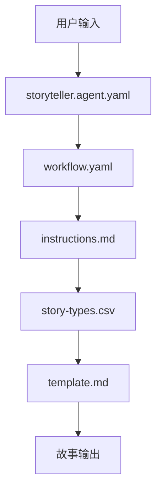
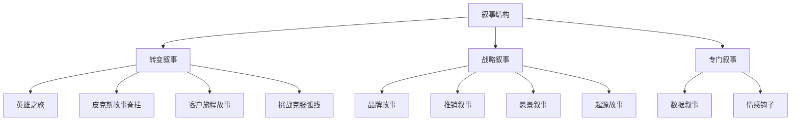
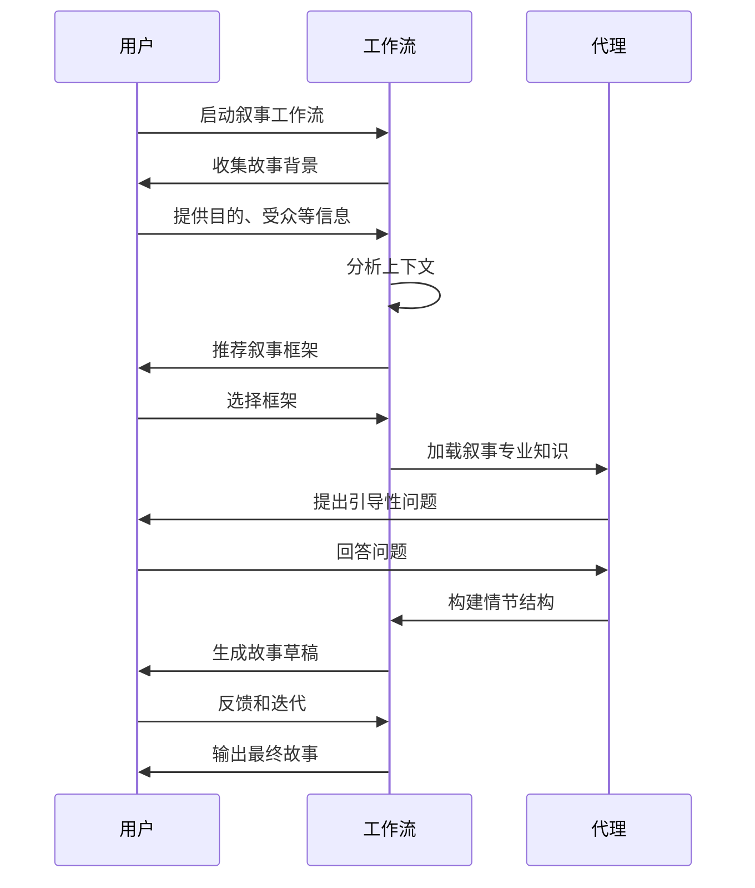
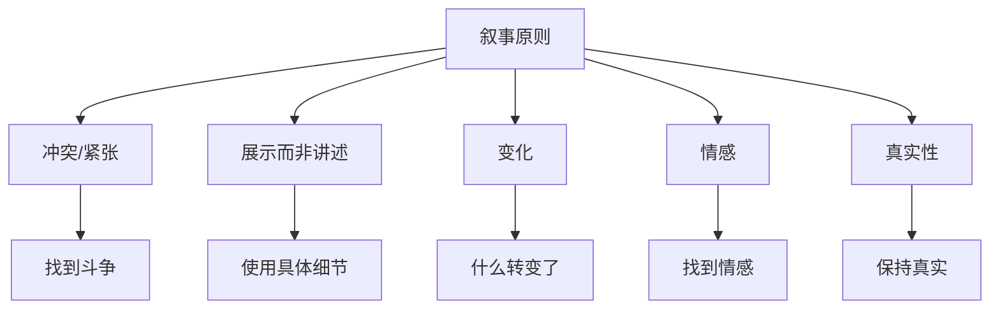
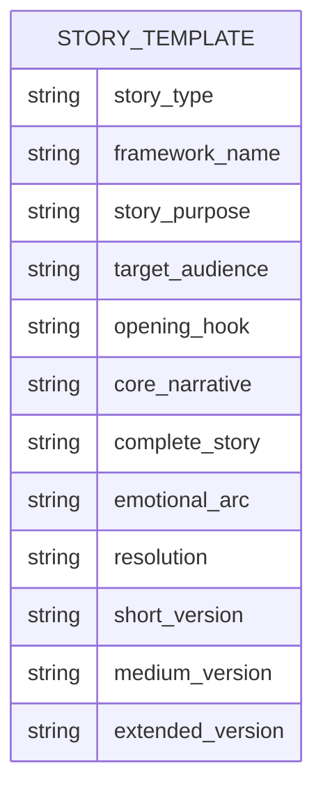
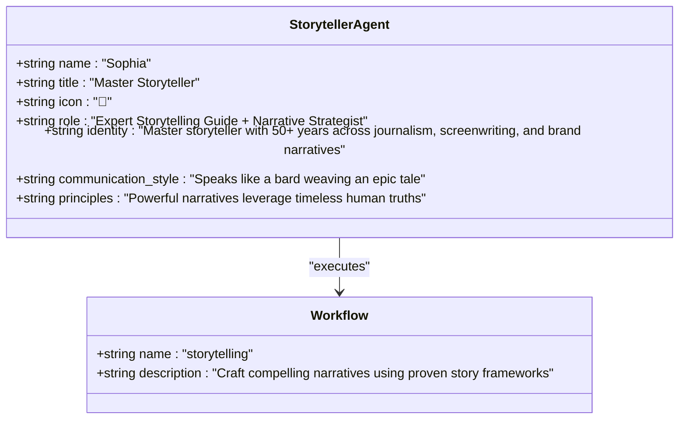
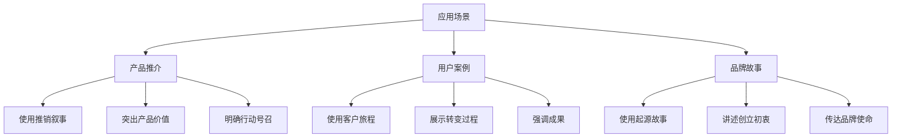

# 讲故事

<cite>
**本文档中引用的文件**   
- [story-types.csv](file://src/modules/cis/workflows/storytelling/story-types.csv)
- [workflow.yaml](file://src/modules/cis/workflows/storytelling/workflow.yaml)
- [instructions.md](file://src/modules/cis/workflows/storytelling/instructions.md)
- [template.md](file://src/modules/cis/workflows/storytelling/template.md)
- [storyteller.agent.yaml](file://src/modules/cis/agents/storyteller.agent.yaml)
</cite>

## 目录
1. [介绍](#介绍)
2. [工作流架构](#工作流架构)
3. [核心组件](#核心组件)
4. [叙事结构选择](#叙事结构选择)
5. [情节发展逻辑](#情节发展逻辑)
6. [叙事技巧指导](#叙事技巧指导)
7. [故事框架模板](#故事框架模板)
8. [叙事代理分析](#叙事代理分析)
9. [应用场景示例](#应用场景示例)
10. [结论](#结论)

## 介绍
讲故事工作流是一个结构化的叙事开发系统，旨在帮助用户构建引人入胜的叙事。该工作流通过引导用户选择合适的故事框架、发展情节逻辑、应用叙事技巧，最终生成具有情感共鸣和感染力的故事。系统基于多种经典故事类型（如英雄之旅、三幕剧结构等），结合叙事心理学原理，提供从故事构思到成品输出的完整指导流程。本工作流特别适用于品牌叙事、产品推介、用户案例等需要情感连接和说服力的场景。

## 工作流架构
讲故事工作流采用模块化设计，由配置文件、指令文件、模板文件和代理定义文件组成。系统通过YAML配置文件定义工作流参数，使用Markdown指令文件指导叙事过程，以模板文件规范输出格式，并通过代理文件定义叙事专家的角色和能力。

**图源**
- [workflow.yaml](file://src/modules/cis/workflows/storytelling/workflow.yaml#L1-L39)
- [instructions.md](file://src/modules/cis/workflows/storytelling/instructions.md#L1-L294)

## 核心组件

讲故事工作流的核心组件包括故事类型库、工作流配置、叙事指导、输出模板和叙事代理。这些组件协同工作，为用户提供完整的叙事开发体验。

**组件来源**
- [story-types.csv](file://src/modules/cis/workflows/storytelling/story-types.csv#L1-L26)
- [workflow.yaml](file://src/modules/cis/workflows/storytelling/workflow.yaml#L1-L39)
- [instructions.md](file://src/modules/cis/workflows/storytelling/instructions.md#L1-L294)
- [template.md](file://src/modules/cis/workflows/storytelling/template.md#L1-L114)
- [storyteller.agent.yaml](file://src/modules/cis/agents/storyteller.agent.yaml#L1-L30)

## 叙事结构选择
工作流提供多种叙事结构供用户选择，这些结构按类别分为转变叙事、战略叙事和专门叙事。转变叙事包括英雄之旅、皮克斯故事脊柱、客户旅程故事和挑战克服弧线；战略叙事涵盖品牌故事、推销叙事、愿景叙事和起源故事；专门叙事则包含数据叙事和情感钩子。

**图源**
- [story-types.csv](file://src/modules/cis/workflows/storytelling/story-types.csv#L1-L26)

## 情节发展逻辑
工作流通过九个步骤引导用户完成情节发展。首先收集故事背景，包括目的、目标受众和关键信息。然后根据上下文推荐合适的叙事框架。接着通过苏格拉底式提问法引导用户思考故事元素，发展情感弧线，设计开场钩子。最后协助用户撰写核心叙事，创建不同版本，并提供使用指南。

**图源**
- [instructions.md](file://src/modules/cis/workflows/storytelling/instructions.md#L12-L294)

## 叙事技巧指导
工作流提供专业的叙事技巧指导，强调五个核心原则：每个好故事都有冲突/紧张关系；展示而非讲述，使用生动具体的细节；变化是必要的，什么发生了转变；情感驱动记忆，找到情感共鸣点；真实性产生共鸣，保持核心真相。

**图源**
- [instructions.md](file://src/modules/cis/workflows/storytelling/instructions.md#L89-L95)

## 故事框架模板
工作流使用标准化的模板来组织故事内容，确保输出的一致性和完整性。模板包含故事信息、故事结构、完整故事、故事元素分析、变体与适应、使用指南和下一步计划等部分。每个部分都有明确的占位符，确保所有关键要素都被涵盖。

**图源**
- [template.md](file://src/modules/cis/workflows/storytelling/template.md#L1-L114)

## 叙事代理分析
叙事代理"索菲亚"是一位拥有50多年经验的叙事大师，精通新闻、剧本创作和品牌叙事。她以吟游诗人般华丽、奇思妙想的沟通风格著称，每句话都引人入胜。代理的核心原则是强大的叙事利用永恒的人类真理，找到真实的故事，并通过生动的细节将抽象概念具体化。

**图源**
- [storyteller.agent.yaml](file://src/modules/cis/agents/storyteller.agent.yaml#L1-L30)

## 应用场景示例
讲故事工作流适用于多种场景，包括产品推介、用户案例和品牌故事。在产品推介中，可以使用推销叙事框架，突出产品解决的问题和带来的价值。在用户案例中，采用客户旅程故事框架，展示用户从痛点到解决方案的转变过程。在品牌故事中，则使用起源故事框架，讲述品牌创立的初衷和使命。

**图源**
- [story-types.csv](file://src/modules/cis/workflows/storytelling/story-types.csv#L1-L26)
- [instructions.md](file://src/modules/cis/workflows/storytelling/instructions.md#L12-L294)

## 结论
讲故事工作流提供了一个系统化的方法来构建引人入胜的叙事。通过结合多种经典故事框架、专业的叙事技巧指导和智能化的代理支持，该工作流能够帮助用户有效地组织内容要素，创建具有感染力的故事。无论是用于营销沟通、品牌建设还是创意表达，这个工作流都能提升叙事的质量和影响力，帮助用户更好地与受众建立情感连接。