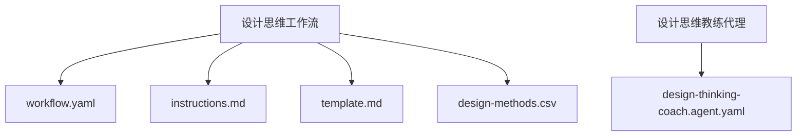
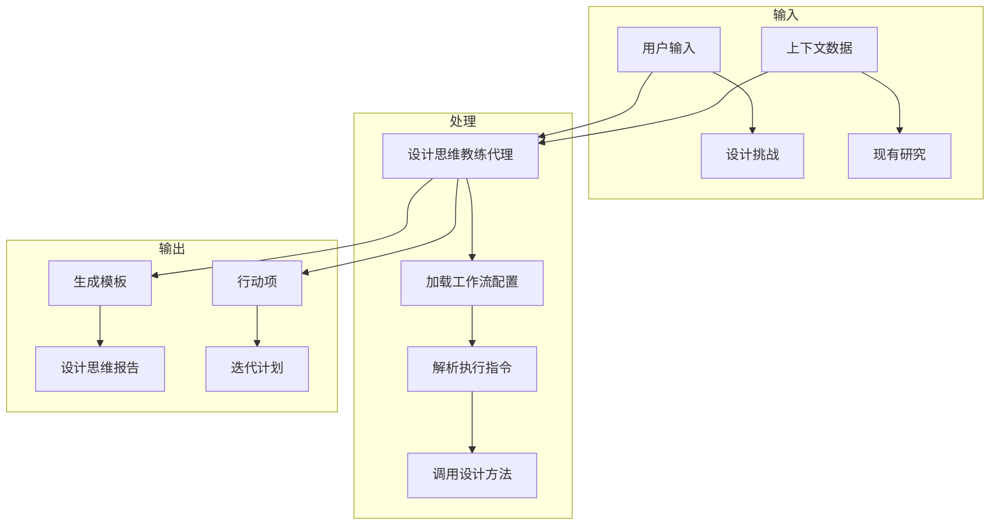
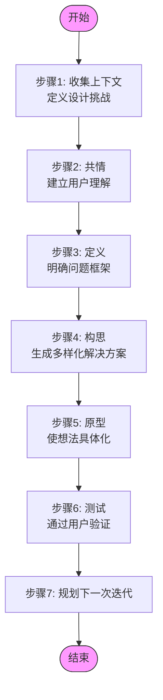
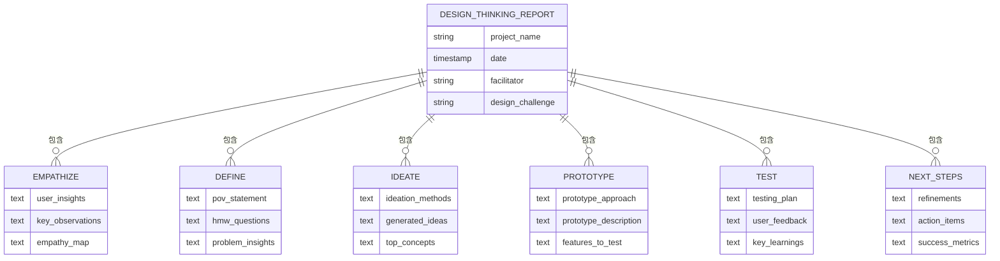
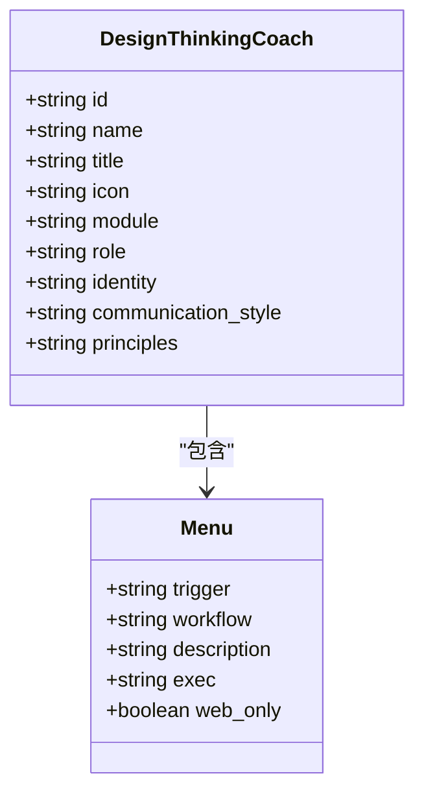
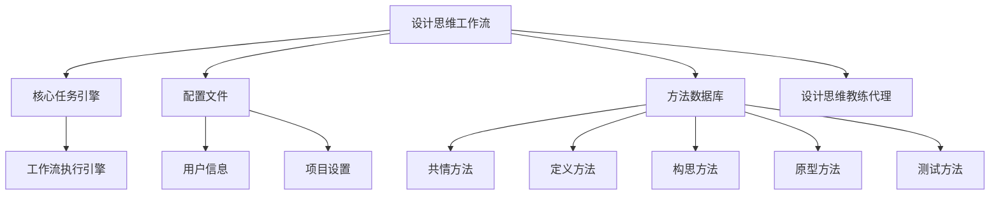

# 设计思维

<cite>
**本文档中引用的文件**  
- [workflow.yaml](file://src/modules/cis/workflows/design-thinking/workflow.yaml)
- [instructions.md](file://src/modules/cis/workflows/design-thinking/instructions.md)
- [template.md](file://src/modules/cis/workflows/design-thinking/template.md)
- [design-thinking-coach.agent.yaml](file://src/modules/cis/agents/design-thinking-coach.agent.yaml)
- [design-methods.csv](file://src/modules/cis/workflows/design-thinking/design-methods.csv)
</cite>

## 目录
1. [简介](#简介)
2. [项目结构](#项目结构)
3. [核心组件](#核心组件)
4. [架构概述](#架构概述)
5. [详细组件分析](#详细组件分析)
6. [依赖分析](#依赖分析)
7. [性能考虑](#性能考虑)
8. [故障排除指南](#故障排除指南)
9. [结论](#结论)

## 简介
本项目旨在实现一个系统化的设计思维工作流，引导用户通过共情、定义、构思、原型和测试五个阶段完成创新设计过程。该工作流以人类为中心的设计原则为基础，结合结构化的方法论和灵活的执行机制，帮助团队或个人深入理解用户需求，创造性地解决问题，并通过快速迭代验证解决方案的有效性。

## 项目结构
设计思维工作流位于`src/modules/cis/workflows/design-thinking/`目录下，包含配置文件、指导文档、模板和数据资源。该工作流是创意智能套件（Creative Intelligence Suite）的一部分，与其他创新方法论（如问题解决、创新策略）协同工作。

**Diagram sources**
- [workflow.yaml](file://src/modules/cis/workflows/design-thinking/workflow.yaml)
- [design-thinking-coach.agent.yaml](file://src/modules/cis/agents/design-thinking-coach.agent.yaml)

**Section sources**
- [workflow.yaml](file://src/modules/cis/workflows/design-thinking/workflow.yaml)
- [design-thinking-coach.agent.yaml](file://src/modules/cis/agents/design-thinking-coach.agent.yaml)

## 核心组件
设计思维工作流的核心由五个关键部分组成：主配置文件（workflow.yaml）、执行指令（instructions.md）、输出模板（template.md）、方法数据库（design-methods.csv）和专用代理（design-thinking-coach.agent.yaml）。这些组件共同构成了一个完整的、可执行的设计思维引导系统。

**Section sources**
- [workflow.yaml](file://src/modules/cis/workflows/design-thinking/workflow.yaml)
- [instructions.md](file://src/modules/cis/workflows/design-thinking/instructions.md)
- [template.md](file://src/modules/cis/workflows/design-thinking/template.md)
- [design-methods.csv](file://src/modules/cis/workflows/design-thinking/design-methods.csv)
- [design-thinking-coach.agent.yaml](file://src/modules/cis/agents/design-thinking-coach.agent.yaml)

## 架构概述
设计思维工作流采用模块化架构，通过YAML配置文件定义工作流元数据和资源路径，使用Markdown模板定义输出格式，通过CSV文件存储设计方法，并由专用代理触发和执行。该架构支持灵活的配置和可扩展的方法库。

**Diagram sources**
- [workflow.yaml](file://src/modules/cis/workflows/design-thinking/workflow.yaml)
- [instructions.md](file://src/modules/cis/workflows/design-thinking/instructions.md)
- [template.md](file://src/modules/cis/workflows/design-thinking/template.md)

## 详细组件分析

### 工作流配置分析
`workflow.yaml`文件定义了设计思维工作流的基本属性、资源路径和输出配置。它指定了工作流的名称、描述、作者信息，并通过变量引用机制动态加载配置源、输出文件夹和用户信息。该文件还定义了模板、指令和方法数据文件的路径，确保工作流能够正确加载所需资源。

**Section sources**
- [workflow.yaml](file://src/modules/cis/workflows/design-thinking/workflow.yaml)

### 执行指令分析
`instructions.md`文件包含了工作流的详细执行逻辑，分为七个步骤：收集上下文、共情、定义、构思、原型、测试和规划下一次迭代。每个步骤都有明确的目标和执行要求，包括引导性问题、方法选择逻辑和输出标记。该文件还包含关键的执行原则，如禁止时间估计、强制检查点协议和以用户为中心的设计理念。

**Diagram sources**
- [instructions.md](file://src/modules/cis/workflows/design-thinking/instructions.md)

### 输出模板分析
`template.md`文件定义了设计思维工作流的最终输出格式，采用Markdown语法和变量占位符。模板结构清晰地反映了设计思维的五个核心阶段，每个阶段都有相应的输出字段。该模板确保了输出的一致性和专业性，同时通过变量注入机制实现了内容的动态生成。

**Diagram sources**
- [template.md](file://src/modules/cis/workflows/design-thinking/template.md)

### 方法数据库分析
`design-methods.csv`文件存储了设计思维各阶段的具体方法，包括共情、定义、构思、原型和测试等。每个方法都有明确的阶段归属、名称、描述和引导性问题。该数据库为工作流提供了丰富的方法论支持，使系统能够根据具体情况推荐合适的设计方法。

**Section sources**
- [design-methods.csv](file://src/modules/cis/workflows/design-thinking/design-methods.csv)

### 设计思维教练代理分析
`design-thinking-coach.agent.yaml`文件定义了设计思维教练代理的角色和功能。该代理名为"Maya"，定位为"设计思维大师"，具有人类中心设计专家和共情架构师的双重角色。代理采用爵士音乐家般的沟通风格，善于使用生动的感官隐喻，并以挑战假设的方式引导用户思考。

**Diagram sources**
- [design-thinking-coach.agent.yaml](file://src/modules/cis/agents/design-thinking-coach.agent.yaml)

## 依赖分析
设计思维工作流依赖于核心任务引擎（workflow.xml）来执行工作流，并依赖于配置文件（config.yaml）提供用户和项目信息。该工作流还与其他CIS工作流（如问题解决、创新策略）共享方法论和执行框架，形成了一个完整的创新工具生态系统。

**Diagram sources**
- [workflow.yaml](file://src/modules/cis/workflows/design-thinking/workflow.yaml)
- [instructions.md](file://src/modules/cis/workflows/design-thinking/instructions.md)

**Section sources**
- [workflow.yaml](file://src/modules/cis/workflows/design-thinking/workflow.yaml)
- [instructions.md](file://src/modules/cis/workflows/design-thinking/instructions.md)

## 性能考虑
设计思维工作流的性能主要取决于用户输入的速度和复杂性。由于工作流采用检查点协议，在每个关键步骤后都会保存进度，因此具有良好的容错性和可恢复性。系统通过模块化设计和资源预加载机制，确保了快速的响应时间和流畅的用户体验。

## 故障排除指南
如果设计思维工作流无法正常执行，请检查以下事项：确保核心任务引擎（workflow.xml）已正确加载；验证配置文件（config.yaml）中的路径和变量是否正确；确认所有必需的资源文件（模板、指令、方法数据库）都存在于指定位置；检查代理配置文件（design-thinking-coach.agent.yaml）中的触发器和工作流路径是否正确。

**Section sources**
- [workflow.yaml](file://src/modules/cis/workflows/design-thinking/workflow.yaml)
- [instructions.md](file://src/modules/cis/workflows/design-thinking/instructions.md)
- [design-thinking-coach.agent.yaml](file://src/modules/cis/agents/design-thinking-coach.agent.yaml)

## 结论
设计思维工作流提供了一个系统化、可执行的创新框架，通过五个阶段的循环迭代，帮助用户深入理解用户需求，创造性地解决问题，并通过快速原型和用户测试验证解决方案。该工作流结合了结构化的方法论和灵活的执行机制，是现代产品设计和创新过程中的有力工具。