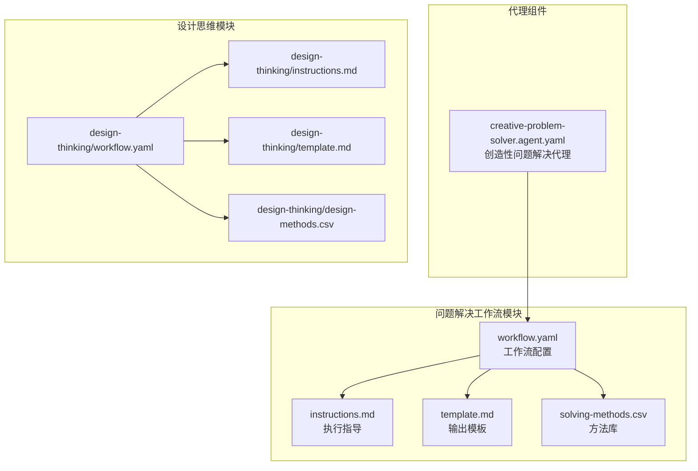
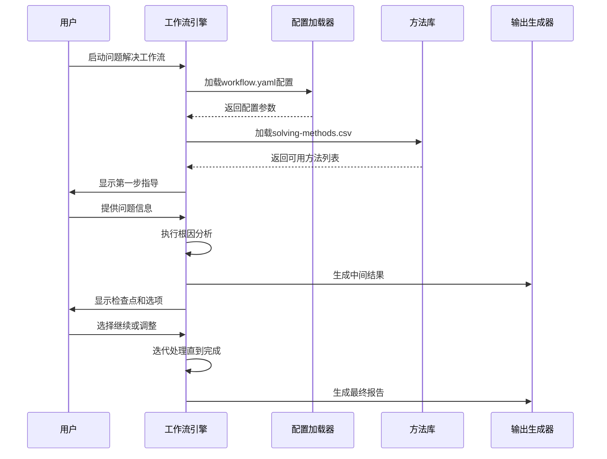
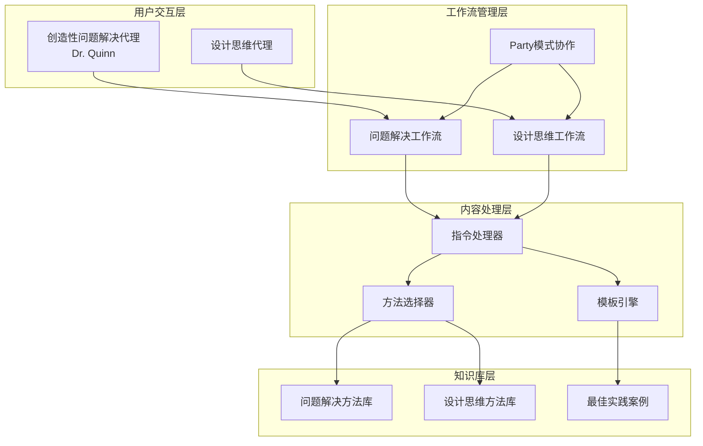
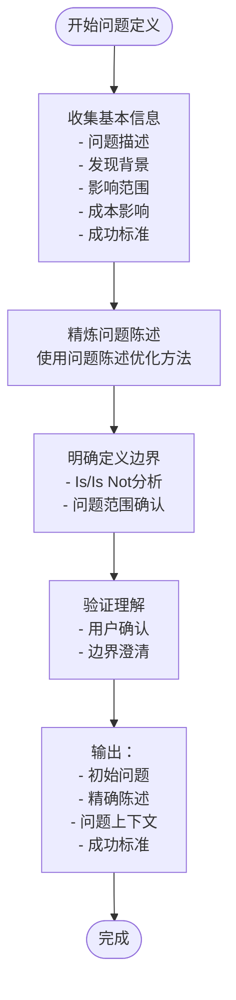
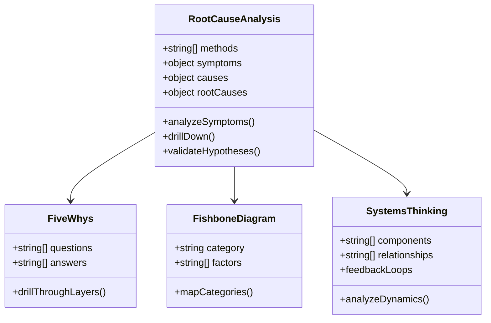
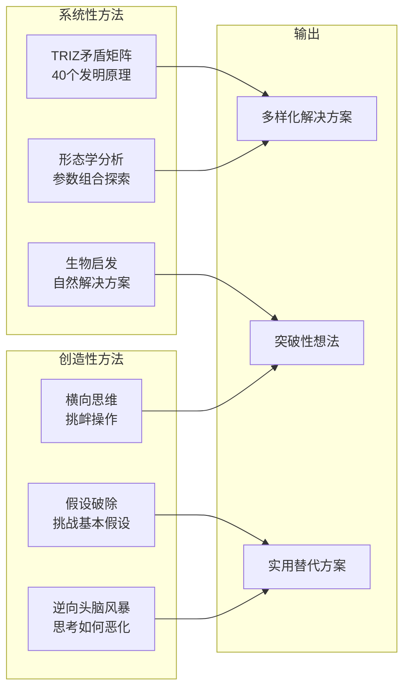
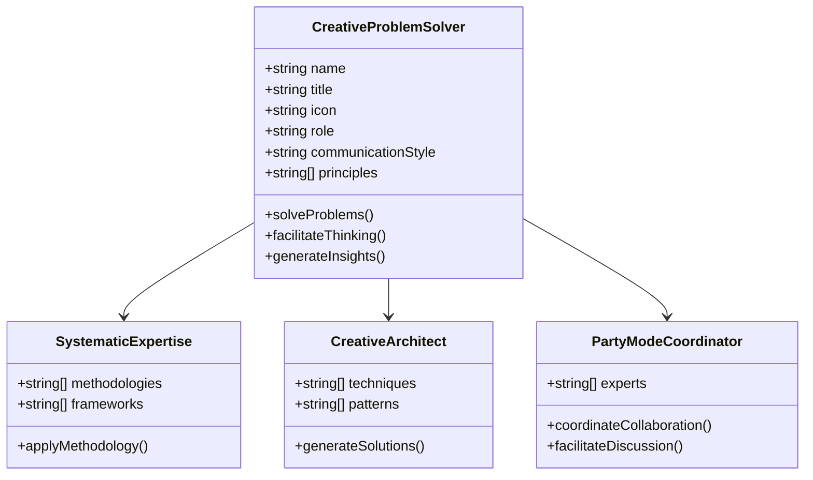
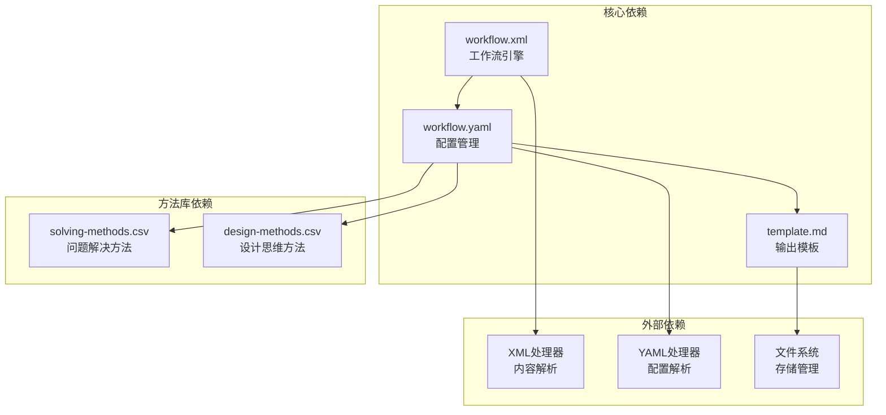

# 问题解决工作流

<cite>
**本文档中引用的文件**
- [solving-methods.csv](file://src/modules/cis/workflows/problem-solving/solving-methods.csv)
- [workflow.yaml](file://src/modules/cis/workflows/problem-solving/workflow.yaml)
- [instructions.md](file://src/modules/cis/workflows/problem-solving/instructions.md)
- [template.md](file://src/modules/cis/workflows/problem-solving/template.md)
- [creative-problem-solver.agent.yaml](file://src/modules/cis/agents/creative-problem-solver.agent.yaml)
- [design-thinking/workflow.yaml](file://src/modules/cis/workflows/design-thinking/workflow.yaml)
- [design-thinking/instructions.md](file://src/modules/cis/workflows/design-thinking/instructions.md)
- [design-thinking/template.md](file://src/modules/cis/workflows/design-thinking/template.md)
- [design-thinking/design-methods.csv](file://src/modules/cis/workflows/design-thinking/design-methods.csv)
- [workflow.xml](file://src/core/tasks/workflow.xml)
</cite>

## 目录
1. [简介](#简介)
2. [项目结构](#项目结构)
3. [核心组件](#核心组件)
4. [架构概览](#架构概览)
5. [详细组件分析](#详细组件分析)
6. [依赖关系分析](#依赖关系分析)
7. [性能考虑](#性能考虑)
8. [故障排除指南](#故障排除指南)
9. [结论](#结论)

## 简介

问题解决工作流是BMAD创意智能套件中的核心模块，提供了一套系统化的问题分析和解决方案生成框架。该工作流结合了多种经典问题解决方法论，包括TRIZ创新原理、五问法根因分析、鱼骨图因果分析、设计思维等，通过结构化的步骤引导用户从问题定义到解决方案实施的完整过程。

该工作流的独特之处在于：
- **系统性方法库**：包含超过30种经过验证的问题解决方法
- **创造性思维模式**：融合系统分析与创新思维
- **交互式执行**：实时指导用户完成每个分析阶段
- **多领域适用**：支持技术问题、业务问题和复杂挑战的解决

## 项目结构

问题解决工作流采用模块化架构，主要包含以下核心文件：

**图表来源**
- [workflow.yaml](file://src/modules/cis/workflows/problem-solving/workflow.yaml#L1-L39)
- [creative-problem-solver.agent.yaml](file://src/modules/cis/agents/creative-problem-solver.agent.yaml#L1-L30)

**节来源**
- [workflow.yaml](file://src/modules/cis/workflows/problem-solving/workflow.yaml#L1-L39)
- [instructions.md](file://src/modules/cis/workflows/problem-solving/instructions.md#L1-L253)
- [template.md](file://src/modules/cis/workflows/problem-solving/template.md#L1-L166)

## 核心组件

### 问题解决方法库

`solving-methods.csv`文件提供了30种经过分类的问题解决方法，涵盖诊断、分析、综合、评估和实施五个主要阶段：

| 阶段 | 方法名称 | 描述 | 应用场景 |
|------|----------|------|----------|
| 诊断 | 五问法根因分析 | 通过连续提问揭示根本原因 | 线性因果链问题 |
| 诊断 | 鱼骨图因果分析 | 按人员、流程、材料、设备、环境分类分析 | 复杂多因素问题 |
| 分析 | 强制关联分析 | 识别推动和阻碍解决方案的力量 | 动态系统分析 |
| 分析 | 帕累托分析 | 应用80/20法则识别关键因素 | 资源优先级分配 |
| 综合 | TRIZ矛盾矩阵 | 使用40个发明原理解决技术矛盾 | 创新性技术问题 |
| 创意 | 假设破除 | 挑战基本假设开启新思路 | 突破性创新 |
| 评估 | 决策矩阵 | 基于加权标准评估方案 | 多选项比较 |
| 实施 | PDCA循环 | 计划-执行-检查-行动迭代改进 | 持续优化 |

### 工作流引擎

工作流引擎基于XML配置和Markdown指令，通过`workflow.xml`核心处理器实现：

**图表来源**
- [workflow.xml](file://src/core/tasks/workflow.xml#L46-L68)
- [workflow.yaml](file://src/modules/cis/workflows/problem-solving/workflow.yaml#L16-L27)

**节来源**
- [solving-methods.csv](file://src/modules/cis/workflows/problem-solving/solving-methods.csv#L1-L31)
- [workflow.xml](file://src/core/tasks/workflow.xml#L38-L68)

## 架构概览

问题解决工作流采用分层架构设计，确保灵活性和可扩展性：

**图表来源**
- [creative-problem-solver.agent.yaml](file://src/modules/cis/agents/creative-problem-solver.agent.yaml#L1-L30)
- [workflow.yaml](file://src/modules/cis/workflows/problem-solving/workflow.yaml#L1-L39)

## 详细组件分析

### 问题定义阶段

问题定义是整个解决过程的基础，通过精确的问题陈述确保后续分析的准确性：

**图表来源**
- [instructions.md](file://src/modules/cis/workflows/problem-solving/instructions.md#L21-L62)

关键特性：
- **系统性提问**：遵循结构化的问题收集流程
- **边界映射**：使用Is/Is Not分析明确问题范围
- **成功标准**：预先定义可衡量的成果指标

### 根因分析阶段

根因分析采用多层次的方法组合，确保不遗漏潜在的根本原因：

**图表来源**
- [instructions.md](file://src/modules/cis/workflows/problem-solving/instructions.md#L64-L86)
- [solving-methods.csv](file://src/modules/cis/workflows/problem-solving/solving-methods.csv#L2-L10)

### 解决方案生成阶段

解决方案生成结合系统性和创造性方法，产生多样化的解决方案选项：

**图表来源**
- [instructions.md](file://src/modules/cis/workflows/problem-solving/instructions.md#L112-L140)
- [solving-methods.csv](file://src/modules/cis/workflows/problem-solving/solving-methods.csv#L12-L18)

### 实施规划阶段

实施规划确保解决方案能够有效落地，包含详细的行动计划和风险控制：

| 实施要素 | 描述 | 关键考虑 |
|----------|------|----------|
| 实施策略 | 总体实施方案 | 瀑布式、敏捷式、试点先行 |
| 行动步骤 | 具体执行任务 | 优先级排序、依赖关系 |
| 时间线 | 里程碑计划 | 关键节点、缓冲时间 |
| 资源需求 | 人力物力投入 | 成本估算、资源分配 |
| 责任分工 | 角色职责明确 | 权责对等、沟通渠道 |

**节来源**
- [instructions.md](file://src/modules/cis/workflows/problem-solving/instructions.md#L173-L201)
- [template.md](file://src/modules/cis/workflows/problem-solving/template.md#L105-L126)

### 创造性问题解决代理

Dr. Quinn作为Master Problem Solver，具备独特的创造性思维模式：

**图表来源**
- [creative-problem-solver.agent.yaml](file://src/modules/cis/agents/creative-problem-solver.agent.yaml#L1-L30)

**节来源**
- [creative-problem-solver.agent.yaml](file://src/modules/cis/agents/creative-problem-solver.agent.yaml#L1-L30)

## 依赖关系分析

问题解决工作流的依赖关系体现了模块化设计的优势：

**图表来源**
- [workflow.yaml](file://src/modules/cis/workflows/problem-solving/workflow.yaml#L16-L27)
- [workflow.xml](file://src/core/tasks/workflow.xml#L46-L68)

**节来源**
- [workflow.yaml](file://src/modules/cis/workflows/problem-solving/workflow.yaml#L1-L39)
- [workflow.xml](file://src/core/tasks/workflow.xml#L38-L68)

## 性能考虑

问题解决工作流在设计时充分考虑了性能优化：

### 内存管理
- **按需加载**：只在需要时加载特定方法和数据
- **增量处理**：每个步骤完成后立即保存，避免内存累积
- **变量替换**：动态替换模板变量，减少重复计算

### 执行效率
- **并行处理**：多个独立分析可以并行进行
- **缓存机制**：常用方法和模板结果缓存
- **智能跳过**：根据用户输入智能跳过不适用的步骤

### 可扩展性
- **插件架构**：支持新增方法和工具
- **配置驱动**：通过配置文件调整行为
- **模块分离**：各功能模块独立部署

## 故障排除指南

### 常见问题及解决方案

| 问题类型 | 症状 | 解决方案 |
|----------|------|----------|
| 配置错误 | 工作流无法启动 | 检查workflow.yaml语法和路径 |
| 方法缺失 | 特定方法不可用 | 验证solving-methods.csv格式 |
| 输出失败 | 结果文件未生成 | 检查输出目录权限和空间 |
| 性能问题 | 处理速度慢 | 优化大文件处理和缓存策略 |

### 调试技巧
- **逐步验证**：每个步骤后检查中间结果
- **日志记录**：启用详细日志跟踪执行过程
- **单元测试**：对关键方法进行单元测试
- **用户反馈**：收集用户使用体验改进

**节来源**
- [instructions.md](file://src/modules/cis/workflows/problem-solving/instructions.md#L6-L8)

## 结论

问题解决工作流代表了系统化问题分析和创造性解决方案生成的最佳实践集合。通过结合经典方法论和现代AI技术，它为复杂问题的解决提供了可靠的方法论框架。

### 主要优势
- **系统性**：完整的5阶段问题解决流程
- **灵活性**：多种方法可供选择和组合
- **创造性**：鼓励创新思维和突破性解决方案
- **实用性**：可直接应用于实际问题解决

### 应用前景
该工作流不仅适用于技术问题解决，也可扩展到业务流程优化、产品设计、战略规划等多个领域，是提升组织问题解决能力的重要工具。

通过持续的方法更新和用户体验优化，问题解决工作流将继续演进，为用户提供更加强大和易用的问题解决能力。