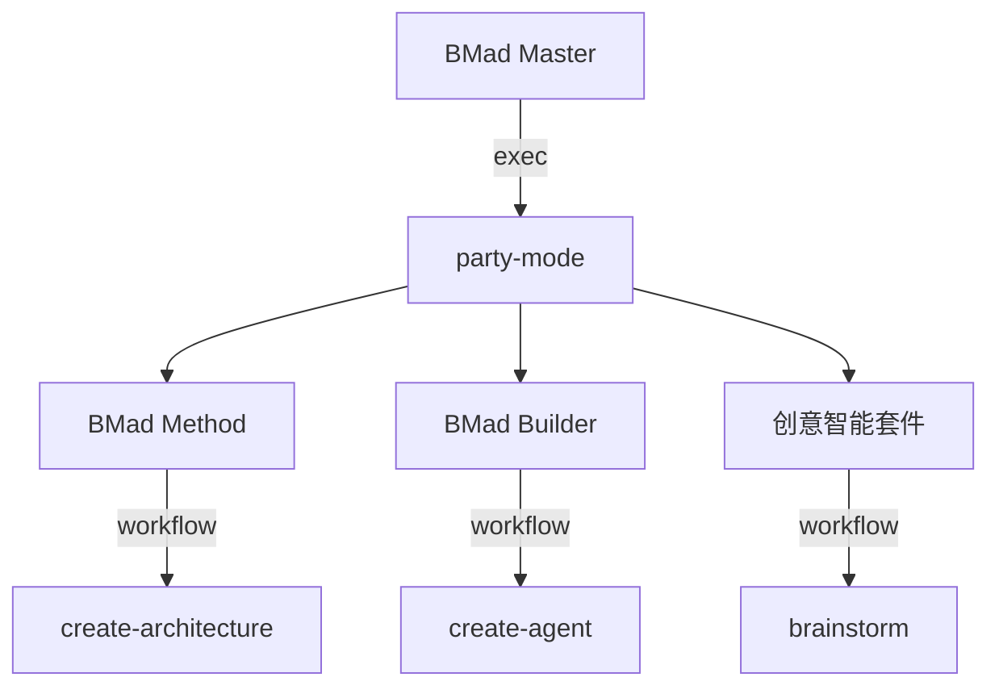
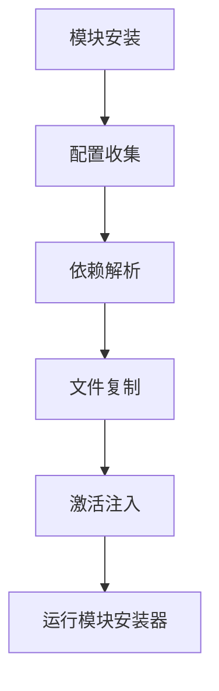

# 模块化架构

<cite>
**本文档引用的文件**  
- [bmad-master.agent.yaml](file://src/core/agents/bmad-master.agent.yaml)
- [install-config.yaml](file://src/core/_module-installer/install-config.yaml)
- [bmm-install-config.yaml](file://src/modules/bmm/_module-installer/install-config.yaml)
- [bmb-install-config.yaml](file://src/modules/bmb/_module-installer/install-config.yaml)
- [cis-install-config.yaml](file://src/modules/cis/_module-installer/install-config.yaml)
- [architect.agent.yaml](file://src/modules/bmm/agents/architect.agent.yaml)
- [bmad-builder.agent.yaml](file://src/modules/bmb/agents/bmad-builder.agent.yaml)
- [brainstorming-coach.agent.yaml](file://src/modules/cis/agents/brainstorming-coach.agent.yaml)
- [manager.js](file://tools/cli/installers/lib/modules/manager.js)
- [installer.js](file://tools/cli/installers/lib/core/installer.js)
- [web-bundler.js](file://tools/cli/bundlers/web-bundler.js)
- [AGENTS.md](file://AGENTS.md)
- [party-mode.md](file://src/modules/bmm/docs/party-mode.md)
- [workflow.md](file://src/core/workflows/party-mode/workflow.md)
- [README.md](file://src/modules/cis/workflows/README.md)
</cite>

## 目录
1. [引言](#引言)
2. [核心框架与模块化架构](#核心框架与模块化架构)
3. [BMad Method (BMM)](#bmad-method-bmm)
4. [BMad Builder (BMB)](#bmad-builder-bmb)
5. [创意智能套件 (CIS)](#创意智能套件-cis)
6. [模块间依赖与通信机制](#模块间依赖与通信机制)
7. [模块安装机制与运行时加载](#模块安装机制与运行时加载)
8. [架构图示例](#架构图示例)
9. [模块适用场景对比](#模块适用场景对比)
10. [结论](#结论)

## 引言
BMAD-METHOD是一个模块化的AI驱动开发框架，旨在通过结构化的工作流和专业化的代理来提升软件开发效率。该框架采用分层架构设计，将核心功能与特定领域模块分离，实现了高度的可扩展性和灵活性。本文档将详细阐述BMAD-METHOD的模块化架构，包括核心框架（Core）与各功能模块（BMM、BMB、CIS）的设计原理、职责分工、依赖关系和通信机制。

## 核心框架与模块化架构
BMAD-METHOD的架构分为核心框架和多个功能模块。核心框架提供了基础的执行环境和通用的工作流，而功能模块则针对特定的开发需求提供专业化的工具和代理。

```mermaid
graph TD
subgraph "核心框架"
Core[核心框架]
Master[BMad Master]
PartyMode[Party Mode]
CoreWorkflows[通用工作流]
end
subgraph "功能模块"
BMM[BMad Method (BMM)]
BMB[BMad Builder (BMB)]
CIS[创意智能套件 (CIS)]
end
Master --> BMM
Master --> BMB
Master --> CIS
PartyMode --> BMM
PartyMode --> BMB
PartyMode --> CIS
CoreWorkflows --> BMM
CoreWorkflows --> BMB
CoreWorkflows --> CIS
```

**图示来源**
- [bmad-master.agent.yaml](file://src/core/agents/bmad-master.agent.yaml#L4-L40)
- [AGENTS.md](file://AGENTS.md#L85-L140)

**本节来源**
- [bmad-master.agent.yaml](file://src/core/agents/bmad-master.agent.yaml#L4-L40)
- [AGENTS.md](file://AGENTS.md#L85-L140)

## BMad Method (BMM)
BMad Method (BMM) 是BMAD-METHOD的核心工作流引擎，负责敏捷开发的全过程管理。BMM模块提供了一系列专业化的代理，覆盖了从项目分析到实施的各个阶段。

### 职责与功能
BMM模块的主要职责包括：
- **项目分析**：通过产品简报和研究工作流进行需求收集和市场分析
- **规划工作流**：创建用户体验设计和产品需求文档
- **解决方案设计**：进行架构设计、创建史诗故事和实现准备
- **实施**：代码审查、纠正方向、创建故事和开发故事

BMM模块中的代理如架构师（Architect）、项目经理（PM）、开发人员（DEV）等，各自承担特定的角色，协同完成开发任务。

```mermaid
graph TD
BMM[BMad Method (BMM)]
Analysis[1-分析]
Plan[2-规划]
Solution[3-解决方案]
Implementation[4-实施]
BMM --> Analysis
BMM --> Plan
BMM --> Solution
BMM --> Implementation
Analysis --> ProductBrief[产品简报]
Analysis --> Research[研究]
Plan --> UXDesign[创建用户体验设计]
Plan --> PRD[PRD]
Solution --> Architecture[架构]
Solution --> EpicsStories[创建史诗和故事]
Solution --> ImplementationReadiness[实施准备]
Implementation --> CodeReview[代码审查]
Implementation --> CorrectCourse[纠正方向]
Implementation --> CreateStory[创建故事]
Implementation --> DevStory[开发故事]
```

**图示来源**
- [architect.agent.yaml](file://src/modules/bmm/agents/architect.agent.yaml#L3-L53)
- [AGENTS.md](file://AGENTS.md#L93-L99)

**本节来源**
- [architect.agent.yaml](file://src/modules/bmm/agents/architect.agent.yaml#L3-L53)
- [AGENTS.md](file://AGENTS.md#L93-L99)

## BMad Builder (BMB)
BMad Builder (BMB) 是一个元编程工具，用于创建和修改代理与工作流。BMB模块为开发者提供了强大的自定义能力，可以构建符合特定需求的代理和工作流。

### 创建与修改能力
BMB模块的主要功能包括：
- **创建代理**：通过`create-agent`工作流创建新的代理
- **编辑代理**：通过`edit-agent`工作流修改现有代理
- **验证代理**：通过`agent-compliance-check`工作流确保代理符合最佳实践
- **创建工作流**：通过`create-workflow`工作流创建新的工作流
- **编辑工作流**：通过`edit-workflow`工作流修改现有工作流
- **验证工作流**：通过`workflow-compliance-check`工作流确保工作流符合标准
- **创建模块**：通过`create-module`工作流创建完整的BMAD兼容模块

BMB模块的灵活性使得开发者可以根据项目需求快速定制和扩展框架功能。

```mermaid
graph TD
BMB[BMad Builder (BMB)]
CreateAgent[创建代理]
EditAgent[编辑代理]
ValidateAgent[验证代理]
CreateWorkflow[创建工作流]
EditWorkflow[编辑工作流]
ValidateWorkflow[验证工作流]
CreateModule[创建模块]
EditModule[编辑模块]
BMB --> CreateAgent
BMB --> EditAgent
BMB --> ValidateAgent
BMB --> CreateWorkflow
BMB --> EditWorkflow
BMB --> ValidateWorkflow
BMB --> CreateModule
BMB --> EditModule
```

**图示来源**
- [bmad-builder.agent.yaml](file://src/modules/bmb/agents/bmad-builder.agent.yaml#L4-L72)
- [AGENTS.md](file://AGENTS.md#L100-L103)

**本节来源**
- [bmad-builder.agent.yaml](file://src/modules/bmb/agents/bmad-builder.agent.yaml#L4-L72)
- [AGENTS.md](file://AGENTS.md#L100-L103)

## 创意智能套件 (CIS)
创意智能套件 (CIS) 专注于创新思维和创意过程，提供了一系列促进创造力的工作流和代理。

### 创新思维应用
CIS模块的主要功能包括：
- **头脑风暴**：通过`brainstorming`工作流引导用户进行创意发散
- **设计思维**：通过`design-thinking`工作流进行以人为本的设计
- **创新战略**：通过`innovation-strategy`工作流识别颠覆性机会
- **问题解决**：通过`problem-solving`工作流系统性地解决复杂问题
- **讲故事**：通过`storytelling`工作流构建引人入胜的叙事

CIS模块中的代理如头脑风暴教练（Brainstorming Coach）、创意问题解决者（Creative Problem Solver）等，通过专业的引导技巧帮助用户激发创意。

```mermaid
graph TD
CIS[创意智能套件 (CIS)]
Brainstorming[头脑风暴]
DesignThinking[设计思维]
InnovationStrategy[创新战略]
ProblemSolving[问题解决]
Storytelling[讲故事]
CIS --> Brainstorming
CIS --> DesignThinking
CIS --> InnovationStrategy
CIS --> ProblemSolving
CIS --> Storytelling
```

**图示来源**
- [brainstorming-coach.agent.yaml](file://src/modules/cis/agents/brainstorming-coach.agent.yaml#L3-L30)
- [README.md](file://src/modules/cis/workflows/README.md#L1-L140)

**本节来源**
- [brainstorming-coach.agent.yaml](file://src/modules/cis/agents/brainstorming-coach.agent.yaml#L3-L30)
- [README.md](file://src/modules/cis/workflows/README.md#L1-L140)

## 模块间依赖与通信机制
BMAD-METHOD的模块之间通过明确的依赖关系和通信机制进行协作。以`bmad-master.agent.yaml`中对各模块代理的引用为例，展示了模块间的集成方式。

### 依赖关系
- **核心框架**：作为基础层，被所有模块依赖
- **BMM模块**：依赖核心框架的通用工作流，如`party-mode`
- **BMB模块**：依赖核心框架的代理和工作流创建工具
- **CIS模块**：依赖核心框架的通用工作流，如`brainstorming`

### 通信机制
- **命令调用**：通过`exec`、`workflow`等命令调用其他模块的工作流
- **数据共享**：通过`{project-root}`等变量共享项目上下文
- **事件驱动**：通过`trigger`机制触发特定工作流

例如，在`bmad-master.agent.yaml`中，`party-mode`触发器通过`exec`命令调用核心框架的`party-mode`工作流，实现了多代理协作。



**图示来源**
- [bmad-master.agent.yaml](file://src/core/agents/bmad-master.agent.yaml#L34-L36)
- [architect.agent.yaml](file://src/modules/bmm/agents/architect.agent.yaml#L25-L27)
- [bmad-builder.agent.yaml](file://src/modules/bmb/agents/bmad-builder.agent.yaml#L36-L37)
- [brainstorming-coach.agent.yaml](file://src/modules/cis/agents/brainstorming-coach.agent.yaml#L19-L20)

**本节来源**
- [bmad-master.agent.yaml](file://src/core/agents/bmad-master.agent.yaml#L34-L36)
- [architect.agent.yaml](file://src/modules/bmm/agents/architect.agent.yaml#L25-L27)
- [bmad-builder.agent.yaml](file://src/modules/bmb/agents/bmad-builder.agent.yaml#L36-L37)
- [brainstorming-coach.agent.yaml](file://src/modules/cis/agents/brainstorming-coach.agent.yaml#L19-L20)

## 模块安装机制与运行时加载
BMAD-METHOD的模块安装机制确保了模块的可扩展性和更新安全性。模块安装和运行时加载过程如下：

### 安装机制
1. **配置收集**：通过`config-collector.js`收集用户配置
2. **依赖解析**：通过`dependency-resolver.js`解析模块依赖
3. **文件复制**：通过`copyModuleWithFiltering`复制模块文件
4. **激活注入**：通过`processAgentFiles`注入激活块
5. **模块安装器**：运行模块特定的安装器（如`installer.js`）

### 运行时加载
- **动态加载**：代理和工作流在运行时动态加载，避免预加载
- **资源管理**：通过`BMad Master`管理内存中的资源
- **上下文传递**：通过`{project-root}`等变量传递项目上下文

例如，在`manager.js`中，`install`方法负责安装模块，`vendorCrossModuleWorkflows`方法负责处理跨模块工作流的依赖。



**图示来源**
- [manager.js](file://tools/cli/installers/lib/modules/manager.js#L164-L198)
- [installer.js](file://tools/cli/installers/lib/core/installer.js#L1276-L1292)

**本节来源**
- [manager.js](file://tools/cli/installers/lib/modules/manager.js#L164-L198)
- [installer.js](file://tools/cli/installers/lib/core/installer.js#L1276-L1292)

## 架构图示例
以下架构图示例展示了BMAD-METHOD各模块在开发流程中的协作方式。

```mermaid
graph TD
User[用户]
CLI[命令行界面]
IDE[集成开发环境]
User --> CLI
CLI --> IDE
subgraph "核心框架"
Master[BMad Master]
PartyMode[Party Mode]
CoreWorkflows[通用工作流]
end
subgraph "功能模块"
BMM[BMad Method (BMM)]
BMB[BMad Builder (BMB)]
CIS[创意智能套件 (CIS)]
end
Master --> BMM
Master --> BMB
Master --> CIS
PartyMode --> BMM
PartyMode --> BMB
PartyMode --> CIS
CoreWorkflows --> BMM
CoreWorkflows --> BMB
CoreWorkflows --> CIS
BMM --> |create| BMB
BMB --> |use| CIS
CIS --> |inspire| BMM
```

**图示来源**
- [bmad-master.agent.yaml](file://src/core/agents/bmad-master.agent.yaml#L4-L40)
- [AGENTS.md](file://AGENTS.md#L85-L140)
- [party-mode.md](file://src/modules/bmm/docs/party-mode.md#L1-L182)

**本节来源**
- [bmad-master.agent.yaml](file://src/core/agents/bmad-master.agent.yaml#L4-L40)
- [AGENTS.md](file://AGENTS.md#L85-L140)
- [party-mode.md](file://src/modules/bmm/docs/party-mode.md#L1-L182)

## 模块适用场景对比
不同模块适用于不同的开发场景，以下是各模块的适用场景对比：

| 模块 | 适用场景 | 不适用场景 |
| --- | --- | --- |
| **BMM** | 敏捷开发全过程管理、多角色协作、复杂项目规划 | 简单实现问题、文档审查、单一领域问题 |
| **BMB** | 自定义代理和工作流创建、框架扩展、模块开发 | 日常开发任务、简单问题解决、单一代理使用 |
| **CIS** | 创意发散、创新战略制定、复杂问题解决、故事构建 | 技术实现细节、代码审查、单一领域问题 |

例如，当需要进行多角色协作的复杂项目规划时，应使用BMM模块；当需要创建自定义代理时，应使用BMB模块；当需要进行创意发散时，应使用CIS模块。

**本节来源**
- [bmad-master.agent.yaml](file://src/core/agents/bmad-master.agent.yaml#L4-L40)
- [architect.agent.yaml](file://src/modules/bmm/agents/architect.agent.yaml#L3-L53)
- [bmad-builder.agent.yaml](file://src/modules/bmb/agents/bmad-builder.agent.yaml#L4-L72)
- [brainstorming-coach.agent.yaml](file://src/modules/cis/agents/brainstorming-coach.agent.yaml#L3-L30)

## 结论
BMAD-METHOD的模块化架构通过核心框架与功能模块的分离，实现了高度的可扩展性和灵活性。BMM模块作为敏捷开发工作流引擎，BMB模块作为元编程工具，CIS模块作为创意智能套件，各自承担特定的职责，通过明确的依赖关系和通信机制进行协作。模块安装机制和运行时加载过程确保了框架的可维护性和更新安全性。开发者可以根据项目需求选择合适的模块，构建高效的AI驱动开发环境。