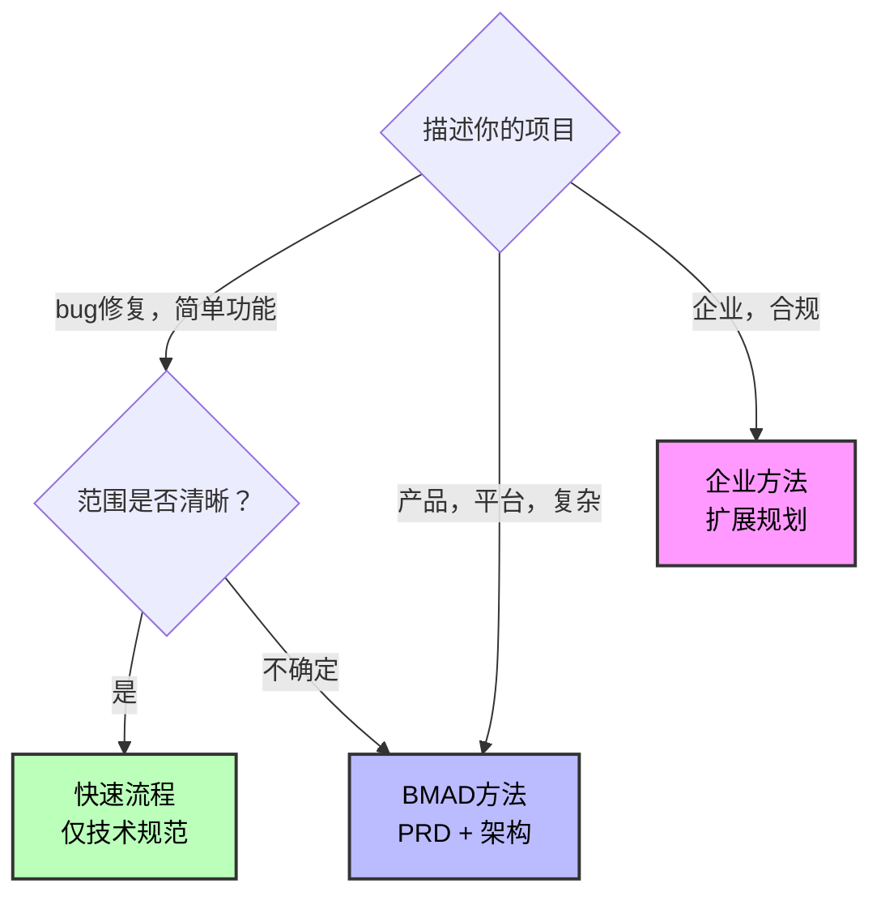
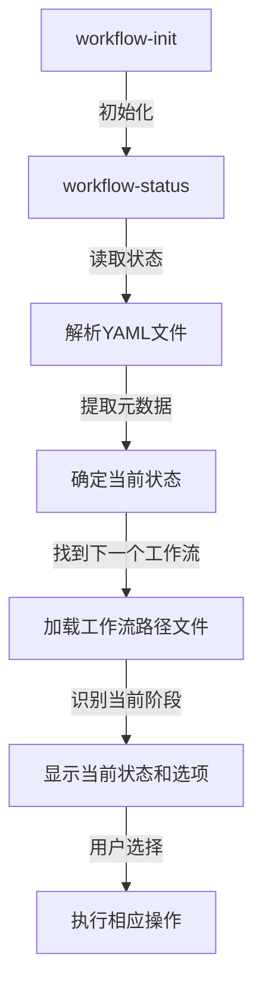
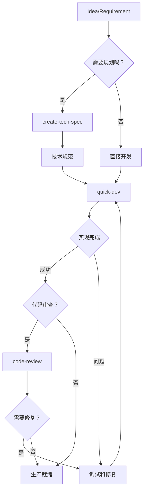
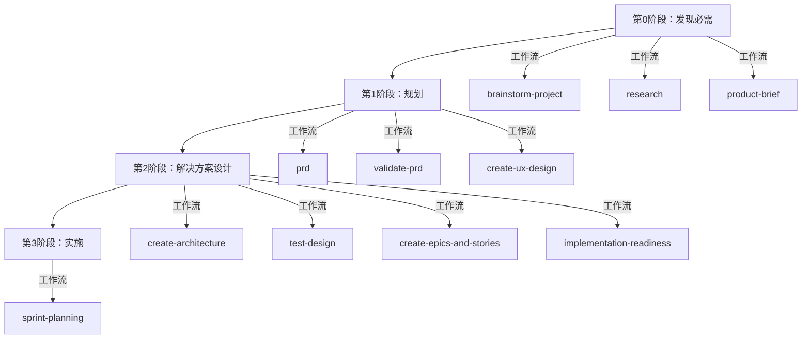
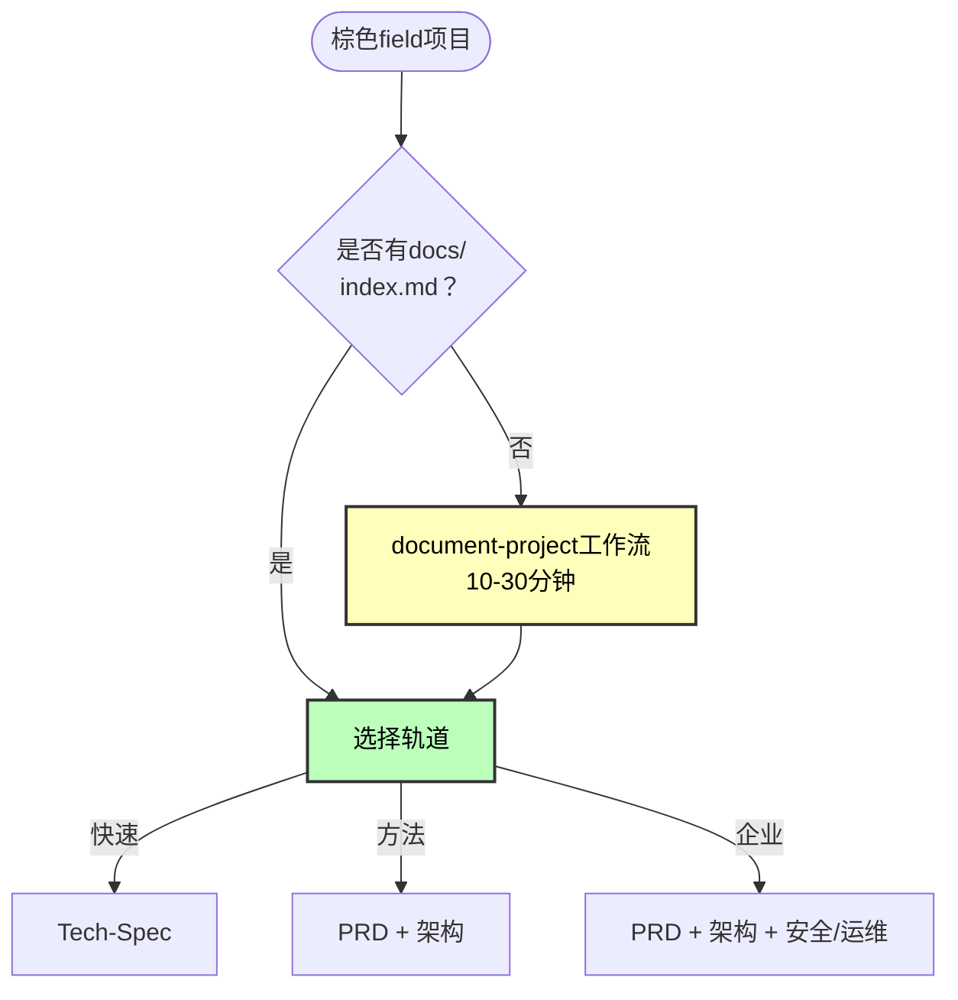

# 规模自适应智能

<cite>
**本文档中引用的文件**  
- [project-levels.yaml](file://src/modules/bmm/workflows/workflow-status/project-levels.yaml)
- [workflow-status-template.yaml](file://src/modules/bmm/workflows/workflow-status/workflow-status-template.yaml)
- [instructions.md](file://src/modules/bmm/workflows/workflow-status/instructions.md)
- [scale-adaptive-system.md](file://src/modules/bmm/docs/scale-adaptive-system.md)
- [bmad-quick-flow.md](file://src/modules/bmm/docs/bmad-quick-flow.md)
- [workflow.yaml](file://src/modules/bmm/workflows/workflow-status/workflow.yaml)
- [init/workflow.yaml](file://src/modules/bmm/workflows/workflow-status/init/workflow.yaml)
- [paths/method-greenfield.yaml](file://src/modules/bmm/workflows/workflow-status/paths/method-greenfield.yaml)
- [paths/method-brownfield.yaml](file://src/modules/bmm/workflows/workflow-status/paths/method-brownfield.yaml)
- [paths/enterprise-greenfield.yaml](file://src/modules/bmm/workflows/workflow-status/paths/enterprise-greenfield.yaml)
- [paths/enterprise-brownfield.yaml](file://src/modules/bmm/workflows/workflow-status/paths/enterprise-brownfield.yaml)
</cite>

## 目录
1. [简介](#简介)
2. [核心概念](#核心概念)
3. [项目类型与组织规模](#项目类型与组织规模)
4. [工作流状态路径配置](#工作流状态路径配置)
5. [智能路由机制](#智能路由机制)
6. [技术实现](#技术实现)
7. [实际案例](#实际案例)
8. [配置与自定义](#配置与自定义)
9. [结论](#结论)

## 简介

规模自适应智能系统是BMAD方法论的核心组件，它能够根据项目复杂度（绿色field vs 棕色field）和组织规模（企业级 vs 小团队）动态调整工作流和代理行为。该系统通过智能路由机制，评估项目特征并选择最佳实践路径，从而为不同规模和复杂度的项目提供最优的开发流程。

**Section sources**
- [scale-adaptive-system.md](file://src/modules/bmm/docs/scale-adaptive-system.md)

## 核心概念

规模自适应智能系统基于三个主要规划轨道来适应不同复杂度的项目：

### 三个规划轨道

| 轨道 | 规划深度 | 适用场景 |
| ---- | -------- | -------- |
| **快速流程** | 仅技术规范 | 简单功能、bug修复、明确范围 |
| **BMAD方法** | PRD + 架构 + UX | 产品、平台、复杂功能 |
| **企业方法** | 方法 + 测试/安全/运维 | 企业需求、合规性、多租户 |

### 规模自适应系统的优势

- **正确的规划深度**：为每个项目提供适当的规划深度
- **智能路由**：根据项目特征自动选择最佳路径
- **动态调整**：支持从简单到复杂的平滑过渡
- **上下文感知**：考虑绿色field和棕色field项目的不同需求

**Section sources**
- [scale-adaptive-system.md](file://src/modules/bmm/docs/scale-adaptive-system.md)

## 项目类型与组织规模

### 绿色field vs 棕色field项目

绿色field项目是从零开始的新项目，而棕色field项目是在现有代码库上进行开发。系统对这两种项目类型有不同的处理策略：

#### 绿色field项目特点
- 从零开始构建
- 可以自由选择技术栈
- 需要完整的架构设计
- 适合创新性功能

#### 棕色field项目特点
- 在现有代码库上开发
- 必须遵循现有模式和约定
- 需要文档化现有系统
- 强调集成和兼容性

### 组织规模的影响

#### 小团队/个人开发者
- 偏好快速流程
- 最小化仪式感
- 追求开发速度
- 适合简单功能和bug修复

#### 企业级团队
- 需要完整的规划流程
- 强调合规性和安全性
- 要求详细的文档
- 采用企业方法轨道

**Section sources**
- [scale-adaptive-system.md](file://src/modules/bmm/docs/scale-adaptive-system.md)
- [bmad-quick-flow.md](file://src/modules/bmm/docs/bmad-quick-flow.md)

## 工作流状态路径配置

工作流状态路径配置文件定义了不同项目类型的工作流组合。系统通过这些配置文件来确定最佳实践路径。

### 项目级别定义

`project-levels.yaml`文件定义了项目的五个级别：

```yaml
levels:
  0:
    name: "Level 0"
    title: "单个原子变更"
    stories: "1个故事"
    description: "bug修复，小功能，单个微小变更"
    documentation: "最小化 - 仅技术规范"
    architecture: false

  1:
    name: "Level 1"
    title: "小功能"
    stories: "1-10个故事"
    description: "小的连贯功能，最小化文档"
    documentation: "技术规范"
    architecture: false

  2:
    name: "Level 2"
    title: "中型项目"
    stories: "5-15个故事"
    description: "多个功能，集中的PRD"
    documentation: "PRD + 可选技术规范"
    architecture: false

  3:
    name: "Level 3"
    title: "复杂系统"
    stories: "12-40个故事"
    description: "子系统，集成，完整架构"
    documentation: "PRD + 架构 + JIT技术规范"
    architecture: true

  4:
    name: "Level 4"
    title: "企业级规模"
    stories: "40+个故事"
    description: "多个产品，企业架构"
    documentation: "PRD + 架构 + JIT技术规范"
    architecture: true
```

### 检测提示

系统使用关键词来检测项目复杂度：

```yaml
detection_hints:
  keywords:
    level_0: ["fix", "bug", "typo", "small change", "quick update", "patch"]
    level_1: ["simple", "basic", "small feature", "add", "minor"]
    level_2: ["dashboard", "several features", "admin panel", "medium"]
    level_3: ["platform", "integration", "complex", "system", "architecture"]
    level_4: ["enterprise", "multi-tenant", "multiple products", "ecosystem", "scale"]
```

**Diagram sources**
- [project-levels.yaml](file://src/modules/bmm/workflows/workflow-status/project-levels.yaml)

**Section sources**
- [project-levels.yaml](file://src/modules/bmm/workflows/workflow-status/project-levels.yaml)

## 智能路由机制

### 路由决策流程



**Diagram sources**
- [scale-adaptive-system.md](file://src/modules/bmm/docs/scale-adaptive-system.md)

### 路由决策算法

智能路由机制通过以下步骤评估项目特征并选择最佳路径：

1. **描述分析**：分析项目描述中的复杂度指标
2. **教育性展示**：展示所有三个轨道及其优缺点
3. **诚实推荐**：基于复杂度关键词、绿色field/棕色field、用户描述提供定制化建议
4. **用户选择**：用户选择最适合其情况的轨道

### 上下文切换机制

系统通过`workflow-status`工作流管理上下文切换：



**Diagram sources**
- [instructions.md](file://src/modules/bmm/workflows/workflow-status/instructions.md)
- [workflow.yaml](file://src/modules/bmm/workflows/workflow-status/workflow.yaml)

**Section sources**
- [instructions.md](file://src/modules/bmm/workflows/workflow-status/instructions.md)
- [workflow.yaml](file://src/modules/bmm/workflows/workflow-status/workflow.yaml)

## 技术实现

### 状态检测

系统通过`workflow-init`工作流进行初始状态检测：

```yaml
# Workflow Init - 初始项目设置
name: workflow-init
description: "通过确定级别、类型和创建工作流路径来初始化新BMM项目"
```

### 路径决策算法

路径决策基于以下因素：
- 项目描述中的关键词
- 故事数量范围
- 绿色field vs 棕色field
- 企业需求（合规性、安全性等）

### 上下文切换机制

上下文切换通过`workflow-status`工作流实现，支持多种模式：
- **交互模式**：默认模式，与用户交互
- **验证模式**：检查工作流是否可以继续
- **数据模式**：提取特定信息
- **初始化检查模式**：简单的存在性检查
- **更新模式**：集中更新状态文件

**Section sources**
- [init/workflow.yaml](file://src/modules/bmm/workflows/workflow-status/init/workflow.yaml)
- [workflow.yaml](file://src/modules/bmm/workflows/workflow-status/workflow.yaml)

## 实际案例

### 小型项目：快速流程

对于小型项目，系统启用快速流程：



**Diagram sources**
- [bmad-quick-flow.md](file://src/modules/bmm/docs/bmad-quick-flow.md)

### 大型企业项目：四阶段工作流

对于大型企业项目，系统启用完整的四阶段工作流：



**Diagram sources**
- [paths/enterprise-greenfield.yaml](file://src/modules/bmm/workflows/workflow-status/paths/enterprise-greenfield.yaml)

### 棕色field项目：文档化优先

对于棕色field项目，系统优先执行文档化工作流：



**Diagram sources**
- [scale-adaptive-system.md](file://src/modules/bmm/docs/scale-adaptive-system.md)

**Section sources**
- [scale-adaptive-system.md](file://src/modules/bmm/docs/scale-adaptive-system.md)

## 配置与自定义

### 工作流状态模板

`workflow-status-template.yaml`定义了状态文件的基本结构：

```yaml
# 工作流状态模板

# 这跟踪BMM方法论分析、规划和解决方案设计阶段的进度。
# 实施阶段在sprint-status.yaml中单独跟踪

generated: "{{generated}}"
project: "{{project_name}}"
project_type: "{{project_type}}"
selected_track: "{{selected_track}}"
field_type: "{{field_type}}"
workflow_path: "{{workflow_path_file}}"
workflow_status: "{{workflow_items}}"
```

### 路径配置文件

路径配置文件定义了不同项目类型的工作流组合。例如，`method-greenfield.yaml`定义了绿色field项目的BMAD方法路径：

```yaml
# BMAD方法 - 绿色field
# 用于绿色field项目的完整产品+架构规划（通常10-50+个故事）

method_name: "BMAD方法"
track: "bmad-method"
field_type: "greenfield"
description: "用于绿色field项目的完整产品和系统设计方法论"

phases:
  - phase: 0
    name: "发现（可选）"
    optional: true
    workflows:
      - id: "brainstorm-project"
        optional: true
        agent: "analyst"
        command: "brainstorm-project"
        
      - id: "research"
        optional: true
        agent: "analyst"
        command: "research"
        
      - id: "product-brief"
        optional: true
        agent: "analyst"
        command: "product-brief"
        
  - phase: 1
    name: "规划"
    required: true
    workflows:
      - id: "prd"
        required: true
        agent: "pm"
        command: "prd"
        
      - id: "validate-prd"
        optional: true
        agent: "pm"
        command: "validate-prd"
        
      - id: "create-ux-design"
        conditional: "if_has_ui"
        agent: "ux-designer"
        command: "create-ux-design"
```

**Section sources**
- [workflow-status-template.yaml](file://src/modules/bmm/workflows/workflow-status/workflow-status-template.yaml)
- [paths/method-greenfield.yaml](file://src/modules/bmm/workflows/workflow-status/paths/method-greenfield.yaml)

## 结论

规模自适应智能系统通过智能路由机制，能够根据项目复杂度和组织规模动态调整工作流和代理行为。该系统为不同类型的项目提供了最优的开发流程：

- **小型项目**：使用快速流程，最小化规划，快速实现
- **中型项目**：使用BMAD方法，平衡规划和实现
- **大型企业项目**：使用企业方法，全面规划，确保质量和合规性

通过工作流状态路径配置文件，系统能够精确控制不同项目类型的工作流组合。智能路由机制基于项目特征评估，选择最佳实践路径，并通过上下文切换机制动态加载相应模块。

这种规模自适应的方法确保了每个项目都能获得适当的规划深度，既避免了过度规划的浪费，又防止了规划不足带来的风险，实现了开发效率和质量的最佳平衡。

**Section sources**
- [scale-adaptive-system.md](file://src/modules/bmm/docs/scale-adaptive-system.md)
- [bmad-quick-flow.md](file://src/modules/bmm/docs/bmad-quick-flow.md)