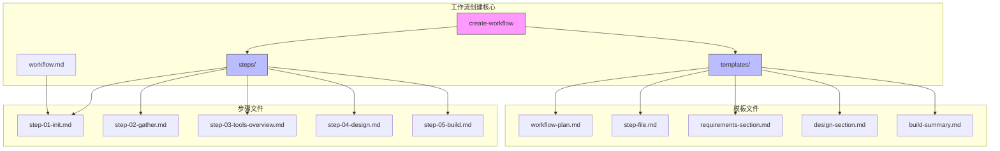
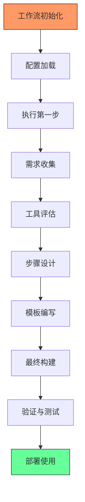
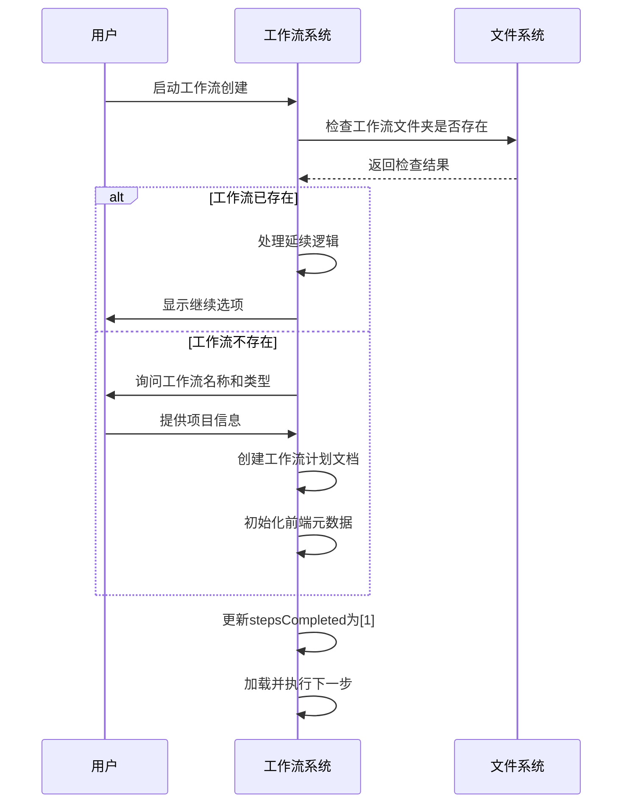
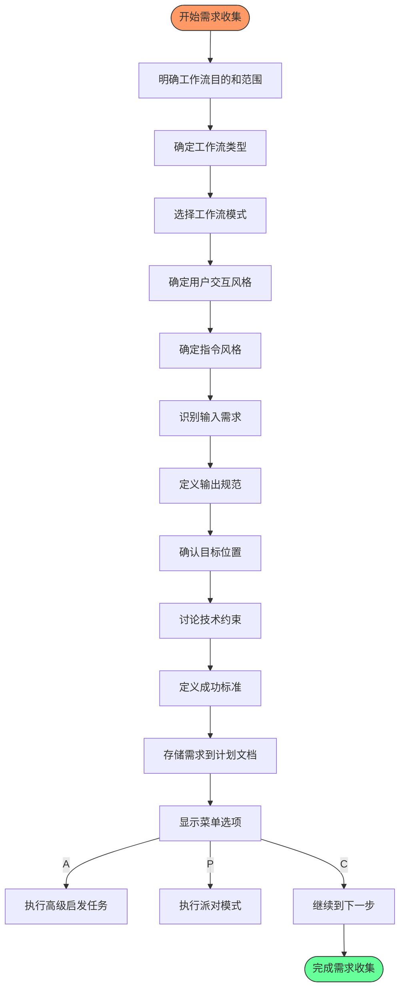
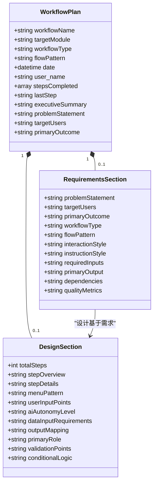
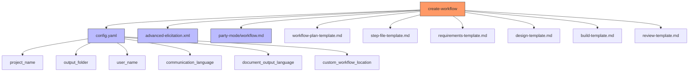

# 工作流创建

<cite>
**本文档引用的文件**   
- [workflow.md](file://src/modules/bmb/workflows/create-workflow/workflow.md)
- [step-01-init.md](file://src/modules/bmb/workflows/create-workflow/steps/step-01-init.md)
- [step-02-gather.md](file://src/modules/bmb/workflows/create-workflow/steps/step-02-gather.md)
- [workflow-plan.md](file://src/modules/bmb/workflows/create-workflow/templates/workflow-plan.md)
- [workflow.md](file://src/modules/bmb/workflows/create-workflow/templates/workflow.md)
- [step-file.md](file://src/modules/bmb/workflows/create-workflow/templates/step-file.md)
- [requirements-section.md](file://src/modules/bmb/workflows/create-workflow/templates/requirements-section.md)
- [design-section.md](file://src/modules/bmb/workflows/create-workflow/templates/design-section.md)
- [completion-section.md](file://src/modules/bmb/workflows/create-workflow/templates/completion-section.md)
- [review-section.md](file://src/modules/bmb/workflows/create-workflow/templates/review-section.md)
- [meal-prep-nutrition/workflow.md](file://src/modules/bmb/reference/workflows/meal-prep-nutrition/workflow.md)
- [step-template.md](file://src/modules/bmb/docs/workflows/step-template.md)
- [architecture.md](file://src/modules/bmb/docs/workflows/architecture.md)
</cite>

## 目录
1. [简介](#简介)
2. [项目结构](#项目结构)
3. [核心组件](#核心组件)
4. [架构概述](#架构概述)
5. [详细组件分析](#详细组件分析)
6. [依赖分析](#依赖分析)
7. [性能考虑](#性能考虑)
8. [故障排除指南](#故障排除指南)
9. [结论](#结论)
10. [附录](#附录)（如有必要）

## 简介
本文档提供了BMAD-METHOD工作流创建的详细指南，深入讲解从零开始构建新工作流的完整流程。文档涵盖了需求收集、工具评估、步骤设计、模板编写和最终构建等关键环节，详细解释了create-workflow工作流中每个步骤的作用和执行顺序。通过实际代码示例展示如何定义工作流YAML结构、关联数据文件和引用模板，并阐述工作流创建过程中的最佳实践、常见陷阱及解决方案，帮助用户高效创建可复用、可维护的工作流。

## 项目结构
BMAD-METHOD工作流创建系统采用模块化、分层的文件组织结构，确保工作流的可维护性和可扩展性。核心工作流创建功能位于`src/modules/bmb/workflows/create-workflow/`目录下，采用基于Markdown的步骤文件架构（step-file architecture）来实现结构化执行。

**图示来源**
- [workflow.md](file://src/modules/bmb/workflows/create-workflow/workflow.md)
- [steps/](file://src/modules/bmb/workflows/create-workflow/steps/)
- [templates/](file://src/modules/bmb/workflows/create-workflow/templates/)

**本节来源**
- [workflow.md](file://src/modules/bmb/workflows/create-workflow/workflow.md)
- [project_structure](file://project_structure)

## 核心组件
工作流创建系统的核心组件包括工作流定义文件（workflow.md）、步骤文件（step-*.md）和模板文件（*.md）。这些组件共同构成了一个结构化的、可重复的工作流创建框架。系统采用微文件设计原则，每个步骤都是一个独立的指令文件，必须严格按照顺序执行。通过前端元数据（frontmatter）中的`stepsCompleted`数组来跟踪执行进度，确保状态的正确管理。

**本节来源**
- [workflow.md](file://src/modules/bmb/workflows/create-workflow/workflow.md#L1-L59)
- [step-01-init.md](file://src/modules/bmb/workflows/create-workflow/steps/step-01-init.md#L1-L169)

## 架构概述
BMAD-METHOD工作流创建系统采用**步骤文件架构**（step-file architecture）进行严格的执行控制。该架构基于一系列核心原则，确保工作流的纪律性、可预测性和可维护性。

**图示来源**
- [workflow.md](file://src/modules/bmb/workflows/create-workflow/workflow.md#L15-L45)
- [architecture.md](file://src/modules/bmb/docs/workflows/architecture.md#L213-L221)

## 详细组件分析
### 工作流创建步骤分析
工作流创建过程被分解为一系列有序的步骤，每个步骤都有明确的目标和执行规则。这种分步方法确保了工作流创建的系统性和完整性。

#### 初始化步骤 (step-01-init.md)
初始化步骤是工作流创建的起点，负责检测延续状态并设置项目环境。

**图示来源**
- [step-01-init.md](file://src/modules/bmb/workflows/create-workflow/steps/step-01-init.md#L25-L169)
- [workflow.md](file://src/modules/bmb/workflows/create-workflow/workflow.md#L48-L59)

#### 需求收集步骤 (step-02-gather.md)
需求收集步骤通过协作对话收集工作流的全面需求，为后续设计提供依据。

**图示来源**
- [step-02-gather.md](file://src/modules/bmb/workflows/create-workflow/steps/step-02-gather.md#L24-L234)
- [requirements-section.md](file://src/modules/bmb/workflows/create-workflow/templates/requirements-section.md)

### 工作流模板分析
工作流模板文件定义了新工作流的基本结构和内容框架。

#### 工作流计划模板 (workflow-plan.md)
工作流计划模板为工作流创建过程提供了一个结构化的文档框架，用于记录所有需求和设计细节。

**图示来源**
- [workflow-plan.md](file://src/modules/bmb/workflows/create-workflow/templates/workflow-plan.md)
- [requirements-section.md](file://src/modules/bmb/workflows/create-workflow/templates/requirements-section.md)
- [design-section.md](file://src/modules/bmb/workflows/create-workflow/templates/design-section.md)

## 依赖分析
工作流创建系统依赖于多个核心组件和配置文件，这些依赖关系确保了系统的完整性和功能性。

**图示来源**
- [workflow.md](file://src/modules/bmb/workflows/create-workflow/workflow.md)
- [step-01-init.md](file://src/modules/bmb/workflows/create-workflow/steps/step-01-init.md)
- [step-02-gather.md](file://src/modules/bmb/workflows/create-workflow/steps/step-02-gather.md)

## 性能考虑
虽然工作流创建系统主要关注功能性和正确性而非性能，但仍有一些重要的性能考虑因素。系统采用按需加载（Just-In-Time Loading）策略，确保只有当前步骤文件在内存中，这有助于保持较低的内存占用。通过严格的顺序执行规则，避免了并行处理可能带来的复杂性和错误。对于大型工作流，建议将步骤分解为更小的单元，以提高可维护性和执行效率。

## 故障排除指南
在工作流创建过程中可能会遇到一些常见问题，以下是一些解决方案：

**本节来源**
- [step-01-init.md](file://src/modules/bmb/workflows/create-workflow/steps/step-01-init.md#L152-L167)
- [step-02-gather.md](file://src/modules/bmb/workflows/create-workflow/steps/step-02-gather.md#L217-L233)
- [step-template.md](file://src/modules/bmb/docs/workflows/step-template.md#L274-L283)

## 结论
BMAD-METHOD工作流创建系统提供了一个结构化、可重复的框架，用于创建高质量的工作流。通过遵循步骤文件架构和一系列核心原则，用户可以系统地构建满足特定需求的工作流。该系统强调协作对话、严格遵循指令和状态跟踪，确保了工作流创建过程的可靠性和可预测性。通过使用预定义的模板和最佳实践，用户可以高效地创建可复用、可维护的工作流，从而提高生产力和工作质量。

## 附录
### 工作流创建最佳实践
1. **保持步骤文件专注** - 每个步骤应该专注于做好一件事
2. **指令明确** - 对要做的事情不要有歧义
3. **包含所有关键规则** - 不要从其他步骤中假设任何内容
4. **使用清晰简洁的语言** - 除非必要，否则避免使用术语
5. **确保所有菜单路径都有处理程序** - 确保每个选项都有明确的说明
6. **记录依赖关系** - 清楚地说明此步骤需要什么
7. **明确定义成功和失败** - 对步骤和工作流都要明确定义
8. **清晰标记完成** - 确保最后步骤更新前端元数据以指示工作流完成

**本节来源**
- [step-template.md](file://src/modules/bmb/docs/workflows/step-template.md#L274-L283)
- [architecture.md](file://src/modules/bmb/docs/workflows/architecture.md#L213-L221)