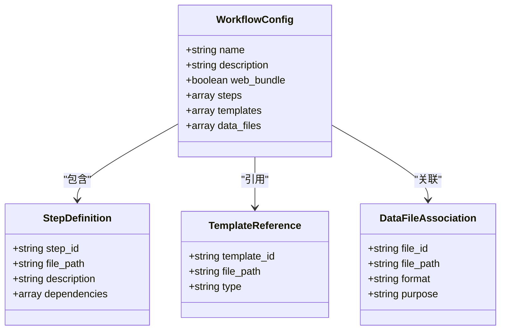
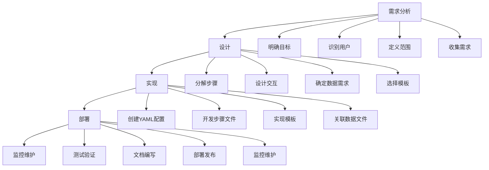
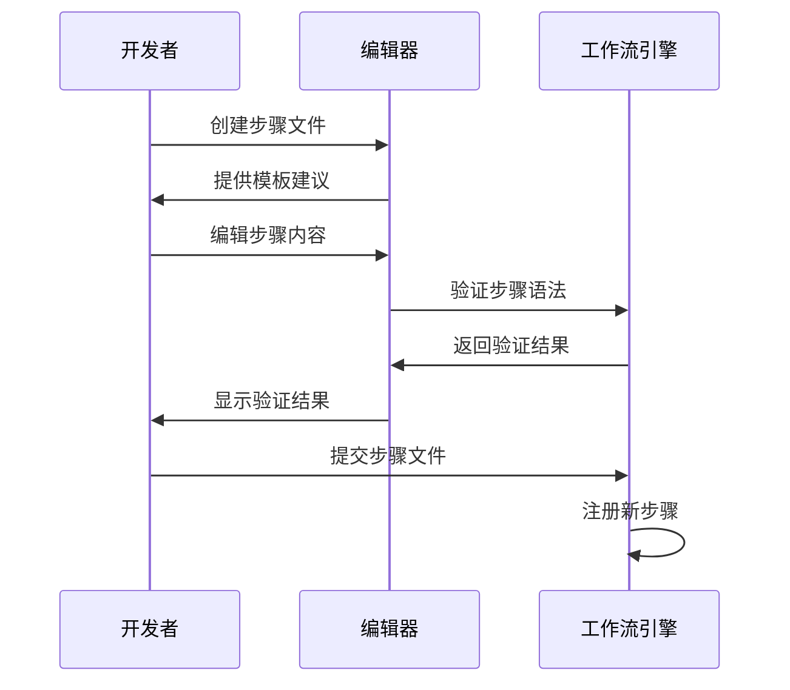
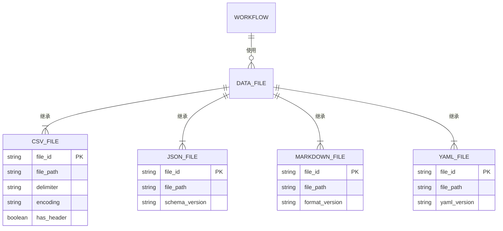
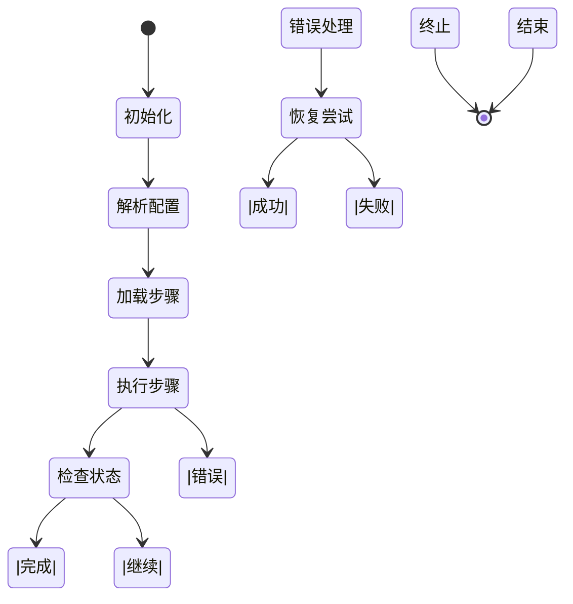
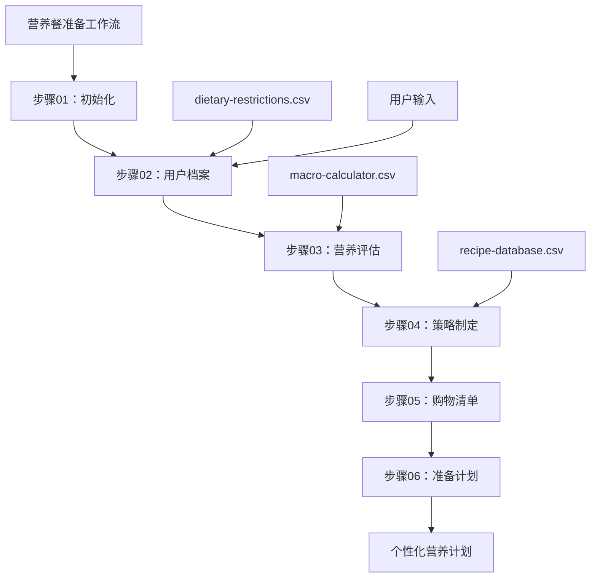
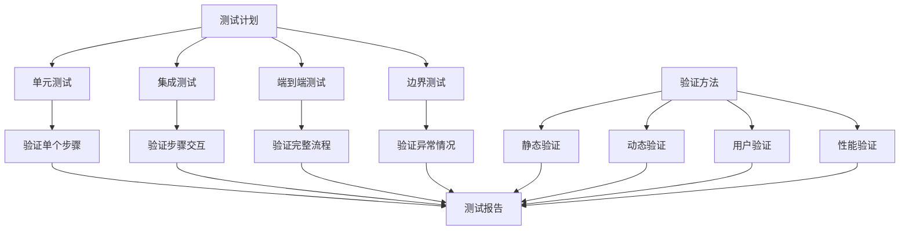

# 工作流扩展

<cite>
**本文档引用的文件**   
- [workflow.md](file://src/modules/bmb/workflows/create-workflow/workflow.md)
- [workflow-template.md](file://src/modules/bmb/docs/workflows/workflow-template.md)
- [step-template.md](file://src/modules/bmb/docs/workflows/step-template.md)
- [create-workflow](file://src/modules/bmb/workflows/create-workflow)
- [meal-prep-nutrition](file://src/modules/bmb/reference/workflows/meal-prep-nutrition)
- [csv-data-file-standards.md](file://src/modules/bmb/docs/workflows/csv-data-file-standards.md)
- [workflow-architecture-reference.md](file://src/modules/bmm/docs/workflow-architecture-reference.md)
- [intent-vs-prescriptive-spectrum.md](file://src/modules/bmb/docs/workflows/intent-vs-prescriptive-spectrum.md)
- [terms.md](file://src/modules/bmb/docs/workflows/terms.md)
</cite>

## 目录
1. [引言](#引言)
2. [工作流架构概述](#工作流架构概述)
3. [工作流YAML文件结构](#工作流yaml文件结构)
4. [工作流开发流程](#工作流开发流程)
5. [步骤设计与模板创建](#步骤设计与模板创建)
6. [数据文件关联](#数据文件关联)
7. [动态解析机制与状态管理](#动态解析机制与状态管理)
8. [营养餐准备工作流示例](#营养餐准备工作流示例)
9. [测试与验证](#测试与验证)
10. [最佳实践与高级技巧](#最佳实践与高级技巧)

## 引言
BMAD-METHOD工作流系统提供了一套完整的框架，用于创建和扩展现有工作流。本指南旨在为开发者提供全面的指导，详细说明如何基于现有模板创建新的工作流或扩展现有工作流。我们将深入探讨工作流YAML文件的结构、步骤定义、模板引用、数据文件关联等关键元素，并通过实际示例展示复杂工作流的构建方法。

**Section sources**
- [workflow.md](file://src/modules/bmb/workflows/create-workflow/workflow.md#L1-L59)

## 工作流架构概述
BMAD-METHOD工作流系统采用基于步骤文件的架构（step-file architecture），确保工作流的有序执行和状态跟踪。该架构的核心原则包括微文件设计、即时加载、顺序执行、状态跟踪和追加式构建。

### 核心原则
- **微文件设计**：每个步骤都是一个独立的指令文件，作为整体工作流的一部分必须精确遵循
- **即时加载**：仅在需要时加载当前步骤文件，绝不提前加载后续步骤文件
- **顺序执行**：步骤文件内的顺序必须按序完成，不允许跳过或优化
- **状态跟踪**：当工作流生成文档时，在输出文件的前置元数据中使用`stepsCompleted`数组记录进度
- **追加式构建**：通过按指示向输出文件追加内容来构建文档

### 步骤处理规则
1. **完整读取**：在执行任何操作前，必须完整读取整个步骤文件
2. **遵循顺序**：按顺序执行所有编号部分，绝不偏离
3. **等待输入**：如果出现菜单，必须暂停并等待用户选择
4. **检查继续**：如果步骤有包含"继续"选项的菜单，只有当用户选择'C'（继续）时才进入下一步
5. **保存状态**：在加载下一步之前，更新输出文件前置元数据中的`stepsCompleted`
6. **加载下一步**：在指示下，加载、完整读取然后执行下一个步骤文件

**Section sources**
- [workflow.md](file://src/modules/bmb/workflows/create-workflow/workflow.md#L15-L45)

## 工作流YAML文件结构
工作流YAML文件是定义工作流行为和配置的核心文件。它包含工作流的元数据、步骤定义、模板引用和数据文件关联等关键信息。

### 基本结构
```yaml
name: 工作流名称
description: 工作流描述
web_bundle: true/false
```

### 关键元素
- `name`：工作流的唯一标识名称
- `description`：工作流的详细描述
- `web_bundle`：指示工作流是否为Web捆绑包
- `steps`：定义工作流的步骤序列
- `templates`：引用工作流使用的模板文件
- `data_files`：关联工作流使用的数据文件



**Diagram sources**
- [workflow-template.md](file://src/modules/bmb/docs/workflows/workflow-template.md)
- [terms.md](file://src/modules/bmb/docs/workflows/terms.md)

**Section sources**
- [workflow-template.md](file://src/modules/bmb/docs/workflows/workflow-template.md)
- [terms.md](file://src/modules/bmb/docs/workflows/terms.md)

## 工作流开发流程
创建新工作流或扩展现有工作流需要遵循系统化的开发流程，从需求分析到实现部署。

### 需求分析阶段
1. **明确目标**：确定工作流要解决的具体问题或实现的功能
2. **识别用户**：确定工作流的目标用户及其需求
3. **定义范围**：明确工作流的边界和限制
4. **收集需求**：收集所有必要的功能和非功能需求

### 设计阶段
1. **分解步骤**：将工作流分解为逻辑上独立的步骤
2. **设计交互**：规划用户与工作流的交互方式
3. **确定数据需求**：识别工作流所需的数据文件和格式
4. **选择模板**：确定需要使用的模板类型和结构

### 实现阶段
1. **创建YAML配置**：编写工作流的YAML配置文件
2. **开发步骤文件**：为每个步骤创建相应的Markdown文件
3. **实现模板**：创建或修改所需的模板文件
4. **关联数据文件**：准备并关联必要的数据文件

### 部署阶段
1. **测试验证**：全面测试工作流的功能和性能
2. **文档编写**：创建用户文档和开发者文档
3. **部署发布**：将工作流部署到生产环境
4. **监控维护**：持续监控工作流的运行状态并进行维护



**Diagram sources**
- [workflow-architecture-reference.md](file://src/modules/bmm/docs/workflow-architecture-reference.md)
- [intent-vs-prescriptive-spectrum.md](file://src/modules/bmb/docs/workflows/intent-vs-prescriptive-spectrum.md)

**Section sources**
- [workflow-architecture-reference.md](file://src/modules/bmm/docs/workflow-architecture-reference.md)
- [intent-vs-prescriptive-spectrum.md](file://src/modules/bmb/docs/workflows/intent-vs-prescriptive-spectrum.md)

## 步骤设计与模板创建
步骤设计和模板创建是工作流开发的核心环节，直接影响工作流的可用性和效率。

### 步骤设计原则
- **原子性**：每个步骤应完成单一、明确的任务
- **独立性**：步骤应尽可能独立，减少对其他步骤的依赖
- **可测试性**：每个步骤应易于测试和验证
- **用户友好**：步骤的指令应清晰、简洁，易于理解

### 模板创建指南
1. **命名规范**：使用一致的命名约定，便于识别和管理
2. **结构清晰**：保持模板结构清晰，逻辑分明
3. **变量定义**：明确定义模板中的变量和占位符
4. **注释说明**：为复杂部分添加必要的注释说明



**Diagram sources**
- [step-template.md](file://src/modules/bmb/docs/workflows/step-template.md)
- [workflow-template.md](file://src/modules/bmb/docs/workflows/workflow-template.md)

**Section sources**
- [step-template.md](file://src/modules/bmb/docs/workflows/step-template.md)
- [workflow-template.md](file://src/modules/bmb/docs/workflows/workflow-template.md)

## 数据文件关联
数据文件是工作流的重要组成部分，用于存储和传递工作流执行所需的信息。

### 数据文件类型
- **CSV文件**：用于存储结构化数据，如配置选项、参考数据等
- **JSON文件**：用于存储复杂的数据结构和配置
- **Markdown文件**：用于存储文档内容和说明
- **YAML文件**：用于存储配置和元数据

### CSV数据文件标准
- **文件编码**：UTF-8
- **分隔符**：逗号(,)
- **引号**：双引号(")
- **换行符**：LF(\n)
- **BOM**：无BOM



**Diagram sources**
- [csv-data-file-standards.md](file://src/modules/bmb/docs/workflows/csv-data-file-standards.md)
- [terms.md](file://src/modules/bmb/docs/workflows/terms.md)

**Section sources**
- [csv-data-file-standards.md](file://src/modules/bmb/docs/workflows/csv-data-file-standards.md)
- [terms.md](file://src/modules/bmb/docs/workflows/terms.md)

## 动态解析机制与状态管理
BMAD-METHOD工作流系统采用先进的动态解析机制和状态管理策略，确保工作流的可靠执行。

### 动态解析机制
- **即时解析**：在运行时动态解析工作流配置和步骤
- **按需加载**：仅在需要时加载和解析相关组件
- **缓存优化**：对已解析的组件进行缓存，提高执行效率
- **错误恢复**：在解析失败时提供详细的错误信息和恢复建议

### 状态管理
- **进度跟踪**：使用`stepsCompleted`数组跟踪已完成的步骤
- **持久化存储**：将工作流状态持久化到文件系统
- **恢复机制**：支持从断点恢复工作流执行
- **并发控制**：管理多个工作流实例的并发执行



**Diagram sources**
- [workflow.md](file://src/modules/bmb/workflows/create-workflow/workflow.md#L24-L35)
- [workflow-architecture-reference.md](file://src/modules/bmm/docs/workflow-architecture-reference.md)

**Section sources**
- [workflow.md](file://src/modules/bmb/workflows/create-workflow/workflow.md#L24-L35)
- [workflow-architecture-reference.md](file://src/modules/bmm/docs/workflow-architecture-reference.md)

## 营养餐准备工作流示例
营养餐准备工作流是一个复杂的实际示例，展示了如何构建和管理多步骤、多数据源的工作流。

### 工作流结构
- **步骤01：初始化** - 设置工作流环境和参数
- **步骤02：用户档案** - 收集用户的饮食偏好和限制
- **步骤03：营养评估** - 分析用户的营养需求
- **步骤04：策略制定** - 制定个性化的营养计划
- **步骤05：购物清单** - 生成购物清单
- **步骤06：准备计划** - 制定食物准备时间表

### 数据文件关联
- **dietary-restrictions.csv**：存储用户的饮食限制
- **macro-calculator.csv**：用于计算宏量营养素
- **recipe-database.csv**：存储食谱数据库



**Diagram sources**
- [meal-prep-nutrition](file://src/modules/bmb/reference/workflows/meal-prep-nutrition)
- [workflow.md](file://src/modules/bmb/workflows/create-workflow/workflow.md)

**Section sources**
- [meal-prep-nutrition](file://src/modules/bmb/reference/workflows/meal-prep-nutrition)
- [workflow.md](file://src/modules/bmb/workflows/create-workflow/workflow.md)

## 测试与验证
测试与验证是确保工作流质量和可靠性的关键环节。

### 测试策略
- **单元测试**：测试单个步骤的功能
- **集成测试**：测试步骤间的交互和数据传递
- **端到端测试**：测试整个工作流的执行流程
- **边界测试**：测试异常情况和边界条件

### 验证方法
- **静态验证**：检查YAML文件的语法和结构
- **动态验证**：在运行时验证工作流的行为
- **用户验证**：通过用户反馈验证工作流的可用性
- **性能验证**：评估工作流的执行效率



**Section sources**
- [workflow.md](file://src/modules/bmb/workflows/create-workflow/workflow.md)
- [workflow-architecture-reference.md](file://src/modules/bmm/docs/workflow-architecture-reference.md)

## 最佳实践与高级技巧
遵循最佳实践和掌握高级技巧可以显著提高工作流开发的效率和质量。

### 最佳实践
- **模块化设计**：将工作流分解为可重用的模块
- **文档化**：为工作流和步骤提供详细的文档
- **版本控制**：使用版本控制管理工作流的变更
- **持续集成**：将工作流测试集成到CI/CD管道中

### 高级技巧
- **条件分支**：根据用户输入或数据状态动态调整工作流路径
- **并行处理**：在适当的情况下并行执行独立步骤
- **自适应逻辑**：根据上下文动态调整工作流行为
- **智能推荐**：基于用户历史和偏好提供智能建议

**Section sources**
- [workflow-architecture-reference.md](file://src/modules/bmm/docs/workflow-architecture-reference.md)
- [intent-vs-prescriptive-spectrum.md](file://src/modules/bmb/docs/workflows/intent-vs-prescriptive-spectrum.md)
- [terms.md](file://src/modules/bmb/docs/workflows/terms.md)