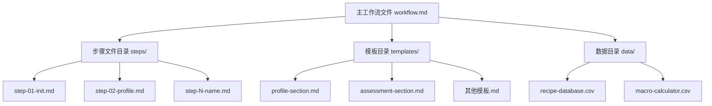
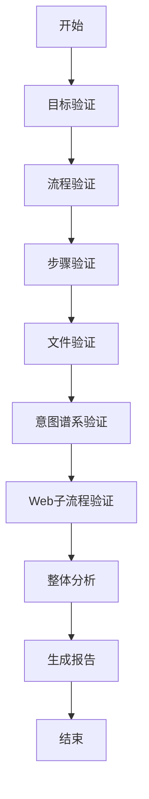
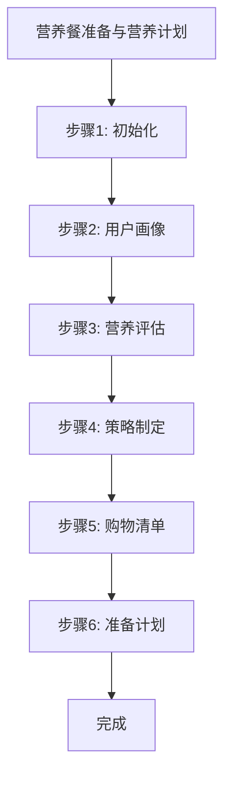

# 工作流管理

<cite>
**本文档中引用的文件**  
- [workflow.md](file://src/modules/bmb/workflows/workflow-compliance-check/workflow.md)
- [step-01-validate-goal.md](file://src/modules/bmb/workflows/workflow-compliance-check/steps/step-01-validate-goal.md)
- [step-02-workflow-validation.md](file://src/modules/bmb/workflows/workflow-compliance-check/steps/step-02-workflow-validation.md)
- [step-03-step-validation.md](file://src/modules/bmb/workflows/workflow-compliance-check/steps/step-03-step-validation.md)
- [step-04-file-validation.md](file://src/modules/bmb/workflows/workflow-compliance-check/steps/step-04-file-validation.md)
- [step-05-intent-spectrum-validation.md](file://src/modules/bmb/workflows/workflow-compliance-check/steps/step-05-intent-spectrum-validation.md)
- [step-06-web-subprocess-validation.md](file://src/modules/bmb/workflows/workflow-compliance-check/steps/step-06-web-subprocess-validation.md)
- [step-07-holistic-analysis.md](file://src/modules/bmb/workflows/workflow-compliance-check/steps/step-07-holistic-analysis.md)
- [step-08-generate-report.md](file://src/modules/bmb/workflows/workflow-compliance-check/steps/step-08-generate-report.md)
- [compliance-report.md](file://src/modules/bmb/workflows/workflow-compliance-check/templates/compliance-report.md)
- [workflow-template.md](file://src/modules/bmb/docs/workflows/workflow-template.md)
- [step-template.md](file://src/modules/bmb/docs/workflows/step-template.md)
- [meal-prep-nutrition/workflow.md](file://src/modules/bmb/reference/workflows/meal-prep-nutrition/workflow.md)
- [meal-prep-nutrition/steps/step-01-init.md](file://src/modules/bmb/reference/workflows/meal-prep-nutrition/steps/step-01-init.md)
</cite>

## 目录
1. [引言](#引言)
2. [工作流架构](#工作流架构)
3. [合规性检查工作流](#合规性检查工作流)
4. [八大验证步骤详解](#八大验证步骤详解)
5. [营养餐准备工作流实例](#营养餐准备工作流实例)
6. [合规报告生成](#合规报告生成)
7. [管理实践](#管理实践)
8. [结论](#结论)

## 引言

BMAD-METHOD提供了一套系统化的工作流管理与合规性检查框架，旨在确保工作流的可靠性、一致性和高质量。本指南将深入探讨工作流全生命周期的管理策略，重点介绍`workflow-compliance-check`工作流的八大验证步骤，并通过`meal-prep-nutrition`（营养餐准备）这一复杂工作流实例，演示如何执行全面的合规性审计。

工作流管理的核心在于其严格的架构和验证机制。通过微文件设计、即时加载和顺序执行等原则，BMAD-METHOD确保了工作流的可预测性和可维护性。合规性检查作为质量保证的关键环节，采用对抗性分析方法，系统性地验证工作流是否符合BMAD标准，并生成详细的合规报告。

本指南将为工作流所有者和验证专家提供权威的实践指导，涵盖从目标验证到生成最终报告的完整流程，确保工作流在功能、性能和安全性方面均达到最高标准。

## 工作流架构

BMAD-METHOD采用**基于步骤文件的架构**（step-file architecture），这是一种纪律性极强的执行模式，确保工作流的可靠性和可维护性。

**架构核心原则**：

- **微文件设计**：每个步骤都是一个独立的、自包含的指令文件，必须严格按照顺序执行。
- **即时加载**：仅将当前步骤文件加载到内存中，绝不预加载未来的步骤文件。
- **顺序执行**：步骤文件必须按顺序完成，不允许跳过或优化序列。
- **状态跟踪**：通过输出文件的前置元数据（frontmatter）中的`stepsCompleted`数组来记录进度。
- **仅追加构建**：通过按指示向输出文件追加内容来构建文档。

**执行模型**：

1.  **加载主工作流**：读取`workflow.md`文件，获取配置信息。
2.  **执行初始化**：运行`step-01-init.md`以初始化或检测继续状态。
3.  **循环执行步骤**：
    a.  完全加载当前步骤文件。
    b.  按顺序执行指令。
    c.  在菜单点等待用户输入。
    d.  只有当用户选择“C”（继续）时才继续。
    e.  更新文档/前置元数据。
    f.  加载下一个步骤。

**Diagram sources**
- [workflow.md](file://src/modules/bmb/docs/workflows/architecture.md#L1-L221)
- [step-01-init.md](file://src/modules/bmb/reference/workflows/meal-prep-nutrition/steps/step-01-init.md#L1-L178)

**Section sources**
- [architecture.md](file://src/modules/bmb/docs/workflows/architecture.md#L1-L221)
- [workflow-template.md](file://src/modules/bmb/docs/workflows/workflow-template.md#L1-L153)

## 合规性检查工作流

`workflow-compliance-check`工作流是BMAD-METHOD中用于系统性验证其他工作流是否符合标准的核心工具。它扮演着合规性验证者和质量保证专家的角色，与工作流所有者合作，通过对抗性分析发现潜在问题。

该工作流的目标是：通过对抗性分析，系统性地验证工作流是否符合BMAD标准，生成包含严重性分级的违规项和改进建议的详细合规报告。

**关键角色**：
- **合规性验证者**：带来BMAD标准、工作流架构和系统性验证方面的专业知识。
- **工作流所有者**：提供其工作流及具体的合规性关注点。

这是一个平等的合作伙伴关系，而非客户-供应商关系。

**核心原则**：
- **微文件设计**：每个验证步骤都是独立的。
- **即时加载**：一次只处理一个验证步骤。
- **顺序执行**：严格按照八个步骤的顺序进行，不允许跳过。
- **状态跟踪**：在合规报告中记录验证进度。
- **仅追加构建**：通过向合规报告追加内容来构建最终报告。

**Diagram sources**
- [workflow.md](file://src/modules/bmb/workflows/workflow-compliance-check/workflow.md#L1-L59)

**Section sources**
- [workflow.md](file://src/modules/bmb/workflows/workflow-compliance-check/workflow.md#L1-L59)

## 八大验证步骤详解

`workflow-compliance-check`工作流由八个精心设计的步骤组成，每个步骤都专注于工作流质量的一个特定方面。这些步骤构成了一个全面的、分阶段的验证过程。

### 1. 目标验证 (step-01-validate-goal.md)

这是合规性检查的起点，旨在确认验证目标和范围。

**核心任务**：
- **确认目标工作流路径**：用户必须提供要验证的工作流的完整路径。
- **验证路径可访问性**：检查指定路径是否存在且可读。
- **确立验证范围**：向用户明确说明将进行的三阶段合规性检查：
    1.  **流程验证**：检查`workflow.md`是否符合`workflow-template.md`标准。
    2.  **步骤验证**：检查每个步骤文件是否符合`step-template.md`标准。
    3.  **整体分析**：进行流程优化和目标对齐的综合评估。
- **获取用户确认**：在用户确认验证范围和目标后，才能进入下一阶段。

此步骤确保了验证过程的起点是清晰和一致的，避免了对错误工作流的无效分析。

**Section sources**
- [step-01-validate-goal.md](file://src/modules/bmb/workflows/workflow-compliance-check/steps/step-01-validate-goal.md#L1-L153)

### 2. 流程验证 (step-02-workflow-validation.md)

此阶段专注于验证主工作流文件`workflow.md`的结构和内容是否符合`workflow-template.md`的权威标准。

**验证重点**：
- **前置元数据结构**：检查`name`、`description`、`web_bundle`等必需字段是否存在且格式正确。
- **核心架构完整性**：确保`WORKFLOW ARCHITECTURE`部分的五大核心原则（微文件设计、即时加载等）完整无缺。
- **初始化序列**：验证`INITIALIZATION SEQUENCE`部分的配置加载和第一步执行指令是否正确。
- **角色定义**：检查`Your Role`部分是否清晰地定义了AI和用户的角色，强调了合作伙伴关系。

此步骤采用对抗性分析方法，逐一比对目标文件与模板，记录所有偏差，并按严重性（关键/主要/次要）进行分级。

**Section sources**
- [step-02-workflow-validation.md](file://src/modules/bmb/workflows/workflow-compliance-check/steps/step-02-workflow-validation.md#L1-L77)
- [workflow-template.md](file://src/modules/bmb/docs/workflows/workflow-template.md#L1-L153)

### 3. 步骤验证 (step-03-step-validation.md)

在通过主流程验证后，此阶段将深入到工作流的每个步骤文件，验证其是否符合`step-template.md`的详细标准。

**验证重点**：
- **文件结构**：检查每个步骤文件是否包含正确的前置元数据（如`name`、`description`、`thisStepFile`、`nextStepFile`等）。
- **强制执行规则**：验证`MANDATORY EXECUTION RULES`部分是否包含通用规则、角色强化和步骤特定规则。
- **执行协议**：检查`EXECUTION PROTOCOLS`是否清晰定义了该步骤的操作流程。
- **上下文边界**：确认`CONTEXT BOUNDARIES`是否明确定义了可用上下文、焦点、限制和依赖关系。
- **指令序列**：确保`Sequence of Instructions`部分的指令是完整、有序且无歧义的。

此步骤对每个步骤文件进行系统性的、文件到文件的对抗性分析，确保工作流的每一个执行单元都符合最佳实践。

**Section sources**
- [step-03-step-validation.md](file://src/modules/bmb/workflows/workflow-compliance-check/steps/step-03-step-validation.md#L1-L79)
- [step-template.md](file://src/modules/bmb/docs/workflows/step-template.md#L1-L284)

### 4. 文件验证 (step-04-file-validation.md)

此步骤关注工作流的性能、可维护性和数据完整性，从文件大小、格式和数据文件三个维度进行验证。

**验证重点**：
- **文件大小分析**：
    -   ≤ 5K：最优（性能和可维护性优秀）
    -   5K-7K：良好
    -   7K-10K：可接受（建议优化）
    -   10K-12K：关注（内容应合并或拆分）
    -   > 15K：必须处理（文件必须优化）
- **Markdown格式验证**：
    -   检查标题层级（H1 → H2 → H3）是否正确。
    -   验证粗体、斜体、列表等格式是否一致。
    -   检查代码块、链接和表格的格式是否正确。
- **CSV数据文件验证**（如果存在）：
    -   **目的验证**：CSV是否包含LLM无法生成或网络搜索的关键数据？
    -   **结构验证**：格式是否正确，列数是否一致，是否有缺失数据。
    -   **内容验证**：数据是否具体、具体、可验证，避免LLM生成的通用内容。
    -   **文档标准**：是否有用途、列描述、数据源和更新程序的文档。

此步骤确保工作流不仅在逻辑上正确，而且在性能和可维护性上也达到高标准。

**Section sources**
- [step-04-file-validation.md](file://src/modules/bmb/workflows/workflow-compliance-check/steps/step-04-file-validation.md#L1-L296)

### 5. 意图谱系验证 (step-05-intent-spectrum-validation.md)

此步骤超越了技术合规性，深入到工作流的设计哲学层面，分析其在“意图驱动”与“规定性”之间的定位。

**验证重点**：
- **当前定位分析**：基于对工作流指令风格、用户交互模式和LLM自由度的分析，评估其当前是“高度意图驱动”、“平衡”还是“高度规定性”。
- **专业建议**：根据工作流的目的、用户期望和风险因素，提出推荐的定位。
- **教育用户**：向用户解释不同定位的含义：
    -   **意图驱动**：更具创造性、适应性和个性化，但交互不可预测。
    -   **规定性**：更一致、可控和可预测，适合合规或标准化场景。
    -   **平衡**：提供专业专长的同时保留一定的适应性。
- **用户确认**：最终的定位决策由用户做出，验证者提供专业指导。

此步骤确保工作流的设计与其预期目的和用户体验相匹配。

**Section sources**
- [step-05-intent-spectrum-validation.md](file://src/modules/bmb/workflows/workflow-compliance-check/steps/step-05-intent-spectrum-validation.md#L1-L265)

### 6. Web子流程验证 (step-06-web-subprocess-validation.md)

此步骤专门验证工作流中与Web搜索和子流程集成相关的部分。

**验证重点**：
- **Web搜索优化**：检查`web_search`指令是否使用得当，搜索查询是否具体、有针对性，避免模糊或低效的搜索。
- **子流程调用**：验证对`advanced-elicitation.xml`或`party-mode`等工作流的调用是否合理，参数传递是否正确。
- **上下文管理**：确保在调用子流程或进行Web搜索后，能够正确地恢复主工作流的上下文。
- **结果整合**：检查工作流是否有效地利用了Web搜索或子流程返回的信息。

此步骤确保工作流能够高效、智能地利用外部资源和能力。

**Section sources**
- [step-06-web-subprocess-validation.md](file://src/modules/bmb/workflows/workflow-compliance-check/steps/step-06-web-subprocess-validation.md#L1-L250)

### 7. 整体分析 (step-07-holistic-analysis.md)

这是验证过程的综合阶段，从全局视角审视工作流。

**验证重点**：
- **流程验证**：端到端地分析工作流的执行流程，检查是否存在逻辑断点、死胡同或不必要的复杂性。
- **目标对齐**：评估工作流的实际实现是否与其声明的目标保持一致，计算对齐度得分。
- **优化机会**：识别可以提高效率、用户体验或可靠性的改进机会。
- **元工作流失败分析**：分析在`create-workflow`或`edit-workflow`等元工作流中本应预防但未被发现的违规项，从而改进元工作流本身。

此步骤提供了一个超越模板合规性的战略性视角。

**Section sources**
- [step-07-holistic-analysis.md](file://src/modules/bmb/workflows/workflow-compliance-check/steps/step-07-holistic-analysis.md#L1-L62)

### 8. 生成报告 (step-08-generate-report.md)

这是合规性检查的最后一步，负责将所有发现汇总成一份结构化的、可操作的报告。

**报告内容**：
- **执行摘要**：总体合规状态（通过/失败/部分通过）、关键/主要/次要问题数量、合规分数。
- **分阶段结果**：详细列出每个验证阶段（流程、步骤、文件等）的违规项，按严重性分级。
- **元工作流失败分析**：指出哪些问题本应在创建或编辑阶段被预防。
- **严重性分级的修复建议**：提供按优先级排序的、具体的修复建议，包括问题描述、模板参考和修复方法。
- **自动化修复选项**：列出可以自动应用的修复项。
- **后续步骤建议**：提供修复问题的推荐方法和时间估算。

**Section sources**
- [step-08-generate-report.md](file://src/modules/bmb/workflows/workflow-compliance-check/steps/step-08-generate-report.md#L1-L225)
- [compliance-report.md](file://src/modules/bmb/workflows/workflow-compliance-check/templates/compliance-report.md#L1-L91)

## 营养餐准备工作流实例

为了演示合规性检查的实际应用，我们以`meal-prep-nutrition`（营养餐准备）工作流为例。

**工作流目标**：通过营养专家与用户的协作，创建个性化的餐食计划。

**合规性审计执行**：
1.  **目标验证**：启动`workflow-compliance-check`，指定`meal-prep-nutrition/workflow.md`为验证目标。
2.  **流程验证**：检查其`workflow.md`是否符合`workflow-template.md`。例如，验证其`Your Role`部分是否正确地将AI定义为“营养专家”，并强调了协作关系。
3.  **步骤验证**：逐一检查其6个步骤文件。例如，验证`step-02-profile.md`是否包含正确的前置元数据和`MANDATORY EXECUTION RULES`。
4.  **文件验证**：分析其文件大小和格式。检查`data/`目录下的`recipe-database.csv`是否符合数据文件标准，确保其包含具体、可验证的食谱数据，而非通用描述。
5.  **整体分析**：评估整个流程是否流畅，从用户画像到最终的准备计划，逻辑是否连贯，目标是否对齐。

通过这一系列审计，可以确保`meal-prep-nutrition`工作流不仅功能完整，而且在架构、性能和用户体验上都达到了BMAD-METHOD的高标准。

**Section sources**
- [workflow.md](file://src/modules/bmb/reference/workflows/meal-prep-nutrition/workflow.md#L1-L59)
- [step-01-init.md](file://src/modules/bmb/reference/workflows/meal-prep-nutrition/steps/step-01-init.md#L1-L178)

## 合规报告生成

合规报告是`workflow-compliance-check`工作流的最终产出，它将技术分析转化为可操作的业务洞察。

**报告结构**（基于`compliance-report.md`模板）：
1.  **执行摘要**：提供一个高层概览，让利益相关者快速了解工作流的健康状况。
2.  **分阶段验证结果**：详细展示每个验证阶段的发现，使问题定位变得简单。
3.  **元工作流失败分析**：这是报告的亮点，它不仅修复当前问题，还致力于预防未来问题，体现了持续改进的理念。
4.  **严重性分级的修复建议**：将建议分为“立即”、“高优先级”和“中优先级”，帮助团队有效分配资源。
5.  **自动化修复选项**：对于可以自动修复的问题，报告会明确指出，极大地提高了修复效率。

这份报告不仅是问题清单，更是一份改进路线图，指导工作流所有者如何将其工作流提升到更高的质量水平。

**Section sources**
- [compliance-report.md](file://src/modules/bmb/workflows/workflow-compliance-check/templates/compliance-report.md#L1-L91)
- [step-08-generate-report.md](file://src/modules/bmb/workflows/workflow-compliance-check/steps/step-08-generate-report.md#L78-L225)

## 管理实践

除了核心的合规性检查，BMAD-METHOD还强调一系列支撑性管理实践，以确保工作流的长期成功。

### 版本管理
- **工作流版本化**：将工作流文件（`workflow.md`、`steps/`等）纳入版本控制系统（如Git），跟踪所有变更。
- **变更日志**：在`workflow.md`的描述或单独的`CHANGELOG.md`中记录每次修改的原因和内容。
- **向后兼容性**：在修改现有工作流时，尽量保持向后兼容，或提供清晰的迁移指南。

### 质量保证
- **自动化测试**：为关键工作流编写自动化测试，模拟用户交互，验证输出的正确性。
- **同行评审**：在`create-workflow`或`edit-workflow`后，引入同行评审流程，利用`workflow-compliance-check`作为评审工具。
- **用户反馈循环**：收集最终用户对工作流的反馈，并将其作为改进的输入。

### 性能监控
- **执行时间跟踪**：监控工作流的平均执行时间，识别性能瓶颈。
- **文件大小监控**：设置警报，当步骤文件超过10K时发出警告。
- **用户交互分析**：分析用户在哪些步骤停留时间最长，或最常选择“高级探索”等分支，以优化流程。

### 安全审计
- **数据安全**：确保工作流处理的任何敏感数据（如健康信息）都得到妥善保护。
- **注入防护**：在设计工作流时，考虑潜在的提示注入风险，并在`MANDATORY EXECUTION RULES`中加入相应的防护措施。
- **权限控制**：在多用户环境中，实施适当的权限控制，确保只有授权人员才能创建或编辑工作流。

这些管理实践与`workflow-compliance-check`相结合，构成了一个全面的工作流治理体系。

**Section sources**
- [edit-workflow.md](file://src/modules/bmb/workflows/edit-workflow/workflow.md#L1-L25)
- [create-workflow.md](file://src/modules/bmb/workflows/create-workflow/workflow.md#L1-L25)

## 结论

BMAD-METHOD的工作流管理与合规性检查框架提供了一套严谨、系统化的方法，用于确保工作流的卓越品质。通过`workflow-compliance-check`工作流的八大验证步骤——从目标验证到报告生成——可以对任何工作流进行深度审计，发现从架构缺陷到性能瓶颈的各种问题。

以`meal-prep-nutrition`为例，我们看到该框架如何将一个复杂的、多步骤的协作流程分解为可验证的单元，并通过生成详细的合规报告来指导改进。这不仅保证了单个工作流的可靠性，其“元工作流失败分析”机制还推动了整个工作流创建和编辑流程的持续进化。

结合版本管理、质量保证、性能监控和安全审计等管理实践，BMAD-METHOD为构建和维护高质量、可信赖的自动化工作流奠定了坚实的基础。遵循本指南，团队可以自信地开发和部署工作流，确保其在功能、性能和安全性方面均达到最高标准。