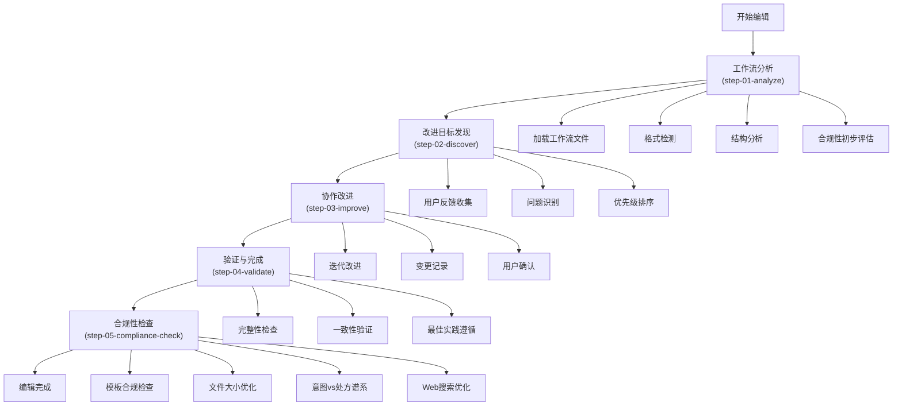
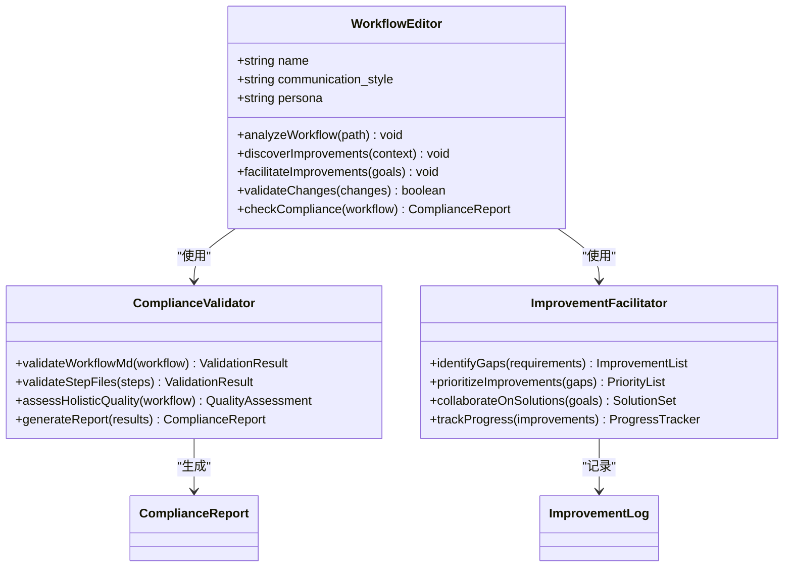
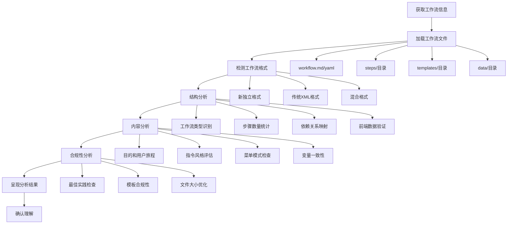
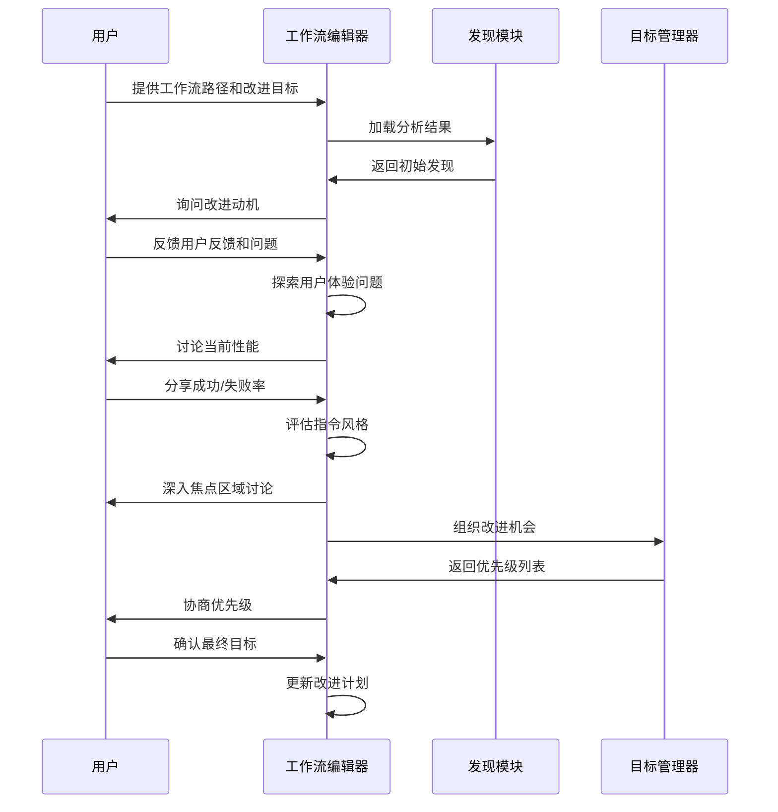
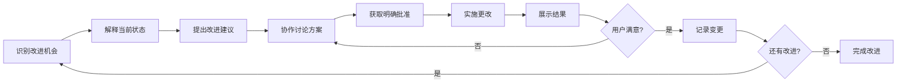
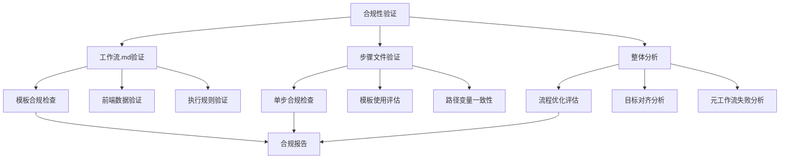
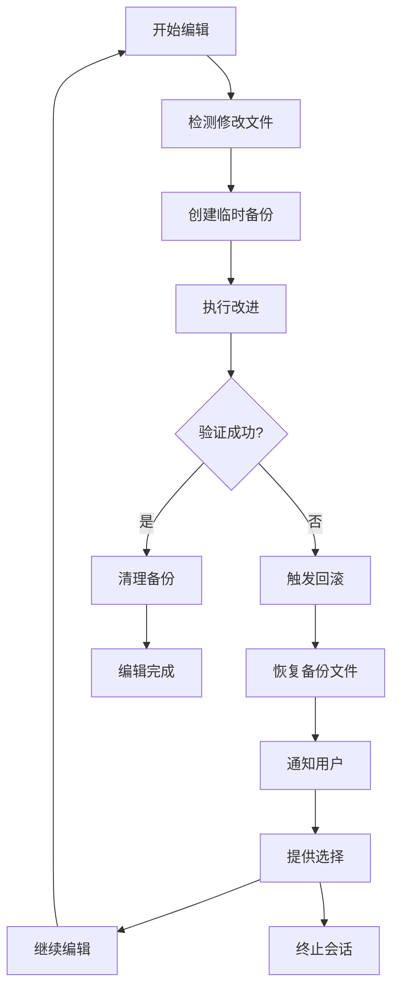
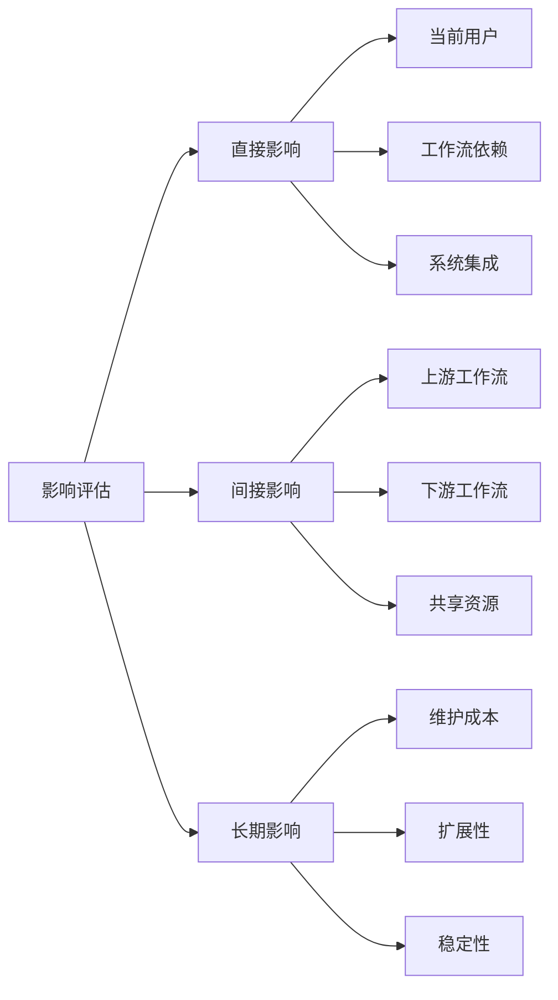

# 工作流编辑

<cite>
**本文档中引用的文件**
- [workflow.md](file://src/modules/bmb/workflows/edit-workflow/workflow.md)
- [step-01-analyze.md](file://src/modules/bmb/workflows/edit-workflow/steps/step-01-analyze.md)
- [step-02-discover.md](file://src/modules/bmb/workflows/edit-workflow/steps/step-02-discover.md)
- [step-03-improve.md](file://src/modules/bmb/workflows/edit-workflow/steps/step-03-improve.md)
- [step-04-validate.md](file://src/modules/bmb/workflows/edit-workflow/steps/step-04-validate.md)
- [step-05-compliance-check.md](file://src/modules/bmb/workflows/edit-workflow/steps/step-05-compliance-check.md)
- [workflow-compliance-check/workflow.md](file://src/modules/bmb/workflows/workflow-compliance-check/workflow.md)
- [workflow-compliance-check/step-01-validate-goal.md](file://src/modules/bmb/workflows/workflow-compliance-check/steps/step-01-validate-goal.md)
- [workflow-compliance-check/step-03-step-validation.md](file://src/modules/bmb/workflows/workflow-compliance-check/steps/step-03-step-validation.md)
- [workflow-compliance-check/step-07-holistic-analysis.md](file://src/modules/bmb/workflows/workflow-compliance-check/steps/step-07-holistic-analysis.md)
- [workflow-template.md](file://src/modules/bmb/docs/workflows/workflow-template.md)
- [step-template.md](file://src/modules/bmb/docs/workflows/step-template.md)
- [improvement-goals.md](file://src/modules/bmb/workflows/edit-workflow/templates/improvement-goals.md)
- [workflow-analysis.md](file://src/modules/bmb/workflows/edit-workflow/templates/workflow-analysis.md)
- [compliance-report.md](file://src/modules/bmb/workflows/workflow-compliance-check/templates/compliance-report.md)
</cite>

## 目录
1. [简介](#简介)
2. [工作流编辑架构概述](#工作流编辑架构概述)
3. [核心组件分析](#核心组件分析)
4. [工作流分析阶段](#工作流分析阶段)
5. [改进策略制定](#改进策略制定)
6. [合规性验证流程](#合规性验证流程)
7. [版本控制与回滚策略](#版本控制与回滚策略)
8. [高级主题](#高级主题)
9. [故障排除指南](#故障排除指南)
10. [结论](#结论)

## 简介

BMAD-METHOD的edit-workflow工作流编辑功能是一个系统化的工作流改进平台，旨在帮助用户分析、改进和验证现有工作流。该系统采用协作式方法，结合人工智能专家和人类专业知识，确保工作流既符合最佳实践又满足特定需求。

### 核心目标

- **智能分析**：深度理解现有工作流的结构、目的和潜在改进领域
- **协作改进**：通过对话式交互发现和实现改进机会
- **质量保证**：确保修改后的工作流符合BMAD标准和最佳实践
- **合规验证**：系统性验证工作流的完整性和正确性

## 工作流编辑架构概述

edit-workflow工作流采用严格的step-file架构，确保执行的可预测性和可维护性。

**图表来源**
- [workflow.md](file://src/modules/bmb/workflows/edit-workflow/workflow.md#L1-L59)
- [step-01-analyze.md](file://src/modules/bmb/workflows/edit-workflow/steps/step-01-analyze.md#L1-L222)
- [step-02-discover.md](file://src/modules/bmb/workflows/edit-workflow/steps/step-02-discover.md#L1-L254)
- [step-03-improve.md](file://src/modules/bmb/workflows/edit-workflow/steps/step-03-improve.md#L1-L218)
- [step-04-validate.md](file://src/modules/bmb/workflows/edit-workflow/steps/step-04-validate.md#L1-L194)
- [step-05-compliance-check.md](file://src/modules/bmb/workflows/edit-workflow/steps/step-05-compliance-check.md#L1-L225)

**章节来源**
- [workflow.md](file://src/modules/bmb/workflows/edit-workflow/workflow.md#L1-L59)

## 核心组件分析

### 工作流编辑器角色

edit-workflow工作流编辑器扮演多重角色：

**图表来源**
- [step-01-analyze.md](file://src/modules/bmb/workflows/edit-workflow/steps/step-01-analyze.md#L38-L44)
- [step-02-discover.md](file://src/modules/bmb/workflows/edit-workflow/steps/step-02-discover.md#L38-L44)
- [step-03-improve.md](file://src/modules/bmb/workflows/edit-workflow/steps/step-03-improve.md#L38-L44)

### 执行规则体系

系统遵循严格的操作规则以确保质量和一致性：

| 规则类型 | 描述 | 验证方式 |
|---------|------|----------|
| **文件加载规则** | 永远不同时加载多个step文件 | 自动监控 |
| **阅读规则** | 总是完全阅读step文件后再执行 | 前置检查 |
| **序列规则** | 严格按照顺序执行，不允许跳过或优化 | 序列跟踪 |
| **状态保存规则** | 在加载下一个step前更新frontmatter | 自动记录 |
| **菜单处理规则** | 在显示菜单时暂停并等待用户输入 | 输入验证 |
| **内容生成规则** | 不在没有用户输入的情况下生成内容 | 内容审计 |

**章节来源**
- [workflow.md](file://src/modules/bmb/workflows/edit-workflow/workflow.md#L36-L45)

## 工作流分析阶段

### 分析目标与范围

工作流分析阶段的核心目标是深入了解目标工作流的当前状态，包括其结构、目的和潜在改进领域。

**图表来源**
- [step-01-analyze.md](file://src/modules/bmb/workflows/edit-workflow/steps/step-01-analyze.md#L67-L147)

### 关键检查点

#### 1. 工作流格式检测

系统能够识别三种主要格式：
- **新独立格式**：包含workflow.md和steps/子目录
- **传统XML格式**：使用workflow.yaml和instructions.md
- **混合格式**：部分迁移状态

#### 2. 结构完整性验证

- **前端数据完整性**：检查必需字段的存在和格式
- **步骤文件组织**：验证steps/目录结构和命名约定
- **模板引用一致性**：确保所有模板引用有效且一致

#### 3. 内容质量评估

- **指令清晰度**：评估步骤指令的明确性和可操作性
- **用户交互设计**：分析菜单模式和用户引导效果
- **变量使用规范**：检查变量命名和引用的一致性

**章节来源**
- [step-01-analyze.md](file://src/modules/bmb/workflows/edit-workflow/steps/step-01-analyze.md#L1-L222)

## 改进策略制定

### 发现改进目标

改进策略制定阶段采用协作式方法，通过开放式对话发现具体的改进需求。

**图表来源**
- [step-02-discover.md](file://src/modules/bmb/workflows/edit-workflow/steps/step-02-discover.md#L68-L205)

### 改进分类体系

系统采用三层次改进分类：

| 优先级 | 类型 | 特征 | 处理策略 |
|--------|------|------|----------|
| **关键** | 必须修复 | 阻止成功运行的问题 | 立即处理，高优先级 |
| **重要** | 应该修复 | 增强用户体验的问题 | 计划内处理，合理优先级 |
| **可选** | 可能修复 | 提升但非必需的功能 | 后续考虑，灵活处理 |

### 迭代改进流程

**图表来源**
- [step-03-improve.md](file://src/modules/bmb/workflows/edit-workflow/steps/step-03-improve.md#L67-L173)

**章节来源**
- [step-02-discover.md](file://src/modules/bmb/workflows/edit-workflow/steps/step-02-discover.md#L1-L254)
- [step-03-improve.md](file://src/modules/bmb/workflows/edit-workflow/steps/step-03-improve.md#L1-L218)

## 合规性验证流程

### 验证架构

合规性验证采用三层系统化验证：

**图表来源**
- [workflow-compliance-check/workflow.md](file://src/modules/bmb/workflows/workflow-compliance-check/workflow.md#L1-L59)
- [workflow-compliance-check/step-01-validate-goal.md](file://src/modules/bmb/workflows/workflow-compliance-check/steps/step-01-validate-goal.md#L66-L112)
- [workflow-compliance-check/step-03-step-validation.md](file://src/modules/bmb/workflows/workflow-compliance-check/steps/step-03-step-validation.md#L67-L241)

### 严重性分级系统

| 严重级别 | 描述 | 示例违规 | 处理要求 |
|----------|------|----------|----------|
| **关键** | 影响基本功能的问题 | 缺少必需字段、破坏性错误 | 必须立即修复 |
| **重大** | 显著影响质量的问题 | 模板使用不当、路径错误 | 优先修复 |
| **次要** | 标准合规性改进 | 命名约定轻微偏差、格式问题 | 后续优化 |

### 具体验证检查项

#### 工作流.md验证检查

- **前端数据结构**：验证YAML格式正确性
- **必需字段**：检查name、description、web_bundle等
- **执行规则**：确认MANDATORY EXECUTION RULES完整
- **角色描述**：评估合作式伙伴关系表述

#### 步骤文件验证检查

- **文件命名**：验证step-[number]-[name].md格式
- **前置数据**：检查必需的路径和引用定义
- **菜单模式**：确认标准的A/P/C选项
- **模板使用**：评估模板引用的适当性

**章节来源**
- [workflow-compliance-check/step-01-validate-goal.md](file://src/modules/bmb/workflows/workflow-compliance-check/steps/step-01-validate-goal.md#L1-L153)
- [workflow-compliance-check/step-03-step-validation.md](file://src/modules/bmb/workflows/workflow-compliance-check/steps/step-03-step-validation.md#L1-L275)

## 版本控制与回滚策略

### 自动备份机制

系统实现了多层次的版本控制和备份策略：

### 回滚触发条件

系统自动检测以下情况并准备回滚：

- **配置错误**：工作流配置损坏或无效
- **文件丢失**：关键文件被意外删除
- **语法错误**：YAML或Markdown语法问题
- **逻辑冲突**：步骤间依赖关系冲突
- **用户取消**：用户主动请求回滚

### 数据保护策略

| 保护层级 | 保护对象 | 保留时间 | 恢复方式 |
|----------|----------|----------|----------|
| **实时备份** | 修改的配置文件 | 会话期间 | 自动恢复 |
| **快照备份** | 完整工作流状态 | 24小时 | 手动选择 |
| **历史记录** | 所有编辑操作 | 30天 | 时间点恢复 |
| **归档备份** | 最终版本 | 永久保存 | 完整恢复 |

**章节来源**
- [installer.js](file://tools/cli/installers/lib/core/installer.js#L672-L1000)

## 高级主题

### 影响评估

系统提供全面的影响评估功能：

### 性能优化建议

基于holistic analysis阶段的评估，系统提供以下优化建议：

#### 流程效率优化
- **步骤合并**：识别可以合并的冗余步骤
- **并行处理**：建议可以同时执行的操作
- **延迟加载**：优化资源加载时机

#### 用户体验提升
- **导航简化**：减少用户决策点
- **反馈及时性**：确保用户获得即时反馈
- **错误处理**：提供清晰的错误恢复指导

#### 架构改进
- **模板优化**：改进模板使用策略
- **输出管理**：优化中间产物处理
- **扩展性设计**：增强工作流可扩展性

**章节来源**
- [workflow-compliance-check/step-07-holistic-analysis.md](file://src/modules/bmb/workflows/workflow-compliance-check/steps/step-07-holistic-analysis.md#L113-L150)

## 故障排除指南

### 常见问题诊断

#### 分析阶段问题

| 问题症状 | 可能原因 | 解决方案 |
|----------|----------|----------|
| **无法加载工作流** | 路径错误或文件权限问题 | 验证路径正确性和文件访问权限 |
| **格式识别失败** | 文件结构不符合任何已知格式 | 检查文件命名和目录结构 |
| **分析结果不准确** | 输入信息不完整或错误 | 重新提供详细的工作流信息 |

#### 改进阶段问题

| 问题症状 | 可能原因 | 解决方案 |
|----------|----------|----------|
| **改进建议不适用** | 对工作流理解不足 | 进行更深入的分析和沟通 |
| **用户拒绝变更** | 变更过于激进或不必要 | 调整改进策略，增加用户参与度 |
| **变更冲突** | 多个改进之间的冲突 | 重新排序改进优先级 |

#### 合规性验证问题

| 问题症状 | 可能原因 | 解决方案 |
|----------|----------|----------|
| **合规检查失败** | 严格遵守了错误的标准 | 检查使用的参考模板版本 |
| **修复建议不明确** | 模板标准不够具体 | 请求更详细的修复指导 |
| **验证过程卡住** | 系统超时或资源不足 | 增加系统资源或分批验证 |

### 调试工具和技术

#### 日志分析
系统提供详细的执行日志，帮助诊断问题：

- **步骤执行日志**：记录每个步骤的执行时间和结果
- **错误堆栈跟踪**：提供详细的错误信息和上下文
- **性能指标**：监控执行时间和资源使用

#### 验证工具
内置多种验证工具确保质量：

- **语法验证器**：检查YAML和Markdown语法
- **链接检查器**：验证所有文件引用的有效性
- **一致性检查器**：确保跨文件的一致性

**章节来源**
- [step-05-compliance-check.md](file://src/modules/bmb/workflows/edit-workflow/steps/step-05-compliance-check.md#L41-L225)

## 结论

BMAD-METHOD的工作流编辑功能代表了AI驱动的工作流改进系统的先进水平。通过系统化的分析、协作式的改进和严格的合规性验证，该系统能够：

### 主要优势

1. **系统化方法**：采用严格的step-file架构确保执行的可预测性
2. **协作式设计**：强调合作伙伴关系而非客户-供应商关系
3. **质量保证**：多层验证确保工作流符合最佳实践
4. **灵活性**：支持从简单到复杂的各种工作流改进需求

### 技术创新

- **智能分析**：利用AI能力进行深度工作流理解和改进建议
- **自动化验证**：系统性验证确保合规性和质量
- **版本控制**：完善的备份和回滚机制保护用户数据
- **扩展性**：模块化设计支持各种自定义需求

### 应用价值

该系统特别适用于：
- **企业工作流优化**：提升业务流程效率和质量
- **教育内容改进**：优化学习工作流和教学材料
- **研究项目管理**：改进研究流程和数据分析工作流
- **软件开发流程**：优化开发和测试工作流

通过持续的改进和验证，BMAD-METHOD的工作流编辑功能为用户提供了可靠、高效的工作流管理解决方案，推动了AI驱动工作流管理的发展。