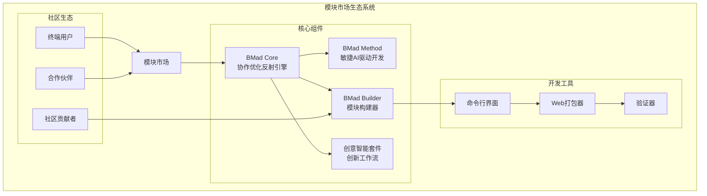
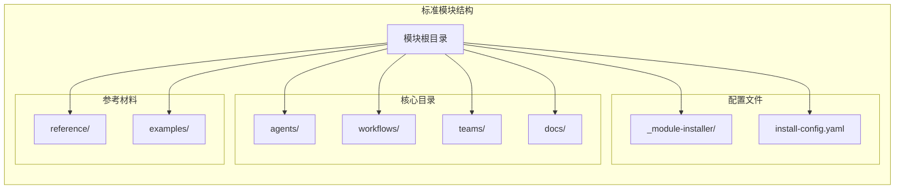
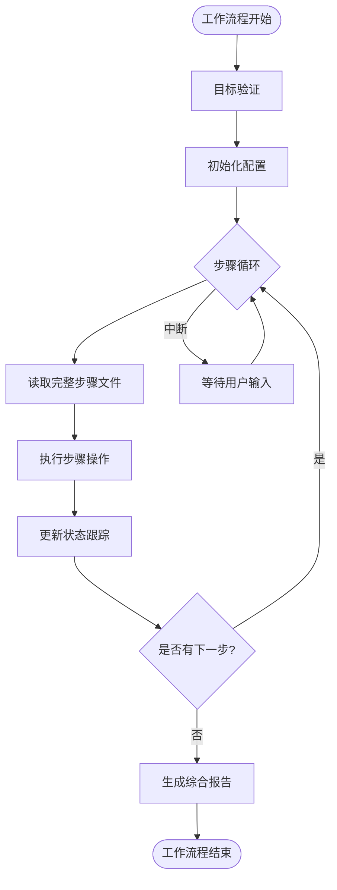
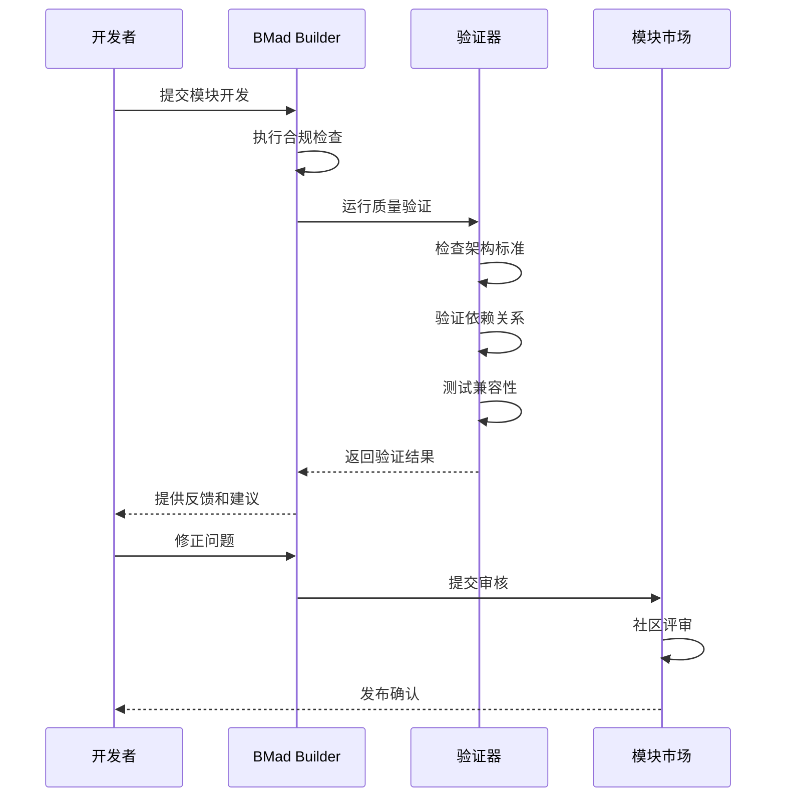
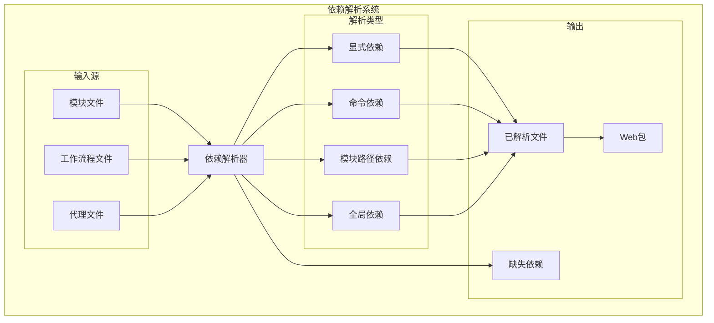
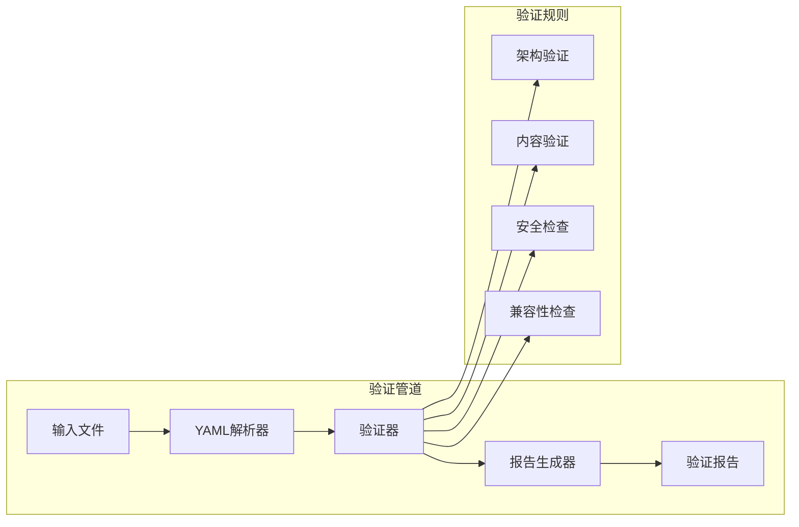
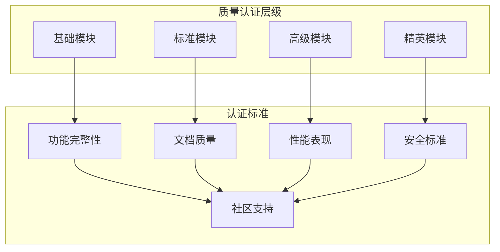
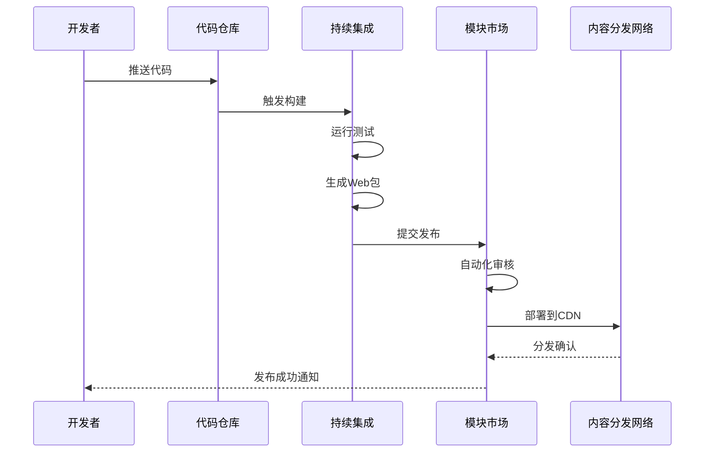
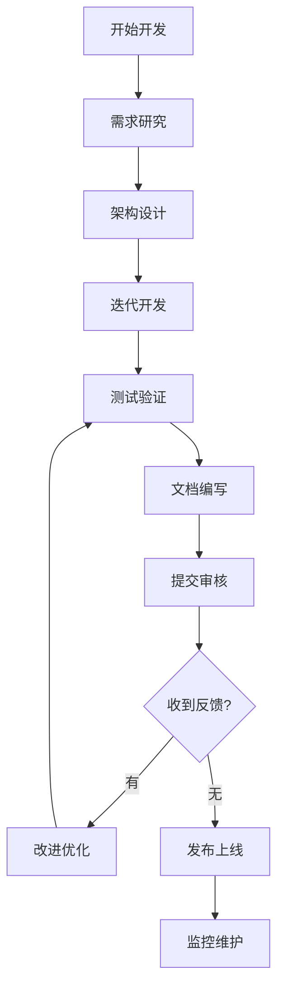
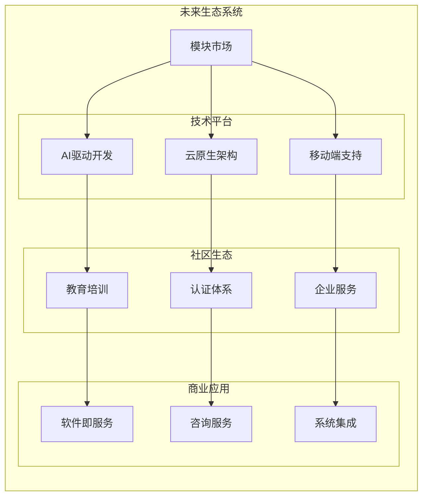

# 模块市场

<cite>
**本文档中引用的文件**
- [README.md](file://README.md)
- [package.json](file://package.json)
- [src/modules/bmm/_module-installer/install-config.yaml](file://src/modules/bmm/_module-installer/install-config.yaml)
- [src/modules/bmb/_module-installer/install-config.yaml](file://src/modules/bmb/_module-installer/install-config.yaml)
- [src/modules/cis/_module-installer/install-config.yaml](file://src/modules/cis/_module-installer/install-config.yaml)
- [src/modules/bmb/README.md](file://src/modules/bmb/README.md)
- [src/modules/cis/README.md](file://src/modules/cis/README.md)
- [tools/cli/bundlers/web-bundler.js](file://tools/cli/bundlers/web-bundler.js)
- [tools/cli/installers/lib/core/dependency-resolver.js](file://tools/cli/installers/lib/core/dependency-resolver.js)
- [tools/cli/lib/replace-project-root.js](file://tools/cli/lib/replace-project-root.js)
- [src/modules/bmb/workflows/workflow-compliance-check/workflow.md](file://src/modules/bmb/workflows/workflow-compliance-check/workflow.md)
</cite>

## 目录
1. [引言](#引言)
2. [模块市场设计理念](#模块市场设计理念)
3. [核心模块概览](#核心模块概览)
4. [模块架构与标准](#模块架构与标准)
5. [模块开发与发布流程](#模块开发与发布流程)
6. [版本管理与依赖管理](#版本管理与依赖管理)
7. [安全验证机制](#安全验证机制)
8. [生态系统建设](#生态系统建设)
9. [社区贡献指南](#社区贡献指南)
10. [未来发展方向](#未来发展方向)

## 引言

BMAD-METHOD模块市场是一个创新的人工智能模块化生态系统，旨在为开发者提供可扩展、可定制的AI驱动开发解决方案。该市场基于BMad Core框架构建，支持从简单工具到复杂企业级解决方案的各种模块类型。

模块市场的核心理念是"协作式AI团队构建"，允许用户创建、分享和使用专门化的AI代理和工作流程，形成一个充满活力的社区生态系统。

## 模块市场设计理念

### 核心设计原则

模块市场遵循以下核心设计原则：

1. **模块化架构**：每个模块都是独立的功能单元，可以单独安装、更新和卸载
2. **标准化接口**：所有模块都遵循统一的架构标准和API规范
3. **可扩展性**：支持从简单代理到复杂多代理系统的渐进式扩展
4. **社区驱动**：鼓励用户贡献和共享自定义模块
5. **质量保证**：建立完善的验证和合规检查体系

### 生态系统架构



**图表来源**
- [README.md](file://README.md#L31-L37)
- [src/modules/bmb/README.md](file://src/modules/bmb/README.md#L1-L50)

## 核心模块概览

### BMad Method (BMM) - 敏捷AI驱动开发

BMad Method是完整的敏捷开发框架，包含12个专业化AI代理和34个工作流程。

**主要特性：**
- **规模适应性智能**：自动调整规划深度从缺陷修复到企业系统
- **完整开发生命周期**：分析 → 规划 → 架构 → 实现
- **专业化专家团队**：产品经理、架构师、开发者、UX设计师等

**模块结构：**
```
bmm/
├── agents/                    # 12个专业化代理
├── workflows/                 # 34个工作流程
├── teams/                     # 团队协作配置
├── data/                      # 项目数据模板
├── testarch/                  # 测试架构知识库
└── docs/                      # 开发文档
```

### BMad Builder (BMB) - 模块构建器

BMad Builder提供创建、定制和扩展BMad组件的专用工具和工作流程。

**核心功能：**
- **代理创建工作流**：从头脑风暴到庆祝的11步引导过程
- **工作流设计**：结构化的12步骤工作流程创建
- **编辑和验证**：现有组件的修改和质量检查
- **架构指导**：三种代理类型（简单、专家、模块）的设计指南

### 创意智能套件 (CIS) - 创新工作流

CIS专注于创意创新和战略思考，提供五个专门领域的工作流程。

**五大工作流程：**
- **头脑风暴**：36种技术，涵盖发散收敛思维
- **设计思维**：完整的人本主义5阶段流程
- **问题解决**：系统性根因分析方法
- **创新策略**：商业模式颠覆和作业理论
- **故事讲述**：25种叙事框架

**节来源**
- [README.md](file://README.md#L110-L128)
- [src/modules/bmm/_module-installer/install-config.yaml](file://src/modules/bmb/_module-installer/install-config.yaml#L1-L55)
- [src/modules/cis/_module-installer/install-config.yaml](file://src/modules/cis/_module-installer/install-config.yaml#L1-L17)

## 模块架构与标准

### 模块结构规范

所有BMAD模块必须遵循统一的目录结构和命名约定：



**图表来源**
- [src/modules/bmb/README.md](file://src/modules/bmb/README.md#L15-L47)

### 代理类型标准

BMad Builder定义了三种标准化的代理类型：

#### 简单代理 (Simple Agent)
- **特点**：逻辑集中在一个YAML文件中
- **状态**：无状态，跨会话不保持记忆
- **用途**：单一工具和专业化的实用程序
- **示例**：提交诗人、代码格式化器

#### 专家代理 (Expert Agent)
- **特点**：维护跨会话的知识记忆
- **资源**：外部文件和数据存储
- **专注度**：特定知识领域的深度
- **示例**：日记保管员、领域顾问

#### 模块代理 (Module Agent)
- **特点**：在特定模块内协调
- **职责**：管理工作流程和复杂进程
- **级别**：企业级能力
- **示例**：BMM项目经理、CIS创新战略家

### 工作流程架构标准

所有工作流程必须采用步骤文件架构：



**图表来源**
- [src/modules/bmb/workflows/workflow-compliance-check/workflow.md](file://src/modules/bmb/workflows/workflow-compliance-check/workflow.md#L17-L45)

**节来源**
- [src/modules/bmb/README.md](file://src/modules/bmb/README.md#L123-L147)

## 模块开发与发布流程

### 开发工作流程

模块开发遵循严格的步骤文件架构，确保质量和一致性：

#### 创建代理工作流程
1. **头脑风暴阶段**：概念定义和角色设计
2. **发现阶段**：需求分析和功能规划
3. **角色阶段**：个性特征和沟通风格设计
4. **命令阶段**：交互模式和触发词定义
5. **命名阶段**：唯一标识符和名称确定
6. **构建阶段**：YAML文件编写和测试
7. **验证阶段**：质量检查和合规性验证
8. **设置阶段**：集成配置和部署准备
9. **定制阶段**：个性化配置和优化
10. **构建工具阶段**：开发环境配置
11. **庆祝阶段**：完成确认和文档更新

#### 创建工作流程工作流程
1. **初始化阶段**：项目背景和目标设定
2. **模板阶段**：模板选择和基础配置
3. **设计阶段**：步骤结构和内容规划
4. **实现阶段**：详细步骤编写和测试
5. **审查阶段**：质量评估和改进
6. **完善阶段**：最终调整和优化

### 发布标准

模块发布前必须通过全面的质量验证：



**图表来源**
- [src/modules/bmb/workflows/workflow-compliance-check/workflow.md](file://src/modules/bmb/workflows/workflow-compliance-check/workflow.md#L1-L59)

**节来源**
- [src/modules/bmb/README.md](file://src/modules/bmb/README.md#L78-L107)

## 版本管理与依赖管理

### 依赖解析机制

BMAD采用先进的依赖解析系统，确保模块间的兼容性和完整性：



**图表来源**
- [tools/cli/installers/lib/core/dependency-resolver.js](file://tools/cli/installers/lib/core/dependency-resolver.js#L1-L50)

### 版本控制策略

模块市场采用语义化版本控制，支持：
- **主版本号**：不兼容的API更改
- **次版本号**：向后兼容的功能性新增
- **修订号**：向后兼容的问题修正

### Web打包系统

为了支持浏览器环境部署，模块市场提供Web打包功能：

#### 打包流程
1. **模块发现**：扫描src/modules/目录
2. **依赖收集**：递归解析所有依赖项
3. **文件内联**：将所有引用文件嵌入到单一XML文件
4. **路径转换**：移除{project-root}/引用
5. **格式验证**：确保XML格式正确性

#### 打包命令
```bash
# 打包所有模块
npm run bundle

# 清理并重新打包
npm run rebundle

# 打包特定模块
node tools/cli/bundlers/bundle-web.js module <模块名>

# 打包特定代理
node tools/cli/bundlers/bundle-web.js agent <模块> <代理名>
```

**节来源**
- [tools/cli/installers/lib/core/dependency-resolver.js](file://tools/cli/installers/lib/core/dependency-resolver.js#L1-L725)
- [tools/cli/bundlers/web-bundler.js](file://tools/cli/bundlers/web-bundler.js#L34-L1764)

## 安全验证机制

### 质量保证体系

模块市场建立了多层次的安全验证机制：

#### 合规性检查工作流程
1. **目标验证**：确保工作流程目标明确且可实现
2. **架构验证**：检查步骤文件架构是否符合标准
3. **内容验证**：验证步骤内容的完整性和准确性
4. **依赖验证**：检查所有外部依赖的存在性和可用性
5. **格式验证**：确保文件格式和语法正确
6. **安全性验证**：检查潜在的安全风险和恶意代码

#### 验证指标分类

| 严重程度 | 描述 | 示例问题 |
|---------|------|----------|
| P0 (关键) | 真正的关键问题，可能导致系统故障 | 硬等待、竞态条件、无断言 |
| P1 (高) | 影响可维护性和可靠性的严重问题 | 缺少ID、硬编码数据 |
| P2 (中) | 可以改善但不影响功能的问题 | 长文件、缺少优先级 |
| P3 (低) | 轻微的样式或偏好问题 | 冗长的测试 |

### 代码验证系统



**图表来源**
- [src/modules/bmb/workflows/workflow-compliance-check/workflow.md](file://src/modules/bmb/workflows/workflow-compliance-check/workflow.md#L1-L59)

### 安全最佳实践

1. **最小权限原则**：模块只请求必要的权限
2. **输入验证**：严格验证所有外部输入
3. **依赖审计**：定期审查第三方依赖
4. **代码签名**：对发布模块进行数字签名
5. **漏洞监控**：持续监控已知安全漏洞

**节来源**
- [src/modules/bmb/workflows/workflow-compliance-check/workflow.md](file://src/modules/bmb/workflows/workflow-compliance-check/workflow.md#L1-L59)

## 生态系统建设

### 社区贡献平台

模块市场致力于构建一个开放、包容的社区生态系统：

#### 贡献类型
- **模块开发**：创建新的AI代理和工作流程
- **功能增强**：改进现有模块的功能和性能
- **文档编写**：提供详细的使用指南和技术文档
- **测试用例**：编写和维护质量测试用例
- **翻译工作**：将文档翻译成多种语言

#### 质量认证体系



### 分发渠道

模块市场通过多个渠道分发模块：

#### 主要分发平台
1. **官方模块市场**：官方认证的模块商店
2. **GitHub仓库**：开源模块的代码托管
3. **NPM注册表**：JavaScript模块的包管理
4. **Web Bundles**：浏览器环境的直接部署

#### 自动化分发流程



### 商业化支持

模块市场为商业用户提供专业支持：
- **企业级认证**：针对企业需求的特殊认证
- **技术支持**：专业的技术咨询服务
- **定制开发**：根据特定需求的模块定制
- **培训服务**：模块使用和开发培训

**节来源**
- [README.md](file://README.md#L1-L50)

## 社区贡献指南

### 如何参与模块开发

#### 新手入门路径
1. **学习基础**：阅读BMad Builder文档和示例
2. **选择领域**：确定感兴趣的开发领域（法律、医疗、金融等）
3. **原型开发**：创建简单的代理或工作流程原型
4. **社区交流**：在Discord社区寻求帮助和反馈
5. **正式贡献**：提交模块到官方市场

#### 开发最佳实践



### 模块质量要求

#### 技术质量标准
- **架构合理性**：符合BMAD架构原则
- **代码规范性**：遵循YAML和Markdown规范
- **性能效率**：响应时间在合理范围内
- **资源占用**：内存和计算资源使用合理

#### 用户体验标准
- **易用性**：直观的用户界面和交互
- **文档完整性**：详细的使用说明和示例
- **错误处理**：优雅的错误处理和用户提示
- **兼容性**：支持多种IDE和平台

### 社区支持资源

#### 学习资源
- **官方文档**：完整的开发指南和API文档
- **示例代码**：丰富的参考实现
- **视频教程**：逐步的教学视频
- **社区论坛**：Discord和其他讨论平台

#### 技术支持
- **问题跟踪**：GitHub Issues用于bug报告
- **实时聊天**：Discord社区获得即时帮助
- **专家咨询**：经验丰富的开发者提供指导
- **定期会议**：社区开发者的定期交流

**节来源**
- [README.md](file://README.md#L151-L157)
- [src/modules/bmb/README.md](file://src/modules/bmb/README.md#L250-L262)

## 未来发展方向

### 技术演进路线图

#### 短期目标（6个月内）
1. **模块市场正式上线**：建立完整的市场基础设施
2. **自动化验证系统**：实现完全自动化的质量检查
3. **Web打包优化**：提升打包速度和压缩率
4. **社区平台建设**：完善用户交互和反馈机制

#### 中期目标（1年内）
1. **智能推荐系统**：基于用户需求的模块推荐
2. **版本兼容性管理**：更精细的版本控制和迁移支持
3. **性能监控平台**：实时监控模块性能和用户体验
4. **多语言支持**：扩展到更多编程语言和自然语言

#### 长期愿景（2-3年）
1. **AI驱动的模块开发**：利用AI辅助模块创建和优化
2. **云原生架构**：完全基于云的服务架构
3. **生态系统集成**：与其他开发工具和服务的深度集成
4. **全球化运营**：建立全球化的运营和支持体系

### 功能扩展计划

#### 模块类型扩展
- **领域特定模块**：针对特定行业和领域的专业模块
- **插件系统**：支持第三方插件和扩展
- **模板库**：预设的模块模板和快速启动包
- **协作工具**：支持多人协作开发和管理模块

#### 平台能力增强
- **实时协作**：多人同时编辑和调试模块
- **模拟环境**：内置的模块测试和演示环境
- **性能分析**：详细的性能分析和优化建议
- **安全审计**：自动化的安全漏洞扫描和报告

### 生态系统发展



### 技术创新方向

#### AI增强功能
- **智能代码生成**：基于上下文的代码和配置自动生成
- **自动化测试**：智能测试用例生成和执行
- **性能优化**：AI驱动的性能调优建议
- **用户体验分析**：基于用户行为的界面优化

#### 开发工具集成
- **IDE插件**：原生IDE集成的开发工具
- **CLI工具**：强大的命令行开发和管理工具
- **可视化编辑器**：图形化的模块设计和配置工具
- **调试器**：专门的模块调试和诊断工具

模块市场作为BMAD生态系统的核心组成部分，将继续推动AI驱动开发的创新和发展，为全球开发者提供强大而灵活的模块化解决方案。通过持续的技术创新和社区建设，模块市场将成为AI开发领域的重要基础设施，助力各行各业实现智能化转型。