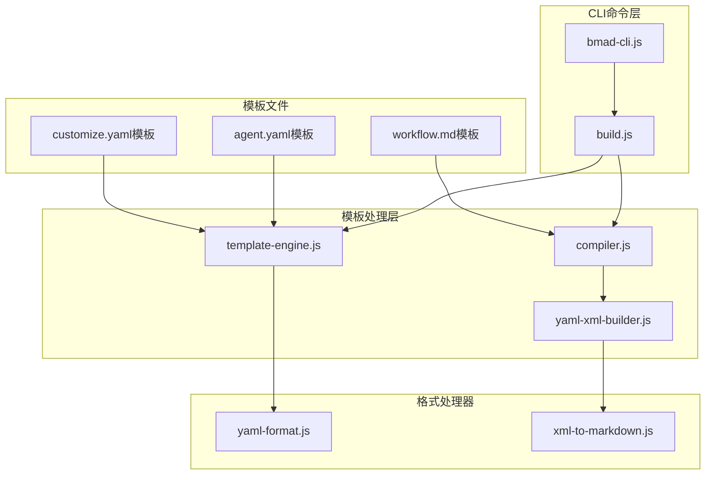
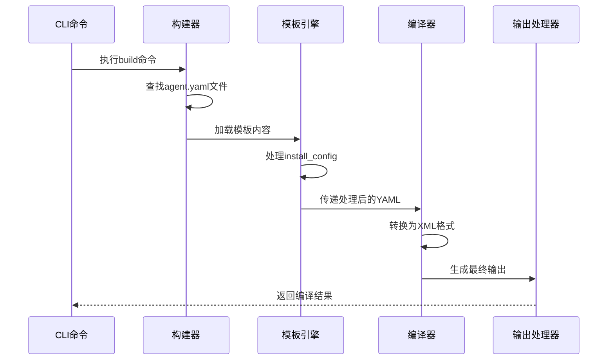
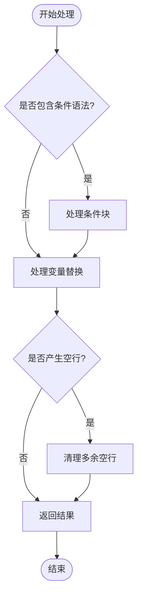
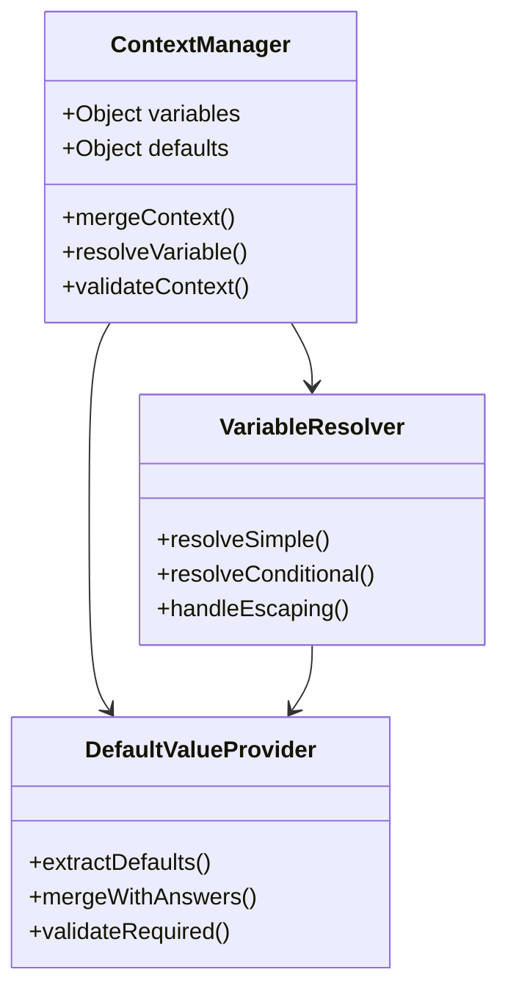
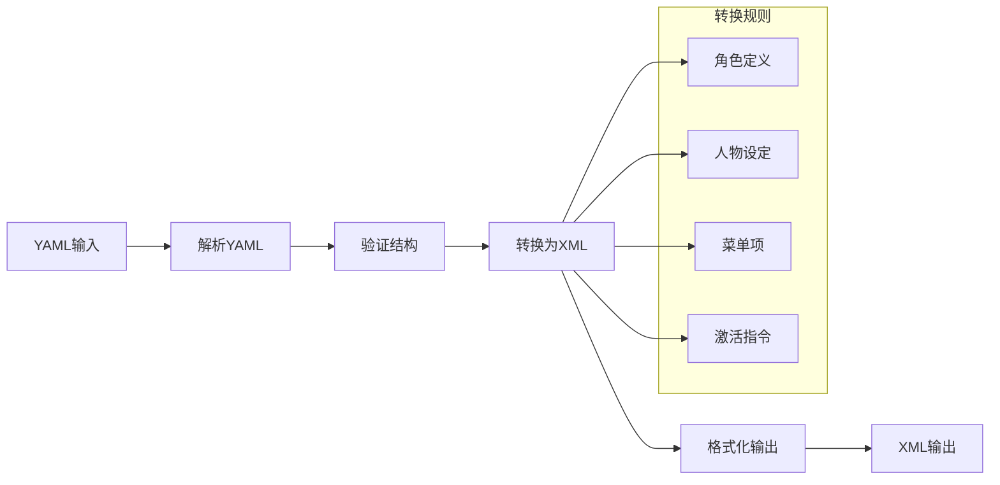
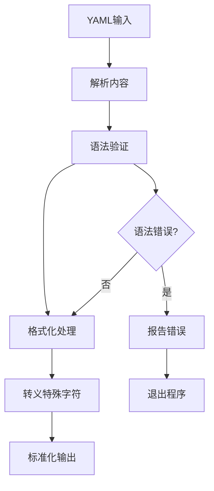
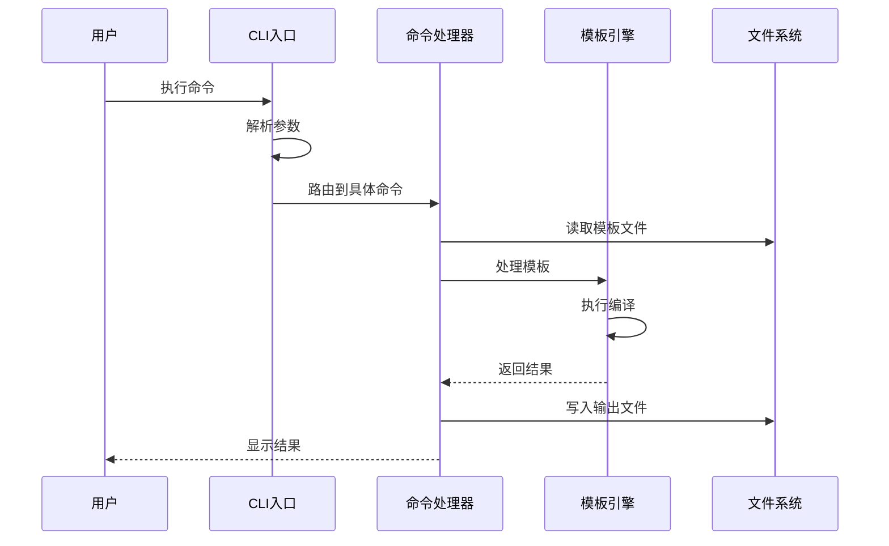
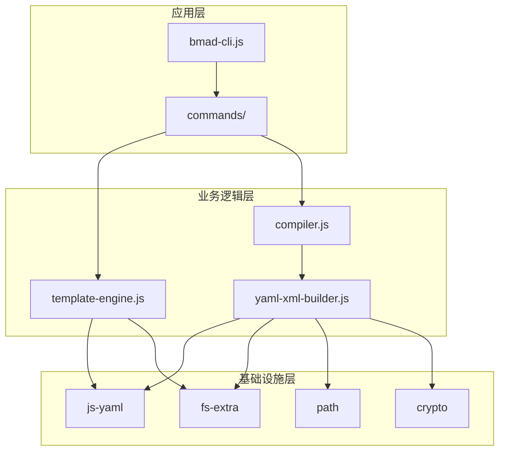

# 模板引擎架构

<cite>
**本文档中引用的文件**
- [template-engine.js](file://tools/cli/lib/agent/template-engine.js)
- [compiler.js](file://tools/cli/lib/agent/compiler.js)
- [build.js](file://tools/cli/commands/build.js)
- [yaml-xml-builder.js](file://tools/cli/lib/yaml-xml-builder.js)
- [bmad-cli.js](file://tools/cli/bmad-cli.js)
- [agent.customize.template.yaml](file://src/utility/templates/agent.customize.template.yaml)
- [commit-poet.agent.yaml](file://custom/src/agents/commit-poet/commit-poet.agent.yaml)
- [agent_purpose_and_type.md](file://src/modules/bmb/workflows/create-agent/templates/agent_purpose_and_type.md)
- [install-config.yaml](file://src/core/_module-installer/install-config.yaml)
- [xml-to-markdown.js](file://tools/cli/lib/xml-to-markdown.js)
- [yaml-format.js](file://tools/cli/lib/yaml-format.js)
</cite>

## 目录
1. [简介](#简介)
2. [项目结构概览](#项目结构概览)
3. [核心组件分析](#核心组件分析)
4. [架构概览](#架构概览)
5. [详细组件分析](#详细组件分析)
6. [模板语法与处理机制](#模板语法与处理机制)
7. [YAML与Markdown处理](#yaml与markdown处理)
8. [CLI工具链集成](#cli工具链集成)
9. [性能优化策略](#性能优化策略)
10. [故障排除指南](#故障排除指南)
11. [总结](#总结)

## 简介

BMAD-METHOD模板引擎是一个专为AI代理框架设计的高性能模板处理系统，支持YAML和Markdown格式的模板文件编译。该引擎采用模块化架构，提供强大的变量替换、条件判断和上下文管理功能，是BMAD核心框架中代理编译和工作流生成的关键组件。

引擎的主要特性包括：
- 支持Mustache风格的模板语法（{{variable}}、{{#if}}、{{#unless}}）
- 原生YAML和Markdown格式支持
- 智能的上下文管理和变量解析
- 高性能的模板编译和渲染管道
- 完整的错误处理和调试支持

## 项目结构概览

BMAD-METHOD模板引擎的文件组织遵循清晰的分层架构：



**图表来源**
- [bmad-cli.js](file://tools/cli/bmad-cli.js#L1-L41)
- [build.js](file://tools/cli/commands/build.js#L1-L459)
- [template-engine.js](file://tools/cli/lib/agent/template-engine.js#L1-L153)

**章节来源**
- [bmad-cli.js](file://tools/cli/bmad-cli.js#L1-L41)
- [build.js](file://tools/cli/commands/build.js#L1-L459)

## 核心组件分析

### 模板引擎核心类

模板引擎的核心由以下关键类组成：

#### TemplateEngine类
负责处理所有模板语法，包括变量替换和条件判断：
- `processTemplate()`：主处理函数，协调变量和条件处理
- `processVariables()`：处理简单的变量替换
- `processConditionals()`：处理条件逻辑块
- `cleanupEmptyLines()`：清理多余的空行

#### Compiler类  
负责将YAML配置转换为最终的XML格式：
- `compileAgent()`：完整的编译管道
- `compileToXml()`：XML格式转换
- `buildFrontmatter()`：构建Markdown前置元数据
- `buildSimpleActivation()`：生成激活指令

#### YamlXmlBuilder类
提供高级的YAML到XML转换功能：
- `loadAndMergeAgent()`：加载和合并代理配置
- `convertToXml()`：执行实际的格式转换
- `deepMerge()`：深度对象合并算法

**章节来源**
- [template-engine.js](file://tools/cli/lib/agent/template-engine.js#L1-L153)
- [compiler.js](file://tools/cli/lib/agent/compiler.js#L1-L525)
- [yaml-xml-builder.js](file://tools/cli/lib/yaml-xml-builder.js#L1-L200)

## 架构概览

BMAD-METHOD模板引擎采用多层处理架构，确保高效的模板编译和渲染：



**图表来源**
- [build.js](file://tools/cli/commands/build.js#L35-L160)
- [template-engine.js](file://tools/cli/lib/agent/template-engine.js#L12-L25)
- [compiler.js](file://tools/cli/lib/agent/compiler.js#L443-L482)

## 详细组件分析

### 模板语法处理器

模板引擎支持多种Mustache风格的语法：

#### 变量替换语法
```javascript
// 简单变量替换
{{variable_name}}

// 对象属性访问
{{agent.metadata.name}}
```

#### 条件判断语法
```javascript
// 布尔条件
{{#if condition}}
  内容块
{{/if}}

// 字符串比较
{{#if variable == "value"}}
  匹配时的内容
{{/if}}

// 反向条件
{{#unless condition}}
  不匹配时的内容
{{/unless}}
```

#### 处理流程图


**图表来源**
- [template-engine.js](file://tools/cli/lib/agent/template-engine.js#L12-L25)
- [template-engine.js](file://tools/cli/lib/agent/template-engine.js#L30-L58)

**章节来源**
- [template-engine.js](file://tools/cli/lib/agent/template-engine.js#L12-L25)
- [template-engine.js](file://tools/cli/lib/agent/template-engine.js#L30-L58)

### 上下文管理系统

上下文管理系统负责维护和传递模板处理过程中的状态信息：

#### 变量解析机制


**图表来源**
- [template-engine.js](file://tools/cli/lib/agent/template-engine.js#L123-L141)
- [compiler.js](file://tools/cli/lib/agent/compiler.js#L462-L467)

**章节来源**
- [template-engine.js](file://tools/cli/lib/agent/template-engine.js#L123-L141)
- [compiler.js](file://tools/cli/lib/agent/compiler.js#L462-L467)

### XML格式转换器

XML转换器负责将YAML配置转换为标准的XML格式：

#### 转换流程


**图表来源**
- [compiler.js](file://tools/cli/lib/agent/compiler.js#L384-L433)
- [yaml-xml-builder.js](file://tools/cli/lib/yaml-xml-builder.js#L139-L200)

**章节来源**
- [compiler.js](file://tools/cli/lib/agent/compiler.js#L384-L433)
- [yaml-xml-builder.js](file://tools/cli/lib/yaml-xml-builder.js#L139-L200)

## 模板语法与处理机制

### 变量替换机制

模板引擎实现了智能的变量替换机制，支持多种数据类型和嵌套结构：

#### 替换算法
1. **模式识别**：使用正则表达式识别模板语法
2. **上下文查找**：在变量上下文中查找对应值
3. **类型转换**：自动进行字符串转换
4. **回退机制**：未找到时保留原始语法

#### 条件处理机制
条件语句支持复杂的逻辑判断：
- **布尔检查**：检查变量是否存在且为真值
- **字符串比较**：支持精确匹配和部分匹配
- **嵌套条件**：支持多层条件嵌套

**章节来源**
- [template-engine.js](file://tools/cli/lib/agent/template-engine.js#L60-L77)
- [template-engine.js](file://tools/cli/lib/agent/template-engine.js#L30-L58)

### 错误处理与调试

模板引擎提供了完善的错误处理机制：

#### 错误类型分类
- **语法错误**：模板语法不正确
- **变量未定义**：引用了不存在的变量
- **类型错误**：变量类型不匹配
- **循环引用**：模板间的循环依赖

#### 调试支持
- **详细的错误位置**：指出错误发生的具体位置
- **上下文信息**：显示相关的上下文内容
- **修复建议**：提供可能的解决方案

## YAML与Markdown处理

### YAML格式化处理器

YAML处理器确保配置文件的正确性和一致性：

#### 格式化规则
- **缩进统一**：使用2个空格作为缩进
- **键排序**：保持键的字典序
- **引用处理**：智能处理特殊字符
- **注释保留**：保持原有注释内容

#### 处理流程


**图表来源**
- [yaml-format.js](file://tools/cli/lib/yaml-format.js#L59-L93)

**章节来源**
- [yaml-format.js](file://tools/cli/lib/yaml-format.js#L59-L93)

### Markdown转换器

Markdown转换器负责将XML内容转换为可读的Markdown格式：

#### 转换特性
- **标题生成**：根据XML根元素生成合适的标题
- **代码块格式化**：正确处理XML代码块
- **元数据提取**：从XML属性中提取元数据
- **格式保持**：保持原有的格式结构

**章节来源**
- [xml-to-markdown.js](file://tools/cli/lib/xml-to-markdown.js#L1-L52)

## CLI工具链集成

### 命令行接口设计

CLI工具链提供了完整的命令行接口，支持各种操作：

#### 主要命令
- **build**：构建代理文件
- **install**：安装模块
- **uninstall**：卸载模块
- **status**：查看状态
- **list**：列出可用项目

#### 命令处理流程


**图表来源**
- [bmad-cli.js](file://tools/cli/bmad-cli.js#L18-L40)
- [build.js](file://tools/cli/commands/build.js#L35-L160)

**章节来源**
- [bmad-cli.js](file://tools/cli/bmad-cli.js#L18-L40)
- [build.js](file://tools/cli/commands/build.js#L35-L160)

### 模块依赖关系

模板引擎的模块依赖关系体现了清晰的分层架构：



**图表来源**
- [bmad-cli.js](file://tools/cli/bmad-cli.js#L1-L10)
- [template-engine.js](file://tools/cli/lib/agent/template-engine.js#L1-L10)
- [compiler.js](file://tools/cli/lib/agent/compiler.js#L1-L10)

## 性能优化策略

### 缓存机制

模板引擎实现了多层次的缓存策略：

#### 文件哈希缓存
- **源文件监控**：计算源文件的SHA-256哈希值
- **增量编译**：仅重新编译变更的文件
- **依赖追踪**：跟踪模板间的依赖关系

#### 内存缓存
- **解析结果缓存**：缓存YAML解析结果
- **编译中间结果**：缓存编译过程中的中间状态
- **模板实例池**：重用模板实例减少创建开销

### 并发处理

为了提高大型项目的处理效率，引擎支持并发处理：

#### 并行编译
- **文件级并行**：同时处理多个独立文件
- **任务队列**：智能的任务调度和负载均衡
- **资源限制**：防止过度消耗系统资源

### 内存管理

优化内存使用以支持大型项目：

#### 流式处理
- **大文件处理**：支持超大文件的流式读取
- **内存映射**：对大型文件使用内存映射技术
- **垃圾回收优化**：及时释放不需要的对象

## 故障排除指南

### 常见问题诊断

#### 模板语法错误
**症状**：编译过程中出现语法错误
**原因**：模板语法不正确或变量未定义
**解决方案**：
1. 检查模板语法是否符合规范
2. 验证所有使用的变量都已定义
3. 使用调试模式查看详细错误信息

#### 编译性能问题
**症状**：编译速度过慢
**原因**：文件过多或模板复杂度高
**解决方案**：
1. 启用增量编译
2. 减少不必要的模板复杂度
3. 使用并行编译选项

#### 输出格式问题
**症状**：生成的XML格式不正确
**原因**：XML转义或格式化问题
**解决方案**：
1. 检查特殊字符的转义
2. 验证XML结构的有效性
3. 使用格式化工具检查输出

**章节来源**
- [build.js](file://tools/cli/commands/build.js#L66-L73)
- [template-engine.js](file://tools/cli/lib/agent/template-engine.js#L12-L25)

## 总结

BMAD-METHOD模板引擎是一个功能强大、设计精良的模板处理系统，具有以下核心优势：

### 技术特点
- **高性能**：采用多层缓存和并发处理机制
- **易扩展**：模块化设计支持功能扩展
- **强类型**：完善的类型检查和错误处理
- **跨平台**：支持多种操作系统和环境

### 应用价值
- **代理编译**：高效处理AI代理的配置和部署
- **工作流生成**：自动生成复杂的工作流模板
- **开发效率**：显著提升开发和部署效率
- **质量保证**：确保输出的一致性和可靠性

### 发展方向
- **智能化**：引入AI辅助的模板优化
- **可视化**：提供图形化的模板编辑界面
- **云端集成**：支持云端模板仓库和协作
- **生态扩展**：构建更丰富的模板生态系统

该模板引擎作为BMAD核心框架的重要组成部分，为AI代理的开发、部署和管理提供了坚实的技术基础，是现代AI开发工具链中不可或缺的核心组件。