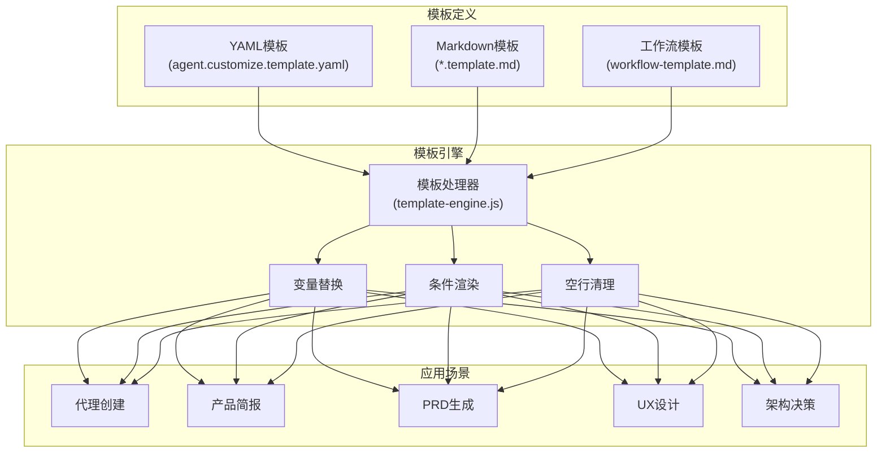
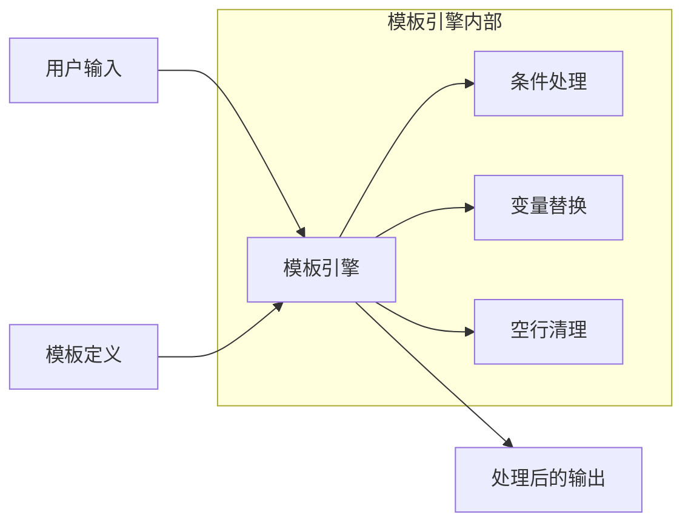
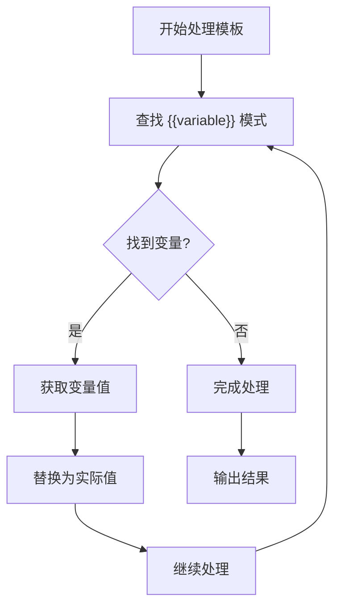
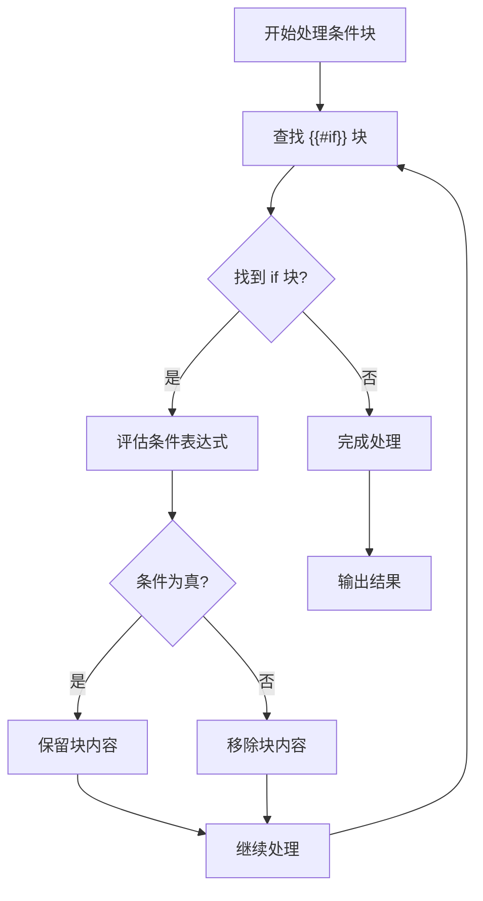
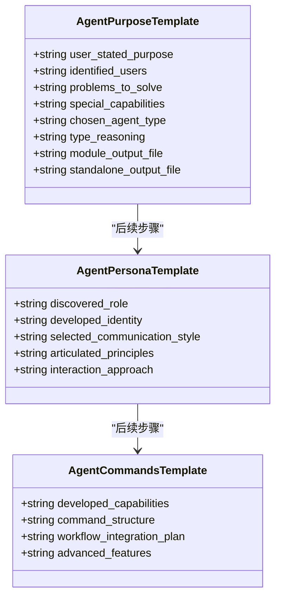
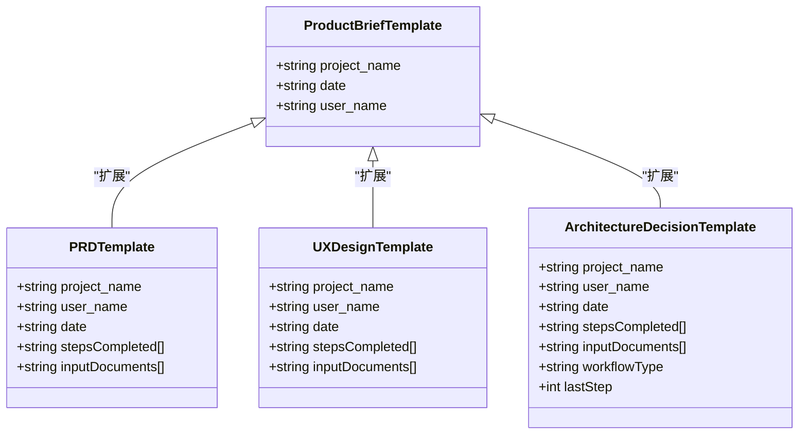
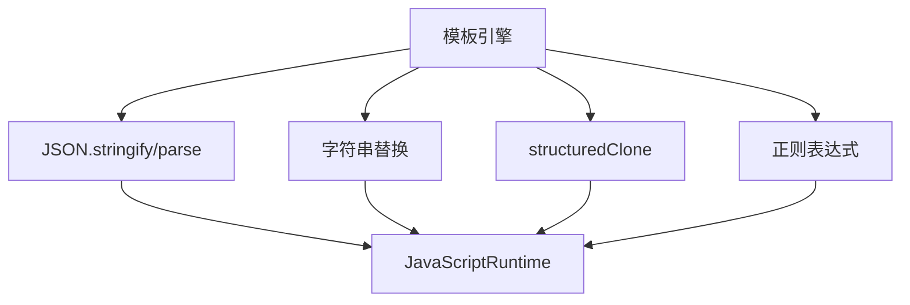

# 模板系统

<cite>
**本文档中引用的文件**  
- [agent.customize.template.yaml](file://src/utility/templates/agent.customize.template.yaml)
- [agent_commands.md](file://src/modules/bmb/workflows/create-agent/templates/agent_commands.md)
- [agent_persona.md](file://src/modules/bmb/workflows/create-agent/templates/agent_persona.md)
- [agent_purpose_and_type.md](file://src/modules/bmb/workflows/create-agent/templates/agent_purpose_and_type.md)
- [product-brief.template.md](file://src/modules/bmm/workflows/1-analysis/product-brief/product-brief.template.md)
- [prd-template.md](file://src/modules/bmm/workflows/2-plan-workflows/prd/prd-template.md)
- [architecture-decision-template.md](file://src/modules/bmm/workflows/3-solutioning/architecture/architecture-decision-template.md)
- [ux-design-template.md](file://src/modules/bmm/workflows/2-plan-workflows/create-ux-design/ux-design-template.md)
- [project-context-template.md](file://src/modules/bmm/data/project-context-template.md)
- [template-engine.js](file://tools/cli/lib/agent/template-engine.js)
</cite>

## 目录
1. [引言](#引言)
2. [项目结构](#项目结构)
3. [核心组件](#核心组件)
4. [架构概述](#架构概述)
5. [详细组件分析](#详细组件分析)
6. [依赖分析](#依赖分析)
7. [性能考虑](#性能考虑)
8. [故障排除指南](#故障排除指南)
9. [结论](#结论)

## 引言
BMAD-METHOD模板系统是一个用于生成可重用YAML和Markdown模板的动态引擎，支持变量替换、条件渲染和循环处理等核心功能。该系统通过模板引擎实现工作流自动化，允许用户创建高度可定制的代理和工作流配置。本文档深入探讨模板引擎的实现原理、工作机制以及最佳实践，帮助用户设计高效、灵活的模板以满足大规模自定义需求。

## 项目结构
BMAD-METHOD的模板系统分布在多个模块中，主要位于`src/modules/`和`src/utility/templates/`目录下。模板文件广泛应用于不同工作流场景，如代理创建、产品需求文档生成、架构决策记录等。模板引擎逻辑则集中于CLI工具的`template-engine.js`文件中。

**图示来源**  
- [agent.customize.template.yaml](file://src/utility/templates/agent.customize.template.yaml)
- [template-engine.js](file://tools/cli/lib/agent/template-engine.js)

**本节来源**  
- [src/utility/templates/](file://src/utility/templates/)
- [src/modules/bmb/workflows/create-agent/templates/](file://src/modules/bmb/workflows/create-agent/templates/)

## 核心组件
模板系统的核心由模板定义文件和模板引擎处理器组成。模板定义文件使用`.yaml`和`.md`格式，包含变量占位符（如`{{variable}}`）和条件块（如`{{#if}}...{{/if}}`）。模板引擎处理器负责解析这些模板并注入实际值。

**本节来源**  
- [agent.customize.template.yaml](file://src/utility/templates/agent.customize.template.yaml)
- [template-engine.js](file://tools/cli/lib/agent/template-engine.js)

## 架构概述
BMAD-METHOD模板系统的架构采用分层设计，上层为模板定义，中层为模板引擎，下层为应用集成。模板引擎作为中间件，接收用户输入的变量数据，处理模板中的逻辑指令，并输出最终的配置文件或文档内容。

**图示来源**  
- [template-engine.js](file://tools/cli/lib/agent/template-engine.js)

## 详细组件分析

### 模板语法分析
BMAD-METHOD模板系统支持标准的Mustache风格语法，包括变量替换、条件渲染等功能。

#### 变量替换机制

**图示来源**  
- [template-engine.js](file://tools/cli/lib/agent/template-engine.js#L60-L77)

#### 条件渲染机制

**图示来源**  
- [template-engine.js](file://tools/cli/lib/agent/template-engine.js#L30-L57)

### 模板文件分析
BMAD-METHOD提供了多种预定义模板，涵盖代理创建、产品简报、PRD生成等场景。

#### 代理创建模板

**图示来源**  
- [agent_purpose_and_type.md](file://src/modules/bmb/workflows/create-agent/templates/agent_purpose_and_type.md)
- [agent_persona.md](file://src/modules/bmb/workflows/create-agent/templates/agent_persona.md)
- [agent_commands.md](file://src/modules/bmb/workflows/create-agent/templates/agent_commands.md)

#### 文档生成模板

**图示来源**  
- [product-brief.template.md](file://src/modules/bmm/workflows/1-analysis/product-brief/product-brief.template.md)
- [prd-template.md](file://src/modules/bmm/workflows/2-plan-workflows/prd/prd-template.md)
- [ux-design-template.md](file://src/modules/bmm/workflows/2-plan-workflows/create-ux-design/ux-design-template.md)
- [architecture-decision-template.md](file://src/modules/bmm/workflows/3-solutioning/architecture/architecture-decision-template.md)

**本节来源**  
- [src/modules/bmb/workflows/create-agent/templates/](file://src/modules/bmb/workflows/create-agent/templates/)
- [src/modules/bmm/workflows/](file://src/modules/bmm/workflows/)

## 依赖分析
模板系统依赖于YAML解析、字符串处理和文件操作等基础功能。其核心依赖关系如下：

**图示来源**  
- [template-engine.js](file://tools/cli/lib/agent/template-engine.js)

**本节来源**  
- [template-engine.js](file://tools/cli/lib/agent/template-engine.js)

## 性能考虑
模板引擎采用简单的正则表达式匹配和字符串替换策略，具有良好的性能表现。对于大型模板文件，建议避免嵌套过深的条件块，以减少正则表达式的匹配复杂度。引擎在处理完成后会自动清理多余的空行，确保输出格式整洁。

## 故障排除指南
当模板渲染出现问题时，可参考以下常见问题及解决方案：

**本节来源**  
- [template-engine.js](file://tools/cli/lib/agent/template-engine.js#L78-L85)

## 结论
BMAD-METHOD模板系统通过简洁而强大的模板引擎实现了高度可定制的工作流自动化。其基于Mustache语法的变量替换和条件渲染机制，结合预定义的模板文件，为用户提供了灵活的配置能力。通过深入理解模板引擎的内部工作机制，用户可以设计出更加高效、可维护的模板，满足复杂项目的需求。