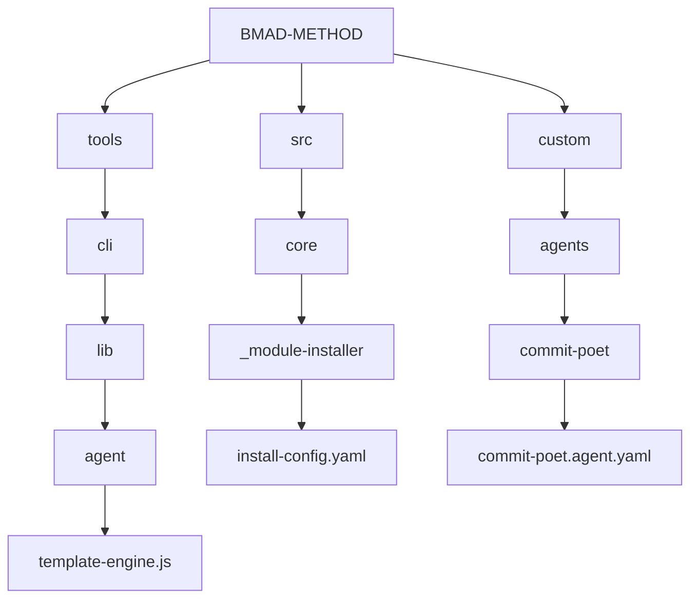
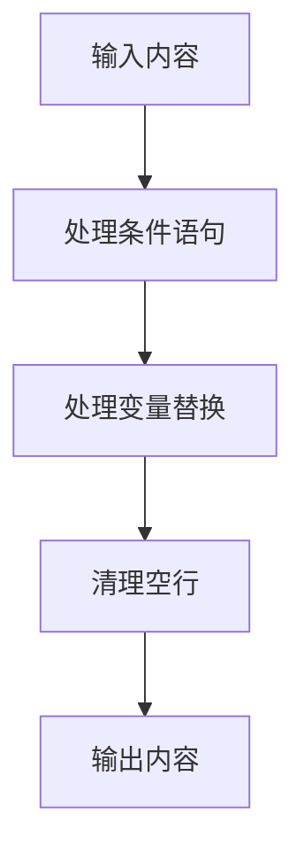
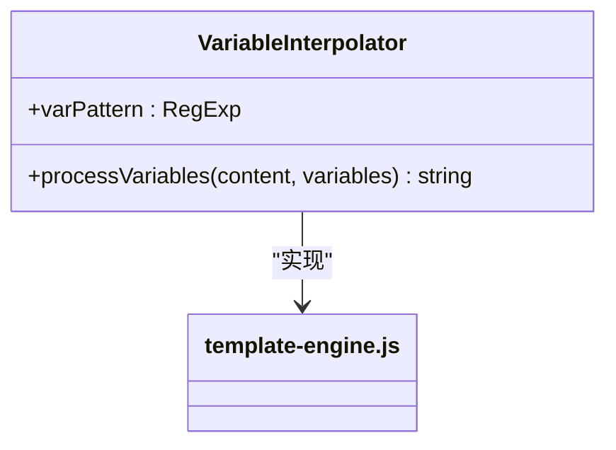
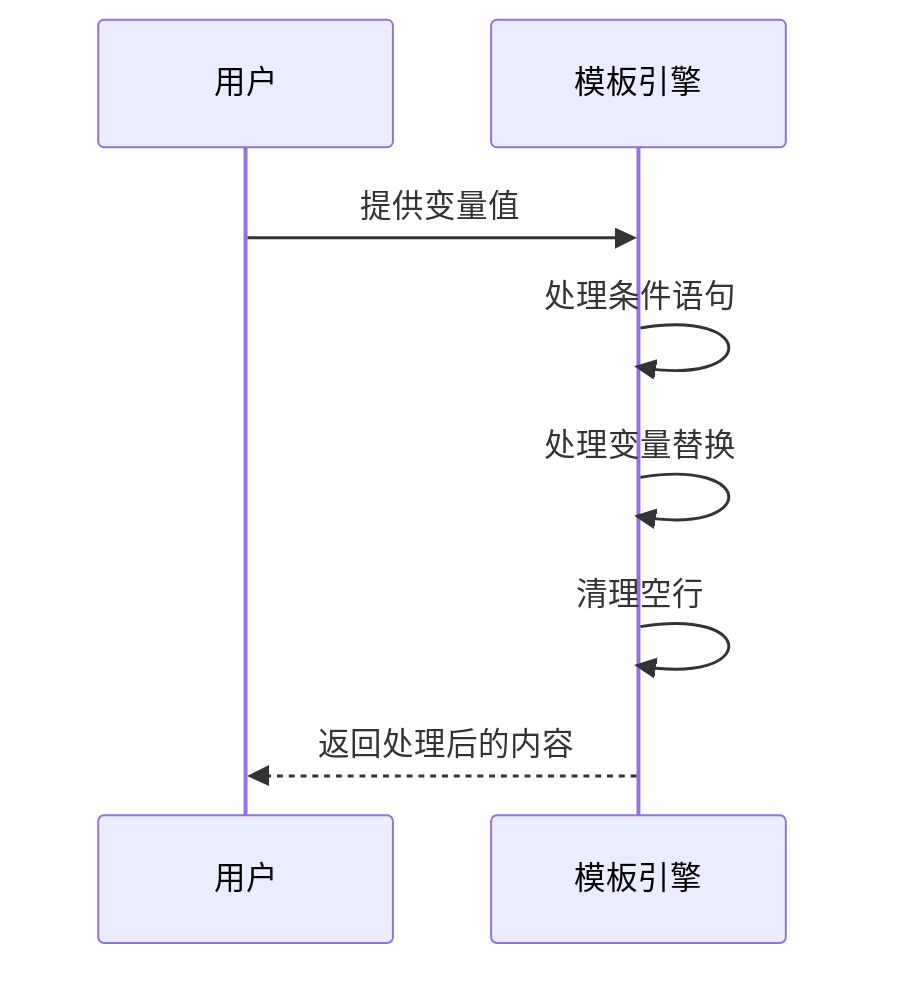
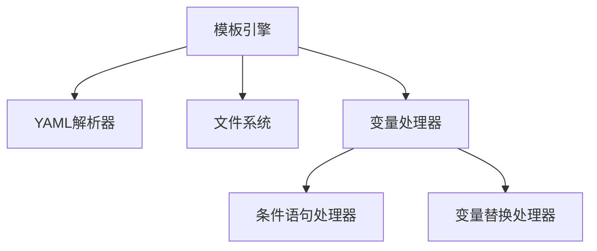

# 模板语法指南

<cite>
**本文档中引用的文件**  
- [template-engine.js](file://tools/cli/lib/agent/template-engine.js)
- [install-config.yaml](file://src/core/_module-installer/install-config.yaml)
- [commit-poet.agent.yaml](file://custom/src/agents/commit-poet/commit-poet.agent.yaml)
- [toolsmith.agent.yaml](file://custom/src/agents/toolsmith/toolsmith.agent.yaml)
- [agent_commands.md](file://src/modules/bmb/workflows/create-agent/templates/agent_commands.md)
- [agent_persona.md](file://src/modules/bmb/workflows/create-agent/templates/agent_persona.md)
- [design-section.md](file://src/modules/bmb/workflows/create-workflow/templates/design-section.md)
- [workflow.xml](file://src/core/tasks/workflow.xml)
- [installer.js](file://tools/cli/installers/lib/core/installer.js)
- [compiler.js](file://tools/cli/lib/agent/compiler.js)
</cite>

## 目录
1. [简介](#简介)
2. [项目结构](#项目结构)
3. [核心组件](#核心组件)
4. [架构概述](#架构概述)
5. [详细组件分析](#详细组件分析)
6. [依赖分析](#依赖分析)
7. [性能考虑](#性能考虑)
8. [故障排除指南](#故障排除指南)
9. [结论](#结论)

## 简介
BMAD-METHOD模板语法是一种用于动态生成配置文件和文档的模板系统，支持变量插值、条件语句和循环等结构。该系统主要用于在安装和配置过程中根据用户输入动态生成YAML配置和Markdown文档。

**Section sources**
- [template-engine.js](file://tools/cli/lib/agent/template-engine.js#L1-L152)

## 项目结构
BMAD-METHOD项目包含多个模块和工作流，其中模板引擎主要位于`tools/cli/lib/agent/template-engine.js`文件中。模板文件分布在各个模块的`install-config.yaml`和工作流模板中。



**Diagram sources**
- [template-engine.js](file://tools/cli/lib/agent/template-engine.js#L1-L152)
- [install-config.yaml](file://src/core/_module-installer/install-config.yaml#L1-L36)

**Section sources**
- [template-engine.js](file://tools/cli/lib/agent/template-engine.js#L1-L152)
- [install-config.yaml](file://src/core/_module-installer/install-config.yaml#L1-L36)

## 核心组件
模板引擎的核心功能包括变量插值、条件语句和特殊变量处理。这些功能在`template-engine.js`中实现，用于处理安装配置和生成最终的配置文件。

**Section sources**
- [template-engine.js](file://tools/cli/lib/agent/template-engine.js#L1-L152)

## 架构概述
BMAD-METHOD模板系统采用分层架构，首先处理条件语句，然后进行变量替换，最后清理空行。这种顺序确保了条件块内的变量能够正确解析。



**Diagram sources**
- [template-engine.js](file://tools/cli/lib/agent/template-engine.js#L12-L24)

## 详细组件分析

### 变量插值分析
变量插值使用`{{variable}}`语法，将模板中的占位符替换为实际值。支持的变量包括用户输入、系统变量和运行时变量。



**Diagram sources**
- [template-engine.js](file://tools/cli/lib/agent/template-engine.js#L63-L77)

**Section sources**
- [template-engine.js](file://tools/cli/lib/agent/template-engine.js#L63-L77)

### 条件语句分析
条件语句支持`{{#if}}`、`{{#unless}}`和`{{/if}}`、`{{/unless}}`块。支持相等比较和布尔值检查。

```mermaid
flowchart TD
Start([开始]) --> IfEquals{"if variable == \"value\"?"}
IfEquals --> |是| Block1["执行块内容"]
IfEquals --> |否| Block2["跳过块内容"]
IfBool{"if variable?"}
IfBool --> |真| Block3["执行块内容"]
IfBool --> |假| Block4["跳过块内容"]
Unless{"unless variable?"}
Unless --> |假| Block5["执行块内容"]
Unless --> |真| Block6["跳过块内容"]
```

**Diagram sources**
- [template-engine.js](file://tools/cli/lib/agent/template-engine.js#L30-L58)

**Section sources**
- [template-engine.js](file://tools/cli/lib/agent/template-engine.js#L30-L58)

### 数据绑定机制
数据绑定机制通过`processTemplate`函数实现，将用户输入的变量值绑定到模板中。支持默认值和继承值。



**Diagram sources**
- [template-engine.js](file://tools/cli/lib/agent/template-engine.js#L12-L24)

**Section sources**
- [template-engine.js](file://tools/cli/lib/agent/template-engine.js#L12-L24)

## 依赖分析
模板引擎依赖于YAML解析器和文件系统操作，主要用于读取配置文件和生成输出文件。



**Diagram sources**
- [compiler.js](file://tools/cli/lib/agent/compiler.js#L443-L483)
- [installer.js](file://tools/cli/installers/lib/core/installer.js#L2333-L2366)

**Section sources**
- [compiler.js](file://tools/cli/lib/agent/compiler.js#L443-L483)
- [installer.js](file://tools/cli/installers/lib/core/installer.js#L2333-L2366)

## 性能考虑
模板引擎的性能主要受正则表达式匹配和字符串替换操作的影响。建议避免嵌套过深的条件语句以提高处理效率。

## 故障排除指南
常见问题包括变量未定义、条件语句语法错误和特殊字符处理不当。确保变量名正确且条件语句闭合。

**Section sources**
- [template-engine.js](file://tools/cli/lib/agent/template-engine.js#L69-L73)

## 结论
BMAD-METHOD模板语法提供了一套完整的模板处理机制，支持变量插值、条件语句和特殊变量处理。通过合理使用这些功能，可以实现灵活的配置文件和文档生成。