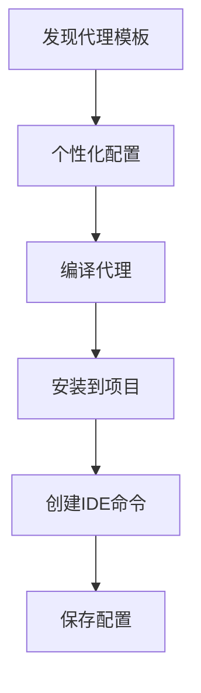
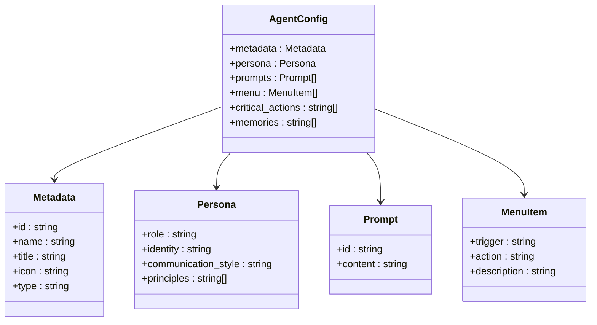
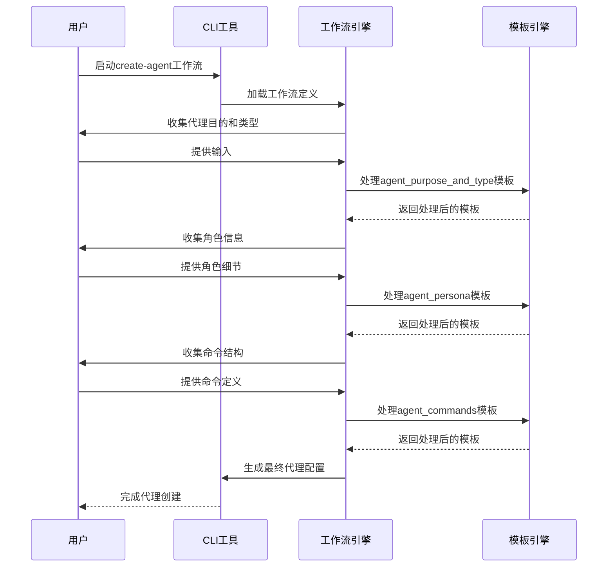
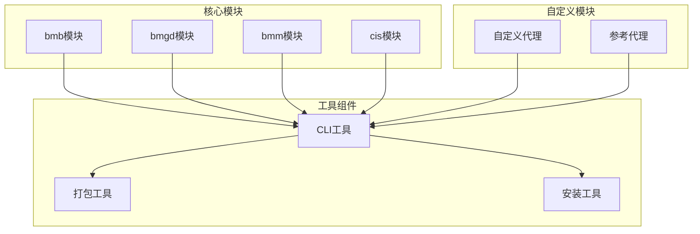

# 自定义与扩展

<cite>
**本文档引用的文件**
- [commit-poet.agent.yaml](file://custom/src/agents/commit-poet/commit-poet.agent.yaml)
- [toolsmith.agent.yaml](file://custom/src/agents/toolsmith/toolsmith.agent.yaml)
- [agent-customization-guide.zh-CN.md](file://docs/agent-customization-guide.zh-CN.md)
- [custom-agent-installation.md](file://docs/custom-agent-installation.md)
- [agent-config-template.md](file://src/utility/models/agent-config-template.md)
- [commit-poet.agent.yaml](file://src/modules/bmb/reference/agents/simple-examples/commit-poet.agent.yaml)
- [journal-keeper.agent.yaml](file://src/modules/bmb/reference/agents/expert-examples/journal-keeper/journal-keeper.agent.yaml)
- [agent_purpose_and_type.md](file://src/modules/bmb/workflows/create-agent/templates/agent_purpose_and_type.md)
- [agent_persona.md](file://src/modules/bmb/workflows/create-agent/templates/agent_persona.md)
- [agent_commands.md](file://src/modules/bmb/workflows/create-agent/templates/agent_commands.md)
- [template-engine.js](file://tools/cli/lib/agent/template-engine.js)
</cite>

## 目录
1. [自定义代理](#自定义代理)
2. [YAML配置文件结构](#yaml配置文件结构)
3. [工作流扩展](#工作流扩展)
4. [模板引擎使用](#模板引擎使用)
5. [模块市场与未来扩展](#模块市场与未来扩展)
6. [高级技术细节](#高级技术细节)
7. [最佳实践与反模式](#最佳实践与反模式)

## 自定义代理

BMAD-METHOD提供了强大的代理自定义功能，允许用户在不修改核心文件的情况下创建和安装自定义代理。所有自定义配置在系统更新时保持不变，确保了配置的持久性和安全性。

通过`.customize.yaml`文件，用户可以对已安装的代理进行个性化配置。这些文件位于`{bmad_folder}/_cfg/agents/`目录下，每个已安装的代理都有对应的自定义文件。自定义过程包括编辑配置文件和重建代理两个主要步骤。

**代理安装流程**


**代理安装来源**
- 项目自定义目录：`.bmad/custom/agents/`
- 模块参考目录：`src/modules/bmb/reference/agents/`
- 自定义路径：通过`-s/--source`参数指定

**Section sources**
- [custom-agent-installation.md](file://docs/custom-agent-installation.md#L1-L184)

## YAML配置文件结构

BMAD-METHOD的代理配置采用YAML格式，具有清晰的结构和严格的验证规则。配置文件定义了代理的元数据、角色、提示、菜单等核心属性。

### 核心配置结构



### 字段定义与验证规则

**元数据字段**
- `id`: 代理的唯一标识符，遵循`.bmad/agents/{name}/{name}.md`格式
- `name`: 代理的显示名称，用于个性化标识
- `title`: 代理的职位或角色描述
- `icon`: 代理的视觉标识，使用Unicode表情符号
- `type`: 代理类型，支持`simple`和`expert`两种类型

**角色字段**
- `role`: 代理的核心角色描述
- `identity`: 代理的身份和背景说明
- `communication_style`: 代理的沟通风格描述
- `principles`: 代理的行为准则数组

**验证规则**
- 所有顶级键必须存在于预定义的允许列表中
- `metadata`部分必须包含`name`和`type`字段
- `persona`部分必须包含`role`字段
- `menu`项的`trigger`必须使用kebab-case命名约定
- `prompts`中的`id`必须唯一且非空

**Section sources**
- [commit-poet.agent.yaml](file://custom/src/agents/commit-poet/commit-poet.agent.yaml#L1-L130)
- [toolsmith.agent.yaml](file://custom/src/agents/toolsmith/toolsmith.agent.yaml#L1-L109)
- [commit-poet.agent.yaml](file://src/modules/bmb/reference/agents/simple-examples/commit-poet.agent.yaml#L1-L127)

## 工作流扩展

BMAD-METHOD支持通过创建和集成自定义工作流来扩展现有功能。用户可以创建全新的工作流或修改现有工作流以满足特定需求。

### 工作流创建流程



### 工作流集成方法

**自定义菜单项**
用户可以通过在`.customize.yaml`文件中添加`menu`字段来集成自定义工作流：

```yaml
menu:
  - trigger: my-workflow
    workflow: '{project-root}/custom/my-workflow.yaml'
    description: 我的自定义工作流
  - trigger: deploy
    action: '#deploy-prompt'
    description: 部署到生产环境
```

**工作流类型**
- **简单代理**: 单一YAML文件，适用于基本功能
- **专家代理**: 包含侧车文件的文件夹结构，支持复杂记忆和知识管理

**Section sources**
- [agent_purpose_and_type.md](file://src/modules/bmb/workflows/create-agent/templates/agent_purpose_and_type.md#L1-L24)
- [agent_persona.md](file://src/modules/bmb/workflows/create-agent/templates/agent_persona.md#L1-L26)
- [agent_commands.md](file://src/modules/bmb/workflows/create-agent/templates/agent_commands.md#L1-L22)

## 模板引擎使用

BMAD-METHOD的模板引擎是代理自定义和安装的核心组件，负责处理配置模板中的变量替换和条件逻辑。

### 模板语法

```mermaid
flowchart TD
Start([模板处理开始]) --> ProcessConditionals["处理条件语句\n{{#if}}, {{#unless}}"]
ProcessConditionals --> ProcessVariables["处理变量替换\n{{variable}}"]
ProcessVariables --> Cleanup["清理空行"]
Cleanup --> End([模板处理完成])
subgraph 条件处理
ProcessConditionals --> IfEquals["{{#if var == \"value\"}}"]
ProcessConditionals --> IfBoolean["{{#if var}}"]
ProcessConditionals --> Unless["{{#unless var}}"]
end
subgraph 变量处理
ProcessVariables --> SimpleReplace["{{var}} → value"]
ProcessVariables --> Preserve["未定义变量保持原样"]
end
```

### 模板处理流程

1. **条件处理**: 首先处理`{{#if}}`、`{{#unless}}`等条件块
2. **变量替换**: 然后处理`{{variable}}`形式的变量替换
3. **清理优化**: 最后清理因条件块移除而产生的多余空行

### 模板变量类型

**内置变量**
- `{project-root}`: 项目根目录路径
- `{agent-folder}`: 代理文件夹路径
- `{core:communication_language}`: 核心通信语言
- `{core:user_name}`: 用户名称

**自定义变量**
- 通过`install_config`定义的安装时变量
- 用户在安装过程中提供的个性化输入

**Section sources**
- [template-engine.js](file://tools/cli/lib/agent/template-engine.js#L1-L153)

## 模块市场与未来扩展

BMAD-METHOD设计了模块化的架构，为未来的扩展和模块市场奠定了基础。系统支持不同类型的代理和模块，具有良好的可扩展性。

### 模块架构



### 扩展可能性

**模块市场概念**
- 共享代理模板库
- 社区贡献的工作流
- 专业领域的专家代理
- 行业特定的解决方案包

**未来发展方向**
- 全局配置支持
- 模块版本管理
- 依赖关系解析
- 自动化测试集成

**Section sources**
- [docs](file://docs#L1-L209)
- [src/modules](file://src/modules#L1-L109)

## 高级技术细节

### 代理编译过程


编译过程包括以下步骤：
1. 从YAML文件中提取`install_config`部分
2. 通过交互式界面收集用户配置
3. 使用模板引擎处理变量替换
4. 移除已处理的`install_config`部分
5. 生成最终的代理配置文件
6. 为支持的IDE创建相应的命令

### 命令生成机制

系统为多种IDE生成特定格式的命令：
- **Claude Code**: `/bmad:custom:agents:{name}`
- **Codex**: `/bmad-custom-agents-{name}`
- **GitHub Copilot**: `bmad-agent-custom-{name}`

### 动态加载原理

代理系统采用动态加载机制，通过以下方式实现：
- 按需加载代理配置
- 缓存已加载的代理实例
- 支持运行时代理切换
- 热重载自定义配置

**Section sources**
- [template-engine.js](file://tools/cli/lib/agent/template-engine.js#L12-L153)
- [custom-agent-installation.md](file://docs/custom-agent-installation.md#L1-L184)

## 最佳实践与反模式

### 最佳实践

**配置管理**
- 从小处着手：一次只自定义一个部分并重建测试
- 备份重要配置：在进行重大更改前复制自定义文件
- 版本控制：考虑将`_cfg/`目录提交到版本控制系统
- 按项目配置：自定义文件是按项目的，不是全局的

**代理设计**
- 明确角色定位：确保代理的角色和职责清晰
- 保持沟通一致性：代理的沟通风格应与其角色匹配
- 提供有价值的功能：每个菜单项都应解决实际问题
- 考虑用户体验：设计直观易用的交互流程

### 反模式

**避免的错误**
- 不要包含`*`前缀或`help`/`exit`项：这些会自动注入
- 不要为空的必需字段取消注释：确保所有必需字段都有值
- 不要忽略YAML语法：缩进和格式非常重要
- 不要直接修改核心文件：使用自定义机制进行个性化

**故障排除**
- **更改未生效**: 确保编辑后运行了`npx bmad-method build <agent-name>`
- **代理未加载**: 检查YAML语法错误和必需字段
- **需要重置**: 删除`.customize.yaml`文件并重新生成

**Section sources**
- [agent-customization-guide.zh-CN.md](file://docs/agent-customization-guide.zh-CN.md#L1-L209)
- [custom-agent-installation.md](file://docs/custom-agent-installation.md#L1-L184)