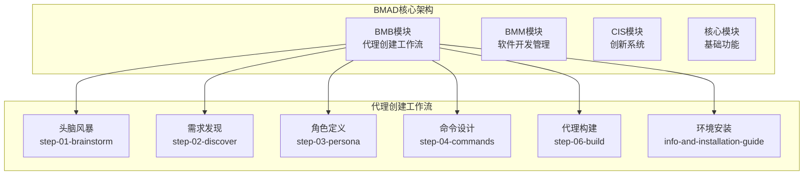
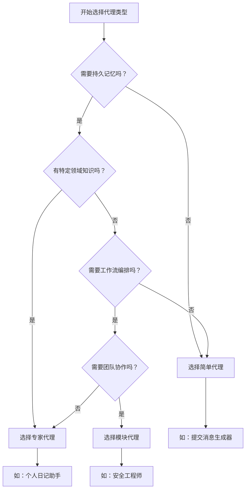
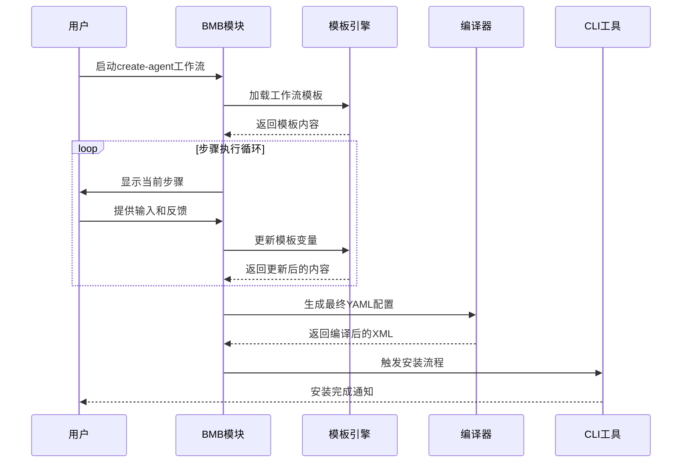
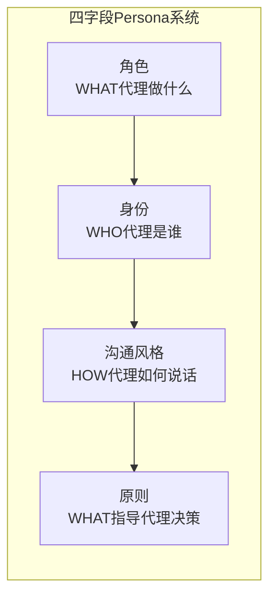
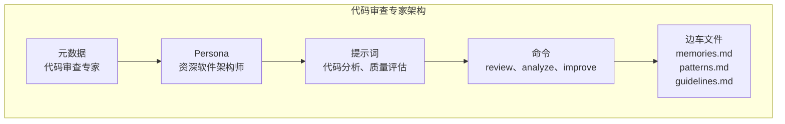
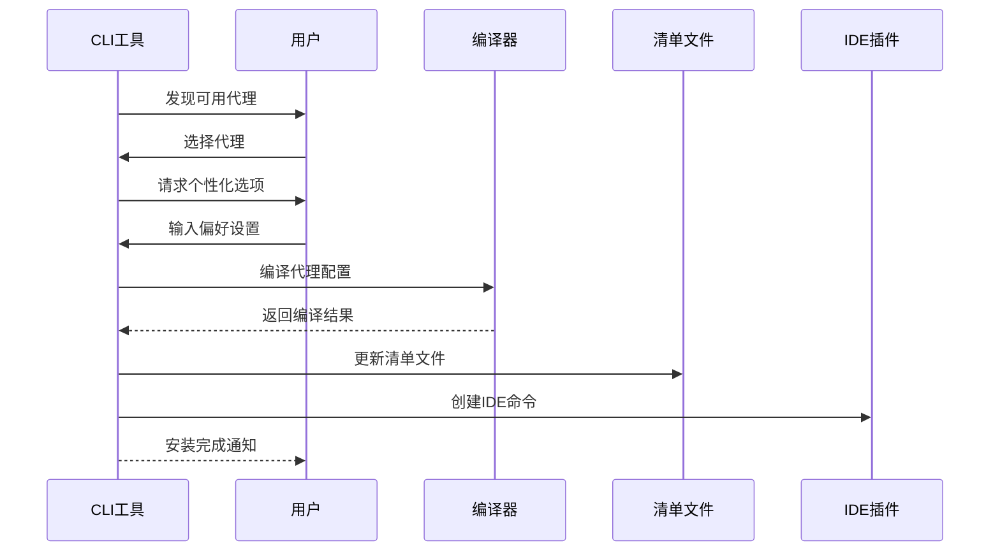
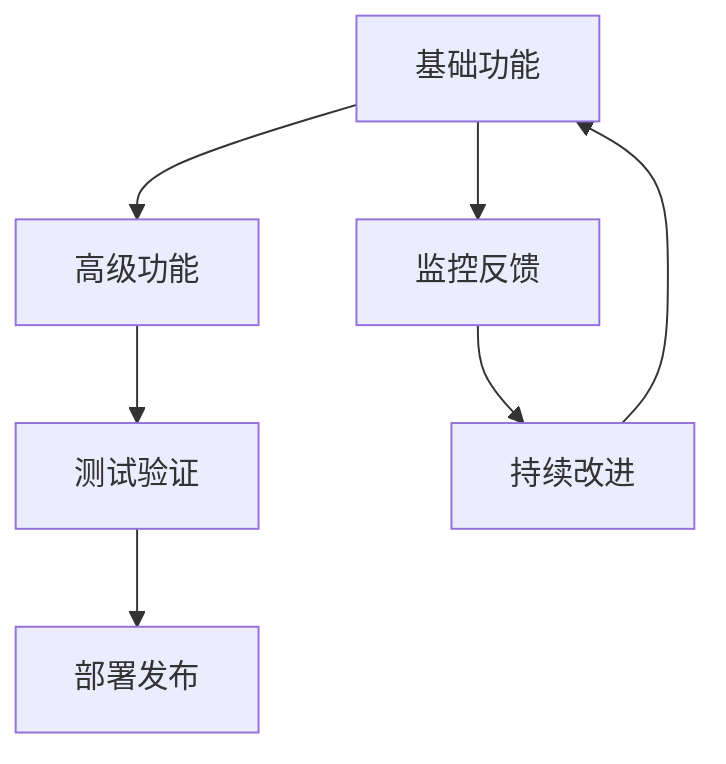

# BMAD-METHOD自定义代理创建教程

<cite>
**本文档中引用的文件**
- [workflow.md](file://src/modules/bmb/workflows/create-agent/workflow.md)
- [agent_purpose_and_type.md](file://src/modules/bmb/workflows/create-agent/templates/agent_purpose_and_type.md)
- [info-and-installation-guide.md](file://src/modules/bmb/workflows/create-agent/data/info-and-installation-guide.md)
- [understanding-agent-types.md](file://src/modules/bmb/docs/agents/understanding-agent-types.md)
- [simple-agent-architecture.md](file://src/modules/bmb/docs/agents/simple-agent-architecture.md)
- [step-01-brainstorm.md](file://src/modules/bmb/workflows/create-agent/steps/step-01-brainstorm.md)
- [step-03-persona.md](file://src/modules/bmb/workflows/create-agent/steps/step-03-persona.md)
- [step-04-commands.md](file://src/modules/bmb/workflows/create-agent/steps/step-04-commands.md)
- [step-06-build.md](file://src/modules/bmb/workflows/create-agent/steps/step-06-build.md)
- [commit-poet.agent.yaml](file://src/modules/bmb/reference/agents/simple-examples/commit-poet.agent.yaml)
- [journal-keeper/README.md](file://src/modules/bmb/reference/agents/expert-examples/journal-keeper/README.md)
- [security-engineer.agent.yaml](file://src/modules/bmb/reference/agents/module-examples/security-engineer.agent.yaml)
- [agent-install.js](file://tools/cli/commands/agent-install.js)
- [custom-agent-installation.md](file://docs/custom-agent-installation.md)
</cite>

## 目录
1. [简介](#简介)
2. [项目结构概览](#项目结构概览)
3. [代理类型与架构](#代理类型与架构)
4. [完整创建流程](#完整创建流程)
5. [实战案例：代码审查专家](#实战案例代码审查专家)
6. [环境安装与部署](#环境安装与部署)
7. [最佳实践与优化](#最佳实践与优化)
8. [故障排除指南](#故障排除指南)
9. [总结](#总结)

## 简介

BMAD-METHOD是一个强大的AI代理开发框架，提供了从构思到部署的完整工作流程。本教程将指导您通过BMB模块的create-agent工作流，创建一个功能完善的自定义代理，以"代码审查专家"为例进行实战演示。

BMAD-METHOD的核心优势：
- **渐进式开发**：从头脑风暴到最终部署的系统化流程
- **多种代理类型**：简单、专家、模块三种架构模式
- **模板驱动**：基于工作流模板的自动化配置生成
- **CLI工具支持**：完整的命令行安装和管理工具

## 项目结构概览

BMAD-METHOD采用模块化架构，核心组件包括：



**图表来源**
- [workflow.md](file://src/modules/bmb/workflows/create-agent/workflow.md#L1-L92)

**章节来源**
- [workflow.md](file://src/modules/bmb/workflows/create-agent/workflow.md#L1-L92)

## 代理类型与架构

BMAD-METHOD支持三种主要的代理类型，每种都有其特定的架构模式和适用场景：

### 代理类型对比表

| 特性 | 简单代理 | 专家代理 | 模块代理 |
|------|----------|----------|----------|
| **架构** | 单一YAML文件 | YAML + 边车文件夹 | YAML + 模块系统 |
| **内存管理** | 会话级 | 持久化（边车文件） | 配置驱动 |
| **提示词** | 内嵌 | 内嵌 + 外部文件 | 工作流引用 |
| **依赖关系** | 无 | 边车文件夹 | 模块工作流/任务 |
| **域访问** | 无限制 | 受限于边车 | 完整模块访问 |
| **复杂度** | 低 | 中等 | 高 |
| **使用场景** | 自包含工具 | 带记忆的领域专家 | 全面工作流系统 |

### 架构选择指南



**图表来源**
- [understanding-agent-types.md](file://src/modules/bmb/docs/agents/understanding-agent-types.md#L1-L185)

**章节来源**
- [understanding-agent-types.md](file://src/modules/bmb/docs/agents/understanding-agent-types.md#L1-L185)

## 完整创建流程

BMAD-METHOD的代理创建遵循严格的步骤化流程，确保每个环节都得到充分考虑和实现。

### 标准工作流程架构



**图表来源**
- [workflow.md](file://src/modules/bmb/workflows/create-agent/workflow.md#L15-L45)

### 关键步骤详解

#### 步骤1：头脑风暴（step-01-brainstorm）

头脑风暴阶段是创意探索的关键环节：

- **可选性原则**：用户可以选择是否参与头脑风暴
- **创造性引导**：提供多种创意激发方法
- **输出保存**：保留所有头脑风暴结果用于后续步骤

#### 步骤3：角色定义（step-03-persona）

角色定义采用四字段系统：



**图表来源**
- [step-03-persona.md](file://src/modules/bmb/workflows/create-agent/steps/step-03-persona.md#L70-L94)

#### 步骤4：命令设计（step-04-commands）

命令设计阶段将能力转化为技术实现：

- **自然语言到技术结构的转换**
- **架构特定的能力规划**
- **工作流集成计划**
- **高级特性讨论**

#### 步骤6：代理构建（step-06-build）

最终的YAML生成阶段：

- **庆祝创作历程**
- **加载类型模板**
- **生成完整YAML结构**
- **类型特定实现优化**

**章节来源**
- [step-01-brainstorm.md](file://src/modules/bmb/workflows/create-agent/steps/step-01-brainstorm.md#L1-L146)
- [step-03-persona.md](file://src/modules/bmb/workflows/create-agent/steps/step-03-persona.md#L1-L261)
- [step-04-commands.md](file://src/modules/bmb/workflows/create-agent/steps/step-04-commands.md#L1-L238)
- [step-06-build.md](file://src/modules/bmb/workflows/create-agent/steps/step-06-build.md#L1-L225)

## 实战案例：代码审查专家

让我们通过创建一个"代码审查专家"代理来演示完整的创建过程。

### 需求分析阶段

#### 代理目的确定

**核心目的**：为软件开发团队提供智能代码审查服务

**目标用户**：软件开发者、技术负责人、质量保证团队

**解决的关键问题**：
- 自动识别代码质量问题
- 提供改进建议和最佳实践
- 维护代码一致性标准
- 加速审查流程

**独特价值**：结合静态分析和人工智慧的深度代码理解

### 代理类型选择

基于需求分析，选择**专家代理**架构：



**图表来源**
- [journal-keeper/README.md](file://src/modules/bmb/reference/agents/expert-examples/journal-keeper/README.md#L38-L70)

### 角色定义

#### 四字段Persona系统应用

**角色（Role）**：
"资深软件架构师 + 代码质量专家 - 专注于识别潜在问题并提供建设性改进建议"

**身份（Identity）**：
"拥有10年以上软件开发经验的资深架构师，精通多种编程语言和架构模式。在多个大型项目中担任技术负责人，对代码质量和可维护性有着深刻的理解和实践经验。"

**沟通风格（Communication Style）**：
"专业而富有建设性的沟通方式。能够清晰地指出问题所在，同时提供具体的改进方案。善于用实例说明概念，避免过于技术化的术语，让不同经验水平的开发者都能理解。"

**原则（Principles）**：
- 质量优先：代码质量是第一位的考虑因素
- 建设性反馈：提供具体、可操作的改进建议
- 一致性原则：维护团队编码标准和最佳实践
- 学习导向：帮助开发者成长，不仅仅是批评
- 效率平衡：在质量保证和开发效率之间找到平衡

### 命令设计

#### 核心能力识别

1. **代码质量分析**：自动检测代码质量问题
2. **架构模式识别**：识别不良的架构模式
3. **安全漏洞检查**：发现潜在的安全问题
4. **性能优化建议**：提供性能改进方案
5. **最佳实践验证**：检查是否符合团队标准

#### 命令结构设计

```yaml
menu:
  - trigger: review
    action: "#analyze-code"
    description: "审查代码并提供详细反馈"
  
  - trigger: analyze
    action: "#quality-analysis"
    description: "执行全面的质量分析"
  
  - trigger: security
    action: "#security-check"
    description: "检查安全漏洞"
  
  - trigger: improve
    action: "#suggest-improvements"
    description: "提供具体的改进建议"
  
  - trigger: patterns
    action: "#pattern-analysis"
    description: "分析代码模式和架构"
```

### 代理构建

#### 完整YAML配置生成

基于以上分析，生成完整的代理配置：

```yaml
agent:
  metadata:
    id: ".bmad/custom/agents/code-review-expert/code-review-expert.md"
    name: "CodeGuardian"
    title: "代码审查专家"
    icon: "🔍"
    type: "expert"
  
  persona:
    role: |
      我是代码审查专家，专门负责识别代码质量问题、提供改进建议，并确保代码符合团队的最佳实践标准。
    
    identity: |
      我是一位拥有10年以上软件开发经验的资深架构师，精通多种编程语言和架构模式。在多个大型项目中担任技术负责人，对代码质量和可维护性有着深刻的理解和实践经验。
    
    communication_style: |
      专业而富有建设性的沟通方式。能够清晰地指出问题所在，同时提供具体的改进方案。善于用实例说明概念，避免过于技术化的术语，让不同经验水平的开发者都能理解。
    
    principles:
      - 质量优先：代码质量是第一位的考虑因素
      - 建设性反馈：提供具体、可操作的改进建议
      - 一致性原则：维护团队编码标准和最佳实践
      - 学习导向：帮助开发者成长，不仅仅是批评
      - 效率平衡：在质量保证和开发效率之间找到平衡
  
  critical_actions:
    - "Load COMPLETE file {agent-folder}/code-review-expert-sidecar/memories.md"
    - "Load COMPLETE file {agent-folder}/code-review-expert-sidecar/guidelines.md"
    - "ONLY read/write files in {agent-folder}/code-review-expert-sidecar/"
  
  prompts:
    - id: analyze-code
      content: |
        <instructions>
        我将分析提供的代码，重点关注：
        - 代码质量指标
        - 架构模式识别
        - 安全漏洞检查
        - 性能优化机会
        - 最佳实践遵循情况
        
        请提供要审查的代码或描述。
        </instructions>
        
        <process>
        1. 分析代码结构和逻辑
        2. 应用质量标准进行评估
        3. 识别潜在问题和改进点
        4. 提供具体的改进建议
        5. 记录审查结果和学习点
        </process>
    
    - id: quality-analysis
      content: |
        <instructions>
        执行全面的代码质量分析，包括：
        - 复杂度评估
        - 可读性检查
        - 可维护性分析
        - 测试覆盖率评估
        </instructions>
    
    - id: suggest-improvements
      content: |
        <instructions>
        基于分析结果，提供具体的代码改进建议：
        - 重构建议
        - 设计模式应用
        - 性能优化方案
        - 安全加固措施
        </instructions>
```

**章节来源**
- [commit-poet.agent.yaml](file://src/modules/bmb/reference/agents/simple-examples/commit-poet.agent.yaml#L1-L127)
- [journal-keeper/README.md](file://src/modules/bmb/reference/agents/expert-examples/journal-keeper/README.md#L1-L243)

## 环境安装与部署

### 安装前准备

#### 系统要求

- Node.js 16+ 环境
- BMAD-METHOD 框架已安装
- 适当的IDE插件（Claude Code、GitHub Copilot等）

#### 项目结构设置

```bash
# 创建项目目录结构
mkdir -p .bmad/custom/agents/code-review-expert
cd .bmad/custom/agents/code-review-expert

# 复制代理配置文件
cp path/to/your/code-review-expert.agent.yaml .
```

### CLI安装流程

#### 交互式安装

```bash
# 进入项目根目录
cd your-project-root

# 启动安装程序
npx bmad-method agent-install

# 或者全局安装后使用
bmad agent-install
```

#### 安装过程详解



**图表来源**
- [agent-install.js](file://tools/cli/commands/agent-install.js#L1-L410)

#### 默认配置安装

对于自动化部署场景：

```bash
# 使用默认配置进行非交互式安装
npx bmad-method agent-install --source ./code-review-expert.agent.yaml --defaults

# 指定目标项目路径
npx bmad-method agent-install --source ./code-review-expert.agent.yaml --destination /path/to/target/project
```

### 验证安装

#### 安装成功检查

```bash
# 查看已安装的代理
npx bmad-method list

# 验证代理文件
ls -la .bmad/custom/agents/code-review-expert/

# 测试代理功能
npx bmad-method agent-install --source ./code-review-expert.agent.yaml --defaults
```

#### IDE集成验证

安装完成后，您可以在支持的IDE中使用以下命令：

- **Claude Code**: `/bmad:custom:agents:code-review-expert`
- **GitHub Copilot**: `bmad-agent-custom-code-review-expert`
- **Cursor**: `/bmad-custom-agents-code-review-expert`

**章节来源**
- [agent-install.js](file://tools/cli/commands/agent-install.js#L1-L410)
- [custom-agent-installation.md](file://docs/custom-agent-installation.md#L1-L184)

## 最佳实践与优化

### 代理设计最佳实践

#### 1. Persona设计原则

**保持一致性**：确保Persona的四个字段之间的一致性和互补性。

**真实可信**：Persona应该反映真实的用户体验和期望。

**适应性设计**：考虑不同用户群体的需求差异。

#### 2. 命令结构优化

**触发词设计**：
- 简洁明了：使用简短的动词作为触发词
- 语义明确：触发词应该清楚表达命令含义
- 一致命名：遵循统一的命名约定

**动作类型选择**：
- 内嵌提示词：适用于简单的、一次性操作
- 外部文件引用：适用于复杂的、需要上下文的操作
- 工作流调用：适用于需要多步骤处理的任务

#### 3. 性能优化策略

**资源管理**：
- 合理使用内存和存储
- 优化文件访问模式
- 实现缓存机制

**响应时间优化**：
- 异步处理长时间运行的任务
- 实现进度报告机制
- 优化算法复杂度

### 开发调试技巧

#### 1. 渐进式开发



#### 2. 错误处理策略

**预防性设计**：
- 输入验证和清理
- 边界条件检查
- 异常情况处理

**错误恢复**：
- 自动重试机制
- 降级服务策略
- 用户友好的错误信息

#### 3. 文档和维护

**文档化要求**：
- 清晰的使用说明
- API文档
- 故障排除指南

**版本控制**：
- 语义化版本管理
- 变更日志维护
- 向后兼容性保证

## 故障排除指南

### 常见问题及解决方案

#### 1. 安装失败问题

**问题症状**：代理安装过程中出现错误

**可能原因**：
- YAML语法错误
- 文件权限问题
- 依赖缺失

**解决方案**：
```bash
# 检查YAML语法
npx bmad-method validate --agent ./code-review-expert.agent.yaml

# 检查文件权限
chmod 644 ./code-review-expert.agent.yaml

# 重新安装
npx bmad-method agent-install --source ./code-review-expert.agent.yaml --defaults
```

#### 2. 功能异常问题

**问题症状**：代理无法正常响应或产生错误结果

**诊断步骤**：
1. 检查代理配置是否正确
2. 验证边车文件是否存在且可访问
3. 查看日志文件获取详细错误信息

**解决方案**：
```bash
# 重新编译代理
npx bmad-method build --agent ./code-review-expert.agent.yaml

# 清理并重新安装
npx bmad-method cleanup
npx bmad-method agent-install --source ./code-review-expert.agent.yaml
```

#### 3. 性能问题

**问题症状**：代理响应缓慢或占用过多资源

**优化措施**：
- 减少不必要的文件读写
- 优化提示词长度
- 实现适当的缓存机制

### 调试工具和技术

#### 1. 日志分析

```bash
# 启用详细日志
export BMAD_LOG_LEVEL=debug

# 查看代理日志
tail -f .bmad/logs/agent.log
```

#### 2. 性能监控

```bash
# 监控资源使用
top -p $(pgrep -f "bmad")

# 分析内存使用
ps aux | grep bmad
```

#### 3. 配置验证

```bash
# 验证代理配置
npx bmad-method validate --agent ./code-review-expert.agent.yaml

# 检查清单文件
cat .bmad/manifest.csv
```

## 总结

BMAD-METHOD提供了一个完整而系统的代理开发框架，通过标准化的工作流程确保高质量的代理产品。本教程通过"代码审查专家"的实际案例，展示了从需求分析到部署的完整过程。

### 关键要点回顾

1. **架构选择**：根据需求特点选择合适的代理类型
2. **Persona设计**：建立真实可信的角色形象
3. **命令设计**：将功能需求转化为技术实现
4. **安装部署**：利用CLI工具实现自动化部署
5. **持续优化**：基于反馈不断改进代理性能

### 下一步行动建议

1. **实践练习**：尝试创建其他类型的代理
2. **社区贡献**：分享您的代理经验和最佳实践
3. **深入学习**：探索更高级的功能和定制选项
4. **生态系统**：参与BMAD-METHOD社区的发展

通过遵循本教程的指导原则和最佳实践，您将能够创建出功能强大、易于使用的AI代理，为您的项目和团队带来显著的价值提升。