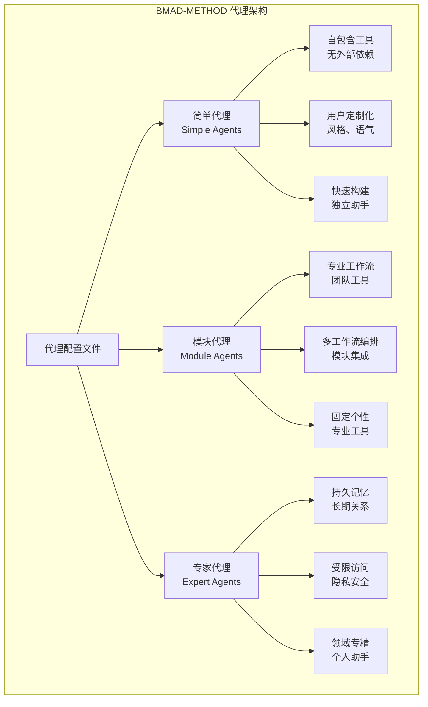
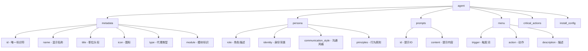
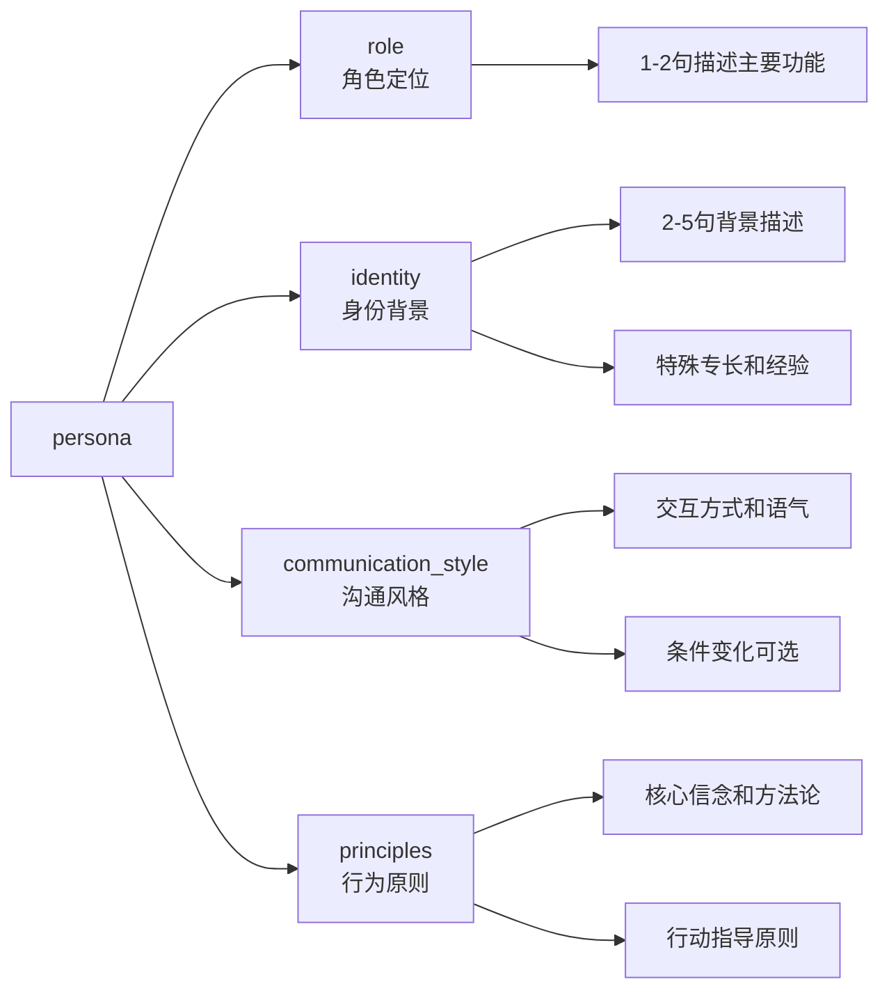
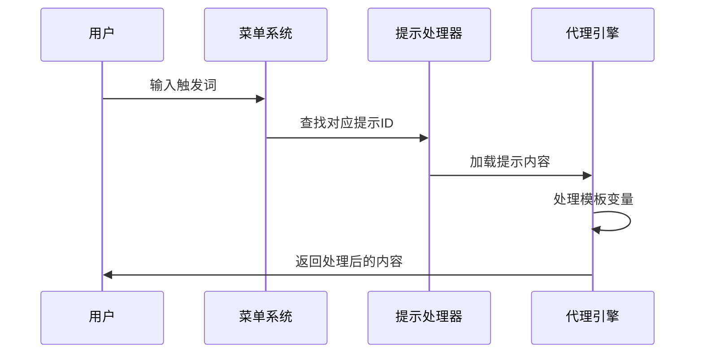
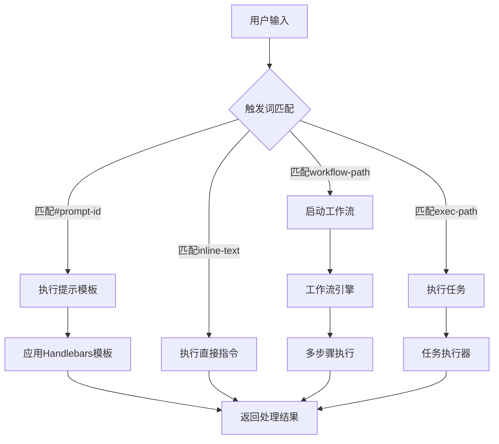
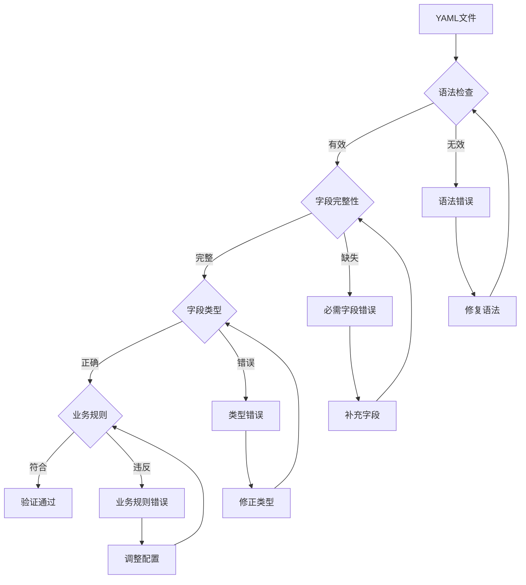

# BMAD-METHOD代理配置指南

<cite>
**本文档中引用的文件**
- [commit-poet.agent.yaml](file://custom/src/agents/commit-poet/commit-poet.agent.yaml)
- [toolsmith.agent.yaml](file://custom/src/agents/toolsmith/toolsmith.agent.yaml)
- [journal-keeper.agent.yaml](file://src/modules/bmb/reference/agents/expert-examples/journal-keeper/journal-keeper.agent.yaml)
- [security-engineer.agent.yaml](file://src/modules/bmb/reference/agents/module-examples/security-engineer.agent.yaml)
- [commit-poet-simple.agent.yaml](file://src/modules/bmb/reference/agents/simple-examples/commit-poet.agent.yaml)
- [agent-config-template.md](file://src/utility/models/agent-config-template.md)
- [simple-agent-architecture.md](file://src/modules/bmb/docs/agents/simple-agent-architecture.md)
- [module-agent-architecture.md](file://src/modules/bmb/docs/agents/module-agent-architecture.md)
- [expert-agent-architecture.md](file://src/modules/bmb/docs/agents/expert-agent-architecture.md)
- [minimal-core-agent.agent.yaml](file://test/fixtures/agent-schema/valid/top-level/minimal-core-agent.agent.yaml)
- [missing-id.agent.yaml](file://test/fixtures/agent-schema/invalid/metadata/missing-id.agent.yaml)
- [duplicate-triggers.agent.yaml](file://test/fixtures/agent-schema/invalid/menu-triggers/duplicate-triggers.agent.yaml)
- [missing-role.agent.yaml](file://test/fixtures/agent-schema/invalid/persona/missing-role.agent.yaml)
</cite>

## 目录
1. [简介](#简介)
2. [代理类型概览](#代理类型概览)
3. [核心配置结构](#核心配置结构)
4. [metadata字段详解](#metadata字段详解)
5. [persona字段详解](#persona字段详解)
6. [prompts字段详解](#prompts字段详解)
7. [menu字段详解](#menu字段详解)
8. [代理实例分析](#代理实例分析)
9. [技术约束与验证规则](#技术约束与验证规则)
10. [配置最佳实践](#配置最佳实践)
11. [故障排除指南](#故障排除指南)
12. [总结](#总结)

## 简介

BMAD-METHOD代理系统提供了三种主要的代理类型：简单代理（Simple Agents）、模块代理（Module Agents）和专家代理（Expert Agents）。每种类型都有其特定的用途和配置模式，适用于不同的应用场景和复杂度需求。

本指南将深入解析代理YAML配置文件的各个组成部分，通过实际示例展示不同复杂度代理的配置差异，并提供完整的配置最佳实践和验证规则。

## 代理类型概览



**图表来源**
- [simple-agent-architecture.md](file://src/modules/bmb/docs/agents/simple-agent-architecture.md#L1-L50)
- [module-agent-architecture.md](file://src/modules/bmb/docs/agents/module-agent-architecture.md#L1-L50)
- [expert-agent-architecture.md](file://src/modules/bmb/docs/agents/expert-agent-architecture.md#L1-L50)

## 核心配置结构

所有BMAD-METHOD代理都遵循统一的YAML配置结构：



**图表来源**
- [agent-config-template.md](file://src/utility/models/agent-config-template.md#L1-L24)

## metadata字段详解

metadata部分是代理配置的核心元数据，定义了代理的基本属性和分类信息。

### 字段规范

| 字段 | 类型 | 必需 | 描述 | 示例值 |
|------|------|------|------|--------|
| id | string | 是 | 唯一标识符，最终编译路径 | `.bmad/agents/commit-poet/commit-poet.md` |
| name | string | 是 | 代理人格名称，显示给用户 | `"Inkwell Von Comitizen"` |
| title | string | 是 | 专业角色或功能描述 | `"Commit Message Artisan"` |
| icon | string | 是 | 单个表情符号，用于视觉识别 | `"📜"` |
| type | string | 是 | 代理类型：simple/expert/module | `"simple"` |
| module | string | 否 | 模块标识符（仅模块代理需要） | `"bmm"` |

### 技术约束

1. **id的唯一性要求**
   - 必须在整个系统中保持唯一
   - 简单代理格式：`.bmad/agents/{agent-name}/{agent-name}.md`
   - 模块代理格式：`{bmad_folder}/{module}/agents/{agent-name}.md`

2. **name的可读性规范**
   - 应该朗朗上口，易于记忆
   - 避免使用过于技术化的术语
   - 可以包含昵称或幽默元素

3. **icon的选择原则**
   - 使用单个表情符号
   - 与代理功能相关
   - 在不同平台上具有一致的显示效果

**节来源**
- [commit-poet.agent.yaml](file://custom/src/agents/commit-poet/commit-poet.agent.yaml#L2-L8)
- [toolsmith.agent.yaml](file://custom/src/agents/toolsmith/toolsmith.agent.yaml#L2-L8)
- [journal-keeper.agent.yaml](file://src/modules/bmb/reference/agents/expert-examples/journal-keeper/journal-keeper.agent.yaml#L2-L7)

## persona字段详解

persona部分定义了代理的第一人称角色描述，包括角色定位、身份背景、沟通风格和行为原则。

### 字段组成



**图表来源**
- [simple-agent-architecture.md](file://src/modules/bmb/docs/agents/simple-agent-architecture.md#L113-L120)

### role字段

**职责定义规范：**
- 使用第一人称描述
- 1-2句话概括主要功能
- 避免过于宽泛的描述
- 突出独特价值主张

**示例对比：**
```yaml
# 推荐：具体明确
role: "Commit Message Artisan - transforming code changes into clear, meaningful commit history."

# 不推荐：过于宽泛  
role: "Helpful assistant for code development."
```

### identity字段

**背景描述原则：**
- 第一人称叙述
- 2-5句话描述背景
- 包含特殊专长和经验
- 展现专业知识和价值观

### communication_style字段

**风格描述要点：**
- 描述交互方式
- 包含语气特点
- 可以包含条件变化
- 体现代理个性

### principles字段

**原则制定指南：**
- 使用行动动词开头
- 每条原则独立成行
- 体现核心价值观
- 影响决策和行为

**节来源**
- [commit-poet.agent.yaml](file://custom/src/agents/commit-poet/commit-poet.agent.yaml#L9-L23)
- [toolsmith.agent.yaml](file://custom/src/agents/toolsmith/toolsmith.agent.yaml#L8-L28)
- [journal-keeper.agent.yaml](file://src/modules/bmb/reference/agents/expert-examples/journal-keeper/journal-keeper.agent.yaml#L8-L21)

## prompts字段详解

prompts部分定义了代理的可重用提示模板，支持语义XML标签和Handlebars模板语法。

### ID引用机制



**图表来源**
- [simple-agent-architecture.md](file://src/modules/bmb/docs/agents/simple-agent-architecture.md#L120-L140)

### 内容模板语法

**基本结构：**
```yaml
prompts:
  - id: prompt-id
    content: |
      <instructions>
      清晰的操作指令
      </instructions>
      
      <process>
      1. 步骤1描述
      2. 步骤2描述
      </process>
      
      自然的结束语句
```

**语义标签使用：**
- `<instructions>`：操作说明
- `<process>`：执行步骤
- `<analysis_output>`：分析结果输出
- `<improvement_process>`：改进流程

### Prompt设计原则

1. **单一目的**：每个提示应该有明确的单一目标
2. **清晰指令**：使用简洁明确的语言
3. **结构化内容**：合理使用语义标签
4. **上下文感知**：考虑用户提供的输入

**节来源**
- [commit-poet.agent.yaml](file://custom/src/agents/commit-poet/commit-poet.agent.yaml#L24-L130)
- [journal-keeper.agent.yaml](file://src/modules/bmb/reference/agents/expert-examples/journal-keeper/journal-keeper.agent.yaml#L29-L153)

## menu字段详解

menu部分定义了代理的命令菜单，包括触发词、动作和描述信息。

### Command与Trigger的联动关系



**图表来源**
- [module-agent-architecture.md](file://src/modules/bmb/docs/agents/module-agent-architecture.md#L98-L155)

### 触发词设计规范

**kebab-case命名约定：**
- 使用小写字母
- 单词间用连字符连接
- 避免特殊字符
- 保持简短易记

**触发词分类：**
```yaml
# 工作流类
- trigger: create-prd
  workflow: "{project-root}/{bmad_folder}/bmm/workflows/prd/workflow.yaml"

# 任务类  
- trigger: validate
  exec: "{project-root}/{bmad_folder}/core/tasks/validate-workflow.xml"

# 模板类
- trigger: create-brief
  exec: "{project-root}/{bmad_folder}/core/tasks/create-doc.xml"
  tmpl: "{project-root}/{bmad_folder}/bmm/templates/brief.md"

# 直接指令类
- trigger: help
  action: "显示帮助信息"
```

### 动作类型详解

1. **Prompt引用（#id）**
   - 引用预定义的提示模板
   - 支持Handlebars变量替换
   - 适合复杂的交互流程

2. **内联指令**
   - 直接的文本指令
   - 适合简单的操作
   - 不支持模板变量

3. **工作流调用**
   - 启动多步骤工作流程
   - 支持跨模块调用
   - 提供进度跟踪

4. **任务执行**
   - 执行单步操作
   - 可附加模板或数据
   - 适合工具类功能

**节来源**
- [commit-poet.agent.yaml](file://custom/src/agents/commit-poet/commit-poet.agent.yaml#L102-L130)
- [toolsmith.agent.yaml](file://custom/src/agents/toolsmith/toolsmith.agent.yaml#L39-L109)
- [security-engineer.agent.yaml](file://src/modules/bmb/reference/agents/module-examples/security-engineer.agent.yaml#L32-L54)

## 代理实例分析

通过三个实际示例，展示不同复杂度代理的配置差异。

### commit-poet（简单代理）

commit-poet是一个专注于提交消息生成的简单代理，体现了简单代理的特点：

**核心特征：**
- 单一功能定位：提交消息创作
- 用户定制化：支持多种写作风格
- 快速响应：即时生成commit消息
- 易于使用：直观的触发词设计

**配置亮点：**
- 多样化的prompt模板
- 清晰的触发词分类
- 支持多种commit格式
- 丰富的交互选项

**节来源**
- [commit-poet.agent.yaml](file://custom/src/agents/commit-poet/commit-poet.agent.yaml#L1-L130)
- [commit-poet-simple.agent.yaml](file://src/modules/bmb/reference/agents/simple-examples/commit-poet.agent.yaml#L1-L127)

### security-engineer（模块代理）

security-engineer展示了模块代理的专业性和集成能力：

**核心特征：**
- 专业领域：应用安全和威胁建模
- 工作流集成：与BMM生态系统深度集成
- 团队协作：支持多方安全讨论
- 标准合规：符合OWASP等安全标准

**配置亮点：**
- 模块特定路径引用
- 工作流orchestration
- 跨模块协作能力
- 标准化安全流程

**节来源**
- [security-engineer.agent.yaml](file://src/modules/bmb/reference/agents/module-examples/security-engineer.agent.yaml#L1-L54)

### journal-keeper（专家代理）

journal-keeper代表了专家代理的完整功能集：

**核心特征：**
- 持久记忆：长期存储用户信息
- 领域专精：心理学和自我反思
- 私密空间：受限的文件系统访问
- 智能分析：模式识别和趋势分析

**配置亮点：**
- 完整的sidecar文件结构
- critical_actions强制加载
- domain限制确保隐私
- 深度个性化支持

**节来源**
- [journal-keeper.agent.yaml](file://src/modules/bmb/reference/agents/expert-examples/journal-keeper/journal-keeper.agent.yaml#L1-L153)

## 技术约束与验证规则

### YAML语法验证



**图表来源**
- [minimal-core-agent.agent.yaml](file://test/fixtures/agent-schema/valid/top-level/minimal-core-agent.agent.yaml#L1-L24)
- [missing-id.agent.yaml](file://test/fixtures/agent-schema/invalid/metadata/missing-id.agent.yaml#L1-L24)

### 字段验证清单

**必需字段验证：**
- [ ] `agent.metadata.id` - 唯一标识符
- [ ] `agent.metadata.name` - 显示名称
- [ ] `agent.metadata.title` - 职位头衔
- [ ] `agent.metadata.icon` - 图标
- [ ] `agent.metadata.type` - 代理类型

**Persona验证：**
- [ ] `agent.persona.role` - 角色描述
- [ ] `agent.persona.identity` - 身份背景
- [ ] `agent.persona.communication_style` - 沟通风格
- [ ] `agent.persona.principles` - 行为原则（数组）

**Menu验证：**
- [ ] `agent.menu` - 菜单项数组
- [ ] 每个菜单项有`trigger`、`action`、`description`
- [ ] `trigger`不以`*`开头（自动添加）
- [ ] `trigger`在同个代理中唯一

**Prompts验证：**
- [ ] `agent.prompts` - 提示模板数组
- [ ] 每个提示有唯一`id`
- [ ] `id`格式正确
- [ ] `content`不为空

### 常见错误类型

1. **重复触发词**
   ```yaml
   # 错误：重复触发词
   menu:
     - trigger: help
       action: help_text
     - trigger: help  # 重复！
       action: another_help
   ```

2. **缺少必需字段**
   ```yaml
   # 错误：缺少id
   metadata:
     name: Test Agent
     title: Test
     icon: ❌
   ```

3. **类型错误**
   ```yaml
   # 错误：role应该是字符串
   persona:
     role: 
       - array_element  # 应该是字符串
   ```

**节来源**
- [duplicate-triggers.agent.yaml](file://test/fixtures/agent-schema/invalid/menu-triggers/duplicate-triggers.agent.yaml#L1-L31)
- [missing-role.agent.yaml](file://test/fixtures/agent-schema/invalid/persona/missing-role.agent.yaml#L1-L24)

## 配置最佳实践

### 命名规范

**文件命名：**
- 简单代理：`{agent-name}.agent.yaml`
- 专家代理：`{agent-name}/`目录结构
- 模块代理：`src/modules/{module}/agents/`

**ID命名：**
- 简单代理：`.bmad/agents/{name}/{name}.md`
- 模块代理：`{bmad_folder}/{module}/agents/{name}.md`

**触发词设计：**
- 使用kebab-case格式
- 保持简短易记
- 语义明确
- 避免歧义

### 提示工程技巧

**结构化提示设计：**
```yaml
content: |
  <instructions>
  清晰的操作说明，告诉AI要做什么
  </instructions>
  
  <process>
  1. 步骤1：具体描述
  2. 步骤2：详细说明
  3. 步骤3：预期结果
  </process>
  
  <analysis_output>
  - **关键发现**：重要结论
  - **建议措施**：具体建议
  - **后续步骤**：下一步计划
  </analysis_output>
```

**Handlebars模板使用：**
```yaml
# 条件样式
communication_style: |
  {{#if enthusiasm == "high"}}
  充满热情和能量的方式！
  {{/if}}
  {{#if enthusiasm == "moderate"}}
  平衡和专业的态度
  {{/if}}

# 用户个性化
identity: |
  我知道你叫{{user_name}}，很高兴为你服务。
```

### 性能优化建议

1. **Prompt优化**
   - 保持提示简洁明了
   - 避免过度复杂的模板
   - 合理使用语义标签

2. **菜单设计**
   - 按功能逻辑分组
   - 提供清晰的描述
   - 避免过多的菜单项

3. **资源管理**
   - 合理使用critical_actions
   - 控制sidecar文件大小
   - 优化文件访问模式

### 测试策略

**单元测试：**
- 验证YAML语法正确性
- 检查字段完整性
- 测试模板渲染

**集成测试：**
- 验证菜单功能
- 测试工作流调用
- 检查跨模块协作

**用户验收测试：**
- 功能可用性测试
- 用户体验评估
- 边界情况处理

## 故障排除指南

### 常见问题诊断

**安装失败：**
1. 检查YAML语法错误
2. 验证必需字段完整性
3. 确认文件路径正确性

**运行时错误：**
1. 检查提示ID引用
2. 验证菜单触发词
3. 确认工作流路径

**性能问题：**
1. 优化提示模板
2. 减少不必要的文件加载
3. 简化复杂逻辑

### 调试技巧

**日志分析：**
- 启用详细日志记录
- 分析错误堆栈信息
- 检查环境变量设置

**配置验证：**
- 使用内置验证工具
- 对比参考配置
- 逐步排除法

**环境检查：**
- 确认BMAD版本兼容性
- 检查依赖模块安装
- 验证权限设置

## 总结

BMAD-METHOD代理配置系统提供了灵活而强大的框架，支持从简单的工具助手到复杂的专家系统的各种应用场景。通过理解不同代理类型的特性和配置要求，开发者可以创建高质量、用户友好的AI代理。

**关键要点：**

1. **选择合适的代理类型**：根据功能需求选择简单、模块或专家代理
2. **遵循命名规范**：使用一致的命名约定和文件结构
3. **设计清晰的交互**：创建直观的菜单和有效的提示模板
4. **遵守技术约束**：确保YAML语法正确和字段完整性
5. **持续优化改进**：基于用户反馈不断迭代优化

通过遵循本指南的最佳实践和验证规则，开发者可以构建出既功能强大又易于使用的BMAD-METHOD代理系统。