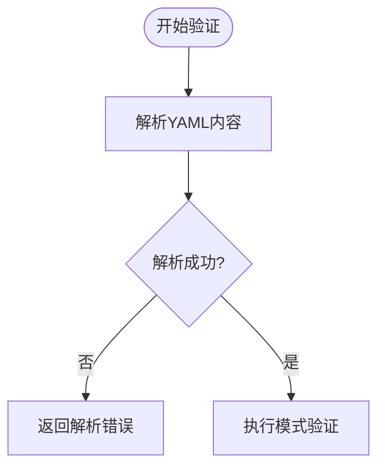
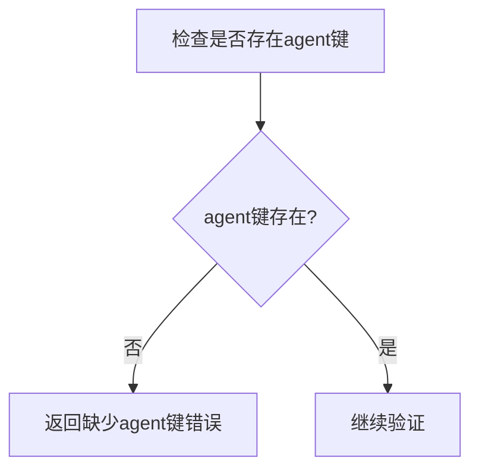
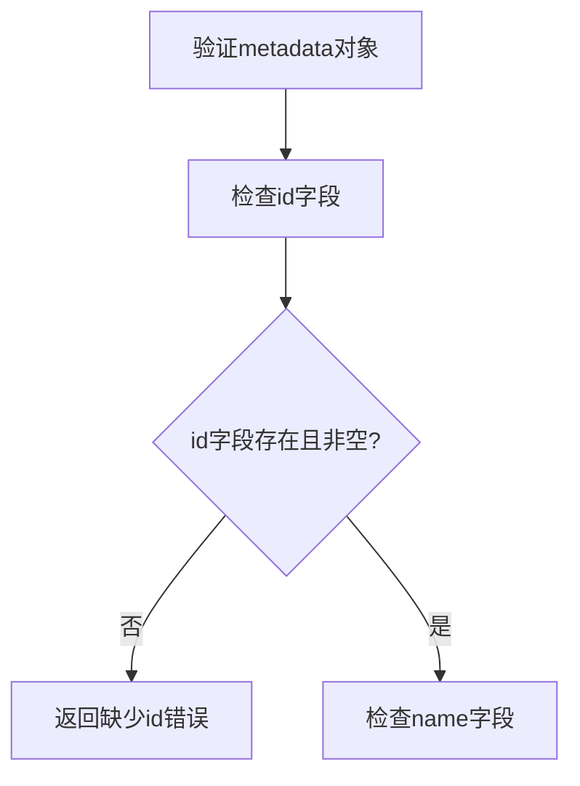
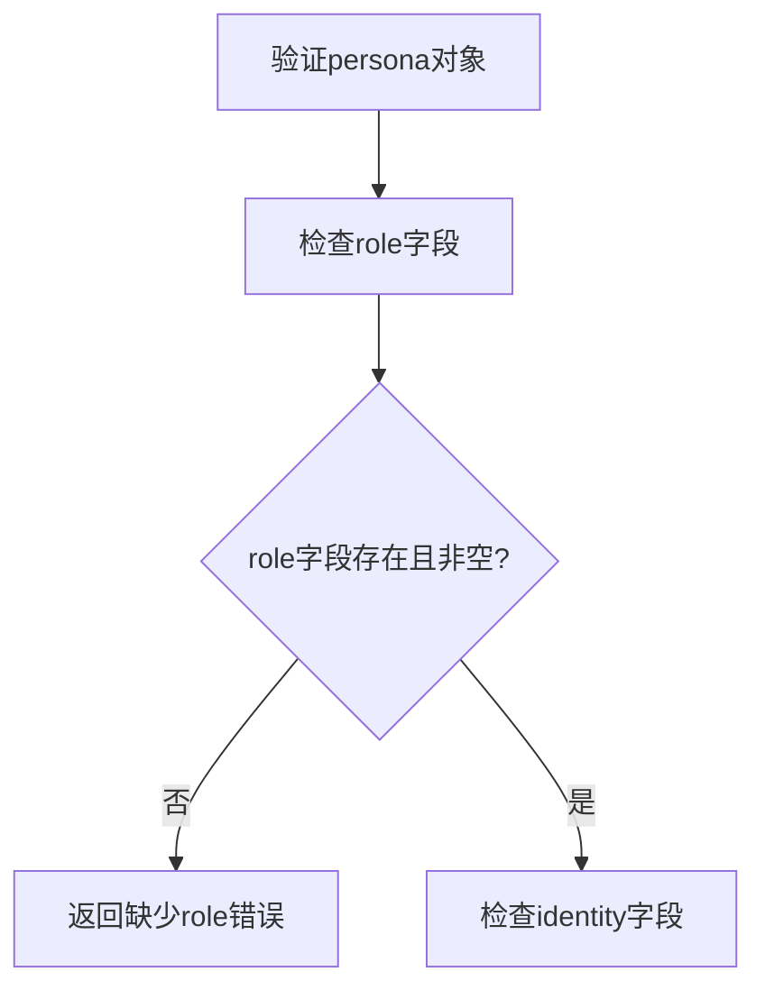
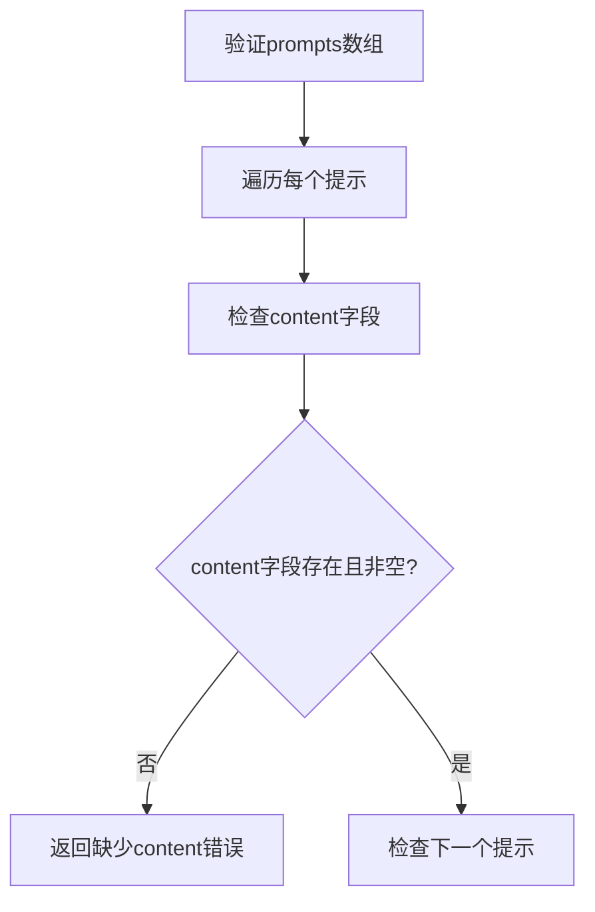
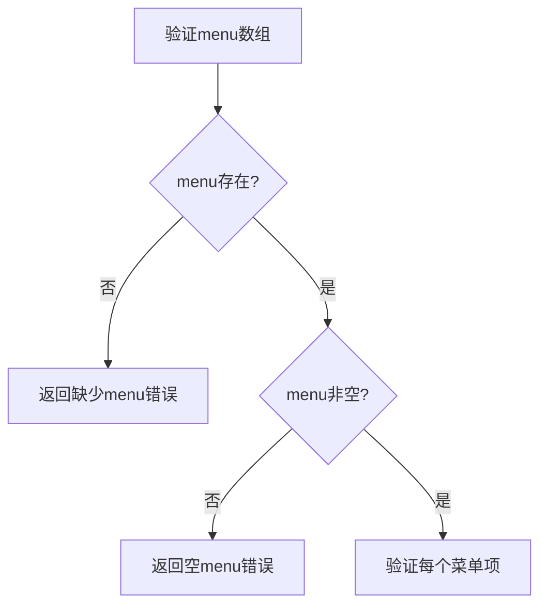
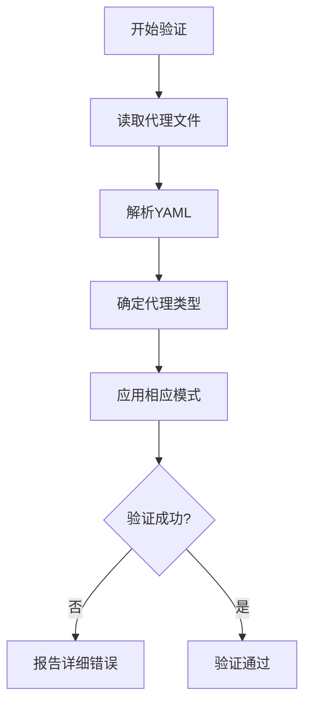

# 代理验证与调试

<cite>
**本文档引用的文件**  
- [validate-agent-schema.js](file://tools/validate-agent-schema.js)
- [agent.js](file://tools/schema/agent.js)
- [test-agent-schema.js](file://test/test-agent-schema.js)
- [test-cli-integration.sh](file://test/test-cli-integration.sh)
- [package.json](file://package.json)
- [malformed-yaml.agent.yaml](file://test/fixtures/agent-schema/invalid/yaml-errors/malformed-yaml.agent.yaml)
- [missing-agent-key.agent.yaml](file://test/fixtures/agent-schema/invalid/top-level/missing-agent-key.agent.yaml)
- [missing-id.agent.yaml](file://test/fixtures/agent-schema/invalid/metadata/missing-id.agent.yaml)
- [missing-role.agent.yaml](file://test/fixtures/agent-schema/invalid/persona/missing-role.agent.yaml)
- [missing-content.agent.yaml](file://test/fixtures/agent-schema/invalid/prompts/missing-content.agent.yaml)
- [empty-menu.agent.yaml](file://test/fixtures/agent-schema/invalid/menu/empty-menu.agent.yaml)
- [minimal-core-agent.agent.yaml](file://test/fixtures/agent-schema/valid/top-level/minimal-core-agent.agent.yaml)
- [module-agent-correct.agent.yaml](file://test/fixtures/agent-schema/valid/metadata/module-agent-correct.agent.yaml)
- [valid-prompts-minimal.agent.yaml](file://test/fixtures/agent-schema/valid/prompts/valid-prompts-minimal.agent.yaml)
</cite>

## 目录
1. [引言](#引言)
2. [代理验证机制](#代理验证机制)
3. [错误模式分析](#错误模式分析)
4. [验证逻辑与错误报告](#验证逻辑与错误报告)
5. [调试策略](#调试策略)
6. [关键注意事项](#关键注意事项)
7. [结论](#结论)

## 引言
BMAD-METHOD框架通过严格的代理验证机制确保代理配置的可靠性和兼容性。本指南深入分析了`validate-agent-schema.js`的验证逻辑，系统性地列举了各类错误模式，并提供了详细的调试策略。通过理解这些验证规则，开发者可以创建符合规范的代理配置，避免常见错误。

## 代理验证机制
BMAD-METHOD使用Zod库对代理YAML文件进行结构化验证。验证过程基于文件路径推断代理类型（核心代理或模块代理），并应用相应的验证规则。验证器通过`validateAgentFile`函数暴露，该函数接收文件路径和解析后的YAML数据作为输入，并返回验证结果。

**Section sources**
- [agent.js](file://tools/schema/agent.js#L18-L21)
- [validate-agent-schema.js](file://tools/validate-agent-schema.js#L57-L58)

## 错误模式分析
### 语法层错误
语法层错误发生在YAML解析阶段，通常由于格式不正确导致。例如，`malformed-yaml.agent.yaml`测试用例包含不正确的YAML语法，导致解析失败。

**Diagram sources**
- [malformed-yaml.agent.yaml](file://test/fixtures/agent-schema/invalid/yaml-errors/malformed-yaml.agent.yaml)

**Section sources**
- [test-agent-schema.js](file://test/test-agent-schema.js#L186-L197)

### 结构层错误
结构层错误涉及代理配置的基本结构问题。最常见的错误是缺少顶层`agent`键，如`missing-agent-key.agent.yaml`所示。该文件缺少`agent`根对象，导致验证失败。

**Diagram sources**
- [missing-agent-key.agent.yaml](file://test/fixtures/agent-schema/invalid/top-level/missing-agent-key.agent.yaml)

**Section sources**
- [missing-agent-key.agent.yaml](file://test/fixtures/agent-schema/invalid/top-level/missing-agent-key.agent.yaml)

### 元数据层错误
元数据层错误涉及`metadata`对象中的必填字段缺失。`missing-id.agent.yaml`测试用例展示了缺少`id`字段的情况，这是所有代理都必须提供的关键标识符。

**Diagram sources**
- [missing-id.agent.yaml](file://test/fixtures/agent-schema/invalid/metadata/missing-id.agent.yaml)

**Section sources**
- [agent.js](file://tools/schema/agent.js#L144-L148)

### 角色层错误
角色层错误涉及`persona`对象中的必填字段缺失。`missing-role.agent.yaml`测试用例展示了缺少`role`字段的情况，该字段定义了代理的核心角色。

**Diagram sources**
- [missing-role.agent.yaml](file://test/fixtures/agent-schema/invalid/persona/missing-role.agent.yaml)

**Section sources**
- [agent.js](file://tools/schema/agent.js#L185-L187)

### 提示层错误
提示层错误涉及`prompts`数组中的条目缺少必填字段。`missing-content.agent.yaml`测试用例展示了提示缺少`content`字段的情况，这是提示内容的核心部分。

**Diagram sources**
- [missing-content.agent.yaml](file://test/fixtures/agent-schema/invalid/prompts/missing-content.agent.yaml)

**Section sources**
- [agent.js](file://tools/schema/agent.js#L202-L204)

### 菜单层错误
菜单层错误涉及`menu`数组的完整性问题。`empty-menu.agent.yaml`测试用例展示了空菜单数组的情况，而验证规则要求至少包含一个菜单项。

**Diagram sources**
- [empty-menu.agent.yaml](file://test/fixtures/agent-schema/invalid/menu/empty-menu.agent.yaml)

**Section sources**
- [agent.js](file://tools/schema/agent.js#L129-L130)

## 验证逻辑与错误报告
`validate-agent-schema.js`的验证逻辑分为多个阶段：首先解析YAML内容，然后根据文件路径确定代理类型，最后应用相应的Zod模式进行验证。错误报告机制提供了详细的错误信息，包括错误代码、路径和消息，帮助开发者快速定位问题。

**Diagram sources**
- [validate-agent-schema.js](file://tools/validate-agent-schema.js#L50-L57)
- [agent.js](file://tools/schema/agent.js#L18-L21)

**Section sources**
- [validate-agent-schema.js](file://tools/validate-agent-schema.js#L47-L78)

## 调试策略
### 使用CLI工具进行本地验证
可以通过`npm run validate:schemas`命令运行验证器，该命令会扫描所有代理文件并报告验证结果。对于自定义项目根目录，可以传递路径参数：`node tools/validate-agent-schema.js /path/to/project`。

### 解读错误信息
验证器输出的错误信息包含三个关键部分：
- **Path**: 错误发生的具体路径（如`agent.menu[0].trigger`）
- **Error**: 错误的详细描述
- **Code**: 错误代码，用于分类错误类型

### 定位问题根源
当遇到验证失败时，应按照以下步骤定位问题：
1. 检查YAML语法是否正确
2. 确认顶层结构是否包含`agent`键
3. 验证所有必填字段是否存在且非空
4. 检查特殊规则（如触发词格式）

**Section sources**
- [test-cli-integration.sh](file://test/test-cli-integration.sh#L123-L129)
- [package.json](file://package.json#L48)

## 关键注意事项
- **使用kebab-case触发词**: 所有菜单触发词必须使用kebab-case格式（小写字母，连字符分隔）
- **避免额外字段**: 代理配置中不应包含模式未定义的额外字段
- **确保必填项完整**: 包括`id`、`name`、`title`、`icon`、`role`等所有必填字段
- **正确设置模块字段**: 模块代理必须包含正确的`module`字段，而核心代理不应包含该字段

**Section sources**
- [agent.js](file://tools/schema/agent.js#L6)
- [agent.js](file://tools/schema/agent.js#L148)
- [agent.js](file://tools/schema/agent.js#L164-L176)

## 结论
通过理解BMAD-METHOD的代理验证机制和常见错误模式，开发者可以创建更可靠、兼容性更好的代理配置。遵循本文档中的调试策略和关键注意事项，可以显著提高开发效率，减少配置错误。