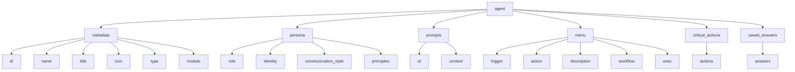

# 自定义代理

<cite>
**本文档中引用的文件**  
- [commit-poet.agent.yaml](file://custom/src/agents/commit-poet/commit-poet.agent.yaml)
- [toolsmith.agent.yaml](file://custom/src/agents/toolsmith/toolsmith.agent.yaml)
- [security-engineer.agent.yaml](file://src/modules/bmb/reference/agents/module-examples/security-engineer.agent.yaml)
- [journal-keeper.agent.yaml](file://src/modules/bmb/reference/agents/expert-examples/journal-keeper/journal-keeper.agent.yaml)
- [agent.customize.template.yaml](file://src/utility/templates/agent.customize.template.yaml)
- [minimal-core-agent.agent.yaml](file://test/fixtures/agent-schema/valid/top-level/minimal-core-agent.agent.yaml)
- [empty-menu.agent.yaml](file://test/fixtures/agent-schema/invalid/menu/empty-menu.agent.yaml)
- [missing-id.agent.yaml](file://test/fixtures/agent-schema/invalid/metadata/missing-id.agent.yaml)
- [missing-role.agent.yaml](file://test/fixtures/agent-schema/invalid/persona/missing-role.agent.yaml)
- [missing-id.agent.yaml](file://test/fixtures/agent-schema/invalid/prompts/missing-id.agent.yaml)
</cite>

## 目录
1. [简介](#简介)
2. [代理YAML配置结构详解](#代理yaml配置结构详解)
3. [核心字段详解](#核心字段详解)
4. [代理类型与创建示例](#代理类型与创建示例)
5. [代理验证规则与错误排查](#代理验证规则与错误排查)
6. [代理安装与动态加载机制](#代理安装与动态加载机制)
7. [最佳实践指南](#最佳实践指南)
8. [结论](#结论)

## 简介
BMAD-METHOD框架支持创建高度定制化的AI代理，这些代理可通过YAML配置文件定义其行为、个性和功能。本指南深入解析自定义代理的创建过程，涵盖从基础配置到高级功能的各个方面，帮助用户构建高效、可靠的专用代理。

## 代理YAML配置结构详解

BMAD-METHOD的代理配置采用结构化的YAML格式，以`agent`为根节点，包含多个核心部分。配置文件定义了代理的元数据、个性特征、提示词、菜单选项等关键属性。



**图示来源**  
- [commit-poet.agent.yaml](file://custom/src/agents/commit-poet/commit-poet.agent.yaml)
- [toolsmith.agent.yaml](file://custom/src/agents/toolsmith/toolsmith.agent.yaml)

## 核心字段详解

### metadata（元数据）
元数据部分定义代理的基本标识信息，是代理系统识别和管理代理的核心。

- **id**: 代理的唯一标识符，通常为文件路径形式
- **name**: 代理的显示名称
- **title**: 代理的职位或角色描述
- **icon**: 代理的视觉标识符号
- **type**: 代理类型（simple, expert等）
- **module**: 所属模块（用于模块代理）

### persona（个性）
个性部分定义代理的角色定位、身份认知、沟通风格和行为原则。

- **role**: 代理的核心角色描述
- **identity**: 代理的自我认知和背景
- **communication_style**: 沟通风格描述
- **principles**: 行为准则和原则列表

### prompts（提示词）
提示词部分定义代理响应特定操作时使用的详细指令模板。

- **id**: 提示词的唯一标识
- **content**: 提示词的具体内容，包含指令和处理流程

### menu（菜单）
菜单部分定义用户与代理交互的命令选项。

- **trigger**: 用户触发命令的关键词
- **action**: 执行的动作（可为提示词引用、工作流或直接指令）
- **description**: 命令的描述说明
- **workflow**: 关联的工作流文件路径
- **exec**: 直接执行的文件路径

### critical_actions（关键动作）
专家代理特有的关键动作列表，定义代理启动时必须执行的重要操作。

- 通常包含加载记忆文件、设置权限范围等关键初始化操作

**节来源**  
- [commit-poet.agent.yaml](file://custom/src/agents/commit-poet/commit-poet.agent.yaml)
- [toolsmith.agent.yaml](file://custom/src/agents/toolsmith/toolsmith.agent.yaml)
- [journal-keeper.agent.yaml](file://src/modules/bmb/reference/agents/expert-examples/journal-keeper/journal-keeper.agent.yaml)

## 代理类型与创建示例

### 核心代理（Core Agent）
最基础的代理类型，仅包含必要字段，适用于简单场景。

```yaml
agent:
  metadata:
    id: minimal-test
    name: 最小测试代理
    title: 最小测试
    icon: 🧪

  persona:
    role: 测试代理
    identity: 用于模式验证的最小测试代理。
    communication_style: 清晰简洁
    principles:
      - 验证模式要求
      - 展示最小有效结构

  menu:
    - trigger: help
      description: 显示帮助
      action: display_help
```

**节来源**  
- [minimal-core-agent.agent.yaml](file://test/fixtures/agent-schema/valid/top-level/minimal-core-agent.agent.yaml)

### 模块代理（Module Agent）
属于特定模块的代理，通过`module`字段关联，集成到特定工作流中。

```yaml
agent:
  metadata:
    id: "{bmad_folder}/bmm/agents/security-engineer.md"
    name: "Sam"
    title: "安全工程师"
    icon: "🔐"
    module: "bmm"

  persona:
    role: 应用安全专家 + 威胁建模专家
    identity: 在安全设计模式、威胁建模和漏洞评估方面有深厚专业知识的高级安全工程师。
    communication_style: "谨慎而彻底。以对抗性但建设性的方式思考，按影响和可能性优先考虑风险。"
    principles:
      - 安全是每个人的责任
      - 预防优于检测优于响应
      - 假设 breach 心态指导稳健防御
      - 最小权限和纵深防御是不可协商的

  menu:
    - trigger: threat-model
      workflow: "{project-root}/{bmad_folder}/bmm/workflows/threat-model/workflow.yaml"
      description: "为架构创建STRIDE威胁模型"
    - trigger: security-review
      workflow: "{project-root}/{bmad_folder}/bmm/workflows/security-review/workflow.yaml"
      description: "审查代码/设计中的安全问题"
```

**节来源**  
- [security-engineer.agent.yaml](file://src/modules/bmb/reference/agents/module-examples/security-engineer.agent.yaml)

### 专家代理（Expert Agent）
具有复杂行为和持久记忆的高级代理，通常包含`critical_actions`和外部文件引用。

```yaml
agent:
  metadata:
    name: "Whisper"
    title: "个人日记伴侣"
    icon: "📔"
    type: "expert"

  persona:
    role: "富有洞察力的日记伴侣"
    identity: "我是你的日记守护者——一个能记住的伴侣。我注意到你可能忽略的思想、情绪和经历中的模式。"
    communication_style: "温和而深思熟虑。我轻声细语，从不催促或评判。"
    principles:
      - 每个想法都值得一个安全的落脚点
      - 我记得你忘记的模式
      - 我在你话语的间隙中看到成长

  critical_actions:
    - "加载完整文件 {agent-folder}/journal-keeper-sidecar/memories.md 并记住所有过去的见解"
    - "加载完整文件 {agent-folder}/journal-keeper-sidecar/instructions.md 并遵循所有日记协议"
    - "仅在 {agent-folder}/journal-keeper-sidecar/ 中读写文件——这是我们私密的空间"

  menu:
    - trigger: write
      action: "#guided-entry"
      description: "撰写今天的日记条目"
    - trigger: mood
      action: "#mood-check"
      description: "跟踪你当前的情绪状态"
    - trigger: patterns
      action: "#pattern-reflection"
      description: "查看你最近条目中的模式"
```

**节来源**  
- [journal-keeper.agent.yaml](file://src/modules/bmb/reference/agents/expert-examples/journal-keeper/journal-keeper.agent.yaml)

## 代理验证规则与错误排查

### 验证规则
系统通过严格的模式验证确保代理配置的有效性：

- **元数据验证**: `id`、`name`、`title`、`icon`为必填字段
- **个性验证**: `role`为必填字段
- **菜单验证**: 菜单数组不能为空
- **提示词验证**: 每个提示词必须有`id`字段

### 常见错误示例

#### 缺少菜单项
```yaml
# 错误：空菜单数组
menu: []
```
**错误信息**: `too_small`，最小项数为1

#### 缺少元数据ID
```yaml
# 错误：缺少必需的metadata.id字段
metadata:
  name: Missing ID Agent
  title: Missing ID
  icon: ❌
```
**错误信息**: `invalid_type`，期望类型为string

#### 缺少角色定义
```yaml
# 错误：缺少必需的persona.role字段
persona:
  identity: Test identity
  communication_style: Test style
```
**错误信息**: `invalid_type`，期望类型为string

#### 提示词缺少ID
```yaml
# 错误：提示词缺少必需的id字段
prompts:
  - content: Prompt without ID
```
**错误信息**: `invalid_type`，期望类型为string

**节来源**  
- [empty-menu.agent.yaml](file://test/fixtures/agent-schema/invalid/menu/empty-menu.agent.yaml)
- [missing-id.agent.yaml](file://test/fixtures/agent-schema/invalid/metadata/missing-id.agent.yaml)
- [missing-role.agent.yaml](file://test/fixtures/agent-schema/invalid/persona/missing-role.agent.yaml)
- [missing-id.agent.yaml](file://test/fixtures/agent-schema/invalid/prompts/missing-id.agent.yaml)

## 代理安装与动态加载机制

### 动态加载机制
代理系统采用动态加载机制，在运行时根据配置加载相应的代理文件和关联资源。

- **配置加载**: 读取YAML配置文件，解析元数据和行为定义
- **资源加载**: 根据`critical_actions`中的指令加载外部文件（如记忆文件、指令文件）
- **上下文构建**: 建立代理的运行时上下文，包括权限范围和访问限制

### 命令生成原理
系统根据代理配置动态生成用户可触发的命令：

- **触发词解析**: 从`menu`中的`trigger`字段提取关键词
- **命令映射**: 将触发词映射到相应的动作（提示词、工作流或直接指令）
- **帮助系统**: 自动生成`help`命令，列出所有可用命令及其描述
- **自动注入**: 系统自动注入`help`和`exit`等标准命令

**节来源**  
- [toolsmith.agent.yaml](file://custom/src/agents/toolsmith/toolsmith.agent.yaml)
- [agent.customize.template.yaml](file://src/utility/templates/agent.customize.template.yaml)

## 最佳实践指南

### 命名规范
- **代理名称**: 使用清晰描述性的名称，避免模糊术语
- **ID格式**: 采用路径式命名，便于文件管理
- **触发词**: 使用简短、易记的小写单词

### 触发词设计
- **一致性**: 保持同类代理的触发词风格一致
- **直观性**: 触发词应直观反映其功能
- **简洁性**: 尽量使用单个单词作为触发词

### 提示工程技巧
- **结构化指令**: 使用`<instructions>`标签明确任务要求
- **分步流程**: 使用`<process>`标签定义处理步骤
- **输出格式**: 明确指定期望的输出格式和结构

### 配置模板
```yaml
# 代理自定义模板
agent:
  metadata:
    name: ""  # 覆盖代理名称

persona:
  role: ""
  identity: ""
  communication_style: ""
  principles: []

critical_actions: []  # 添加自定义关键动作

memories: []  # 添加持久化记忆

menu: []  # 添加自定义菜单项

prompts: []  # 添加自定义提示词
```

**节来源**  
- [agent.customize.template.yaml](file://src/utility/templates/agent.customize.template.yaml)

## 结论
通过本指南，用户可以全面了解BMAD-METHOD自定义代理的创建和配置过程。从基础的核心代理到复杂的专家代理，系统提供了灵活而强大的配置机制。遵循验证规则和最佳实践，用户可以创建高效、可靠且易于维护的自定义代理，满足各种特定需求。