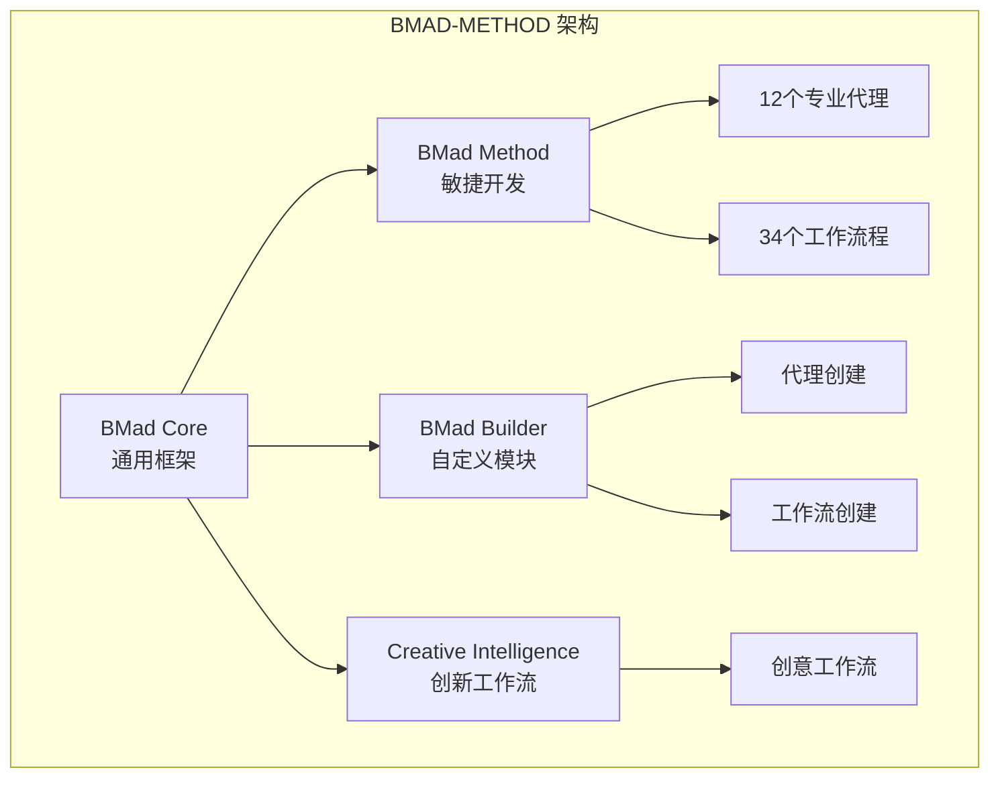
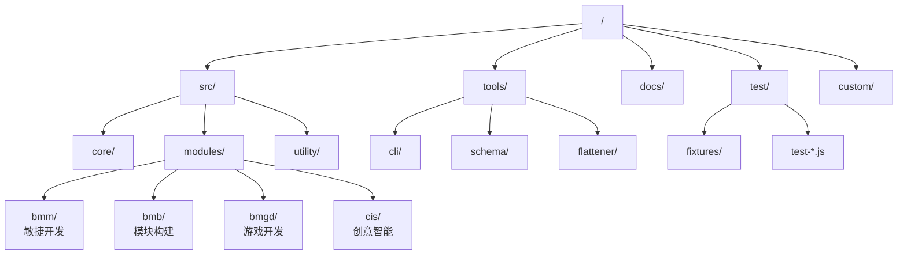
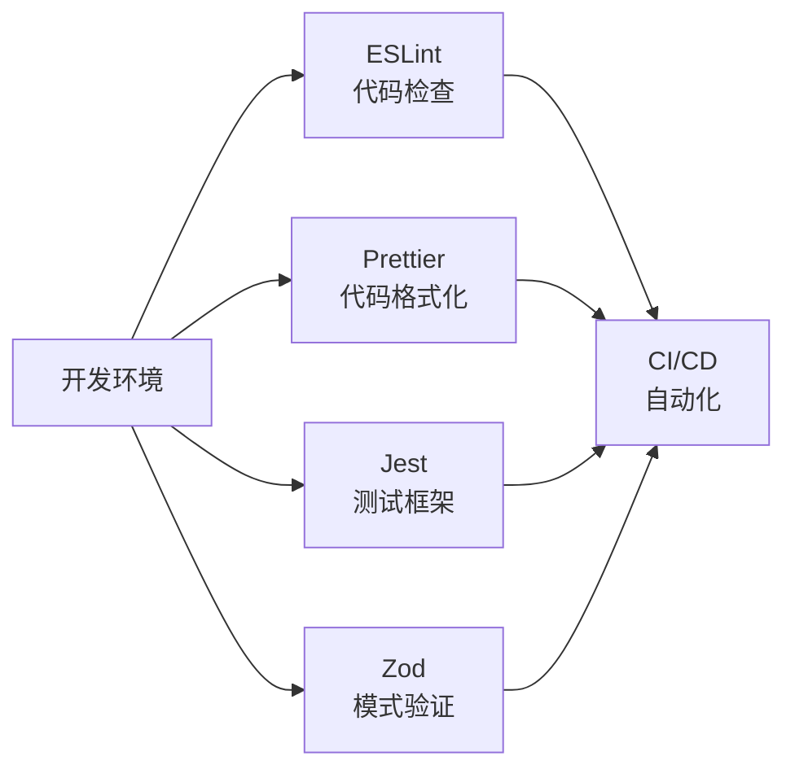
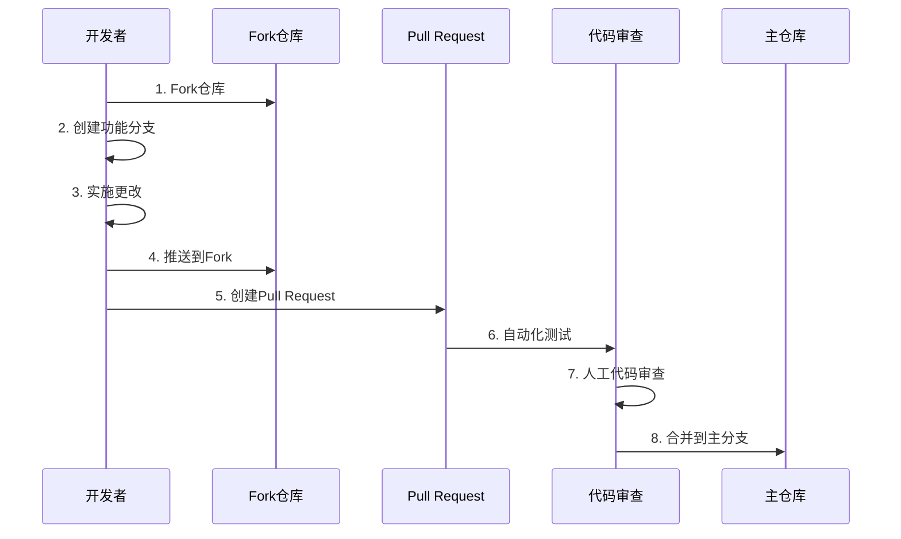
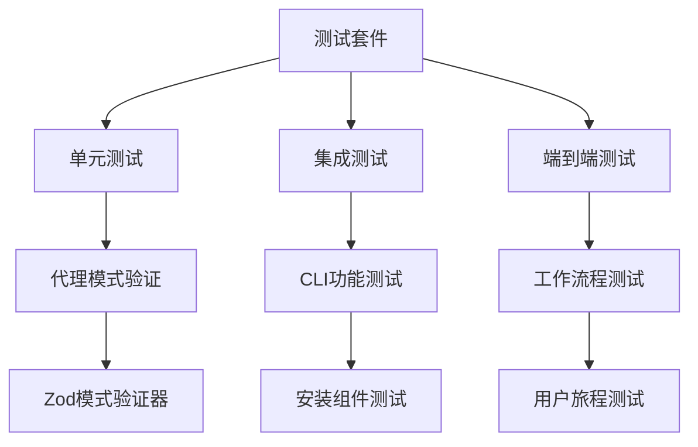
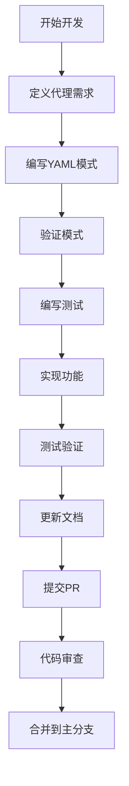

# BMAD-METHOD 贡献指南

<cite>
**本文档中引用的文件**
- [CONTRIBUTING.md](file://CONTRIBUTING.md)
- [README.md](file://README.md)
- [package.json](file://package.json)
- [tools/cli/README.md](file://tools/cli/README.md)
- [test/README.md](file://test/README.md)
- [eslint.config.mjs](file://eslint.config.mjs)
- [prettier.config.mjs](file://prettier.config.mjs)
- [AGENTS.md](file://AGENTS.md)
- [src/modules/bmb/docs/agents/module-agent-architecture.md](file://src/modules/bmb/docs/agents/module-agent-architecture.md)
- [src/modules/bmm/testarch/knowledge/test-levels-framework.md](file://src/modules/bmm/testarch/knowledge/test-levels-framework.md)
- [src/modules/bmm/workflows/README.md](file://src/modules/bmm/workflows/README.md)
- [src/modules/bmb/workflows/create-agent/README.md](file://src/modules/bmb/workflows/create-agent/README.md)
</cite>

## 目录
1. [项目简介](#项目简介)
2. [项目架构概览](#项目架构概览)
3. [开发环境设置](#开发环境设置)
4. [代码库结构详解](#代码库结构详解)
5. [技术栈与工具链](#技术栈与工具链)
6. [编码规范与标准](#编码规范与标准)
7. [贡献流程指南](#贡献流程指南)
8. [测试要求与实践](#测试要求与实践)
9. [工作流程与最佳实践](#工作流程与最佳实践)
10. [故障排除指南](#故障排除指南)
11. [社区支持与资源](#社区支持与资源)

## 项目简介

BMAD-METHOD（Build More, Architect Dreams）是一个革命性的AI驱动敏捷开发框架，通过19个专业化AI代理和50多个引导式工作流程，适应从简单错误修复到企业级平台的各种项目复杂度。该项目的核心理念是**人类增强而非替代**，通过指导性协作实现人机协同的最佳效果。

### 核心原则

- **伙伴关系优于自动化** - AI代理作为专家教练、导师和合作者，增强人类能力而非取代
- **双向指导** - 代理通过结构化工作流程指导用户，同时用户通过高级提示推动代理
- **系统化工作流程** - BMad Core构建完整的指导性工作流程系统
- **工具无关基础** - BMad Core保持工具无关性，提供稳定可扩展的基础架构

**章节来源**
- [CONTRIBUTING.md](file://CONTRIBUTING.md#L10-L35)
- [README.md](file://README.md#L17-L28)

## 项目架构概览

BMAD-METHOD采用模块化架构设计，核心包含三个主要模块：



**图表来源**
- [AGENTS.md](file://AGENTS.md#L85-L120)

### 模块化设计理念

每个模块都是自包含的，包含：
- **代理（Agents）** - 专业化AI角色
- **工作流程（Workflows）** - 引导式任务执行
- **团队（Teams）** - 预配置的代理组合
- **数据（Data）** - 模块特定的数据文件

**章节来源**
- [AGENTS.md](file://AGENTS.md#L120-L140)

## 开发环境设置

### 系统要求

- **Node.js** 版本 ≥ 20.0.0
- **npm** 或 **yarn** 包管理器
- **Git** 版本控制

### 快速开始步骤

1. **克隆仓库**
```bash
git clone https://github.com/bmad-code-org/BMAD-METHOD.git
cd BMAD-METHOD
```

2. **安装依赖**
```bash
npm install
```

3. **验证安装**
```bash
npm test
```

### 开发命令

| 命令 | 功能 | 描述 |
|------|------|------|
| `npm run lint:fix` | 代码风格修复 | 自动修复ESLint规则冲突 |
| `npm run format:fix` | 代码格式化 | 使用Prettier格式化代码 |
| `npm run bundle` | 打包Web组件 | 构建Web就绪的XML包 |
| `npm run validate:schemas` | 验证代理模式 | 检查所有代理文件的有效性 |

**章节来源**
- [package.json](file://package.json#L26-L48)
- [README.md](file://README.md#L158-L172)

## 代码库结构详解

### 目录组织架构



**图表来源**
- [AGENTS.md](file://AGENTS.md#L85-L120)

### 核心目录说明

- **`src/core/`** - 通用框架，模块无关
- **`src/modules/`** - 领域特定模块
- **`tools/cli/`** - 命令行工具
- **`tools/schema/`** - Zod模式定义
- **`test/`** - 测试套件
- **`docs/`** - 文档资源

**章节来源**
- [AGENTS.md](file://AGENTS.md#L85-L120)

## 技术栈与工具链

### 核心技术栈

- **JavaScript/Node.js** - 主要运行时环境
- **YAML** - 代理和工作流程配置
- **XML** - Web打包格式
- **Zod** - 类型安全验证
- **ESLint + Prettier** - 代码质量保证

### 开发工具链



**图表来源**
- [eslint.config.mjs](file://eslint.config.mjs#L1-L134)
- [prettier.config.mjs](file://prettier.config.mjs#L1-L33)

### 代码质量工具

- **ESLint** - JavaScript代码检查
- **Prettier** - 代码格式化
- **Zod** - 运行时类型验证
- **Jest** - 单元测试框架

**章节来源**
- [eslint.config.mjs](file://eslint.config.mjs#L1-L134)
- [prettier.config.mjs](file://prettier.config.mjs#L1-L33)

## 编码规范与标准

### 代码风格规范

#### ESLint配置
- 允许`console`用于CLI工具
- 强制使用`.yaml`文件扩展名
- 推荐双引号，允许避免转义

#### Prettier配置
- 行宽：140字符
- 缩进：2个空格
- 分号：必需
- 单引号：推荐（YAML除外）

### 文件命名约定

| 类型 | 约定 | 示例 |
|------|------|------|
| 代理文件 | `*.agent.yaml` | `pm.agent.yaml` |
| 工作流程 | `workflow.yaml` | `prd/workflow.yaml` |
| 步骤文件 | `step-*.md` | `step-01-init.md` |
| 数据文件 | `*.csv` | `design-methods.csv` |

### 提交消息规范

使用Conventional Commits格式：
- `feat:` 新功能
- `fix:` 错误修复
- `docs:` 仅文档修改
- `refactor:` 重构但不修复bug或添加功能
- `test:` 添加缺失的测试
- `chore:` 构建过程或辅助工具的变动

**章节来源**
- [CONTRIBUTING.md](file://CONTRIBUTING.md#L192-L206)
- [eslint.config.mjs](file://eslint.config.mjs#L40-L60)

## 贡献流程指南

### 贡献前准备

#### 报告Bug
1. 检查现有问题以避免重复
2. 在Discord讨论区寻求帮助
3. 使用Bug报告模板
4. 标识是否正在处理修复

#### 功能请求
1. 在Discord讨论（#general-dev频道）
2. 检查现有问题和讨论
3. 使用功能请求模板
4. 具体说明对BMad社区的好处

### Pull Request指南

#### 分支策略
- **主分支**：仅用于关键bug修复和安全补丁
- **功能分支**：为新功能和改进创建专门分支

#### PR大小指南
- **理想PR大小**：200-400行代码变更
- **最大PR大小**：800行（生成文件除外）
- **单个功能/修复**：每个PR应解决单一问题或添加单一功能

#### PR分解清单
- 是否可以将重构与功能实现分离？
- 是否可以在一个PR中引入新API/接口而在另一个PR中实现？
- 是否可以按文件或模块拆分？
- 是否可以先创建共享工具的基础PR？

### Pull Request流程



**图表来源**
- [CONTRIBUTING.md](file://CONTRIBUTING.md#L125-L170)

### PR描述模板

```markdown
## What

[1-2句描述WHAT发生了变化]

## Why

[1-2句解释为什么需要这个更改]
修复 #[issue编号]（如适用）

## How

## [2-3个要点列出如何实现]
- 
- 
```

**章节来源**
- [CONTRIBUTING.md](file://CONTRIBUTING.md#L148-L230)

## 测试要求与实践

### 测试架构

BMAD-METHOD采用多层次测试策略：



**图表来源**
- [test/README.md](file://test/README.md#L1-L296)
- [src/modules/bmm/testarch/knowledge/test-levels-framework.md](file://src/modules/bmm/testarch/knowledge/test-levels-framework.md#L1-L282)

### 测试分类

#### 1. 代理模式验证测试
- **总数**：50个测试夹具
- **有效案例**：18个
- **无效案例**：32个
- **覆盖率**：100%

#### 2. CLI集成测试
- 验证实际代理文件
- 测试退出代码
- 检查输出格式

#### 3. 安装组件测试
- 测试安装程序逻辑
- 验证依赖解析
- 检查文件完整性

### 测试命令

| 命令 | 功能 | 描述 |
|------|------|------|
| `npm test` | 运行完整测试套件 | 包含所有测试类型 |
| `npm run test:coverage` | 生成覆盖率报告 | 使用c8工具 |
| `npm run validate:schemas` | 验证代理模式 | 检查所有agent文件 |

### 测试最佳实践

- **测试隔离**：每个测试应该独立运行
- **断言明确**：使用具体的断言消息
- **测试数据**：使用真实的测试夹具
- **覆盖率监控**：保持100%代码覆盖率

**章节来源**
- [test/README.md](file://test/README.md#L1-L296)

## 工作流程与最佳实践

### 代理开发工作流程



**图表来源**
- [src/modules/bmb/docs/agents/module-agent-architecture.md](file://src/modules/bmb/docs/agents/module-agent-architecture.md#L1-L302)

### 工作流程开发指南

#### 步骤文件架构
- **主文件**：`workflow.md` - 主要编排
- **步骤目录**：`steps/` - 个体步骤文件
- **模板目录**：`templates/` - 可重用模板

#### 工作流程类型
- **意图驱动**：灵活的指导性工作流程
- **规定性**：严格的步骤执行
- **混合模式**：结合两种方法的优势

### 模块创建最佳实践

#### 模块结构
```
src/modules/{module}/
├── agents/           # 代理文件
├── workflows/        # 工作流程
├── teams/           # 预配置团队
├── data/            # 模块数据
└── _module-installer/
    └── install-config.yaml
```

#### 配置管理
- 使用`install-config.yaml`定义安装行为
- 支持变量替换（`{project-root}`、`{module}`等）
- 配置值保存到模块的`config.yaml`

**章节来源**
- [src/modules/bmm/workflows/README.md](file://src/modules/bmm/workflows/README.md)
- [src/modules/bmb/workflows/create-agent/README.md](file://src/modules/bmb/workflows/create-agent/README.md)

## 故障排除指南

### 常见问题解决

#### 安装问题
1. **权限错误**：确保有正确的文件系统权限
2. **依赖冲突**：清理npm缓存并重新安装
3. **版本兼容性**：检查Node.js版本要求

#### 代理验证失败
1. **YAML语法错误**：使用在线YAML验证器
2. **模式不匹配**：参考代理模式文档
3. **路径问题**：确保使用正确的变量替换

#### 测试失败
1. **依赖未安装**：运行`npm install`
2. **测试数据损坏**：重新生成测试夹具
3. **环境配置**：检查环境变量设置

### 调试技巧

- **启用详细日志**：使用`--verbose`标志
- **逐步调试**：在关键点添加日志语句
- **隔离测试**：单独运行有问题的测试
- **环境检查**：验证所有依赖项已正确安装

## 社区支持与资源

### 获取帮助

#### Discord社区
- **#general-dev** - 技术讨论和功能建议
- **#bugs-issues** - Bug报告和问题讨论

#### GitHub资源
- **Issues** - 报告Bug和请求功能
- **Discussions** - 一般讨论和问答
- **Documentation** - 完整的项目文档

#### 学习资源
- **YouTube频道** - 视频教程和演示
- **Web Bundles** - 预构建的代理包
- **官方文档** - 详细的使用指南

### 贡献认可

项目欢迎各种形式的贡献：
- **代码贡献** - 新功能、错误修复、性能优化
- **文档改进** - 错误修正、内容丰富、翻译
- **社区建设** - 讨论参与、问题回答、推广项目
- **测试反馈** - 使用体验、改进建议

### 许可证

通过贡献此项目，您同意您的贡献将根据项目许可证进行许可。

**章节来源**
- [CONTRIBUTING.md](file://CONTRIBUTING.md#L253-L269)
- [README.md](file://README.md#L151-L157)

## 结语

BMAD-METHOD项目代表了人机协作的未来方向。我们相信，通过共同努力，我们可以构建出真正能够增强人类能力的AI系统。无论您是经验丰富的开发者还是刚刚入门的新手，我们都欢迎您加入我们的社区，一起创造更好的未来。

记住：**我们在这里提供帮助！** 不要害怕提问。每个专家都曾是初学者。让我们一起构建一个让人类和AI更好地协同工作的未来。