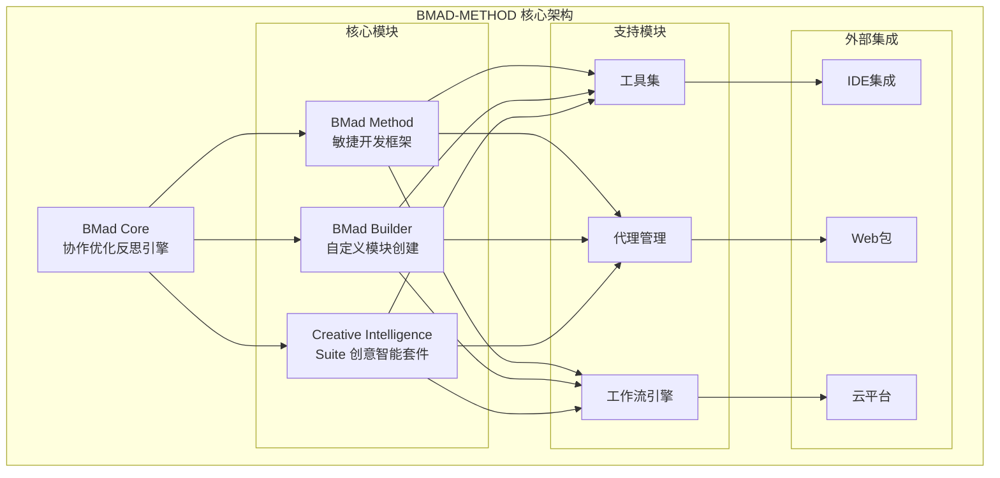
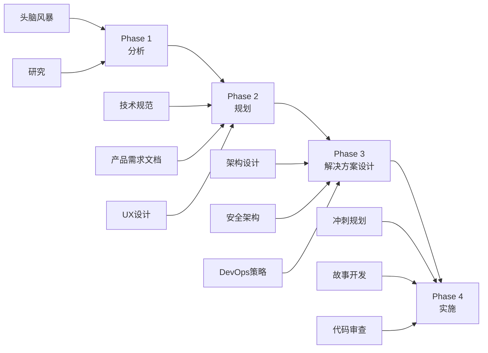
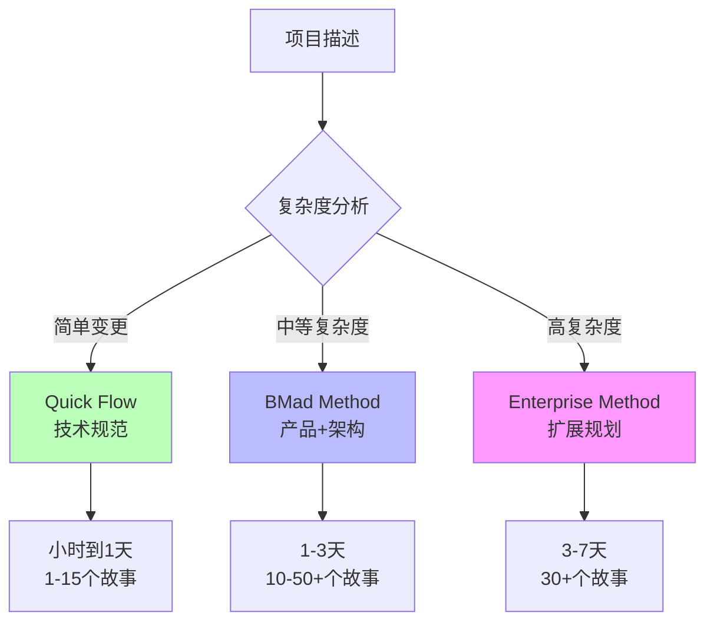
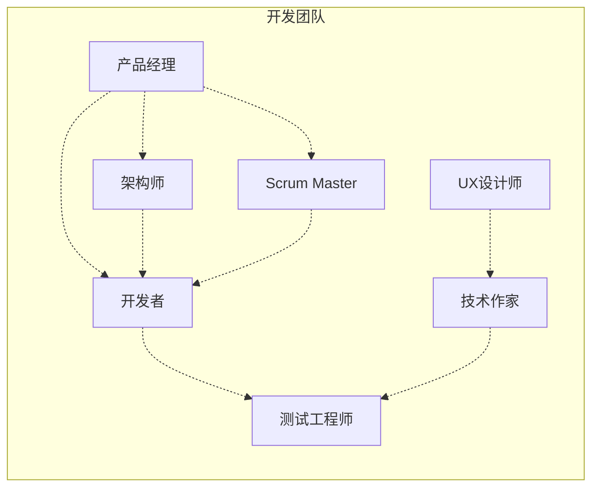
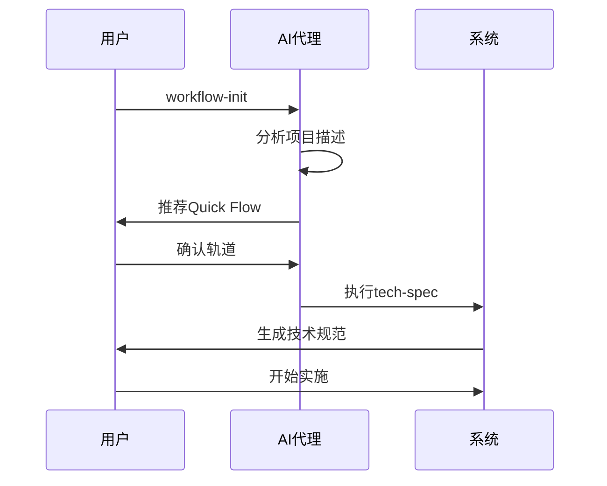
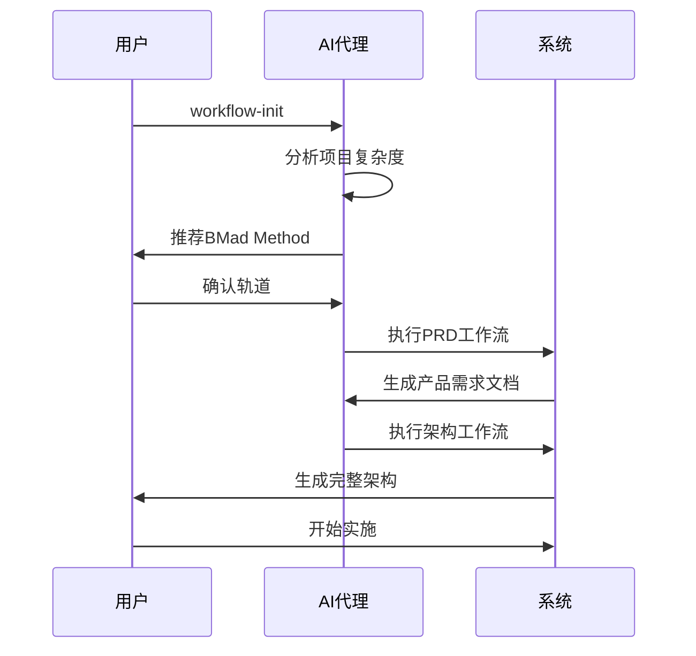
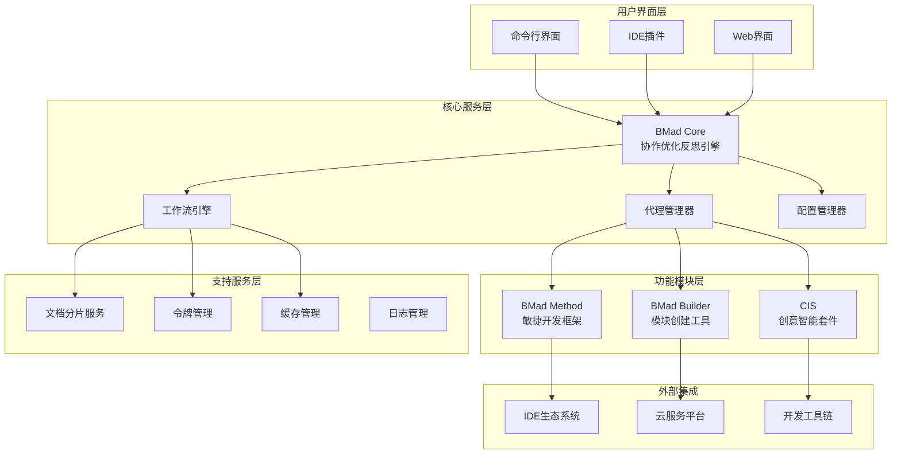
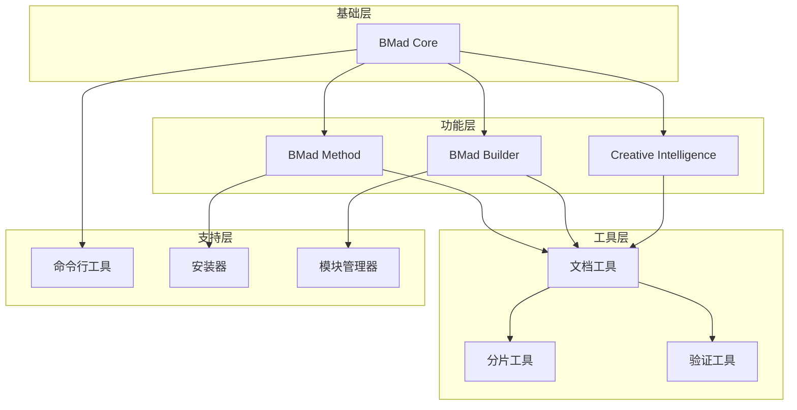

# BMAD-METHOD项目概述

<cite>
**本文档引用的文件**
- [README.md](file://README.md)
- [package.json](file://package.json)
- [src/core/agents/bmad-master.agent.yaml](file://src/core/agents/bmad-master.agent.yaml)
- [src/modules/bmm/README.md](file://src/modules/bmm/README.md)
- [src/modules/bmb/README.md](file://src/modules/bmb/README.md)
- [src/modules/cis/README.md](file://src/modules/cis/README.md)
- [src/modules/bmm/docs/scale-adaptive-system.md](file://src/modules/bmm/docs/scale-adaptive-system.md)
- [src/modules/bmm/docs/workflows-implementation.md](file://src/modules/bmm/docs/workflows-implementation.md)
- [src/modules/bmm/docs/workflows-planning.md](file://src/modules/bmm/docs/workflows-planning.md)
- [docs/document-sharding-guide.md](file://docs/document-sharding-guide.md)
- [src/core/tools/shard-doc.xml](file://src/core/tools/shard-doc.xml)
</cite>

## 目录
1. [项目简介](#项目简介)
2. [核心愿景与目标](#核心愿景与目标)
3. [模块化架构概览](#模块化架构概览)
4. [主要功能组件](#主要功能组件)
5. [核心技术概念](#核心技术概念)
6. [适用场景与案例](#适用场景与案例)
7. [项目架构图](#项目架构图)
8. [总结](#总结)

## 项目简介

BMAD-METHOD是一个革命性的AI驱动敏捷开发框架，旨在通过结构化工作流和专业AI代理来显著提升开发者生产力。该项目提供了一个完整的软件开发生命周期解决方案，涵盖从简单Bug修复到复杂企业级应用开发的各种场景。

**项目特色：**
- **19个专业化AI代理** - 每个代理都有特定的角色和专长
- **50+指导性工作流** - 适应项目复杂度的自动化流程
- **规模自适应智能** - 自动调整规划深度以匹配项目需求
- **模块化架构** - 可扩展的插件式设计
- **多IDE支持** - 兼容Claude Code、Cursor、Windsurf、VS Code等主流开发工具

**Section sources**
- [README.md](file://README.md#L1-L215)
- [package.json](file://package.json#L1-L106)

## 核心愿景与目标

### 项目愿景

BMAD-METHOD的核心愿景是实现"人类放大，而非替代"的理念，通过引导式协作将人类和AI的最佳思维结合起来。项目致力于：

- **构建更多，架构梦想** - 为AI驱动的敏捷开发提供突破性方法
- **规模化AI协作** - 创建可扩展的人机协作平台
- **专业化知识传递** - 将行业专家的知识编码为可执行的工作流

### 主要目标

1. **提高开发效率** - 通过自动化和专业化代理减少重复性工作
2. **保证代码质量** - 通过结构化流程和多层审查确保交付质量
3. **降低学习成本** - 提供直观的界面和指导性工作流
4. **支持复杂项目** - 从简单功能到企业级系统的全方位支持

**Section sources**
- [README.md](file://README.md#L11-L28)
- [CONTRIBUTING.md](file://CONTRIBUTING.md#L1-L23)

## 模块化架构概览

BMAD-METHOD采用创新的模块化架构，建立在BMad Core（协作优化反思引擎）之上，提供了灵活且可扩展的框架设计。

**图表来源**
- [src/core/agents/bmad-master.agent.yaml](file://src/core/agents/bmad-master.agent.yaml#L1-L40)
- [src/modules/bmm/README.md](file://src/modules/bmm/README.md#L1-L129)
- [src/modules/bmb/README.md](file://src/modules/bmb/README.md#L1-L262)

### 架构特点

1. **分层设计** - 清晰的层次结构确保模块间的松耦合
2. **插件机制** - 支持第三方模块的无缝集成
3. **标准化接口** - 统一的模块通信协议
4. **向后兼容** - 稳定的API设计确保版本演进

**Section sources**
- [README.md](file://README.md#L29-L47)

## 主要功能组件

### BMad Method (BMM) - 敏捷开发框架

BMad Method是项目的核心模块，提供完整的敏捷开发生命周期管理。

#### 核心特性

- **12个专业化代理** - PM、分析师、架构师、Scrum Master、开发者、测试工程师、UX设计师等
- **34个工作流** - 覆盖分析、规划、解决方案设计、实施四个阶段
- **3种规划轨道** - Quick Flow（快速）、BMad Method（标准）、Enterprise Method（企业）

#### 工作流阶段

**图表来源**
- [src/modules/bmm/docs/workflows-planning.md](file://src/modules/bmm/docs/workflows-planning.md#L1-L452)
- [src/modules/bmm/docs/workflows-implementation.md](file://src/modules/bmm/docs/workflows-implementation.md#L1-L172)

**Section sources**
- [src/modules/bmm/README.md](file://src/modules/bmm/README.md#L1-L129)

### BMad Builder (BMB) - 自定义模块创建

BMad Builder赋予用户创建自定义AI代理和工作流的能力，支持从简单工具到复杂领域的各种应用场景。

#### 核心能力

- **三种代理类型** - 简单代理、专家代理、模块代理
- **步骤文件架构** - 模块化的工作流设计
- **模板系统** - 标准化的创建和编辑模板
- **验证机制** - 质量保证和合规检查

#### 代理类型对比

| 代理类型 | 状态 | 内存管理 | 集成级别 | 使用场景 |
|---------|------|----------|----------|----------|
| 简单代理 | 自包含 | 无状态 | 单一功能 | 工具类、实用程序 |
| 专家代理 | 持久记忆 | 有状态 | 领域专家 | 需要上下文的应用 |
| 模块代理 | 团队集成 | 企业级 | 复杂流程协调 | 专业基础设施 |

**Section sources**
- [src/modules/bmb/README.md](file://src/modules/bmb/README.md#L1-L262)

### Creative Intelligence Suite (CIS) - 创意智能套件

CIS专注于战略思考和创新，提供五个专业的创意辅导代理。

#### 核心功能

- **5个专业代理** - Brainstorming Coach、Design Thinking Coach、Problem Solver、Innovation Strategist、Storyteller
- **150+创意技术** - 包括头脑风暴、设计思维、问题解决、创新战略、叙事技巧
- **互动工作流** - 结构化的创造性过程

#### 应用领域

- **产品创新** - 新产品概念生成和验证
- **战略规划** - 业务模式创新和竞争分析
- **问题解决** - 复杂问题的系统性解决
- **创意表达** - 故事叙述和内容创作

**Section sources**
- [src/modules/cis/README.md](file://src/modules/cis/README.md#L1-L154)

## 核心技术概念

### 规模自适应智能

BMad Method的核心创新之一是规模自适应系统，能够根据项目复杂度自动选择合适的规划深度。

#### 三大规划轨道

**图表来源**
- [src/modules/bmm/docs/scale-adaptive-system.md](file://src/modules/bmm/docs/scale-adaptive-system.md#L1-L619)

#### 关键特性

- **关键词识别** - 自动检测项目特征
- **教育性决策** - 向导式的轨道选择过程
- **灵活性** - 用户可以覆盖系统建议
- **渐进式复杂度** - 平滑的规划深度过渡

**Section sources**
- [src/modules/bmm/docs/scale-adaptive-system.md](file://src/modules/bmm/docs/scale-adaptive-system.md#L1-L619)

### 文档分片技术

为了处理大型项目中的大量文档，BMad Method实现了先进的文档分片技术。

#### 技术原理

- **Markdown树解析** - 使用`@kayvan/markdown-tree-parser`工具
- **层级分割** - 基于二级标题（##）进行分割
- **索引管理** - 自动生成结构化索引文件
- **选择性加载** - Phase 4工作流只加载需要的部分

#### 效率提升

- **90%+令牌节省** - 对于大型项目显著减少计算负担
- **智能缓存** - 只加载当前需要的文档部分
- **透明操作** - 对用户完全透明的文件管理

**Section sources**
- [docs/document-sharding-guide.md](file://docs/document-sharding-guide.md#L1-L450)
- [src/core/tools/shard-doc.xml](file://src/core/tools/shard-doc.xml#L1-L78)

### 多代理协作

BMad Method的独特之处在于其多代理协作机制，每个代理都有明确的专业角色。

#### 代理协作模式

**图表来源**
- [src/modules/bmm/README.md](file://src/modules/bmm/README.md#L36-L41)

#### 协作原则

- **角色明确** - 每个代理都有清晰的职责边界
- **无缝协作** - 代理间的信息流畅传递
- **专业知识** - 每个代理都具备领域专长
- **可定制性** - 支持个性化的沟通风格

**Section sources**
- [src/modules/bmm/README.md](file://src/modules/bmm/README.md#L94-L107)

## 适用场景与案例

### 简单场景

#### Bug修复
**项目描述**: 修复登录表单中的邮箱验证错误
**轨道选择**: Quick Flow
**时间投入**: 2-4小时
**输出**: 技术规范 + 单个故事

#### 新功能添加
**项目描述**: 添加OAuth社交登录（Google、GitHub、Facebook）
**轨道选择**: Quick Flow
**时间投入**: 1-3天
**输出**: 技术规范 + 3个故事

**Section sources**
- [src/modules/bmm/docs/scale-adaptive-system.md](file://src/modules/bmm/docs/scale-adaptive-system.md#L408-L444)

### 中等复杂度场景

#### 客户门户开发
**项目描述**: 构建包含仪表板、工单、计费的客户门户
**轨道选择**: BMad Method
**时间投入**: 1-2周
**输出**: PRD + 架构 + 多个epics和stories

#### 电商平台建设
**项目描述**: 建设包含商品、购物车、结账、管理后台、分析的电商平台
**轨道选择**: BMad Method
**时间投入**: 3-6周
**输出**: 完整PRD + 详细架构 + 分阶段实现计划

**Section sources**
- [src/modules/bmm/docs/scale-adaptive-system.md](file://src/modules/bmm/docs/scale-adaptive-system.md#L446-L487)

### 复杂场景

#### 现有系统扩展
**项目描述**: 为现有产品目录添加搜索功能
**轨道选择**: BMad Method（推荐架构）
**关键步骤**: 
1. 运行`document-project`分析现有代码库
2. 创建PRD和架构设计
3. 实施遵循现有模式的搜索功能

#### 多租户平台
**项目描述**: 为现有的单租户SaaS平台添加多租户支持
**轨道选择**: Enterprise Method
**扩展要求**: 
- 安全架构设计
- 租户隔离策略
- DevOps管道规划
- 测试策略制定

**Section sources**
- [src/modules/bmm/docs/scale-adaptive-system.md](file://src/modules/bmm/docs/scale-adaptive-system.md#L489-L538)

### 实施流程示例

#### 快速项目流程

#### 复杂项目流程

**图表来源**
- [src/modules/bmm/docs/workflows-planning.md](file://src/modules/bmm/docs/workflows-planning.md#L340-L378)

## 项目架构图

### 整体架构视图

**图表来源**
- [src/core/agents/bmad-master.agent.yaml](file://src/core/agents/bmad-master.agent.yaml#L1-L40)
- [src/modules/bmm/README.md](file://src/modules/bmm/README.md#L21-L33)

### 模块依赖关系

**图表来源**
- [tools/cli/installers/lib/core/installer.js](file://tools/cli/installers/lib/core/installer.js#L1246-L1278)
- [tools/cli/installers/lib/modules/manager.js](file://tools/cli/installers/lib/modules/manager.js#L1-L38)

## 总结

BMAD-METHOD代表了AI驱动软件开发的新范式，通过以下核心创新解决了传统开发中的痛点：

### 核心价值主张

1. **规模化效率** - 从简单任务到复杂项目的统一解决方案
2. **专业化分工** - 19个专业代理协同工作的高效模式
3. **智能化适配** - 自动识别项目复杂度并选择最优路径
4. **可扩展架构** - 模块化设计支持持续的功能扩展
5. **用户体验** - 直观的界面和指导性的工作流程

### 技术创新

- **规模自适应系统** - 基于项目特征的智能路由
- **文档分片技术** - 大型项目处理的创新解决方案
- **多代理协作** - 专业化代理的无缝集成
- **模块化架构** - 可扩展的插件式设计

### 应用前景

BMAD-METHOD不仅适用于传统的软件开发场景，还为以下新兴领域提供了强大支撑：

- **AI辅助开发** - 与各种AI编程助手的深度集成
- **DevOps自动化** - CI/CD流程的智能化管理
- **企业级应用** - 复杂业务系统的架构设计
- **创新孵化** - 从概念到产品的完整创新流程

该项目的成功实施将显著提升软件开发的效率和质量，为AI驱动的敏捷开发树立新的标杆。随着AI技术的不断发展，BMAD-METHOD将继续演进，为开发者提供更加强大和智能的协作平台。