# Web Bundles

<cite>
**本文档中引用的文件**
- [bundle-web.js](file://tools/cli/bundlers/bundle-web.js)
- [web-bundler.js](file://tools/cli/bundlers/web-bundler.js)
- [web-bundles-gemini-gpt-guide.md](file://docs/web-bundles-gemini-gpt-guide.md)
- [BUNDLE_DISTRIBUTION_SETUP.md](file://docs/BUNDLE_DISTRIBUTION_SETUP.md)
- [_base-ide.js](file://tools/cli/installers/lib/ide/_base-ide.js)
- [gemini-agent-command.toml](file://tools/cli/installers/lib/ide/templates/gemini-agent-command.toml)
- [gemini-task-command.toml](file://tools/cli/installers/lib/ide/templates/gemini-task-command.toml)
- [installers-modules-platforms-reference.md](file://docs/installers-bundlers/installers-modules-platforms-reference.md)
- [validate-bundles.js](file://tools/validate-bundles.js)
- [test-bundler.js](file://tools/cli/bundlers/test-bundler.js)
- [package.json](file://package.json)
</cite>

## 目录
1. [简介](#简介)
2. [Web Bundles概念](#web-bundles概念)
3. [架构概览](#架构概览)
4. [打包工具详解](#打包工具详解)
5. [配置文件要求](#配置文件要求)
6. [目标平台集成](#目标平台集成)
7. [激活机制与通信协议](#激活机制与通信协议)
8. [安全考虑](#安全考虑)
9. [故障排除](#故障排除)
10. [性能优化](#性能优化)
11. [最佳实践](#最佳实践)
12. [总结](#总结)

## 简介

BMAD-METHOD Web Bundles是一个强大的功能，允许将BMAD方法的AI代理和工作流程打包并集成到各种Web IDE环境中，包括ChatGPT、Claude Projects和Gemini Gems等平台。通过Web Bundles，BMAD代理能够以自包含的XML文件形式在浏览器环境中运行，无需访问文件系统。

Web Bundles的核心价值在于：
- **跨平台兼容性**：支持多种Web IDE环境
- **独立运行**：单个XML文件即可运行完整代理
- **简化部署**：无需复杂的本地安装过程
- **成本效益**：在云端环境中高效执行规划和分析任务

## Web Bundles概念

### 什么是Web Bundles？

Web Bundles是BMAD代理的自包含XML文件，包含了代理所需的所有内容：
- 完整的代理角色和指令
- 所有工作流程和依赖关系
- 交互式菜单系统
- Party模式多代理协作
- 不需要外部文件

### 核心特性

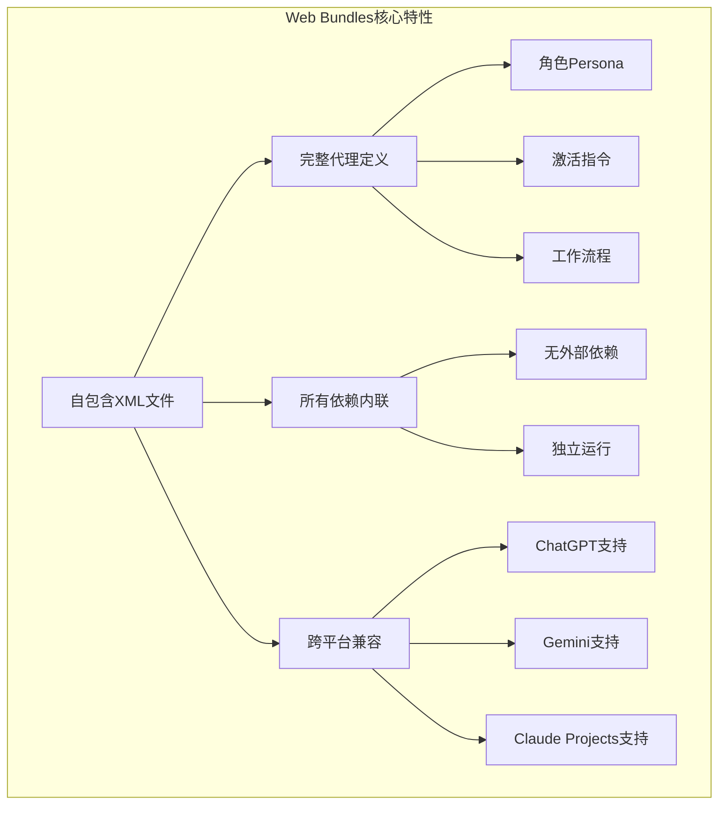

**图表来源**
- [web-bundles-gemini-gpt-guide.md](file://docs/web-bundles-gemini-gpt-guide.md#L1-L15)

### 适用场景

Web Bundles特别适合以下使用场景：
- **云端规划阶段**：在Gemini或ChatGPT中进行需求分析和产品规划
- **快速原型设计**：在Web环境中快速测试代理功能
- **团队协作**：通过共享XML文件实现团队间的知识传递
- **成本优化**：利用云端模型的成本效益优势

**章节来源**
- [web-bundles-gemini-gpt-guide.md](file://docs/web-bundles-gemini-gpt-guide.md#L1-L30)

## 架构概览

### Web Bundler系统架构

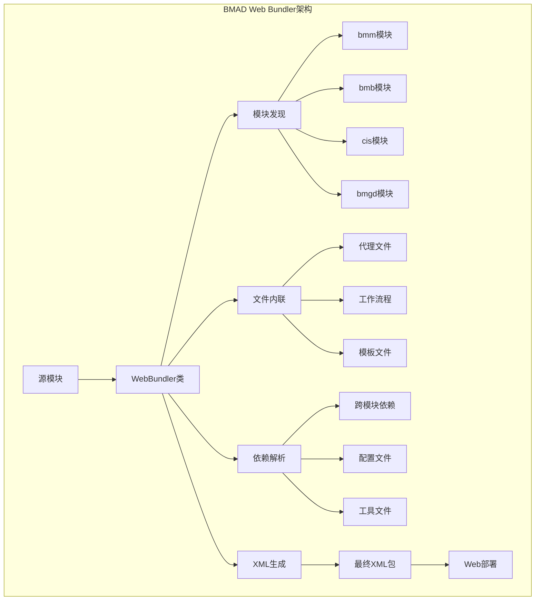

**图表来源**
- [web-bundler.js](file://tools/cli/bundlers/web-bundler.js#L45-L78)
- [bundle-web.js](file://tools/cli/bundlers/bundle-web.js#L7-L180)

### 打包流程

Web Bundles的生成遵循严格的流程：

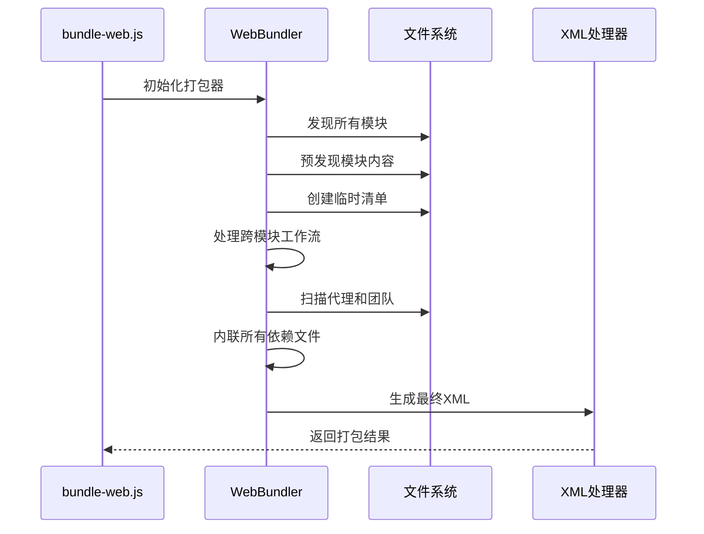

**图表来源**
- [web-bundler.js](file://tools/cli/bundlers/web-bundler.js#L48-L78)

**章节来源**
- [web-bundler.js](file://tools/cli/bundlers/web-bundler.js#L34-L1764)

## 打包工具详解

### bundle-web.js命令行工具

`bundle-web.js`是BMAD Web Bundles的主要命令行接口，提供了丰富的打包选项。

#### 基本用法

```bash
# 生成所有模块的Web Bundles
npm run bundle

# 清理并重新生成所有Bundle
npm run rebundle

# 打包特定模块
node tools/cli/bundlers/bundle-web.js module bmm

# 打包特定代理
node tools/cli/bundlers/bundle-web.js agent bmm dev

# 打包特定团队
node tools/cli/bundlers/bundle-web.js team bmm team-fullstack

# 列出可用模块和代理
node tools/cli/bundlers/bundle-web.js list

# 清理所有生成的Bundle
node tools/cli/bundlers/bundle-web.js clean
```

#### 命令详细说明

| 命令 | 描述 | 参数 | 示例 |
|------|------|------|------|
| `all` | 打包所有模块 | `-o, --output <path>` | `node bundle-web.js all -o ./bundles` |
| `rebundle` | 清理后重新打包所有模块 | `-o, --output <path>` | `node bundle-web.js rebundle` |
| `module <name>` | 打包指定模块 | `-o, --output <path>` | `node bundle-web.js module bmm` |
| `agent <module> <agent>` | 打包指定代理 | `-o, --output <path>` | `node bundle-web.js agent bmm dev` |
| `team <module> <team>` | 打包指定团队 | `-o, --output <path>` | `node bundle-web.js team bmm team-fullstack` |
| `list` | 列出可用模块和代理 | 无 | `node bundle-web.js list` |
| `clean` | 删除所有Web Bundles | 无 | `node bundle-web.js clean` |

### WebBundler类核心功能

WebBundler类是打包逻辑的核心实现：

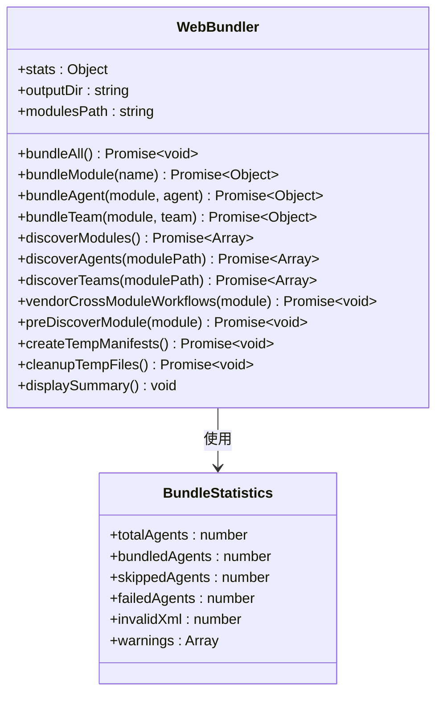

**图表来源**
- [web-bundler.js](file://tools/cli/bundlers/web-bundler.js#L34-L43)
- [bundle-web.js](file://tools/cli/bundlers/bundle-web.js#L7-L180)

### 输出结构

打包完成后，Web Bundles会生成如下目录结构：

```
web-bundles/
├── bmm/
│   ├── agents/
│   │   ├── analyst.xml
│   │   ├── architect.xml
│   │   ├── dev.xml
│   │   ├── pm.xml
│   │   └── [其他代理]
│   └── teams/
│       └── team-fullstack.xml
├── bmb/
│   └── agents/
│       └── bmad-builder.xml
├── cis/
│   └── agents/
│       ├── brainstorming-coach.xml
│       ├── design-thinking-coach.xml
│       └── [其他创意代理]
└── bmgd/
    └── agents/
        ├── game-designer.xml
        ├── game-dev.xml
        └── game-architect.xml
```

**章节来源**
- [bundle-web.js](file://tools/cli/bundlers/bundle-web.js#L1-L180)
- [web-bundler.js](file://tools/cli/bundlers/web-bundler.js#L34-L1764)

## 配置文件要求

### XML格式规范

Web Bundles必须遵循严格的XML格式规范：

```xml
<?xml version="1.0" encoding="UTF-8"?>
<agent>
    <!-- 必需：代理激活块 -->
    <activation critical="MANDATORY">
        <!-- 激活步骤 -->
    </activation>
    
    <!-- 必需：代理角色定义 -->
    <persona>
        <!-- 角色描述 -->
    </persona>
    
    <!-- 可选：代理名称 -->
    <name>BMad Developer Agent</name>
    
    <!-- 可选：代理描述 -->
    <description>AI developer agent powered by BMad Method</description>
    
    <!-- 必需：菜单处理器 -->
    <menu-handlers>
        <!-- 菜单项定义 -->
    </menu-handlers>
    
    <!-- 可选：依赖声明 -->
    <dependencies>
        <!-- 依赖项列表 -->
    </dependencies>
    
    <!-- 可选：Party模式配置 -->
    <agent-party>
        <!-- 多代理协作配置 -->
    </agent-party>
</agent>
```

### 验证机制

系统提供了完整的XML验证机制：

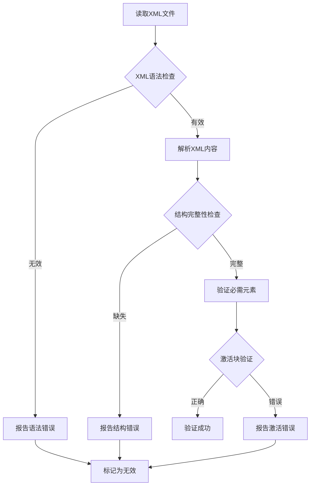

**图表来源**
- [validate-bundles.js](file://tools/validate-bundles.js#L7-L18)

### 配置验证

系统自动验证Bundle的配置完整性：

| 验证项目 | 检查内容 | 错误处理 |
|----------|----------|----------|
| XML语法 | 是否符合XML标准 | 报告具体位置和错误 |
| 必需元素 | activation, persona标签 | 标记为无效Bundle |
| 激活顺序 | activation在persona之前 | 自动修复顺序 |
| 依赖完整性 | 所有引用文件存在 | 记录警告信息 |
| 菜单配置 | 菜单项格式正确 | 提供修复建议 |

**章节来源**
- [validate-bundles.js](file://tools/validate-bundles.js#L1-L40)
- [test-bundler.js](file://tools/cli/bundlers/test-bundler.js#L1-L118)

## 目标平台集成

### Gemini Gems集成

Gemini Gems是Web Bundles的最佳支持平台，提供了最完整的功能体验。

#### 集成步骤

1. **创建Gem**：在Google AI Studio中创建新的Gem
2. **启用代码执行**：确保启用了Canvas/Code Execution功能
3. **配置系统指令**：添加必要的配置提示
4. **上传XML文件**：上传生成的Web Bundle

#### Gemini配置模板

```toml
description = "Activates the {{title}} agent from the BMad Method."

prompt = """
CRITICAL: You are now the BMad '{{title}}' agent.

PRE-FLIGHT CHECKLIST:
1.  [ ] IMMEDIATE ACTION: Load and parse @{{bmad_folder}}/{{module}}/config.yaml - store ALL config values in memory for use throughout the session.
2.  [ ] IMMEDIATE ACTION: Read and internalize the full agent definition at @{{bmad_folder}}/{{module}}/agents/{{name}}.md.
3.  [ ] CONFIRM: The user's name from config is {user_name}.

Only after all checks are complete, greet the user by name and display the menu.
Acknowledge this checklist is complete in your first response.

AGENT DEFINITION: @{{bmad_folder}}/{{module}}/agents/{{name}}.md
"""
```

**图表来源**
- [gemini-agent-command.toml](file://tools/cli/installers/lib/ide/templates/gemini-agent-command.toml#L1-L15)

#### 平台优势

| 特性 | Gemini Gems | Custom GPTs | Claude Projects |
|------|-------------|-------------|-----------------|
| 上下文窗口 | 大容量 | 中等容量 | 中等容量 |
| XML解析 | 优秀 | 一般 | 良好 |
| 代码执行 | 强大 | 基础 | 强大 |
| 团队协作 | 支持 | 不支持 | 支持 |
| 性能稳定性 | 高 | 中等 | 高 |

### Custom GPTs集成

Custom GPTs提供了熟悉的ChatGPT界面，但功能相对有限。

#### 集成限制

- **上下文限制**：较小的上下文窗口可能影响复杂Bundle的加载
- **字符限制**：大型Bundle可能超出字符限制
- **功能限制**：不支持团队Bundle和Party模式
- **代码执行**：Canvas功能不如Gemini成熟

#### 最佳实践

- 使用单一代理Bundle而非团队Bundle
- 选择专注于特定领域的代理（如PM、分析师）
- 避免复杂的多步骤工作流程
- 在本地IDE中进行实现阶段

### Claude Projects集成

Claude Projects提供了良好的代码执行能力和协作功能。

#### 集成特点

- **代码执行**：强大的代码生成和执行能力
- **协作功能**：支持多用户协作
- **平台原生**：与Claude生态深度集成
- **性能稳定**：可靠的运行环境

**章节来源**
- [web-bundles-gemini-gpt-guide.md](file://docs/web-bundles-gemini-gpt-guide.md#L283-L332)
- [_base-ide.js](file://tools/cli/installers/lib/ide/_base-ide.js#L1-L652)

## 激活机制与通信协议

### 激活流程

Web Bundles的激活遵循严格的流程：

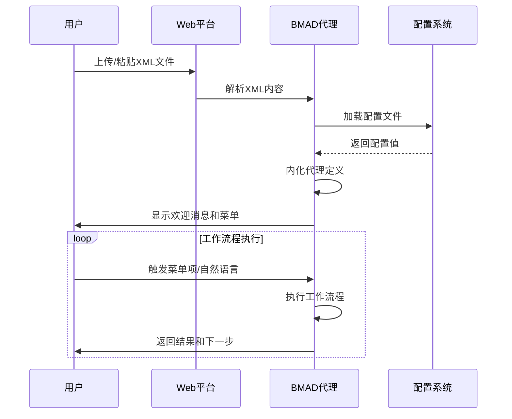

**图表来源**
- [gemini-agent-command.toml](file://tools/cli/installers/lib/ide/templates/gemini-agent-command.toml#L2-L14)

### 通信协议

#### 消息格式

Web Bundles支持多种消息格式：

| 消息类型 | 格式 | 示例 | 用途 |
|----------|------|------|------|
| 菜单触发 | `*workflow-name` | `*prd` | 启动特定工作流程 |
| 自然语言 | 自由文本 | `"运行PRD工作流程"` | 语义识别启动 |
| 配置请求 | `*config` | `*config` | 查看当前配置 |
| 帮助信息 | `*help` | `*help` | 显示可用菜单 |

#### 响应格式

代理的响应遵循统一的格式规范：

```xml
<response>
    <message>响应内容</message>
    <actions>
        <action type="workflow" name="workflow-name"/>
        <action type="menu" items="item1,item2"/>
    </actions>
    <context>
        <step>当前步骤</step>
        <progress>进度百分比</progress>
    </context>
</response>
```

### Party模式协作

Web Bundles内置了Party模式，支持多代理协作：

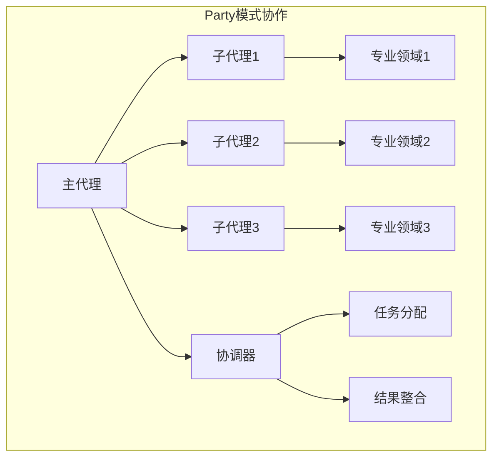

**图表来源**
- [web-bundles-gemini-gpt-guide.md](file://docs/web-bundles-gemini-gpt-guide.md#L259-L267)

**章节来源**
- [gemini-agent-command.toml](file://tools/cli/installers/lib/ide/templates/gemini-agent-command.toml#L1-L15)
- [gemini-task-command.toml](file://tools/cli/installers/lib/ide/templates/gemini-task-command.toml#L1-L13)

## 安全考虑

### 权限范围控制

Web Bundles实施了多层次的安全控制机制：

#### 文件访问控制

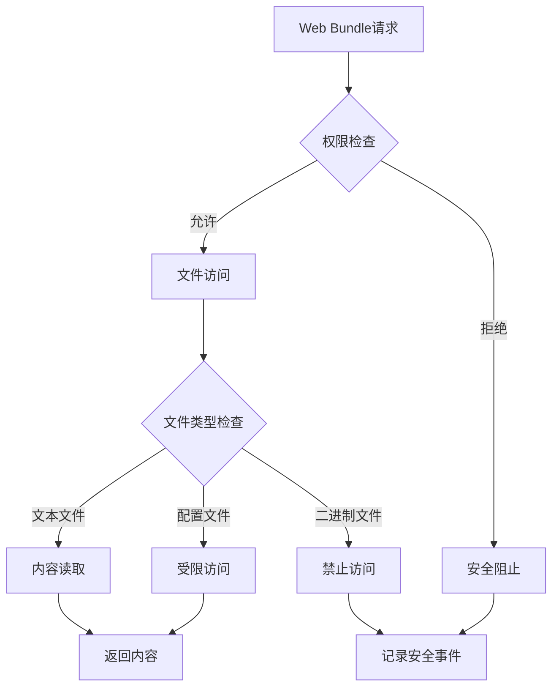

#### 数据隐私保护

| 数据类型 | 保护措施 | 处理方式 |
|----------|----------|----------|
| 用户输入 | 输入验证 | 实时过滤和验证 |
| 配置信息 | 加密存储 | 内存中加密处理 |
| 工作流程 | 访问控制 | 基于角色的权限 |
| 代理状态 | 会话管理 | 临时存储和清理 |

### 安全最佳实践

1. **最小权限原则**：只授予必要的文件访问权限
2. **输入验证**：严格验证所有用户输入
3. **内容过滤**：过滤潜在危险的内容
4. **会话隔离**：确保不同用户的会话隔离
5. **审计日志**：记录所有安全相关事件

### 风险缓解策略

- **沙箱执行**：在受控环境中执行代理代码
- **资源限制**：限制内存和CPU使用
- **超时控制**：防止无限循环和长时间运行
- **错误处理**：优雅处理异常情况

**章节来源**
- [_base-ide.js](file://tools/cli/installers/lib/ide/_base-ide.js#L520-L576)

## 故障排除

### 常见问题诊断

#### 加载失败问题

| 问题症状 | 可能原因 | 解决方案 |
|----------|----------|----------|
| 代理无法启动 | XML格式错误 | 运行 `npm run validate:bundles` 验证 |
| 配置加载失败 | 配置文件缺失 | 检查XML中的配置路径 |
| 依赖文件丢失 | 文件引用错误 | 检查相对路径和文件存在性 |
| 上下文溢出 | Bundle过大 | 分解为多个小Bundle |

#### 命令不响应问题

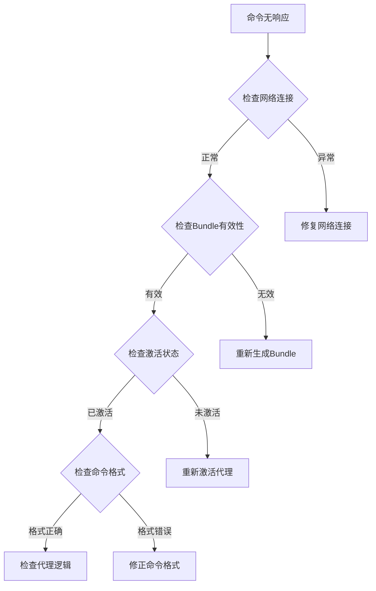

#### 工作流程失败

常见工作流程失败的原因和解决方案：

1. **项目文件缺失**
   - **原因**：Web环境无法访问本地文件
   - **解决方案**：使用云端文档或手动输入

2. **上下文限制**
   - **原因**：大型Bundle超出平台限制
   - **解决方案**：分解为多个专门的Bundle

3. **功能不支持**
   - **原因**：某些功能需要本地环境
   - **解决方案**：在本地IDE中完成实现阶段

### 调试工具

#### Bundle验证

```bash
# 验证所有Bundle的XML格式
npm run validate:bundles

# 测试特定Bundle
node tools/cli/bundlers/test-bundler.js
```

#### 日志分析

系统提供了详细的日志记录：

```javascript
// 包含在WebBundler类中的统计信息
this.stats = {
  totalAgents: 0,      // 总代理数
  bundledAgents: 0,    // 成功打包的代理
  skippedAgents: 0,    // 跳过的代理
  failedAgents: 0,     // 失败的代理
  invalidXml: 0,       // XML无效的Bundle
  warnings: []         // 警告信息数组
};
```

### 性能监控

#### 打包性能指标

| 指标 | 正常范围 | 监控方法 |
|------|----------|----------|
| 打包时间 | < 30秒 | 统计打包耗时 |
| 内存使用 | < 512MB | 监控进程内存 |
| 文件大小 | < 10MB | 检查输出文件 |
| 依赖数量 | < 100 | 统计依赖文件 |

#### 性能优化建议

1. **减少依赖**：合并相似功能的文件
2. **压缩内容**：移除不必要的注释和空白
3. **缓存机制**：重用已处理的文件
4. **并行处理**：同时处理多个Bundle

**章节来源**
- [validate-bundles.js](file://tools/validate-bundles.js#L1-L40)
- [test-bundler.js](file://tools/cli/bundlers/test-bundler.js#L1-L118)

## 性能优化

### 打包性能优化

#### 编译时优化

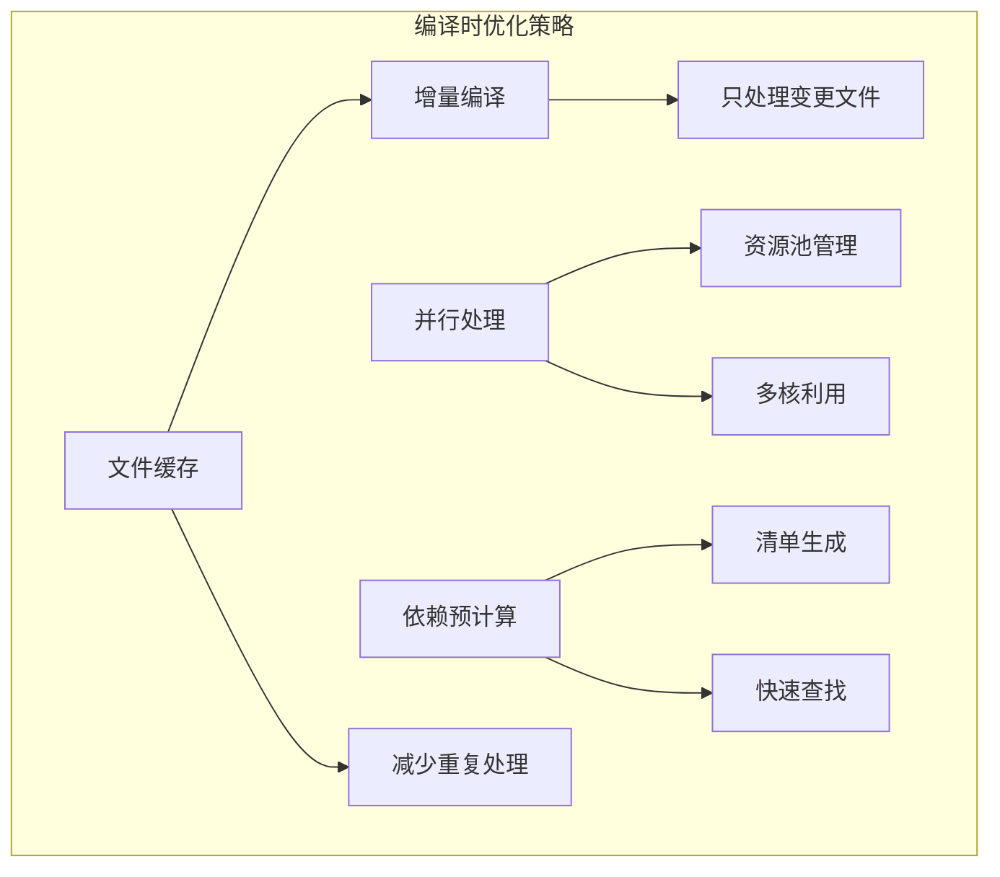

#### 运行时优化

1. **懒加载**：按需加载工作流程和工具
2. **内存管理**：及时释放不需要的资源
3. **缓存策略**：缓存频繁访问的数据
4. **异步处理**：非阻塞的操作处理

### 存储优化

#### 文件大小优化

| 优化技术 | 效果 | 实现方式 |
|----------|------|----------|
| 压缩算法 | 减少50%大小 | GZIP压缩 |
| 内容去重 | 减少30%大小 | 哈希去重 |
| 格式转换 | 减少20%大小 | JSON转XML优化 |
| 白名单过滤 | 减少10%大小 | 移除调试信息 |

#### 存储结构优化

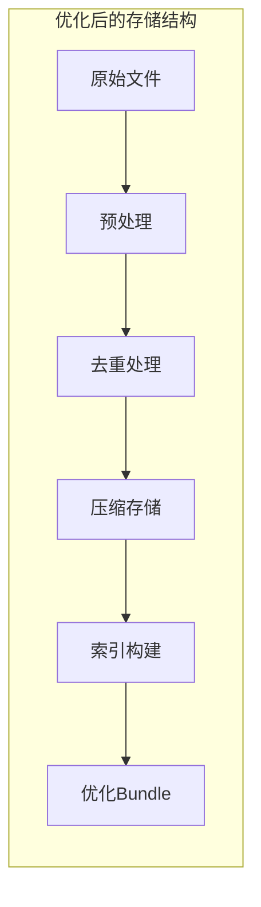

### 网络传输优化

#### 传输协议优化

1. **HTTP/2支持**：利用多路复用
2. **压缩传输**：启用gzip/brotli压缩
3. **CDN分发**：全球节点加速
4. **缓存策略**：智能缓存控制

#### 下载性能

| 优化措施 | 性能提升 | 实现难度 |
|----------|----------|----------|
| CDN部署 | 50-80% | 中等 |
| 压缩传输 | 30-50% | 低 |
| 分片下载 | 20-40% | 高 |
| 预加载 | 10-20% | 中等 |

**章节来源**
- [web-bundler.js](file://tools/cli/bundlers/web-bundler.js#L34-L43)

## 最佳实践

### 开发最佳实践

#### Bundle设计原则

1. **单一职责**：每个Bundle专注于特定功能领域
2. **最小依赖**：只包含必要的依赖文件
3. **清晰命名**：使用描述性的文件和目录名称
4. **版本控制**：跟踪Bundle的版本变化

#### 内容组织

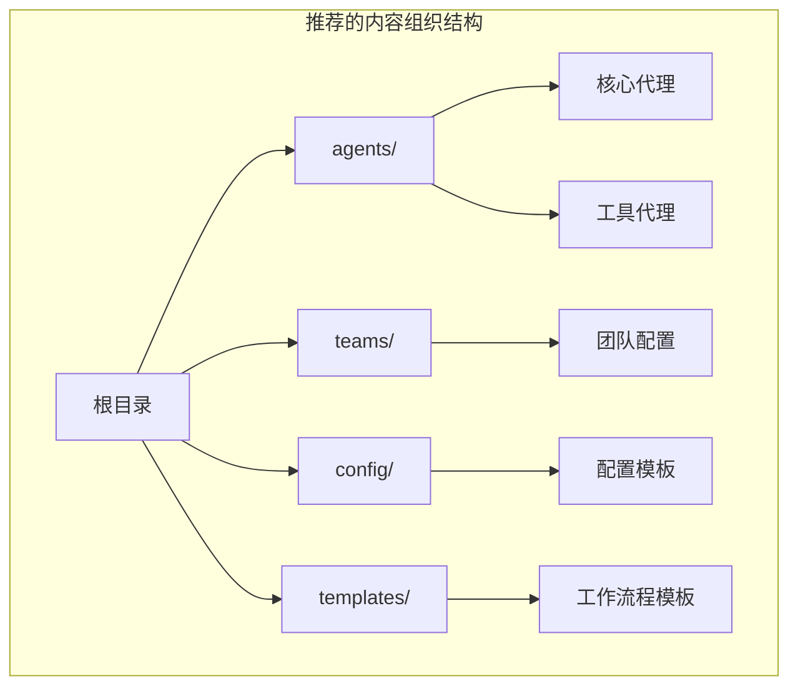

### 部署最佳实践

#### 平台选择策略

| 场景 | 推荐平台 | 原因 |
|------|----------|------|
| 复杂项目规划 | Gemini Gems | 大容量上下文和强大功能 |
| 快速原型 | Custom GPTs | 简单易用的界面 |
| 团队协作 | Claude Projects | 协作功能完善 |
| 个人使用 | 任意平台 | 根据个人偏好 |

#### 版本管理

1. **语义化版本**：使用SemVer规范
2. **变更日志**：记录重要变更
3. **向后兼容**：保持API兼容性
4. **测试覆盖**：确保充分测试

### 维护最佳实践

#### 定期维护任务

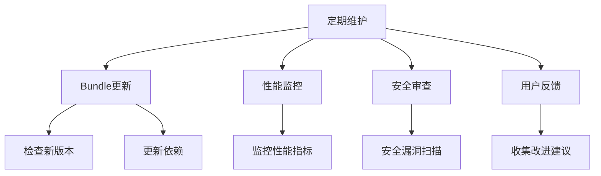

#### 质量保证

1. **自动化测试**：运行完整的测试套件
2. **人工验收**：验证功能正确性
3. **性能基准**：建立性能基线
4. **用户体验测试**：收集用户反馈

### 成本优化策略

#### 使用策略优化

根据BMAD官方建议的最佳使用策略：

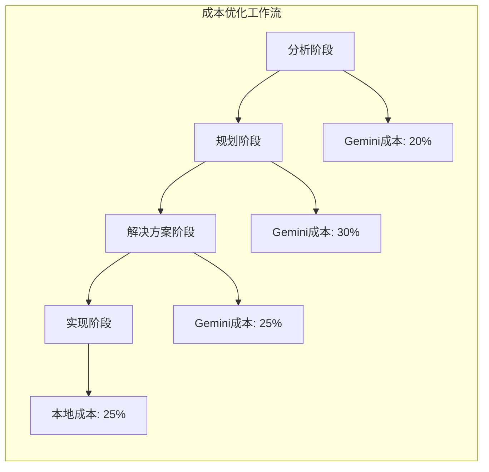

#### 具体优化建议

1. **云端执行规划**：在Gemini中执行分析和规划
2. **本地实现开发**：在本地IDE中进行编码实现
3. **文档导出**：将生成的文档保存到本地
4. **工作流初始化**：在本地重新初始化工作流

**章节来源**
- [web-bundles-gemini-gpt-guide.md](file://docs/web-bundles-gemini-gpt-guide.md#L188-L228)

## 总结

BMAD-METHOD Web Bundles提供了一个强大而灵活的解决方案，使BMAD代理能够在各种Web IDE环境中无缝运行。通过本文档的详细介绍，开发者可以：

### 核心价值

- **跨平台兼容性**：支持ChatGPT、Gemini、Claude等多种平台
- **简化部署**：单个XML文件即可运行完整代理
- **成本效益**：在云端环境中高效执行规划任务
- **协作能力**：支持多代理协作和团队工作

### 技术优势

- **自包含设计**：所有依赖都内嵌在XML文件中
- **标准化格式**：严格的XML规范确保兼容性
- **自动化工具**：完整的打包和验证工具链
- **性能优化**：多种优化策略提升运行效率

### 应用场景

Web Bundles特别适合以下场景：
- **云端规划阶段**：利用Gemini的分析能力
- **快速原型设计**：在Web环境中快速验证想法
- **团队知识共享**：通过XML文件分享代理配置
- **成本优化项目**：在云端执行高成本任务

### 未来发展

随着Web IDE平台的不断发展，Web Bundles将继续演进：
- **更多平台支持**：扩展到新的Web IDE平台
- **增强功能**：支持更复杂的工作流程
- **性能提升**：持续优化打包和运行性能
- **生态系统**：构建更丰富的代理生态系统

通过合理使用Web Bundles，开发团队可以在云端和本地之间实现最佳平衡，最大化成本效益，同时保持开发效率。