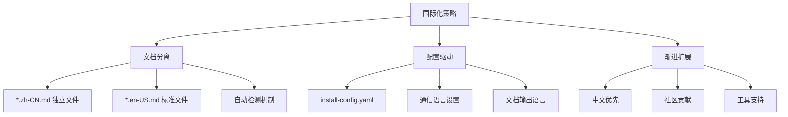
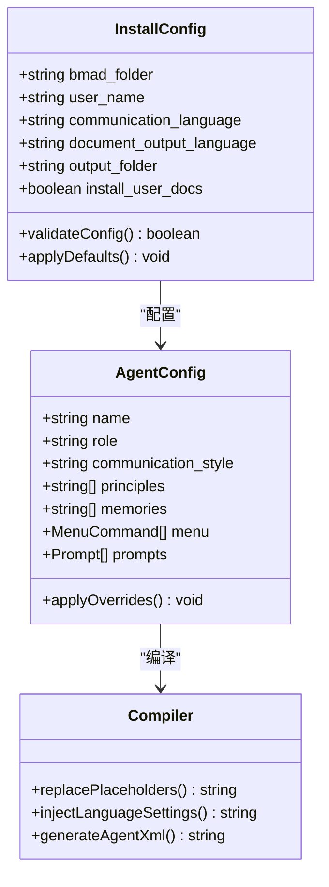
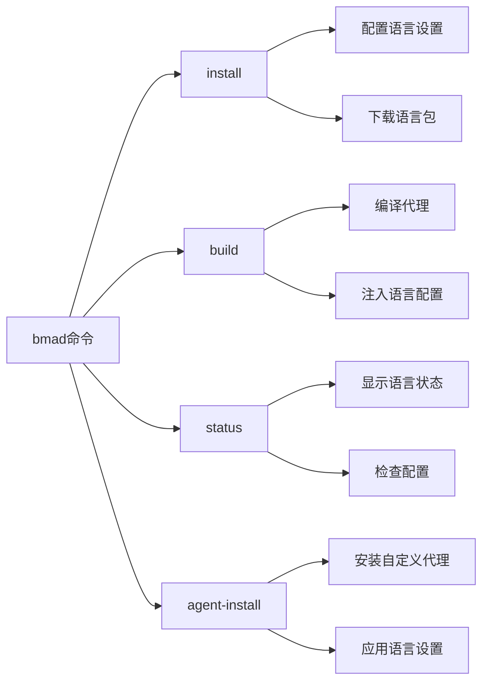
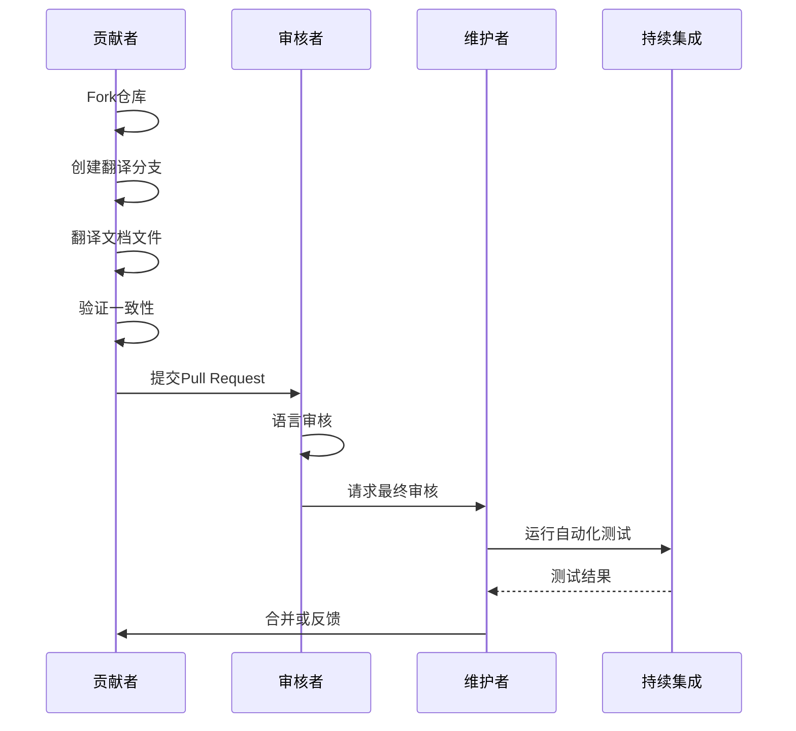
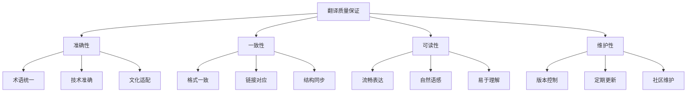
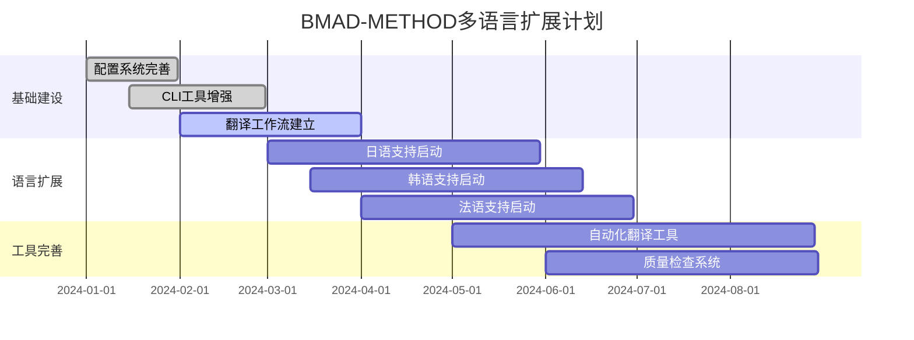
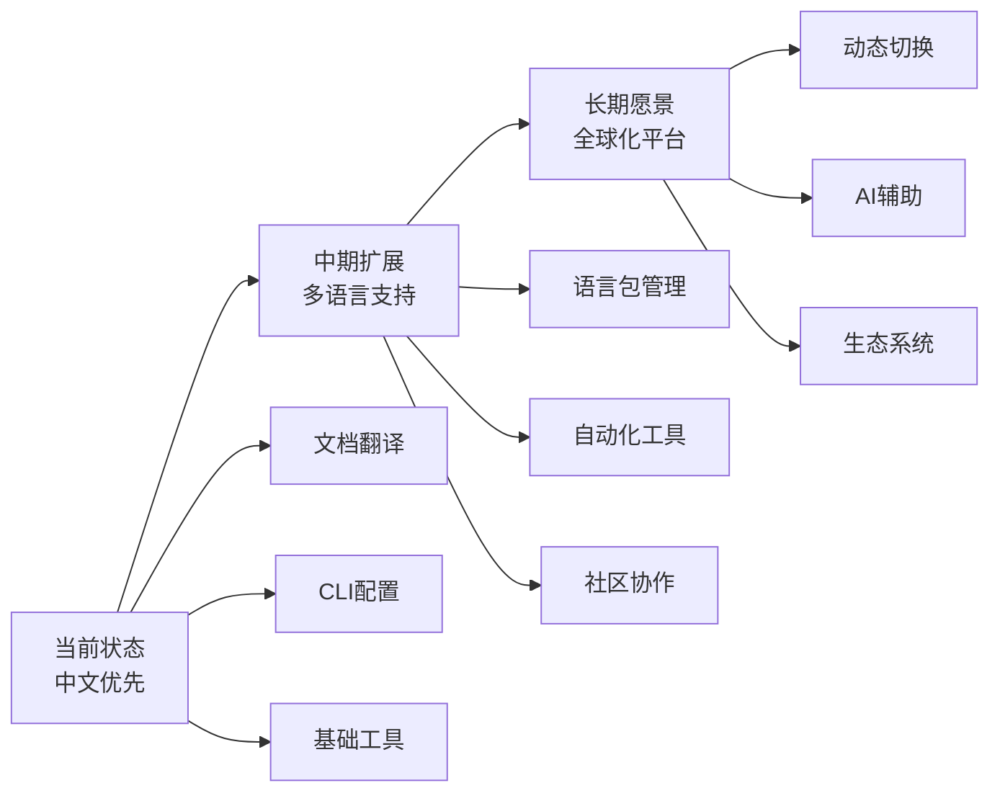

# 多语言支持

<cite>
**本文档引用的文件**
- [README.md](file://README.md)
- [README.zh-CN.md](file://README.zh-CN.md)
- [CONTRIBUTING.md](file://CONTRIBUTING.md)
- [docs/index.md](file://docs/index.md)
- [docs/index.zh-CN.md](file://docs/index.zh-CN.md)
- [docs/quick-start.zh-CN.md](file://docs/quick-start.zh-CN.md)
- [docs/agent-customization-guide.zh-CN.md](file://docs/agent-customization-guide.zh-CN.md)
- [src/core/_module-installer/install-config.yaml](file://src/core/_module-installer/install-config.yaml)
- [tools/cli/commands/build.js](file://tools/cli/commands/build.js)
- [tools/cli/lib/agent/compiler.js](file://tools/cli/lib/agent/compiler.js)
- [tools/cli/installers/lib/core/installer.js](file://tools/cli/installers/lib/core/installer.js)
</cite>

## 目录
1. [项目概述](#项目概述)
2. [国际化策略](#国际化策略)
3. [语言文件结构](#语言文件结构)
4. [配置系统](#配置系统)
5. [CLI工具支持](#cli工具支持)
6. [贡献指南](#贡献指南)
7. [最佳实践](#最佳实践)
8. [未来扩展规划](#未来扩展规划)

## 项目概述

BMAD-METHOD是一个先进的AI驱动敏捷开发框架，采用独特的多语言支持策略。该项目目前主要支持中文（zh-CN）和英文两种语言，通过为每种语言创建独立的文档文件来实现本地化，而不是依赖动态语言切换功能。

### 核心特点
- **文档级本地化**：通过独立的语言文件实现多语言支持
- **渐进式扩展**：从中文开始，逐步扩展到其他语言
- **配置驱动**：通过配置文件控制语言设置
- **工具链支持**：CLI工具提供语言相关的构建和管理功能

## 国际化策略

BMAD-METHOD采用文档级别的国际化策略，这是其多语言支持的核心设计理念。

### 设计原则



**图表来源**
- [src/core/_module-installer/install-config.yaml](file://src/core/_module-installer/install-config.yaml#L16-L24)

### 实现方式

项目通过以下方式实现多语言支持：

1. **文件命名约定**：使用标准的语言代码后缀
2. **内容分离**：每种语言的文档内容完全独立
3. **配置管理**：通过配置文件控制语言设置

**章节来源**
- [README.zh-CN.md](file://README.zh-CN.md#L1-L215)
- [docs/index.zh-CN.md](file://docs/index.zh-CN.md#L1-L153)

## 语言文件结构

BMAD-METHOD采用标准化的语言文件结构，确保翻译的一致性和可维护性。

### 文件命名规范

| 文件类型 | 命名模式 | 示例 | 说明 |
|---------|---------|------|------|
| 主文档 | `{filename}.md` | `README.md` | 英文原版文档 |
| 中文翻译 | `{filename}.zh-CN.md` | `README.zh-CN.md` | 中文版本 |
| 其他语言 | `{filename}.{locale}.md` | `README.es-ES.md` | 其他语言版本 |

### 目录结构示例

```
docs/
├── index.md                    # 英文索引
├── index.zh-CN.md             # 中文索引
├── quick-start.md             # 英文快速开始
├── quick-start.zh-CN.md       # 中文快速开始
├── agent-customization-guide.md
├── agent-customization-guide.zh-CN.md
└── ide-info/
    ├── claude-code.md
    ├── claude-code.zh-CN.md
    └── ...
```

### 内容组织原则

1. **标题对应**：中英文标题保持一致
2. **段落对应**：内容按逻辑结构对应排列
3. **链接保持**：内部链接指向对应的翻译文件
4. **图片引用**：图片文件名保持不变

**章节来源**
- [docs/index.md](file://docs/index.md#L1-L153)
- [docs/index.zh-CN.md](file://docs/index.zh-CN.md#L1-L153)

## 配置系统

BMAD-METHOD通过配置文件系统实现语言设置的管理，支持通信语言和文档输出语言的独立配置。

### 核心配置文件



**图表来源**
- [src/core/_module-installer/install-config.yaml](file://src/core/_module-installer/install-config.yaml#L1-L36)
- [tools/cli/lib/agent/compiler.js](file://tools/cli/lib/agent/compiler.js#L70-L90)

### 配置参数详解

| 参数 | 类型 | 默认值 | 说明 |
|------|------|--------|------|
| `communication_language` | string | "English" | 代理间通信使用的语言 |
| `document_output_language` | string | "{communication_language}" | 生成文档的输出语言 |
| `user_name` | string | "BMad" | 代理称呼用户的方式 |
| `bmad_folder` | string | ".bmad" | BMAD安装根目录 |
| `output_folder` | string | "docs" | 输出文件保存目录 |

### 语言占位符系统

项目使用占位符系统在代理模板中插入语言设置：

```javascript
// 通信语言占位符替换
processedTemplate = processedTemplate.replaceAll(
  '{core:communication_language}', 
  userInfo.responseLanguage
);
```

**章节来源**
- [src/core/_module-installer/install-config.yaml](file://src/core/_module-installer/install-config.yaml#L16-L24)
- [tools/cli/installers/lib/core/installer.js](file://tools/cli/installers/lib/core/installer.js#L2344-L2347)

## CLI工具支持

BMAD-METHOD的CLI工具提供了完整的语言相关功能，支持语言配置、代理构建和多语言工作流管理。

### 命令行接口



**图表来源**
- [tools/cli/commands/build.js](file://tools/cli/commands/build.js#L28-L459)

### 核心命令功能

#### 1. 安装配置命令
```bash
# 安装BMAD并配置语言
npx bmad-method@alpha install

# 交互式配置语言设置
# 会提示选择通信语言和文档输出语言
```

#### 2. 代理构建命令
```bash
# 构建所有代理（包含语言设置）
npx bmad-method@alpha build --all

# 构建特定代理
npx bmad-method@alpha build bmm-pm

# 强制重新构建
npx bmad-method@alpha build --force
```

#### 3. 状态检查命令
```bash
# 检查代理构建状态
npx bmad-method@alpha status

# 查看语言配置
npx bmad-method@alpha status --verbose
```

### 语言检测机制

CLI工具实现了智能的语言检测和配置机制：

```javascript
// 检查代理是否需要重新构建
async function checkIfNeedsRebuild(yamlPath, outputPath, projectDir, agentName) {
  // 检查源文件哈希值
  const currentHash = await builder.calculateFileHash(yamlPath);
  
  // 检查自定义配置文件
  const customizePath = path.join(projectDir, '.claude', '_cfg', 'agents', `${agentName}.customize.yaml`);
  if (await fs.pathExists(customizePath)) {
    // 检查自定义配置哈希值
    const currentCustomizeHash = await builder.calculateFileHash(customizePath);
  }
}
```

**章节来源**
- [tools/cli/commands/build.js](file://tools/cli/commands/build.js#L363-L403)

## 贡献指南

BMAD-METHOD欢迎社区贡献多语言内容，特别是中文以外的语言翻译。

### 翻译流程



### 翻译要求

#### 1. 文件结构要求
- 保持与英文版本相同的目录结构
- 使用正确的语言代码后缀
- 确保文件名与英文版本对应

#### 2. 内容质量要求
- 准确传达原文含义
- 保持技术术语的一致性
- 符合目标语言的表达习惯
- 遵循项目的写作风格

#### 3. 一致性检查

| 检查项目 | 要求 | 工具 |
|---------|------|------|
| 标题对应 | 中英文标题一一对应 | 手动检查 |
| 段落对应 | 内容结构保持一致 | 结构对比 |
| 链接有效性 | 内部链接指向正确 | 链接验证 |
| 图片引用 | 图片文件名不变 | 文件检查 |

### 贡献流程

1. **准备工作**
   ```bash
   # Fork项目仓库
   # 克隆到本地
   git clone https://github.com/YOUR_USERNAME/BMAD-METHOD.git
   
   # 创建翻译分支
   git checkout -b feat/add-language-{lang_code}
   ```

2. **翻译实施**
   ```bash
   # 复制英文文档
   cp docs/index.md docs/index.{lang_code}.md
   
   # 开始翻译
   # 使用文本编辑器或翻译工具
   ```

3. **质量检查**
   ```bash
   # 验证文件结构
   npm run lint:docs
   
   # 检查链接有效性
   npm run validate:links
   ```

4. **提交贡献**
   ```bash
   # 提交翻译
   git add docs/index.{lang_code}.md
   git commit -m "feat: add {lang_name} translation for index"
   
   # 推送到远程仓库
   git push origin feat/add-language-{lang_code}
   ```

**章节来源**
- [CONTRIBUTING.md](file://CONTRIBUTING.md#L1-L269)

## 最佳实践

为了确保BMAD-METHOD多语言支持的质量和一致性，以下是推荐的最佳实践。

### 翻译质量保证



### 技术实现最佳实践

#### 1. 代理模板语言注入
```javascript
// 推荐的语言占位符使用方式
const template = `
  <step n="1">ALWAYS communicate in {communication_language}</step>
  <step n="2">Show greeting using {user_name} from config</step>
`;

// 替换实际的语言设置
const processedTemplate = template
  .replaceAll('{communication_language}', 'Chinese')
  .replaceAll('{user_name}', '开发者');
```

#### 2. 配置文件管理
```yaml
# 推荐的配置文件结构
communication_language: "Chinese"
document_output_language: "Chinese"
user_name: "开发者"
output_folder: "文档"
```

#### 3. 文件命名一致性
```
# 正确的命名方式
README.md                  # 英文原版
README.zh-CN.md           # 中文翻译
README.es-ES.md           # 西班牙语翻译
README.fr-FR.md           # 法语翻译
```

### 维护和更新策略

#### 1. 版本同步机制
- 英文版本作为基准
- 定期同步更新
- 保持版本号一致

#### 2. 社区协作
- 分工负责不同模块
- 建立翻译团队
- 定期质量审核

#### 3. 自动化工具
- 使用翻译记忆工具
- 实施自动化检查
- 建立CI/CD流水线

**章节来源**
- [tools/cli/lib/agent/compiler.js](file://tools/cli/lib/agent/compiler.js#L70-L90)
- [tools/cli/installers/lib/core/installer.js](file://tools/cli/installers/lib/core/installer.js#L2333-L2366)

## 未来扩展规划

BMAD-METHOD的多语言支持正处于发展阶段，未来将逐步扩展到更多语言，同时完善相关工具和流程。

### 短期目标（6个月内）



### 中期目标（1年内）

| 目标领域 | 具体计划 | 预期成果 |
|---------|---------|----------|
| 语言支持 | 扩展到10+种主流语言 | 覆盖全球主要市场 |
| 工具链 | 完善自动化翻译流程 | 提高翻译效率50% |
| 质量保证 | 建立多级审核机制 | 确保翻译质量 |
| 社区建设 | 建立翻译贡献者网络 | 形成长期维护机制 |

### 长期愿景（2-3年）

#### 1. 全球化战略
- 建立多语言内容管理系统
- 实现动态语言切换功能
- 支持实时翻译和本地化

#### 2. 技术创新
- AI辅助翻译工具
- 智能术语管理系统
- 自动化质量检测

#### 3. 生态系统建设
- 多语言插件生态
- 社区贡献激励机制
- 跨语言协作平台

### 技术路线图



### 社区参与

欢迎社区成员参与多语言支持的发展：

1. **翻译贡献**：参与现有文档的翻译工作
2. **工具开发**：贡献自动化翻译和质量检查工具
3. **流程制定**：协助建立翻译工作流程和标准
4. **测试验证**：参与翻译质量和功能测试

通过共同努力，BMAD-METHOD将成为真正全球化的AI开发平台，为世界各地的开发者提供优质的服务和支持。