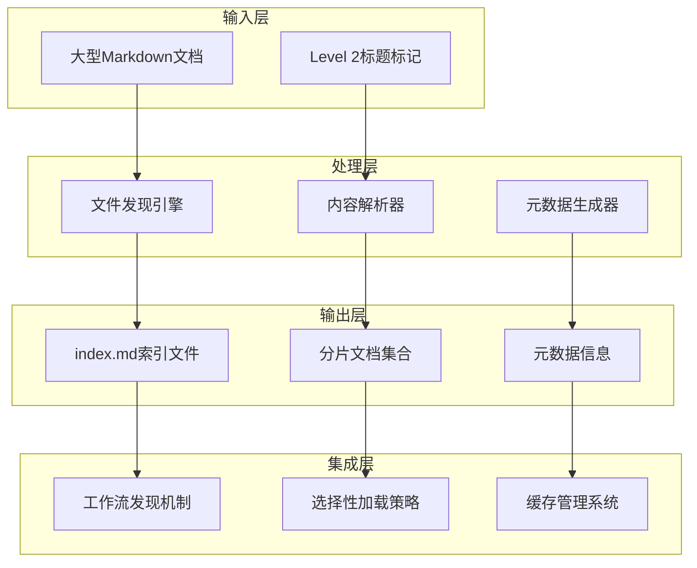
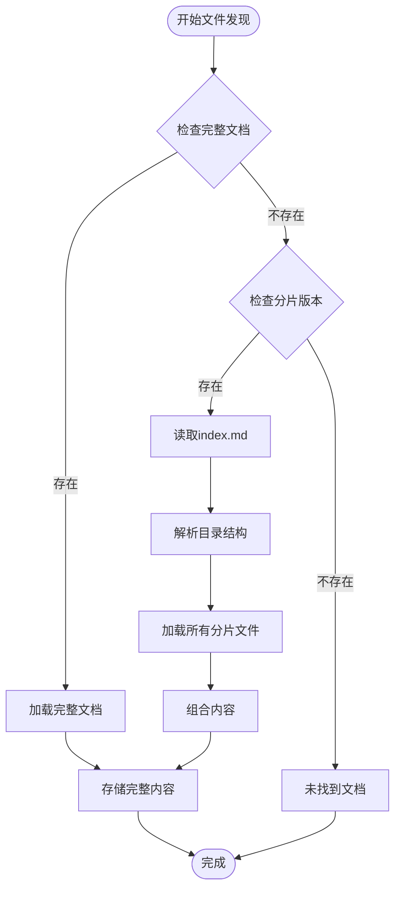
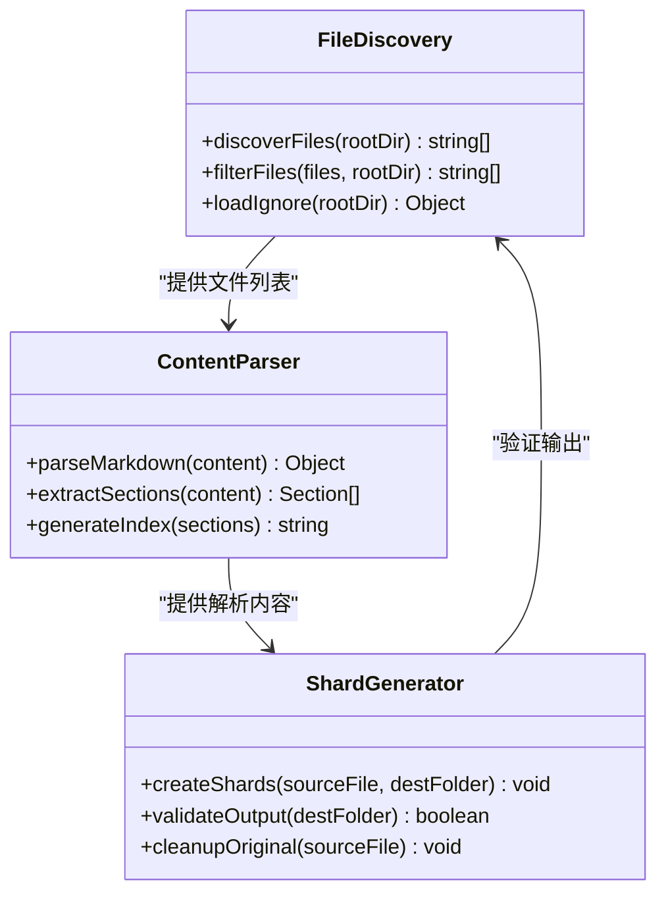
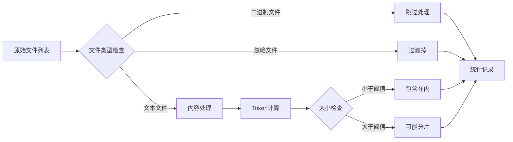
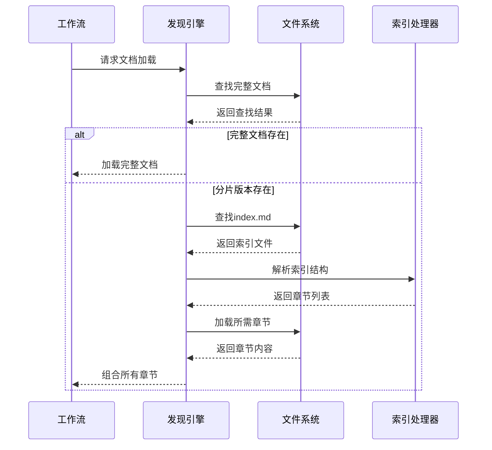
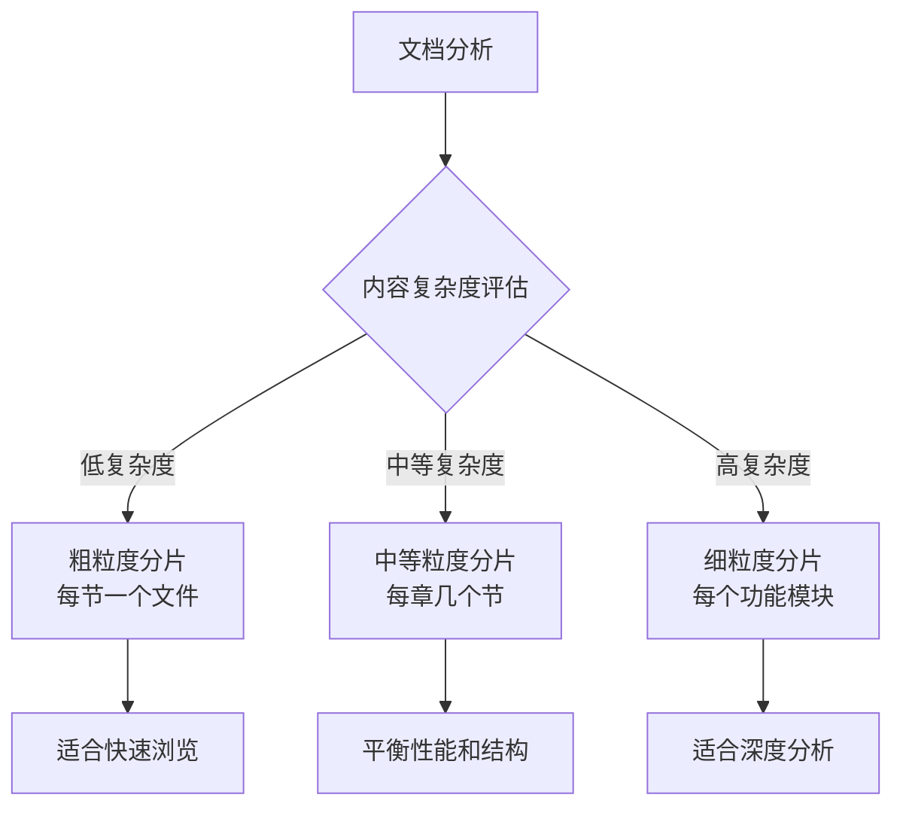

# 文档分片

<cite>
**本文档中引用的文件**
- [document-sharding-guide.md](file://docs/document-sharding-guide.md)
- [shard-doc.xml](file://src/core/tools/shard-doc.xml)
- [main.js](file://tools/flattener/main.js)
- [discovery.js](file://tools/flattener/discovery.js)
- [files.js](file://tools/flattener/files.js)
- [ignoreRules.js](file://tools/flattener/ignoreRules.js)
- [instructions-gdd.md](file://src/modules/bmgd/workflows/2-design/gdd/instructions-gdd.md)
- [workflow.xml](file://src/core/tasks/workflow.xml)
- [bundlers.md](file://custom/src/agents/toolsmith/toolsmith-sidecar/knowledge/bundlers.md)
</cite>

## 目录
1. [简介](#简介)
2. [设计目的](#设计目的)
3. [核心架构](#核心架构)
4. [分片算法详解](#分片算法详解)
5. [配置选项](#配置选项)
6. [使用示例](#使用示例)
7. [工作流集成](#工作流集成)
8. [输出格式](#输出格式)
9. [性能优化](#性能优化)
10. [故障排除](#故障排除)

## 简介

BMAD-METHOD的文档分片技术是一种智能文档管理解决方案，专门设计用于解决大型代码库在AI上下文窗口限制下的处理问题。该系统通过将大型Markdown文档拆分为更小、结构化的文件来提高AI处理效率，同时保持文档的完整性和可维护性。

### 核心价值主张

- **选择性加载**：工作流仅加载所需的文档部分
- **减少Token使用**：为大型项目带来显著的效率提升
- **更好的组织**：基于逻辑章节的文件结构
- **保持上下文**：索引文件保留文档结构信息

## 设计目的

### 解决的核心问题

文档分片技术主要解决以下挑战：

1. **AI上下文窗口限制**：现代AI模型通常有4096-32768 token的上下文限制
2. **大型文档处理效率**：单个大型文档导致处理时间过长
3. **文档更新成本**：频繁更新整个大文档的开销
4. **特定需求访问**：不同工作流对文档的不同关注点

### 技术目标

- 将超过20k token的文档分割为更小的可管理单元
- 维持文档的语义完整性
- 提供透明的文件发现机制
- 支持选择性内容加载

## 核心架构

### 系统组成



**图表来源**
- [shard-doc.xml](file://src/core/tools/shard-doc.xml#L1-L110)
- [main.js](file://tools/flattener/main.js#L1-L484)

### 文件发现机制

系统采用双层发现策略：

1. **优先查找完整文档**：尝试找到完整的`document-name.md`
2. **检查分片版本**：如果未找到，则查找`document-name/index.md`
3. **优先级规则**：如果两者都存在，优先使用完整文档

**节来源**
- [instructions-gdd.md](file://src/modules/bmgd/workflows/2-design/gdd/instructions-gdd.md#L22-L42)

## 分片算法详解

### 文件发现流程



**图表来源**
- [workflow.xml](file://src/core/tasks/workflow.xml#L173-L188)

### 内容聚合过程

分片算法的核心步骤：

1. **Level 2标题识别**：使用正则表达式匹配`## 标题`格式
2. **内容边界确定**：从一个标题到下一个标题之间的内容
3. **文件命名生成**：将标题转换为kebab-case文件名
4. **元数据提取**：生成索引文件和描述信息

### 依赖关系分析



**图表来源**
- [discovery.js](file://tools/flattener/discovery.js#L47-L67)
- [files.js](file://tools/flattener/files.js#L12-L27)

**节来源**
- [discovery.js](file://tools/flattener/discovery.js#L1-L72)
- [files.js](file://tools/flattener/files.js#L1-L36)

## 配置选项

### 忽略规则配置

系统提供了全面的文件过滤机制：

| 过滤类别 | 默认模式 | 描述 |
|---------|---------|------|
| 版本控制系统 | `.git/**` | 忽略Git仓库文件 |
| 构建输出 | `**/build/**` | 排除编译产物 |
| 包管理器 | `**/node_modules/**` | 跳过依赖目录 |
| 虚拟环境 | `**/.venv/**` | 排除Python虚拟环境 |
| 日志文件 | `**/*.log` | 忽略日志文件 |
| 编辑器临时文件 | `**/*.swp` | 排除编辑器备份 |

### 文件类型过滤



**图表来源**
- [ignoreRules.js](file://tools/flattener/ignoreRules.js#L6-L134)

### 分片大小控制

虽然系统不直接提供分片大小控制参数，但通过以下机制实现：

- **自动阈值检测**：默认认为超过20k token的文档值得分片
- **内容密度分析**：根据内容复杂度调整分片粒度
- **用户自定义**：通过修改Level 2标题结构影响分片结果

**节来源**
- [ignoreRules.js](file://tools/flattener/ignoreRules.js#L1-L173)

## 使用示例

### 基础分片操作

```bash
# 激活bmad-master或分析师代理后：
/shard-doc

# 用户交互示例：
Agent: Which document would you like to shard?
User: docs/PRD.md

Agent: Default destination: docs/prd/
       Accept default? [y/n]
User: y

Agent: Sharding PRD.md...
       ✓ Created 12 section files
       ✓ Generated index.md
       ✓ Complete!
```

### 大型PRD分片案例

**场景**：15-epic项目，PRD文档45k token

**分片前**：
- 整个工作流加载整个45k token的PRD
- 架构工作流：45k token
- UX设计工作流：45k token

**分片后**：
```bash
/shard-doc
Source: docs/PRD.md
Destination: docs/prd/

Created:
  prd/index.md
  prd/overview.md (3k tokens)
  prd/functional-requirements.md (8k tokens)
  prd/non-functional-requirements.md (6k tokens)
  prd/user-personas.md (4k tokens)
  ...其他功能需求和非功能需求章节
```

**效果**：
- 架构工作流可以加载特定需要的章节
- UX设计工作流可以加载特定需要的章节
- 显著减少大型需求文档的token消耗

### 选择性加载示例

**场景**：8个epic的详细故事文档，总35k token

```bash
/shard-doc
Source: docs/bmm-epics.md
Destination: docs/epics/

Created:
  epics/index.md
  epics/epic-1.md
  epics/epic-2.md
  ...
  epics/epic-8.md
```

**效率提升**：
```
工作在Epic 5的故事上：
  旧方法：加载所有8个epic（35k token）
  新方法：仅加载epic-5.md（4k token）
  节省：88%的token使用量
```

**节来源**
- [document-sharding-guide.md](file://docs/document-sharding-guide.md#L278-L450)

## 工作流集成

### 自动发现机制



**图表来源**
- [workflow.xml](file://src/core/tasks/workflow.xml#L173-L188)

### 工作流支持矩阵

| 工作流阶段 | 全加载模式 | 选择性加载 | 推荐场景 |
|-----------|-----------|-----------|----------|
| Phase 1-3 | ✓ 完整加载 | ✗ 不适用 | 研究、头脑风暴文档 |
| Phase 4 | ✓ 完整加载 | ✓ 选择性加载 | 实施准备、代码审查 |

### 输入文件模式

系统支持标准化的文件模式匹配：

```yaml
input_file_patterns:
  prd:
    whole: '{output_folder}/*prd*.md'
    sharded: '{output_folder}/*prd*/index.md'

  epics:
    whole: '{output_folder}/*epic*.md'
    sharded_index: '{output_folder}/*epic*/index.md'
    sharded_single: '{output_folder}/*epic*/epic-{{epic_num}}.md'
```

**节来源**
- [document-sharding-guide.md](file://docs/document-sharding-guide.md#L203-L217)

## 输出格式

### 索引文件结构

每个分片目录都会生成标准的`index.md`文件：

```markdown
# PRD - Index

## Sections

1. [Overview](./overview.md) - 项目愿景和目标
2. [User Requirements](./user-requirements.md) - 功能规范
3. [Epic 1: Authentication](./epic-1-authentication.md) - 用户认证系统
4. [Epic 2: Dashboard](./epic-2-dashboard.md) - 主仪表板UI
   ...
```

### 单独章节文件

- **命名规则**：基于标题的kebab-case格式
- **内容完整性**：包含完整的章节内容
- **格式保持**：保留所有Markdown格式
- **独立性**：可以独立阅读

### 元数据生成

分片过程会生成以下元数据：

- **文件数量统计**：创建的分片文件总数
- **大小分布**：各分片的token或字节大小
- **结构信息**：章节间的层次关系
- **引用关系**：章节间的交叉引用

**节来源**
- [document-sharding-guide.md](file://docs/document-sharding-guide.md#L136-L158)

## 性能优化

### 分片策略建议

#### 何时使用分片

**理想候选**：
- 复杂的多史诗项目
- 超过40k token的大文档
- 包含多个系统层的架构文档
- 跨子系统的UX设计规范

**避免分片的情况**：
- 单一史诗项目
- 小于10k token的文档
- 频繁更新的进行中文档

#### 分片粒度控制



### 缓存优化

系统实现了多层缓存机制：

1. **文件系统缓存**：操作系统级别的文件访问缓存
2. **内存缓存**：已加载文档的内容缓存
3. **索引缓存**：分片结构的元数据缓存

### 并行处理

对于大型项目，系统支持并行处理：

- **并发文件读取**：同时读取多个分片文件
- **异步内容处理**：后台处理内容解析
- **流水线执行**：重叠的处理阶段

## 故障排除

### 常见问题及解决方案

#### 双重存在冲突

**问题**：同时存在完整文档和分片版本

**解决方案**：
- 工作流优先使用完整文档（优先级规则）
- 删除不需要的版本以避免混淆

#### 索引文件不同步

**问题**：分片后的index.md与实际文件不匹配

**解决方案**：
```bash
# 删除分片文件夹
rm -rf docs/prd/

# 重新运行分片命令
/shard-doc
```

#### 工作流找不到文档

**问题**：工作流无法定位目标文档

**诊断步骤**：
1. 检查文件命名是否符合模式（`*prd*.md`, `*epic*.md`等）
2. 验证index.md是否存在于分片文件夹中
3. 检查output_folder路径配置

#### 分片过于细粒度

**问题**：Level 2标题过多导致分片过细

**解决方案**：
- 在原始文档中合并相关章节
- 减少Level 2标题的数量
- 重新分片

### 性能监控

系统提供了详细的统计信息：

```bash
# 分片完成后显示的统计信息
📊 Completion Summary:
✅ Successfully processed 12 files into flattened-codebase.xml
📁 Output file: flattened-codebase.xml
📏 Total source size: 1.2 MB
📄 Generated XML size: 850 KB
📝 Total lines of code: 15,000
🔢 Estimated tokens: 120,000
📊 File breakdown: 10 text, 2 binary, 0 errors
```

### 最佳实践

#### 分片前准备

1. **确保文档完整性**：在分片前确认文档内容准确无误
2. **组织标题结构**：合理规划Level 2标题的层次结构
3. **备份原始文档**：分片前保存原始文档的备份

#### 分片后维护

1. **定期重构**：当文档结构发生重大变化时重新分片
2. **版本控制**：将分片文件纳入版本控制系统
3. **团队协作**：确保团队成员理解分片机制

**节来源**
- [document-sharding-guide.md](file://docs/document-sharding-guide.md#L415-L449)

## 结论

BMAD-METHOD的文档分片技术是一个精心设计的解决方案，有效解决了大型代码库在AI上下文窗口限制下的处理难题。通过智能的文件发现机制、灵活的配置选项和强大的工作流集成，该系统为大型项目提供了高效的文档管理方案。

关键优势包括：
- **透明性**：对用户完全透明的操作体验
- **灵活性**：支持多种使用场景和配置选项
- **可扩展性**：易于适应不同的项目规模和需求
- **性能优化**：显著减少AI处理时间和token消耗

随着项目规模的增长和AI处理需求的增加，文档分片技术将成为BMAD-METHOD生态系统中不可或缺的重要组成部分。