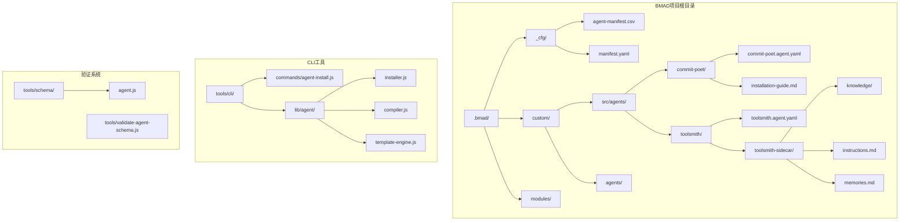
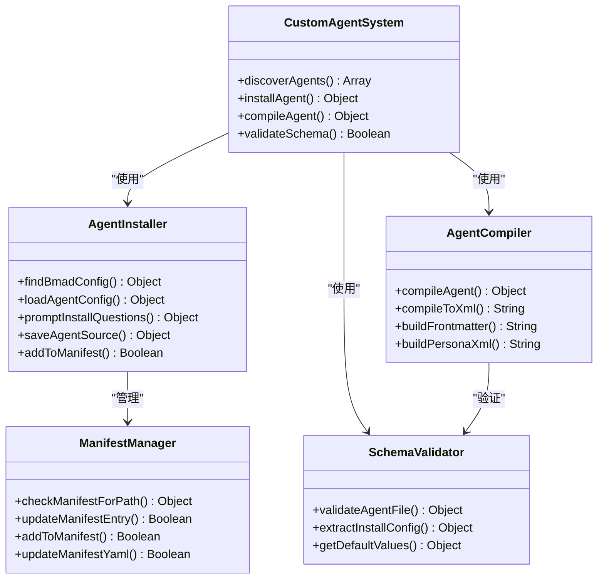
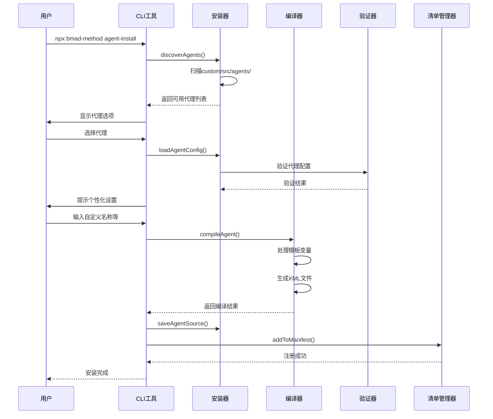
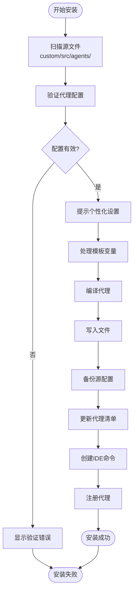
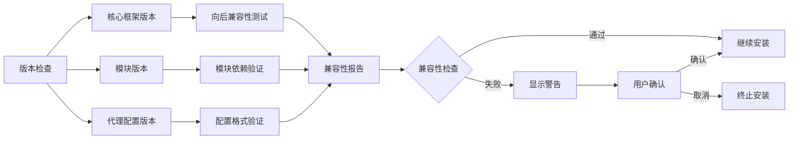

# 更新安全的自定义

<cite>
**本文档引用的文件**
- [commit-poet.agent.yaml](file://custom/src/agents/commit-poet/commit-poet.agent.yaml)
- [toolsmith.agent.yaml](file://custom/src/agents/toolsmith/toolsmith.agent.yaml)
- [custom-agent-installation.md](file://docs/custom-agent-installation.md)
- [agent-customization-guide.md](file://docs/agent-customization-guide.md)
- [install-config.yaml](file://src/core/_module-installer/install-config.yaml)
- [agent-install.js](file://tools/cli/commands/agent-install.js)
- [installer.js](file://tools/cli/lib/agent/installer.js)
- [compiler.js](file://tools/cli/lib/agent/compiler.js)
- [agent.js](file://tools/schema/agent.js)
- [template-engine.js](file://tools/cli/lib/agent/template-engine.js)
- [validate-agent-schema.js](file://tools/validate-agent-schema.js)
</cite>

## 目录
1. [简介](#简介)
2. [项目结构概览](#项目结构概览)
3. [自定义机制架构](#自定义机制架构)
4. [目录结构与命名约定](#目录结构与命名约定)
5. [自定义代理的创建与安装](#自定义代理的创建与安装)
6. [YAML配置文件详解](#yaml配置文件详解)
7. [安装流程与激活机制](#安装流程与激活机制)
8. [版本兼容性策略](#版本兼容性策略)
9. [最佳实践指南](#最佳实践指南)
10. [故障排除指南](#故障排除指南)
11. [总结](#总结)

## 简介

BMAD-METHOD提供了一套完整的更新安全自定义机制，允许用户在不破坏核心框架升级的前提下添加自定义代理和工作流。该机制通过严格的目录结构、命名约定和版本控制策略，确保自定义内容能够随着框架升级而保持兼容性。

核心特性包括：
- **隔离式自定义**：自定义内容存储在独立的`custom/`目录中
- **模板化安装**：支持交互式和非交互式安装流程
- **自动备份恢复**：安装过程中自动保存源配置用于重新安装
- **版本兼容性**：智能检测和处理版本冲突
- **向后兼容**：确保新版本不会破坏现有自定义

## 项目结构概览

BMAD-METHOD采用模块化的项目结构，其中自定义机制的核心组件分布在以下位置：



**图表来源**
- [agent-install.js](file://tools/cli/commands/agent-install.js#L1-L50)
- [installer.js](file://tools/cli/lib/agent/installer.js#L1-L100)

**章节来源**
- [agent-install.js](file://tools/cli/commands/agent-install.js#L1-L410)
- [installer.js](file://tools/cli/lib/agent/installer.js#L1-L736)

## 自定义机制架构

BMAD-METHOD的自定义机制基于分层架构设计，确保了系统的可扩展性和维护性：



**图表来源**
- [installer.js](file://tools/cli/lib/agent/installer.js#L1-L100)
- [compiler.js](file://tools/cli/lib/agent/compiler.js#L1-L100)
- [agent.js](file://tools/schema/agent.js#L1-L50)

### 核心组件职责

1. **AgentInstaller**：负责发现、加载和安装自定义代理
2. **AgentCompiler**：将YAML配置编译为XML格式的可执行文件
3. **SchemaValidator**：验证代理配置的语法和语义正确性
4. **ManifestManager**：管理代理清单文件，跟踪已安装的代理

**章节来源**
- [installer.js](file://tools/cli/lib/agent/installer.js#L1-L736)
- [compiler.js](file://tools/cli/lib/agent/compiler.js#L1-L525)

## 目录结构与命名约定

BMAD-METHOD定义了严格的目录结构和命名约定，确保自定义内容的一致性和可维护性：

### 标准目录结构

```
custom/
├── src/
│   └── agents/
│       ├── commit-poet/
│       │   ├── commit-poet.agent.yaml          # 主要代理配置
│       │   └── installation-guide.md          # 安装指南
│       └── toolsmith/
│           ├── toolsmith.agent.yaml           # 专家代理配置
│           └── toolsmith-sidecar/            # 侧车文件夹
│               ├── knowledge/                 # 知识库
│               │   ├── deploy.md             # 部署知识
│               │   ├── installers.md         # 安装器知识
│               │   └── modules.md           # 模块知识
│               ├── instructions.md           # 核心指令
│               └── memories.md              # 记忆存储
├── agents/                                    # 编译后的代理
│   ├── fred-commit-poet/                     # 用户自定义代理
│   │   ├── fred-commit-poet.md               # 编译后的XML文件
│   │   └── fred-commit-poet-sidecar/         # 侧车文件夹
│   └── vexor/                                # 专家代理
│       ├── vexor.md                          # 编译后的XML文件
│       └── vexor-sidecar/                    # 侧车文件夹
```

### 命名约定规则

| 组件类型 | 文件命名规则 | 示例 | 说明 |
|---------|-------------|------|------|
| **简单代理** | `{agent-name}.agent.yaml` | `commit-poet.agent.yaml` | 单文件代理配置 |
| **专家代理** | `{agent-name}/` | `toolsmith/` | 包含主配置和侧车文件夹 |
| **编译文件** | `{final-name}.md` | `fred-commit-poet.md` | 用户自定义名称的编译结果 |
| **侧车文件夹** | `{agent-name}-sidecar/` | `toolsmith-sidecar/` | 专家代理的辅助文件 |
| **知识文件** | `{topic}.md` | `deploy.md`, `installers.md` | 侧车文件夹中的主题文件 |

### 路径解析机制

BMAD-METHOD支持多种路径变量，允许灵活的文件引用：

- `{project-root}`：项目根目录
- `{bmad-folder}`：BMAD安装目录
- `{agent-folder}`：当前代理文件夹
- `@/path/to/file`：相对路径引用

**章节来源**
- [agent-install.js](file://tools/cli/commands/agent-install.js#L28-L50)
- [installer.js](file://tools/cli/lib/agent/installer.js#L38-L50)

## 自定义代理的创建与安装

### 创建自定义代理

#### 1. 简单代理创建

简单代理是最基础的自定义类型，包含单一的YAML配置文件：

```yaml
agent:
  metadata:
    id: .bmad/agents/custom-agent/custom-agent.md
    name: "Custom Agent"
    title: "Custom Assistant"
    icon: "🤖"
    type: simple
    
  persona:
    role: "I am a custom assistant designed for specific tasks."
    identity: "I understand my purpose and limitations clearly."
    communication_style: "Professional and helpful"
    principles:
      - "Stay focused on the task at hand"
      - "Provide clear and concise responses"
      
  prompts:
    - id: greet
      content: "Hello! How can I assist you today?"
      
  menu:
    - trigger: help
      action: "#greet"
      description: "Get help and guidance"
```

#### 2. 专家代理创建

专家代理包含复杂的侧车文件结构，支持持久化记忆和领域知识：

```yaml
agent:
  metadata:
    id: custom/agents/toolsmith/toolsmith.md
    name: Vexor
    title: Infernal Toolsmith + Guardian of the BMAD Forge
    icon: ⚒️
    type: expert
    
  persona:
    role: "Infernal Toolsmith + Guardian of the BMAD Forge"
    identity: "I am a spirit summoned from the depths..."
    communication_style: "Speaks in ominous prophecy and dark devotion"
    principles:
      - "No error shall escape my vigilance"
      - "Code quality is non-negotiable"
      
  critical_actions:
    - Load COMPLETE file {agent-folder}/toolsmith-sidecar/memories.md
    - Load COMPLETE file {agent-folder}/toolsmith-sidecar/instructions.md
    - You may READ any file in {project-root} to understand and fix the codebase
```

### 安装流程详解

BMAD-METHOD提供了完整的交互式安装流程：



**图表来源**
- [agent-install.js](file://tools/cli/commands/agent-install.js#L28-L100)
- [installer.js](file://tools/cli/lib/agent/installer.js#L120-L200)

### 安装选项与参数

| 参数 | 类型 | 说明 | 示例 |
|------|------|------|------|
| `--source` | 字符串 | 指定代理源文件或文件夹路径 | `-s ./my-agent.agent.yaml` |
| `--defaults` | 布尔值 | 使用默认配置，跳过交互式提示 | `-d` |
| `--destination` | 字符串 | 指定目标安装目录 | `-t /path/to/project` |
| `--path` | 字符串 | 直接指定代理路径 | `-p path/to/agent` |

**章节来源**
- [agent-install.js](file://tools/cli/commands/agent-install.js#L22-L28)
- [custom-agent-installation.md](file://docs/custom-agent-installation.md#L28-L50)

## YAML配置文件详解

### 核心配置结构

BMAD-METHOD的代理配置遵循严格的YAML结构，每个部分都有特定的用途和验证规则：

#### Metadata部分（元数据）

```yaml
agent:
  metadata:
    id: "custom/agents/commit-poet/commit-poet.md"  # 唯一标识符
    name: "Inkwell Von Comitizen"                   # 代理人格名称
    title: "Commit Message Artisan"                 # 代理头衔
    icon: "📜"                                      # 显示图标
    type: "simple"                                  # 代理类型：simple/expert
    module: "custom"                                # 模块标识（可选）
```

#### Persona部分（角色设定）

```yaml
persona:
  role: |
    I am a Commit Message Artisan - transforming code changes into clear, meaningful commit history.
    
  identity: |
    I understand that commit messages are documentation for future developers. Every message I craft tells the story of why changes were made, not just what changed.
    
  communication_style: "Poetic drama and flair with every turn of a phrase."
  
  principles:
    - Every commit tells a story - the message should capture the "why"
    - Future developers will read this - make their lives easier
    - Brevity and clarity work together, not against each other
```

#### Prompts部分（提示词）

```yaml
prompts:
  - id: write-commit
    content: |
      <instructions>
      I'll craft a commit message for your changes. Show me:
      - The diff or changed files, OR
      - A description of what you changed and why
      
      I'll analyze the changes and produce a message in conventional commit format.
      </instructions>
```

#### Menu部分（菜单项）

```yaml
menu:
  - trigger: write
    action: "#write-commit"
    description: "Craft a commit message for your changes"
    
  - trigger: analyze
    action: "#analyze-changes"
    description: "Analyze changes before writing the message"
    
  - trigger: conventional
    action: "Write a conventional commit (feat/fix/chore/refactor/docs/test/style/perf/build/ci) with proper format: <type>(<scope>): <subject>"
    description: "Specifically use conventional commit format"
```

### 高级配置特性

#### Install Config（安装配置）

```yaml
agent:
  install_config:
    description: "Personalize your Commit Message Artisan"
    questions:
      - var: "message_style"
        type: "choice"
        prompt: "What's your preferred default commit message style?"
        default: "conventional"
        options:
          - label: "Conventional (feat/fix/chore)"
            value: "conventional"
          - label: "Narrative storytelling"
            value: "narrative"
          - label: "Poetic haiku"
            value: "haiku"
          
      - var: "enthusiasm_level"
        type: "choice"
        prompt: "How enthusiastic should the agent be?"
        default: "high"
        options:
          - label: "Moderate - Professional with personality"
            value: "moderate"
          - label: "High - Genuinely excited"
            value: "high"
          - label: "EXTREME - Full theatrical drama"
            value: "extreme"
```

#### Critical Actions（关键动作）

```yaml
critical_actions:
  - "Always check git status before making changes"
  - "Use conventional commit messages"
  - "Verify changes before committing"
```

**章节来源**
- [commit-poet.agent.yaml](file://custom/src/agents/commit-poet/commit-poet.agent.yaml#L1-L130)
- [toolsmith.agent.yaml](file://custom/src/agents/toolsmith/toolsmith.agent.yaml#L1-L109)
- [agent-customization-guide.md](file://docs/agent-customization-guide.md#L38-L209)

## 安装流程与激活机制

### 完整安装流程

BMAD-METHOD的安装流程经过精心设计，确保每个步骤都经过验证和备份：



**图表来源**
- [agent-install.js](file://tools/cli/commands/agent-install.js#L300-L400)
- [installer.js](file://tools/cli/lib/agent/installer.js#L500-L600)

### 激活机制详解

#### 1. 清单文件管理

BMAD-METHOD使用CSV格式的代理清单文件跟踪所有已安装的代理：

```csv
name,displayName,title,icon,role,identity,communicationStyle,principles,module,path
commit-poet,Inkwell Von Comitizen,Commit Message Artisan,📜,"I am a Commit Message Artisan...",I understand that commit messages...,Poetic drama and flair with every turn of a phrase.,Every commit tells a story...,custom,.bmad/custom/agents/commit-poet/commit-poet.md
vexor,Vexor,Infernal Toolsmith + Guardian of the BMAD Forge,⚒️,"Infernal Toolsmith + Guardian of the BMAD Forge",I am a spirit summoned from the depths...,Speaks in ominous prophecy and dark devotion,,"No error shall escape my vigilance",custom,.bmad/custom/agents/vexor/vexor.md
```

#### 2. IDE命令集成

安装完成后，BMAD-METHOD会为每个支持的IDE创建专用的命令：

```yaml
# manifest.yaml示例
ides:
  - claude-code
  - codex
  - cursor
  - github-copilot
  
custom_agents:
  - name: "fred-commit-poet"
    type: "commit-poet"
    installed: "2024-01-15T10:30:00Z"
```

#### 3. 自动重安装机制

BMAD-METHOD会在框架升级时自动重新安装所有自定义代理：

```javascript
// 重安装流程
async function reinstallCustomAgents() {
  const customAgentsDir = path.join(bmadDir, '_cfg', 'custom', 'agents');
  const agentConfigs = await fs.readdir(customAgentsDir);
  
  for (const config of agentConfigs) {
    if (config.endsWith('.agent.yaml')) {
      await installAgentFromConfig(config);
    }
  }
}
```

**章节来源**
- [agent-install.js](file://tools/cli/commands/agent-install.js#L350-L400)
- [installer.js](file://tools/cli/lib/agent/installer.js#L500-L600)

## 版本兼容性策略

### 兼容性检查机制

BMAD-METHOD实现了多层次的版本兼容性检查：



**图表来源**
- [installer.js](file://tools/cli/lib/agent/installer.js#L300-L400)

### 冲突解决机制

#### 1. 代理名称冲突

当尝试安装具有相同最终名称的代理时，系统会提示用户选择：

```javascript
if (existingEntry) {
  console.log(chalk.yellow(`\n⚠️  Agent "${finalAgentName}" already installed`));
  const overwrite = await new Promise((resolve) => {
    rl2.question('   Overwrite existing installation? [Y/n]: ', resolve);
  });
  
  if (overwrite.toLowerCase() === 'n') {
    console.log(chalk.yellow('Installation cancelled.'));
    process.exit(0);
  }
}
```

#### 2. 配置格式冲突

系统会验证代理配置的格式正确性：

```javascript
// 验证代理配置
const result = validateAgentFile(validationPath, agentData);
if (!result.success) {
  console.log(chalk.red('Validation failed:'));
  result.error.issues.forEach(issue => {
    console.log(`- ${issue.path.join('.')}: ${issue.message}`);
  });
  process.exit(1);
}
```

#### 3. 向后兼容性保证

BMAD-METHOD确保新版本不会破坏现有自定义：

- **保留用户配置**：所有自定义配置存储在`_cfg/`目录中
- **增量更新**：只更新必要的文件，保留用户修改
- **配置迁移**：自动处理配置格式变更

**章节来源**
- [agent-install.js](file://tools/cli/commands/agent-install.js#L266-L300)
- [validate-agent-schema.js](file://tools/validate-agent-schema.js#L40-L80)

## 最佳实践指南

### 1. 自定义模块组织

#### 推荐的目录结构

```
custom/
├── src/agents/                           # 开发阶段
│   ├── my-company-agents/                # 公司专用代理
│   │   ├── developer-helper.agent.yaml
│   │   └── qa-assistant.agent.yaml
│   ├── domain-experts/                   # 领域专家代理
│   │   ├── security-auditor.agent.yaml
│   │   └── performance-analyst.agent.yaml
│   └── utility-tools/                    # 工具类代理
│       ├── code-formatter.agent.yaml
│       └── documentation-helper.agent.yaml
├── agents/                               # 生产环境
│   ├── company-developer/                # 公司开发助手
│   ├── security-audit/                   # 安全审计员
│   └── performance-review/               # 性能分析师
```

#### 命名规范

- **代理名称**：使用小写字母和连字符，如`company-developer`
- **文件名**：与代理名称一致，如`company-developer.agent.yaml`
- **图标**：使用Unicode表情符号，便于识别
- **描述**：提供清晰的功能描述

### 2. 向后兼容性确保

#### 配置版本控制

```yaml
# 在代理配置中添加版本信息
agent:
  metadata:
    id: "custom/agents/my-agent/my-agent.md"
    name: "My Agent"
    title: "My Assistant"
    icon: "🤖"
    version: "1.0.0"  # 明确版本号
    compatibility: ">=6.0.0"  # 兼容性声明
```

#### 渐进式功能添加

```yaml
# 使用条件语句确保向后兼容
agent:
  install_config:
    questions:
      - var: "advanced_features"
        type: "boolean"
        prompt: "Enable advanced features?"
        default: false
        condition: "{communication_language} == 'English'"  # 条件判断
```

### 3. 性能优化建议

#### 1. 资源加载优化

```yaml
# 使用相对路径减少加载时间
menu:
  - trigger: analyze
    action: "@/knowledge/code-analysis.md"  # 相对路径引用
    description: "Analyze code structure"
```

#### 2. 缓存策略

```yaml
# 利用BMAD的缓存机制
critical_actions:
  - "Load COMPLETE file {agent-folder}/cache/analysis-results.md"
  - "Check cache validity before expensive operations"
```

### 4. 测试与验证

#### 单元测试

```javascript
// 测试代理配置的有效性
describe('Custom Agent Validation', () => {
  test('should validate agent configuration', () => {
    const agentConfig = loadAgentConfig('./my-agent.agent.yaml');
    expect(agentConfig).toBeDefined();
    expect(agentConfig.metadata.name).toBeTruthy();
  });
});
```

#### 集成测试

```bash
# 运行完整的安装测试
npm test
# 或
node tools/validate-agent-schema.js
```

**章节来源**
- [agent-customization-guide.md](file://docs/agent-customization-guide.md#L165-L209)

## 故障排除指南

### 常见错误及解决方案

#### 1. 路径错误

**错误现象**：代理无法找到或加载

**可能原因**：
- 文件路径不正确
- 相对路径引用错误
- 文件权限问题

**解决方案**：
```bash
# 检查文件路径
ls -la custom/src/agents/

# 验证文件权限
chmod 644 custom/src/agents/my-agent.agent.yaml

# 使用绝对路径测试
npx bmad-method agent-install -s /absolute/path/to/agent.agent.yaml
```

#### 2. 格式错误

**错误现象**：YAML解析失败或验证错误

**常见格式问题**：
- 缩进不正确
- 字符编码问题
- 特殊字符未转义

**诊断步骤**：
```bash
# 验证YAML语法
node tools/validate-agent-schema.js custom/src/agents/

# 检查特殊字符
cat -A custom/src/agents/my-agent.agent.yaml
```

#### 3. 安装失败

**错误现象**：安装过程中断或失败

**调试方法**：
```bash
# 启用详细日志
DEBUG=bmad:* npx bmad-method agent-install

# 检查磁盘空间
df -h .bmad/

# 验证网络连接
ping registry.npmjs.org
```

#### 4. 兼容性问题

**错误现象**：代理在新版本中无法正常工作

**解决策略**：
```yaml
# 添加兼容性声明
agent:
  metadata:
    compatibility: ">=6.0.0 <7.0.0"
    
# 使用条件语句
menu:
  - trigger: advanced
    action: "#advanced-feature"
    description: "Advanced functionality"
    condition: "{framework_version} >= '6.1.0'"  # 条件判断
```

### 调试工具和技巧

#### 1. 验证工具

```bash
# 验证所有代理配置
node tools/validate-agent-schema.js

# 验证特定代理
node tools/validate-agent-schema.js custom/src/agents/my-agent.agent.yaml
```

#### 2. 日志分析

```javascript
// 启用调试模式
process.env.DEBUG = 'bmad:installer,bmad:compiler';

// 在代码中添加调试输出
console.log('Agent configuration:', JSON.stringify(agentConfig, null, 2));
```

#### 3. 回滚机制

```bash
# 恢复备份的配置
cp .bmad/_cfg/custom/agents/my-agent.agent.yaml.backup .bmad/_cfg/custom/agents/my-agent.agent.yaml

# 重新编译代理
npx bmad-method build my-agent
```

### 性能监控

#### 1. 安装性能指标

```javascript
// 监控安装时间
const startTime = Date.now();
await installAgent(agentInfo, answers, targetPath);
const duration = Date.now() - startTime;
console.log(`Installation took ${duration}ms`);
```

#### 2. 内存使用监控

```javascript
// 监控内存使用
const memUsage = process.memoryUsage();
console.log('Memory usage:', {
  rss: Math.round(memUsage.rss / 1024 / 1024) + 'MB',
  heapUsed: Math.round(memUsage.heapUsed / 1024 / 1024) + 'MB'
});
```

**章节来源**
- [validate-agent-schema.js](file://tools/validate-agent-schema.js#L170-L200)
- [agent-customization-guide.md](file://docs/agent-customization-guide.md#L185-L209)

## 总结

BMAD-METHOD的更新安全自定义机制提供了一个强大而灵活的平台，允许开发者在不破坏核心框架升级的前提下添加自定义代理和工作流。通过严格的目录结构、命名约定和版本控制策略，该机制确保了自定义内容的长期稳定性和可维护性。

### 关键优势

1. **隔离性**：自定义内容完全隔离于核心框架之外
2. **可扩展性**：支持简单代理和复杂专家代理两种类型
3. **自动化**：完整的安装、编译和部署流程
4. **兼容性**：智能的版本兼容性检查和冲突解决
5. **可维护性**：完善的备份和恢复机制

### 最佳实践要点

- 遵循标准的目录结构和命名约定
- 使用模板化配置提高可维护性
- 实施适当的版本兼容性策略
- 建立完善的测试和验证流程
- 保持配置的简洁性和一致性

通过遵循这些指导原则和最佳实践，开发者可以充分利用BMAD-METHOD的自定义能力，构建出既强大又稳定的AI辅助工具生态系统。