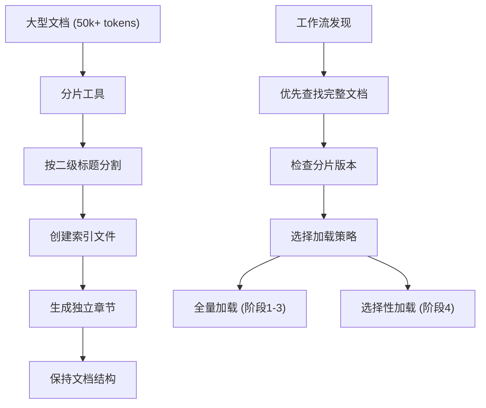
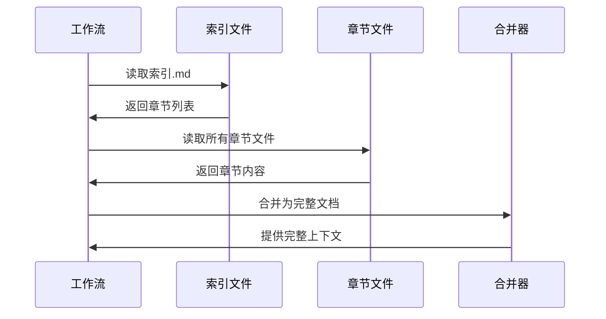
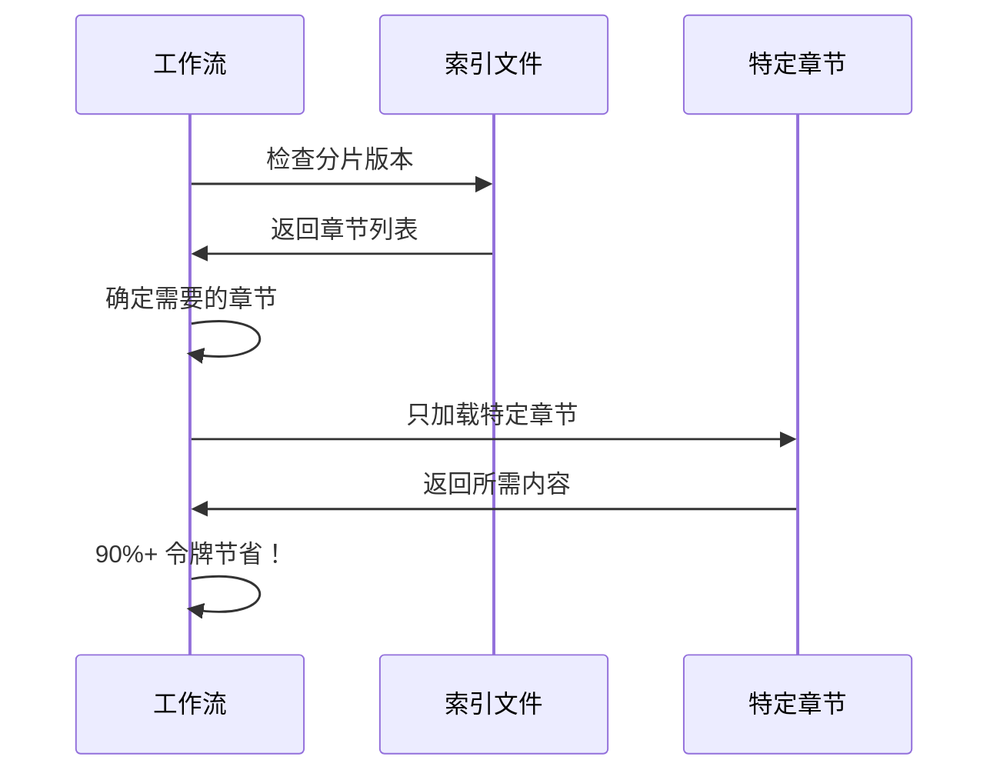
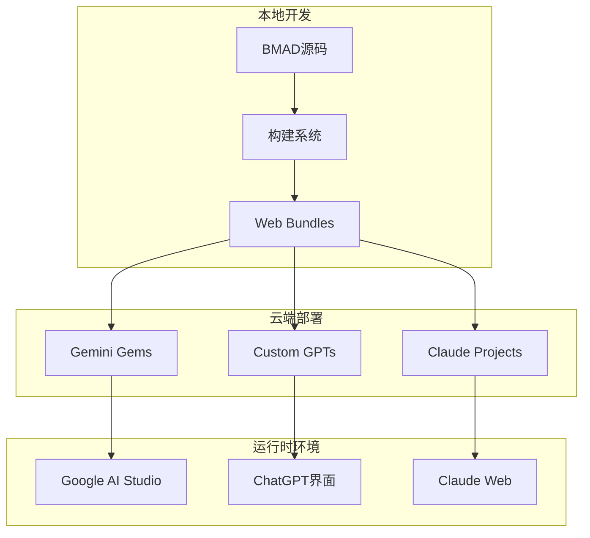
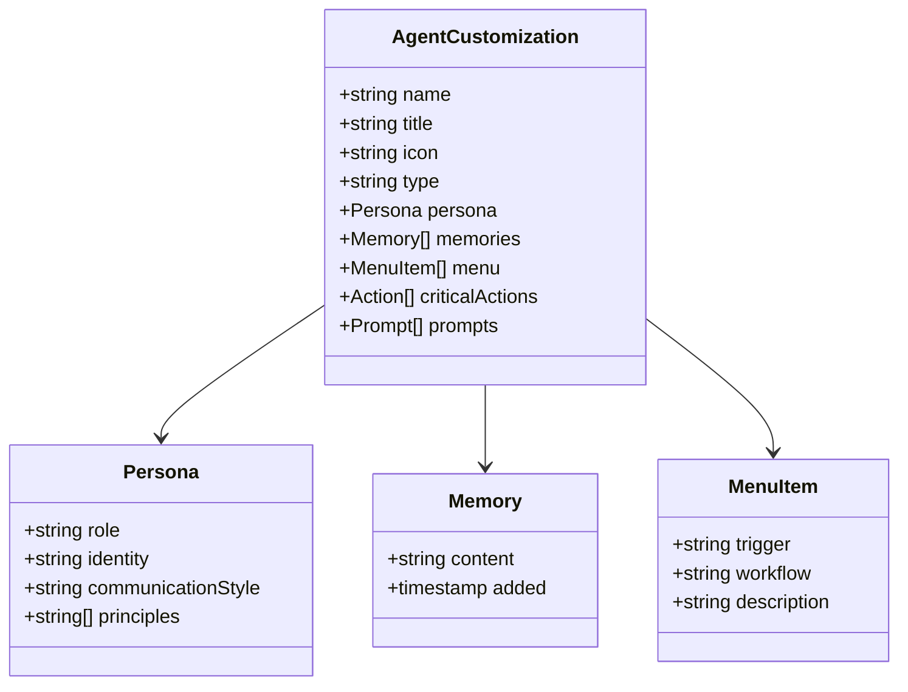
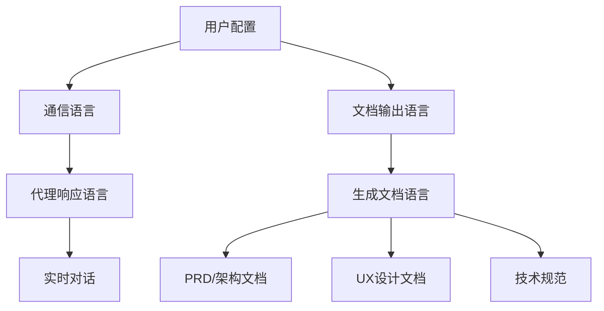
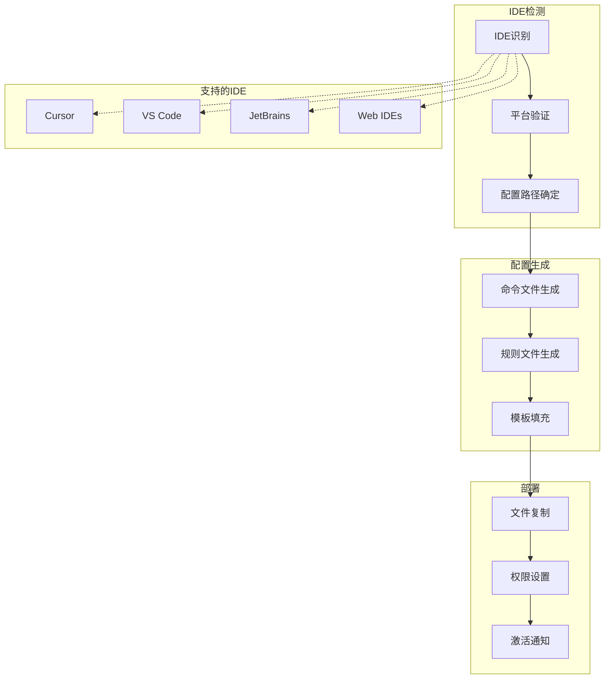
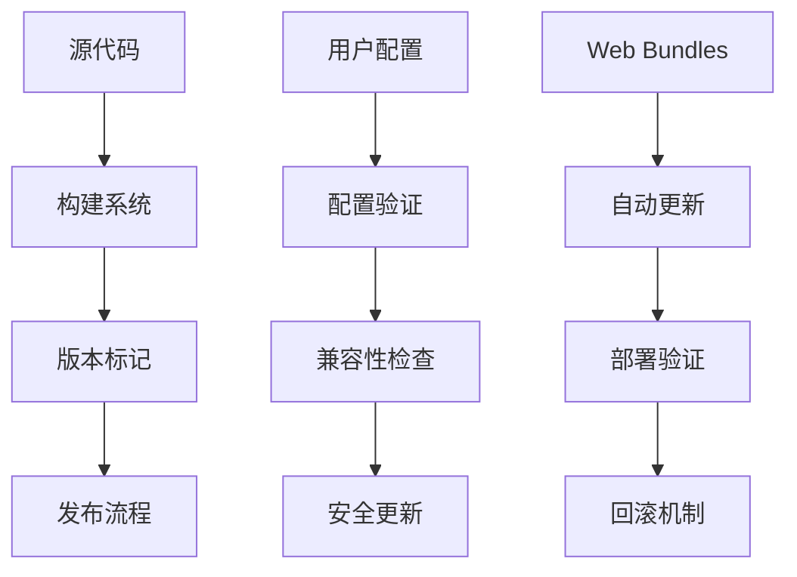
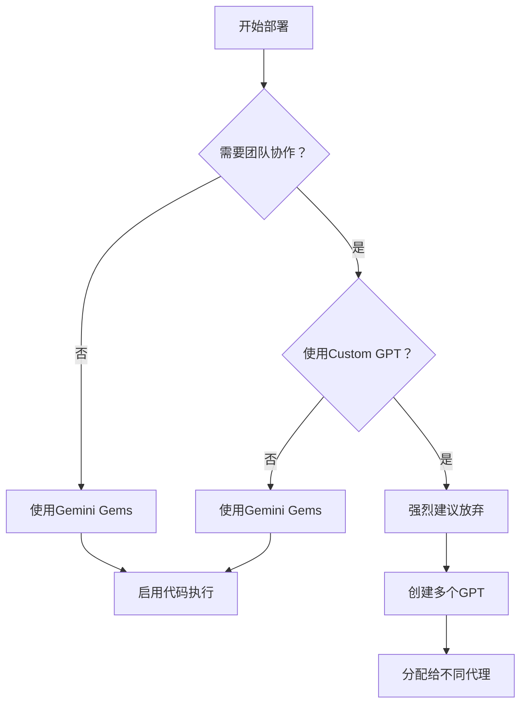

# 高级特性

<cite>
**本文档中引用的文件**
- [document-sharding-guide.md](file://docs/document-sharding-guide.md)
- [web-bundles-gemini-gpt-guide.md](file://docs/web-bundles-gemini-gpt-guide.md)
- [agent-customization-guide.md](file://docs/agent-customization-guide.md)
- [toolsmith.agent.yaml](file://custom/src/agents/toolsmith/toolsmith.agent.yaml)
- [shard-doc.xml](file://src/core/tools/shard-doc.xml)
- [bundle-web.js](file://tools/cli/bundlers/bundle-web.js)
- [web-bundler.js](file://tools/cli/bundlers/web-bundler.js)
- [BUNDLE_DISTRIBUTION_SETUP.md](file://docs/BUNDLE_DISTRIBUTION_SETUP.md)
- [bundlers.md](file://custom/src/agents/toolsmith/toolsmith-sidecar/knowledge/bundlers.md)
- [agent-config-template.md](file://src/utility/models/agent-config-template.md)
- [_base-ide.js](file://tools/cli/installers/lib/ide/_base-ide.js)
- [gemini-agent-command.toml](file://tools/cli/installers/lib/ide/templates/gemini-agent-command.toml)
- [installer.js](file://tools/cli/installers/lib/core/installer.js)
</cite>

## 目录
1. [概述](#概述)
2. [文档分片技术](#文档分片技术)
3. [Web Bundles功能](#web-bundles功能)
4. [自定义代理机制](#自定义代理机制)
5. [多语言支持配置](#多语言支持配置)
6. [IDE集成与平台适配](#ide集成与平台适配)
7. [版本控制与更新安全](#版本控制与更新安全)
8. [最佳实践与故障排除](#最佳实践与故障排除)
9. [总结](#总结)

## 概述

BMAD-METHOD提供了强大的高级特性，包括文档分片、Web Bundles、自定义代理、多语言支持等核心功能。这些特性共同构成了一个完整的AI辅助开发生态系统，能够处理大型代码库的上下文限制，提供灵活的部署选项，并支持多样化的使用场景。

## 文档分片技术

### 核心概念

文档分片是BMAD的核心优化技术，专门用于处理大型规划和架构文档。该技术将大型Markdown文件拆分为更小、更有组织的文件，基于二级标题（`## 标题`）进行分割。



**图表来源**
- [document-sharding-guide.md](file://docs/document-sharding-guide.md#L25-L39)
- [shard-doc.xml](file://src/core/tools/shard-doc.xml#L19-L110)

### 分片触发条件

| 文档类型 | 推荐大小 | 强烈推荐 | 关键效率 |
|---------|---------|---------|---------|
| 复杂PRD | > 20k tokens | > 40k tokens | > 60k tokens |
| 架构文档 | > 20k tokens | > 40k tokens | > 60k tokens |
| 多史诗项目 | 4+史诗 | 6+史诗 | 8+史诗 |
| UX设计规范 | 多子系统 | 大型规范 | 超大规范 |

### 工作流支持模式

#### 全量加载（阶段1-3）


**图表来源**
- [document-sharding-guide.md](file://docs/document-sharding-guide.md#L92-L109)

#### 选择性加载（阶段4）


**图表来源**
- [document-sharding-guide.md](file://docs/document-sharding-guide.md#L185-L201)

### 使用方法

#### CLI命令
```bash
# 激活bmad-master或分析师代理后：
/shard-doc
```

#### 交互流程
```
代理：您要分片哪个文档？
用户：docs/PRD.md

代理：默认目标：docs/prd/
接受默认？[y/n]
用户：y

代理：正在分片PRD.md...
✓ 创建了12个章节文件
✓ 生成了index.md
✓ 完成！
```

**段落来源**
- [document-sharding-guide.md](file://docs/document-sharding-guide.md#L112-L134)

### 最佳实践

#### 推荐做法
- ✅ 在规划阶段完成后进行分片
- ✅ 保持二级标题的良好组织
- ✅ 使用描述性章节名称
- ✅ 在阶段4实施前进行分片
- ✅ 初始保留原始文件作为备份

#### 不推荐做法
- ❌ 对进行中的文档进行分片
- ❌ 对小于20k令牌的小文档进行分片
- ❌ 混合使用分片和完整版本
- ❌ 手动编辑索引.md结构

**段落来源**
- [document-sharding-guide.md](file://docs/document-sharding-guide.md#L219-L277)

## Web Bundles功能

### Web Bundles概述

Web Bundles是BMAD的核心创新，将代理打包为自包含的XML文件，使其能够在Claude.ai、ChatGPT、Gemini等浏览器环境中运行，无需文件系统访问。



**图表来源**
- [web-bundles-gemini-gpt-guide.md](file://docs/web-bundles-gemini-gpt-guide.md#L1-L16)
- [bundle-web.js](file://tools/cli/bundlers/bundle-web.js#L1-L180)

### 平台差异对比

| 平台 | 推荐度 | 上下文窗口 | 团队包支持 | 代码执行 | 适用场景 |
|------|--------|-----------|-----------|---------|---------|
| Gemini Gems | ⭐⭐⭐⭐⭐ | 大 | 是（Gemini 2.5 Pro+） | 是 | 所有功能 |
| Custom GPTs | ⭐⭐⭐ | 中等 | 否 | 是 | 简单对话 |
| Claude Projects | ⭐⭐⭐ | 大 | 是 | 是 | 协作开发 |

### 设置规则

#### 必须遵循的关键规则

1. **单一文件原则** - 每个Gem/GPT上传且仅上传一个XML文件
2. **配置提示** - 创建Gem/GPT时必须添加配置提示
3. **启用代码执行** - 对于文档生成工作流至关重要
4. **Gemini优先** - 性能显著优于Custom GPTs
5. **团队包限制** - 仅Gemini 2.5 Pro+支持团队包
6. **分离代理** - 为每个代理创建单独的Gem

**段落来源**
- [web-bundles-gemini-gpt-guide.md](file://docs/web-bundles-gemini-gpt-guide.md#L17-L32)

### 生成Web Bundles

#### 方法一：下载预打包文件
```bash
# 访问 https://bmad-code-org.github.io/bmad-bundles/
# 导航到模块文件夹 → agents文件夹 → 下载所需的.xml文件
```

#### 方法二：从本地安装生成
```bash
# 生成所有代理包
npm run bundle

# 或生成特定包
node tools/cli/bundlers/bundle-web.js module bmm
node tools/cli/bundlers/bundle-web.js agent bmm dev
```

**输出位置：** `web-bundles/`目录

**段落来源**
- [web-bundles-gemini-gpt-guide.md](file://docs/web-bundles-gemini-gpt-guide.md#L33-L68)

### 部署到Gemini Gems

#### 创建Gem的步骤
1. 前往[Google AI Studio](https://aistudio.google.com/)
2. 点击"新建Gem"或"创建Gem"
3. 命名Gem（例如："BMad PM代理"）
4. **启用"代码执行"以获得最佳效果**
5. 在**系统指令**字段中添加精确文本
6. **上传单个XML文件** - 附件或粘贴内容
7. 测试代理通过输入`*help`查看菜单

#### Gemini配置要点
- **启用代码执行/画布** - 文档输出的关键
- **使用Gemini 2.5 Pro+** - 最佳结果
- **每个代理一个Gem** - 创建分离的Gem
- **测试菜单项** - 触发`*workflow-name`

**段落来源**
- [web-bundles-gemini-gpt-guide.md](file://docs/web-bundles-gemini-gpt-guide.md#L70-L102)

### 部署到Custom GPTs

#### 创建Custom GPT的步骤
1. 前往[ChatGPT](https://chat.openai.com/)
2. 点击头像 → "我的GPT" → "创建GPT"
3. 配置GPT：
   - **名称：** BMad PM代理（或其他）
   - **描述：** 基于BMad Method的AI规划代理
4. 在**指令**字段顶部添加精确文本
5. **在该文本下方**，粘贴整个XML文件内容
6. **启用ChatGPT设置中的"画布"**
7. 保存并测试通过输入`*help`

#### Custom GPT注意事项
- **启用画布** - 文档输出必需
- **每个代理一个GPT** - 创建分离的GPT
- Custom GPT的上下文窗口较小 - 避免团队包
- 适合专注于的代理（PM、分析师、架构师）

**段落来源**
- [web-bundles-gemini-gpt-guide.md](file://docs/web-bundles-gemini-gpt-guide.md#L103-L137)

### 可用的Web Bundles

#### BMad Method (BMM) 代理
- **analyst.xml** - 商业分析和需求收集
- **architect.xml** - 系统架构和技术设计
- **dev.xml** - 全栈开发和实现
- **pm.xml** - 产品管理与规划
- **sm.xml** - 敏捷协调员
- **tea.xml** - 测试架构和质量保证
- **tech-writer.xml** - 技术文档
- **ux-designer.xml** - 用户体验设计
- **game-designer.xml** - 游戏设计和机制
- **game-dev.xml** - 游戏开发
- **game-architect.xml** - 游戏架构

#### BMad Builder (BMB) 代理
- **bmad-builder.xml** - 创建自定义代理、工作流和模块

#### 创意智能套件 (CIS) 代理
- **brainstorming-coach.xml** - 创意头脑风暴促进
- **design-thinking-coach.xml** - 以人为本的问题解决
- **innovation-strategist.xml** - 创新和战略
- **creative-problem-solver.xml** - 突破性问题解决
- **storyteller.xml** - 叙事和讲故事

#### 团队包（多代理协作）
- **bmm/teams/team-fullstack.xml** - 完整BMad Method开发团队
- **bmgd/teams/team-gamedev.xml** - 游戏开发团队
- **cis/teams/creative-squad.xml** - 创意智能团队

**段落来源**
- [web-bundles-gemini-gpt-guide.md](file://docs/web-bundles-gemini-gpt-guide.md#L140-L175)

### 成本节约策略

#### Web → 本地工作流


**图表来源**
- [web-bundles-gemini-gpt-guide.md](file://docs/web-bundles-gemini-gpt-guide.md#L188-L228)

#### 典型节省
- **分析、规划、架构**：60-80%成本降低
- **Web模型**：较低成本处理规划
- **本地IDE**：完整代码库访问能力

**段落来源**
- [web-bundles-gemini-gpt-guide.md](file://docs/web-bundles-gemini-gpt-guide.md#L189-L228)

## 自定义代理机制

### 代理定制化架构

BMAD提供了强大的代理定制化系统，允许用户在不修改核心文件的情况下自定义代理行为。所有自定义都通过`_cfg/agents/`目录持久化，确保更新安全。



**图表来源**
- [agent-customization-guide.md](file://docs/agent-customization-guide.md#L39-L209)
- [toolsmith.agent.yaml](file://custom/src/agents/toolsmith/toolsmith.agent.yaml#L1-L109)

### 可定制元素

#### 代理名称
```yaml
agent:
  metadata:
    name: '海绵宝宝' # 默认："Amelia"
```

#### 代理人格
```yaml
persona:
  role: '资深全栈工程师'
  identity: '住在菠萝下面'
  communication_style: '海绵宝宝风格'
  principles:
    - '永不嵌套，海绵宝宝开发者讨厌超过2层的嵌套'
    - '优先组合而非继承'
```

#### 记忆
```yaml
memories:
  - '在蟹堡王工作'
  - '最喜欢的名人：大卫·哈塞尔霍夫'
  - '在史诗1中了解到假装测试通过不是酷的'
```

#### 自定义菜单项
```yaml
menu:
  - trigger: my-workflow
    workflow: '{project-root}/custom/my-workflow.yaml'
    description: 我的自定义工作流
  - trigger: deploy
    action: '#deploy-prompt'
    description: 部署到生产环境
```

**段落来源**
- [agent-customization-guide.md](file://docs/agent-customization-guide.md#L39-L116)

### 实际应用示例

#### 示例1：为TDD定制开发者代理
```yaml
agent:
  metadata:
    name: 'TDD开发者'
memories:
  - '总是先写测试再实现'
  - '项目使用Jest和React Testing Library'
critical_actions:
  - '提交前检查测试覆盖率'
```

#### 示例2：添加自定义部署工作流
```yaml
menu:
  - trigger: deploy-staging
    workflow: '{project-root}/.bmad-custom/deploy-staging.yaml'
    description: 部署到暂存环境
  - trigger: deploy-prod
    workflow: '{project-root}/.bmad-custom/deploy-prod.yaml'
    description: 部署到生产环境（需要批准）
```

#### 示例3：双语产品经理
```yaml
persona:
  role: '双语产品经理'
  identity: 'US和拉丁美洲市场的专家'
  communication_style: '清晰、战略性，具有文化意识'
  principles:
    - '从第一天就考虑本地化'
    - '平衡业务目标与用户需求'
memories:
  - '用户说英语和西班牙语'
  - '目标市场：美国和拉丁美洲'
```

**段落来源**
- [agent-customization-guide.md](file://docs/agent-customization-guide.md#L118-L164)

### 构建和部署流程

#### 重建代理
```bash
# 重新编译所有代理
npx bmad-method@alpha install

# 或仅重建特定代理
npx bmad-method@alpha build bmm-dev
npx bmad-method@alpha build core-bmad-master
npx bmad-method@alpha build bmm-pm
```

#### 更新安全机制
- **模块级别**：推荐的每项目定制
- **全局配置**：即将推出（跨项目默认值）
- **备份**：编辑前复制定制文件
- **版本控制**：考虑将`_cfg/`提交以与团队共享

**段落来源**
- [agent-customization-guide.md](file://docs/agent-customization-guide.md#L173-L209)

## 多语言支持配置

### 语言配置架构

BMAD提供了完整的多语言支持系统，通过配置模板实现动态语言切换。



**图表来源**
- [agent-config-template.md](file://src/utility/models/agent-config-template.md#L1-L24)
- [installer.js](file://tools/cli/installers/lib/core/installer.js#L2344-L2347)

### 核心配置参数

#### 基础语言设置
```yaml
user_name: "BMad"                    # 代理称呼的用户名
communication_language: "English"    # 聊天语言/风格
document_output_language: "English"  # 文档输出语言
```

#### 动态语言替换
代理配置模板自动处理语言占位符：
```xml
<i>ALWAYS respond in {core:communication_language}.</i>
<memory>The users name is {core:user_name}</memory>
```

**段落来源**
- [src/core/_module-installer/install-config.yaml](file://src/core/_module-installer/install-config.yaml#L11-L24)

### 平台特定配置

#### IDE配置管理
```javascript
// IDE配置管理器处理多语言设置
class IdeConfigManager {
  async saveIdeConfig(bmadDir, ideName, configuration) {
    const configData = {
      ide: ideName,
      configuration: {
        communication_language: "Mandarin",
        document_output_language: "Mandarin"
      }
    };
  }
}
```

#### 代理命令模板
```toml
# Gemini代理命令模板
prompt = """
CRITICAL: You are now the BMad '{{title}}' agent.

PRE-FLIGHT CHECKLIST:
1. [ ] IMMEDIATE ACTION: Load and parse @{{bmad_folder}}/{{module}}/config.yaml - store ALL config values in memory for use throughout the session.
2. [ ] IMMEDIATE ACTION: Read and internalize the full agent definition at @{{bmad_folder}}/{{module}}/agents/{{name}}.md.
3. [ ] CONFIRM: The user's name from config is {user_name}.

Only after all checks are complete, greet the user by name and display the menu.
"""
```

**段落来源**
- [_base-ide.js](file://tools/cli/installers/lib/ide/_base-ide.js#L36-L652)
- [gemini-agent-command.toml](file://tools/cli/installers/lib/ide/templates/gemini-agent-command.toml#L1-L15)

### 多语言最佳实践

#### 1. 统一语言策略
- **通信语言**：与用户交流的语言
- **文档语言**：生成文档的语言
- **默认同步**：通常通信语言与文档语言相同

#### 2. 文化适应性
- **沟通风格**：根据语言调整沟通方式
- **术语本地化**：使用本地化的技术术语
- **示例语言**：工作流示例使用配置的语言

#### 3. 配置一致性
- **项目级配置**：每个项目可有不同的语言设置
- **团队共享**：通过版本控制共享语言偏好
- **环境隔离**：不同环境使用不同的语言配置

## IDE集成与平台适配

### IDE集成架构

BMAD提供了强大的IDE集成系统，支持多种开发环境的自动化配置。



**图表来源**
- [_base-ide.js](file://tools/cli/installers/lib/ide/_base-ide.js#L1-L652)

### 平台特定配置

#### 平台代码系统
```javascript
// 平台代码验证和显示
const platformCodes = {
  isValidPlatform: (code) => VALID_PLATFORM_CODES.includes(code),
  getDisplayName: (code) => PLATFORM_DISPLAY_NAMES[code],
  getPlatform: (code) => PLATFORM_METADATA[code]
};
```

#### IDE特定处理器
```javascript
// BMM模块的IDE特定配置
async function configureForIDE(ide, projectRoot, config, logger) {
  const platformSpecificPath = path.join(__dirname, 'platform-specifics', `${ide}.js`);
  
  if (await fs.pathExists(platformSpecificPath)) {
    const platformHandler = require(platformSpecificPath);
    if (typeof platformHandler.install === 'function') {
      await platformHandler.install({ projectRoot, config, logger });
    }
  }
}
```

**段落来源**
- [installer.js](file://tools/cli/installers/lib/core/installer.js#L868-L903)
- [installer.js](file://src/modules/bmm/_module-installer/installer.js#L94-L131)

### 自定义代理安装

#### 代理启动器安装
```javascript
async installCustomAgentLauncher(projectDir, agentName, agentPath, metadata) {
  // 默认实现 - 子类可以覆盖
  return null;
}
```

#### 文件名扁平化
对于忽略目录结构的IDE（如Antigravity、Codex），BMAD提供文件名扁平化功能：
```javascript
flattenFilename(relativePath) {
  const sanitized = relativePath.replaceAll(/[/\\]/g, '-');
  return `bmad-${sanitized}`;
}
```

**段落来源**
- [_base-ide.js](file://tools/cli/installers/lib/ide/_base-ide.js#L628-L652)

### 配置管理

#### IDE配置存储
```javascript
class IdeConfigManager {
  async saveIdeConfig(bmadDir, ideName, configuration) {
    const configData = {
      ide: ideName,
      configured_date: new Date().toISOString(),
      last_updated: new Date().toISOString(),
      configuration: configuration || {}
    };
    
    const yamlContent = yaml.dump(configData, {
      indent: 2,
      lineWidth: -1,
      noRefs: true,
      sortKeys: false
    });
    
    await fs.writeFile(configPath, content, 'utf8');
  }
}
```

#### 配置检测和清理
```javascript
async detect(projectDir) {
  const pathsToCheck = [];
  
  if (this.configDir) {
    pathsToCheck.push(path.join(projectDir, this.configDir));
  }
  
  if (this.configFile) {
    pathsToCheck.push(path.join(projectDir, this.configFile));
  }
  
  for (const candidate of pathsToCheck) {
    if (await fs.pathExists(candidate)) {
      return true;
    }
  }
  
  return false;
}
```

**段落来源**
- [ide-config-manager.js](file://tools/cli/installers/lib/core/ide-config-manager.js#L41-L154)

## 版本控制与更新安全

### 版本控制系统

BMAD采用了多层次的版本控制和更新安全机制，确保系统的稳定性和可维护性。



### 更新安全机制

#### 1. 配置隔离
```javascript
// 用户配置与核心代码分离
const userConfigPath = path.join(bmadDir, '_cfg', 'agents', `${agentName}.customize.yaml`);
const coreAgentPath = path.join(bmadDir, 'modules', module, 'agents', `${agentName}.md`);
```

#### 2. 构建跟踪
```javascript
async buildFromYaml(agentYamlPath, customizeYamlPath = null, options = {}) {
  // 计算文件哈希用于构建跟踪
  const sourceHash = await this.calculateFileHash(agentYamlPath);
  const customizeHash = customizeYamlPath ? await this.calculateFileHash(customizeYamlPath) : null;
  
  // 提取模块信息
  let module = 'core';
  const pathParts = agentYamlPath.split(path.sep);
  const modulesIndex = pathParts.indexOf('modules');
  const bmadIndex = pathParts.indexOf('bmad');
}
```

**段落来源**
- [yaml-xml-builder.js](file://tools/cli/lib/yaml-xml-builder.js#L521-L547)

#### 3. 权限控制
```javascript
// 文件操作权限验证
async copyFileWithPlaceholderReplacement(sourcePath, targetPath, bmadFolderName) {
  const textExtensions = ['.md', '.yaml', '.yml', '.txt', '.json', '.js', '.ts', '.html', '.css', '.sh', '.bat', '.csv'];
  const ext = path.extname(sourcePath).toLowerCase();
  
  // 仅对文本文件进行占位符替换
  if (textExtensions.includes(ext)) {
    // 执行文件复制和替换
  }
}
```

### 自动化部署

#### Web Bundles自动发布
```bash
# 一键生成所有Web Bundles
npm run bundle

# 清理并重新生成
npm run rebundle

# 验证捆绑包完整性
npm run validate:bundles
```

#### 发布流程
```javascript
// WebBundler主入口点
async bundleAll() {
  try {
    // 首先处理跨模块工作流
    const modules = await this.discoverModules();
    for (const module of modules) {
      await this.vendorCrossModuleWorkflows(module);
    }
    
    // 预发现所有模块以生成完整清单
    for (const module of modules) {
      await this.preDiscoverModule(module);
    }
    
    // 处理所有模块
    for (const module of modules) {
      await this.bundleModule(module);
    }
  } finally {
    // 清理临时文件
    await this.cleanupTempFiles();
  }
}
```

**段落来源**
- [bundle-web.js](file://tools/cli/bundlers/bundle-web.js#L47-L180)
- [web-bundler.js](file://tools/cli/bundlers/web-bundler.js#L45-L78)

### 版本兼容性

#### 向后兼容策略
- **配置迁移**：自动迁移旧版本配置
- **API兼容**：保持向后兼容的API接口
- **渐进式升级**：支持逐步升级策略

#### 错误处理
```javascript
// 详细的错误报告和恢复机制
if (this.stats.invalidXml > 0) {
  console.log(chalk.yellow('\n⚠ Some bundles have invalid XML. Please review the output.'));
} else if (this.stats.failedAgents > 0) {
  console.log(chalk.yellow('\n⚠ Some agents failed to bundle. Please review the errors.'));
} else {
  console.log(chalk.green('\n✨ All bundles generated successfully!'));
}
```

**段落来源**
- [web-bundler.js](file://tools/cli/bundlers/web-bundler.js#L1733-L1764)

## 最佳实践与故障排除

### 文档分片最佳实践

#### 分片时机
- **推荐时机**：规划阶段完成后
- **避免时机**：进行中的文档
- **阈值参考**：20k+ tokens开始考虑，40k+强烈推荐

#### 内容组织
```markdown
# PRD - 索引

## 章节

1. [概述](./overview.md) - 项目愿景和目标
2. [用户需求](./user-requirements.md) - 功能规格
3. [史诗1：认证](./epic-1-authentication.md) - 用户认证系统
4. [史诗2：仪表板](./epic-2-dashboard.md) - 主仪表板UI
```

#### 更新策略
- **直接编辑**：编辑单独的章节文件
- **重新分片**：删除分片文件夹，重新分片原始文件
- **避免手动**：不要手动编辑index.md结构

**段落来源**
- [document-sharding-guide.md](file://docs/document-sharding-guide.md#L220-L277)

### Web Bundles部署最佳实践

#### 平台选择指南


#### 成本优化策略
- **阶段1-3**：在Gemini中完成（主要成本节省）
- **阶段4**：切换到本地IDE（需要完整代码库）
- **导出文档**：保存到项目`docs/`文件夹
- **初始化本地**：运行`*workflow-init`更新状态

**段落来源**
- [web-bundles-gemini-gpt-guide.md](file://docs/web-bundles-gemini-gpt-guide.md#L189-L228)

### 自定义代理最佳实践

#### 配置层次
```yaml
# 模块级别（推荐）
_cfg/agents/bmm-dev.customize.yaml

# 全局配置（即将推出）
_cfg/global/customize.yaml
```

#### 编辑流程
1. **备份配置**：编辑前复制`.customize.yaml`文件
2. **验证语法**：确保YAML语法正确（缩进很重要）
3. **重建代理**：运行`npx bmad-method build <agent-name>`
4. **测试功能**：验证自定义是否生效

#### 常见问题解决
- **更改不显示**：确保运行了构建命令
- **代理无法加载**：检查YAML语法错误
- **需要重置**：删除`.customize.yaml`文件，重新构建

**段落来源**
- [agent-customization-guide.md](file://docs/agent-customization-guide.md#L166-L209)

### 多语言配置最佳实践

#### 语言设置策略
```yaml
# 项目级配置
communication_language: "Mandarin"
document_output_language: "Mandarin"

# 团队共享配置
# 通过版本控制共享语言偏好
```

#### 文化适应性
- **沟通风格**：根据语言调整沟通方式
- **术语本地化**：使用本地化的技术术语
- **示例语言**：工作流示例使用配置的语言

**段落来源**
- [agent-config-template.md](file://src/utility/models/agent-config-template.md#L1-L24)

### 故障排除指南

#### 常见问题及解决方案

##### 文档分片问题
- **同时存在完整和分片版本**：工作流会使用完整文档（优先规则）
- **索引.md不同步**：删除分片文件夹，重新运行分片工具
- **工作流找不到文档**：检查文件命名匹配模式
- **章节过于细粒度**：合并原始文档中的章节，重新分片

##### Web Bundles问题
- **代理响应不正确**：检查是否上传了完整的XML文件
- **菜单项不工作**：使用`*`前缀：`*prd`而不是`prd`
- **工作流失败**：某些工作流期望项目文件（不可用在Web上下文中）
- **文件过大**：拆分为多个部分，使用多个GPT或改用Gemini Gems

##### 自定义代理问题
- **更改不生效**：确保运行了构建命令
- **代理无法加载**：检查YAML语法错误
- **需要重置**：删除配置文件，重新生成默认值

**段落来源**
- [document-sharding-guide.md](file://docs/document-sharding-guide.md#L415-L449)
- [web-bundles-gemini-gpt-guide.md](file://docs/web-bundles-gemini-gpt-guide.md#L353-L391)
- [agent-customization-guide.md](file://docs/agent-customization-guide.md#L186-L209)

## 总结

BMAD-METHOD的高级特性构成了一个完整的AI辅助开发生态系统，通过以下核心功能实现了高效的软件开发：

### 核心优势

1. **文档分片技术**：解决了大型代码库的上下文限制问题，实现了90%+的令牌节省
2. **Web Bundles功能**：使BMAD能够在各种浏览器环境中运行，提供灵活的部署选项
3. **自定义代理机制**：支持无痛的代理定制，确保更新安全
4. **多语言支持**：完整的国际化支持，适应全球开发团队
5. **IDE集成**：广泛的IDE支持，提供无缝的开发体验
6. **版本控制**：完善的更新安全机制，确保系统稳定性

### 应用场景

- **大型项目管理**：通过文档分片处理复杂的多史诗项目
- **远程协作**：利用Web Bundles实现跨地域团队协作
- **成本优化**：通过Web → 本地工作流实现60-80%的成本节省
- **多语言团队**：支持国际化的开发团队
- **快速原型**：利用Web Bundles进行快速概念验证

### 未来发展方向

BMAD-METHOD的高级特性为AI驱动的软件开发奠定了坚实基础，随着技术的不断发展，这些特性将继续演进，为开发者提供更强大、更智能的开发工具。