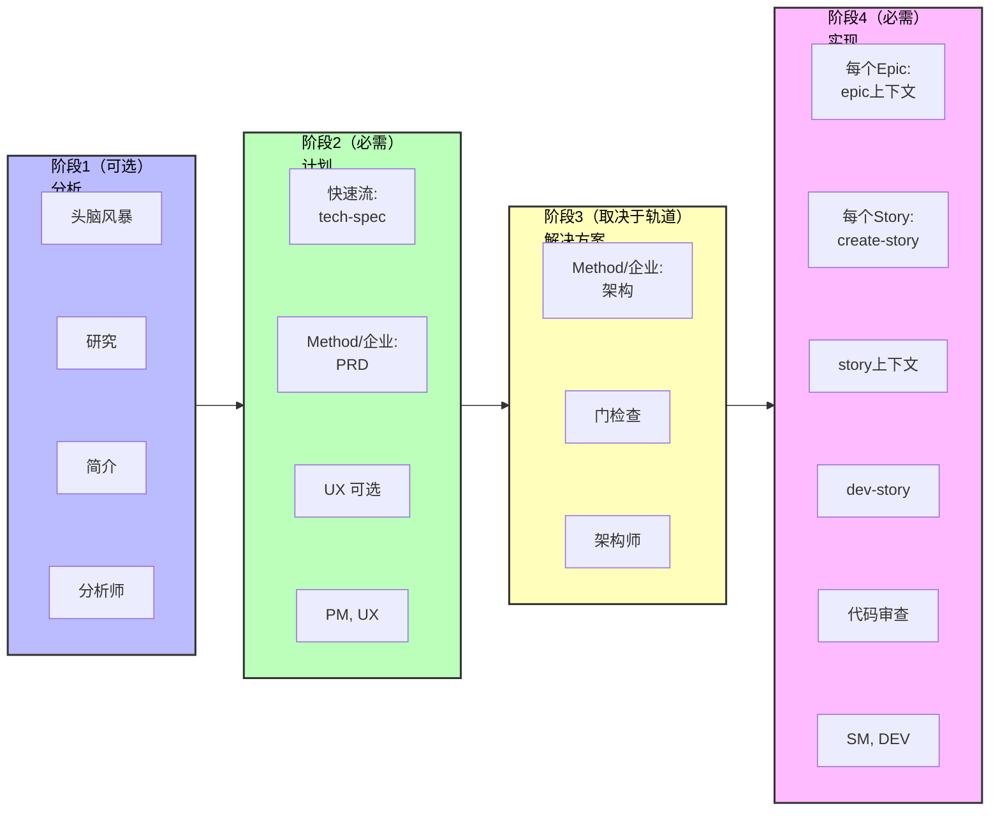

# BMad Method V6 快速开始指南

开始使用BMad Method v6进行全新项目。本指南将引导您使用AI驱动的工作流从头开始构建软件。

## TL;DR - 快速路径

1. **安装**：`npx bmad-method@alpha install`
2. **初始化**：加载分析师代理 → 运行 "workflow-init"
3. **计划**：加载产品经理代理 → 运行 "prd"（小项目使用 "tech-spec"）
4. **架构**：加载架构师代理 → 运行 "create-architecture"（仅10+故事）
5. **构建**：加载Scrum Master代理 → 为每个故事运行工作流 → 加载开发代理 → 实现
6. **始终为每个工作流使用新聊天**以避免幻觉

---

## 什么是 BMad Method？

BMad Method (BMM) 通过专业AI代理的指导性工作流帮助您构建软件。整个过程遵循四个阶段：

1. **阶段1：分析**（可选）- 头脑风暴、研究、产品简介
2. **阶段2：计划**（必需）- 创建需求（技术规范或PRD）
3. **阶段3：解决方案**（取决于轨道）- 为BMad Method和企业轨道设计架构
4. **阶段4：实现**（必需）- 逐个Epic、逐个Story构建软件

### 完整工作流可视化


_完整的可视化流程图，展示所有阶段、工作流、代理（按颜色编码）和BMad Method标准绿地轨道的决策点。每个方框按负责该工作流的代理进行颜色编码。_

## 安装

```bash
# 将 v6 Alpha 安装到您的项目
npx bmad-method@alpha install
```

交互式安装程序将引导您完成设置，并创建包含所有代理和工作流的`{bmad_folder}/`文件夹。

---

## 开始使用

### 步骤1：初始化您的工作流

1. **在IDE中加载分析师代理** - 查看[docs/ide-info](https://github.com/bmad-code-org/BMAD-METHOD/tree/main/docs/ide-info)中针对您IDE的说明以了解如何激活代理：
   - [Claude Code](https://github.com/bmad-code-org/BMAD-METHOD/blob/main/docs/ide-info/claude-code.md)
   - [VS Code/Cursor/Windsurf](https://github.com/bmad-code-org/BMAD-METHOD/tree/main/docs/ide-info) - 查看您的IDE文件夹
   - 也支持其他IDE
2. **等待代理菜单**出现
3. **告诉代理**："Run workflow-init" 或输入 "\*workflow-init" 或选择菜单项编号

#### workflow-init期间会发生什么？

工作流是V6中的交互式流程，取代了之前版本的任务和模板。有许多类型的工作流，您甚至可以使用BMad Builder模块创建自己的工作流。对于BMad Method，您将与专家设计的工作流交互，这些工作流经过精心设计，旨在充分利用您和LLM的优势。

在workflow-init期间，您将描述：

- 您的项目及其目标
- 是否存在现有代码库或这是一个新项目
- 总体规模和复杂度（稍后可以调整）

#### 计划轨道

根据您的描述，工作流将建议一个轨道，并让您从以下选择：

**三个计划轨道：**

- **快速流** - 快速实现（仅技术规范）- Bug修复、简单功能、明确范围（通常1-15个故事）
- **BMad Method** - 完整计划（PRD + 架构 + UX）- 产品、平台、复杂功能（通常10-50+故事）
- **企业Method** - 扩展计划（BMad Method + 安全/DevOps/测试）- 企业需求、合规、多租户（通常30+故事）

**注意**：故事数量是指导性的，不是定义。轨道是根据计划需求选择的，而不是故事数量。

#### 会创建什么？

一旦您确认轨道，将在项目文档文件夹中创建`bmm-workflow-status.yaml`文件（假设默认安装位置）。此文件跟踪您在所有阶段的进度。

**重要说明：**

- 每个轨道通过各阶段有不同的路径
- 随着工作的进展，故事数量仍可能根据整体复杂度变化
- 本指南假设一个BMad Method轨道项目
- 此工作流将引导您完成阶段1（可选）、阶段2（必需）和阶段3（BMad Method和企业轨道必需）

### 步骤2：完成阶段1-3

workflow-init完成后，您将完成计划阶段。**重要：为每个工作流使用新聊天以避免上下文限制。**

#### 检查您的状态

如果您不确定接下来做什么：

1. 在新聊天中加载任意代理
2. 请求 "workflow-status"
3. 代理将告诉您下一个推荐或必需的工作流

**示例响应：**

```
阶段1（分析）完全可选。所有工作流都是可选或推荐的：
  - brainstorm-project - 可选
  - research - 可选
  - product-brief - 推荐（但非必需）

下一个真正必需的步骤是：
  - PRD（产品需求文档）在阶段2 - 计划
  - 代理：pm
  - 命令：prd
```

#### 如何在阶段1-3运行工作流

当代理告诉您运行工作流（如`prd`）时：

1. **与指定代理（例如PM）开始新聊天** - 查看[docs/ide-info](https://github.com/bmad-code-org/BMAD-METHOD/tree/main/docs/ide-info)了解您IDE的具体说明
2. **等待菜单**出现
3. **告诉代理**使用以下任一格式运行它：
   - 输入简写：`*prd`
   - 自然说出：「让我们创建一个新的PRD」
   - 选择 "create-prd" 的菜单编号

V6中的代理非常擅长模糊菜单匹配！

#### 快速参考：代理 → 文档映射

面向v4用户或希望跳过workflow-status指导的人：

- **分析师** → 头脑风暴、产品简介
- **产品经理** → PRD（BMad Method/企业轨道）或 tech-spec（快速流轨道）
- **UX设计师** → UX设计文档（如果项目包含UI）
- **架构师** → 架构（BMad Method/企业轨道）

#### 阶段2：计划 - 创建PRD

**对于BMad Method和企业轨道：**

1. 在新聊天中加载**产品经理代理**
2. 告诉它运行PRD工作流
3. 完成后，您将获得：
   - **PRD.md** - 您的产品需求文档

**对于快速流轨道：**

- 使用**tech-spec**而不是PRD（不需要架构）

#### 阶段2（可选）：UX设计

如果您的项目有用户界面：

1. 在新聊天中加载**UX设计师代理**
2. 告诉它运行UX设计工作流
3. 完成后，您将获得UX规范文档

#### 阶段3：架构

**对于BMad Method和企业轨道：**

1. 在新聊天中加载**架构师代理**
2. 告诉它运行create-architecture工作流
3. 完成后，您将获得包含技术决策的架构文档

#### 阶段3：创建Epic和Story（架构后必需）

**V6改进：** Epic和Story现在在架构之后创建，以获得更好的质量！

1. 在新聊天中加载**产品经理代理**
2. 告诉它运行 "create-epics-and-stories"
3. 这会将您的PRD的FR/NFR分解为可实现的Epic和Story
4. 工作流使用PRD和架构来创建技术知情的Story

**为什么在架构之后？** 架构决策（数据库、API模式、技术栈）直接影响Story应如何分解和排序。

#### 阶段3：实现就绪检查（强烈推荐）

创建Epic和Story后：

1. 在新聊天中加载**架构师代理**
2. 告诉它运行 "implementation-readiness"
3. 这会验证所有计划文档（PRD、UX、架构、Epic）的一致性
4. 这在v4中称为 "PO主检查清单"

**为什么运行此检查？** 它确保在开始构建之前所有计划资产正确对齐。

#### 上下文管理提示

- **使用200k+上下文模型**以获得最佳结果（Claude Sonnet 4.5、GPT-4等）
- **每个工作流新聊天** - 头脑风暴、简介、研究和PRD生成都是上下文密集型的
- **不需要文档分片** - 与v4不同，您不需要拆分文档
- **Web捆绑包即将推出** - 将帮助计划有限的用户节省LLM token

### 步骤3：开始构建（阶段4 - 实现）

计划和架构完成后，您将进入阶段4。**重要：下面的每个工作流都应在新聊天中运行，以避免上下文限制和幻觉。**

#### 3.1 初始化Sprint计划

1. **与Scrum Master代理开始新聊天**
2. 等待菜单出现
3. 告诉代理："Run sprint-planning"
4. 这会创建跟踪所有Epic和Story的`sprint-status.yaml`文件

#### 3.2 创建Epic上下文（可选但推荐）

1. **与Scrum Master代理开始新聊天**
2. 等待菜单
3. 告诉代理："Run epic-tech-context"
4. 这会在起草Story之前为当前Epic创建技术上下文

#### 3.3 起草您的第一个Story

1. **与Scrum Master代理开始新聊天**
2. 等待菜单
3. 告诉代理："Run create-story"
4. 这会从Epic起草Story文件

#### 3.4 添加Story上下文（可选但推荐）

1. **与Scrum Master代理开始新聊天**
2. 等待菜单
3. 告诉代理："Run story-context"
4. 这会为Story创建实现特定的技术上下文

#### 3.5 实现Story

1. **与开发代理开始新聊天**
2. 等待菜单
3. 告诉代理："Run dev-story"
4. 开发代理将实现Story并更新Sprint状态

#### 3.6 审查代码（可选但推荐）

1. **与开发代理开始新聊天**
2. 等待菜单
3. 告诉代理："Run code-review"
4. 开发代理执行质量验证（这在v4中称为QA）

### 步骤4：继续前进

对于每个后续Story，使用**每个工作流的新聊天**重复循环：

1. **新聊天** → Scrum Master代理 → "Run create-story"
2. **新聊天** → Scrum Master代理 → "Run story-context"
3. **新聊天** → 开发代理 → "Run dev-story"
4. **新聊天** → 开发代理 → "Run code-review"（可选但推荐）

完成Epic中的所有Story后：

1. **与Scrum Master代理开始新聊天**
2. 告诉代理："Run retrospective"

**为什么新聊天？** 如果您在同一聊天中继续发出命令，上下文密集型工作流可能会导致幻觉。开始新聊天确保代理为每个工作流具有最大的上下文容量。

---

## 了解代理

每个代理都是一个专业的AI角色：

- **分析师** - 初始化工作流并跟踪进度
- **产品经理** - 创建需求和规范
- **UX设计师** - 如果您的项目有前端 - 此设计师将帮助制作工件、提出模拟更新并在您的指导下设计出色的外观和感觉
- **架构师** - 设计系统架构
- **Scrum Master** - 管理Sprint并创建Story
- **开发者** - 实现代码并审查工作

## 工作流如何工作

1. **加载代理** - 在IDE中打开代理文件以激活它
2. **等待菜单** - 代理将展示其可用工作流
3. **告诉代理运行什么** - 说 "Run [workflow-name]"
4. **遵循提示** - 代理在整个过程中引导您

代理创建文档、提出问题，并在整个过程中帮助您做出决策。

## 项目跟踪文件

BMad创建两个文件来跟踪您的进度：

**1. bmm-workflow-status.yaml**

- 显示您所处的阶段以及接下来要做什么
- 由workflow-init创建
- 随着您在各阶段的进展自动更新

**2. sprint-status.yaml**（仅阶段4）

- 在实现期间跟踪所有Epic和Story
- 对于Scrum Master和开发代理了解接下来要做什么至关重要
- 由sprint-planning工作流创建
- 随着Story的进展自动更新

**您不需要手动编辑这些文件** - 代理会在您工作时更新它们。

---

## 完整流程可视化



## 常见问题

**问：我总是需要架构吗？**
答：仅对于BMad Method和企业轨道。快速流项目直接从tech-spec跳到实现。

**问：我以后可以更改计划吗？**
答：可以！Scrum Master代理有一个 "correct-course" 工作流来处理范围变更。

**问：如果我想先头脑风暴怎么办？**
答：在运行workflow-init之前，加载分析师代理并告诉它 "Run brainstorm-project"。

**问：为什么每个工作流都需要新聊天？**
答：如果按顺序运行，上下文密集型工作流可能会导致幻觉。新聊天确保最大的上下文容量。

**问：我可以跳过workflow-init和workflow-status吗？**
答：可以，一旦您了解流程。使用步骤2中的快速参考直接转到您需要的工作流。

## 获取帮助

- **工作流期间**：代理通过问题和解释引导您
- **社区**：[Discord](https://discord.gg/gk8jAdXWmj) - #general-dev、#bugs-issues
- **完整指南**：[BMM工作流文档](./README.md#-workflow-guides)
- **YouTube教程**：[BMad Code频道](https://www.youtube.com/@BMadCode)

---

## 关键要点

✅ **始终使用新聊天** - 在新聊天中加载代理以进行每个工作流，避免上下文问题
✅ **让workflow-status引导您** - 当不确定接下来做什么时，加载任意代理并请求状态
✅ **轨道很重要** - 快速流使用tech-spec，BMad Method/企业需要PRD和架构
✅ **跟踪是自动的** - 状态文件会自动更新，无需手动编辑
✅ **代理很灵活** - 使用菜单编号、快捷方式（\*prd）或自然语言

**准备开始构建了吗？** 安装BMad，加载分析师，运行workflow-init，让代理引导您！
